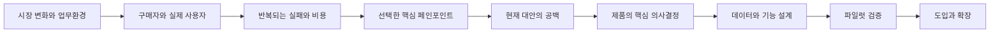
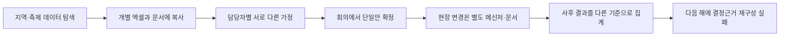
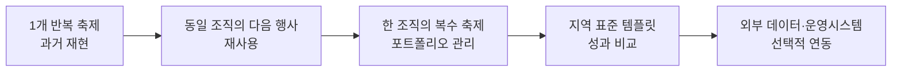

# FEST Compass 분석설계 기획서

> 대상 과제: 2026 관광데이터 활용 공모전 지정과제 9  
> 문서 성격: 내부 팀과 향후 발표자료 제작을 위한 분석·설계 기준서  
> 작성 기준일: 2026-08-18  
> 상태: 가설 설계 단계 — 파일럿 축제와 실제 운영자료 확보 전  

---

## 0. 문서의 목적

이 문서는 발표용 장표 초안이 아니다. 시장·고객·문제·제품·데이터·검증·포지셔닝에 관한 판단을 한곳에 정리하고, 어떤 내용이 확인된 사실이며 어떤 내용이 아직 검증해야 할 가설인지 구분하기 위한 내부 기획문서다.

이 문서를 통해 내부 팀은 다음 다섯 가지 결정을 내려야 한다.

1. 누구를 첫 고객으로 삼을 것인가.
2. 여러 축제 문제 중 어떤 실패를 가장 먼저 줄일 것인가.
3. KTO 데이터가 제품의 어떤 의사결정을 가능하게 하는가.
4. 공모전 기간 안에 무엇을 제품으로 만들고 무엇을 제외할 것인가.
5. 어떤 증거가 확보되면 이 아이디어를 계속 추진할 것인가.

공모전 심사기준은 제품 설계의 제약조건으로만 사용한다. `수상 논리`, `심사 증거`, `배점 대응` 같은 표현은 외부 발표 본문에 노출하지 않는다. 심사위원에게는 기준을 설명하는 대신 문제의 근거, 작동하는 제품, 데이터의 역할, 검증 결과를 보여준다.

---

## 1. 현재 PPT 초안 진단

검토 대상은 `output/ppt/2026_과제9_FEST_Compass_기획초안.pptx`의 12개 장표다.

### 1.1 전체 판단

시장분석 → 의사결정 시점 → 페인포인트 → 대안 → 제품 → 데이터 → 검증 → 포지셔닝으로 이어지는 큰 흐름은 유지할 가치가 있다. 문제는 각 단계의 분석 깊이와 독자 관점이 정렬되지 않았다는 점이다.

현재 자료는 다음 세 종류의 문서가 한 덱 안에 섞여 있다.

- 심사위원에게 보여주는 제품 설명
- 내부 팀이 사용하는 범위·검증 체크리스트
- 공모전 통과 전략을 설명하는 메타 문서

이 세 층위가 섞이면서 초반에는 고객 문제를 설명하다가 후반에는 제작팀이 스스로 심사 대응을 설명하는 구조가 되었다. 결과적으로 제품의 필요성이 자연스럽게 결론으로 이어지지 않고, ‘공모전을 위해 만든 서비스’처럼 보일 위험이 생겼다.

### 1.2 장표별 진단

| 기존 장표 | 유지할 요소 | 현재 부족한 요소 | 재설계 방향 |
|---|---|---|---|
| 1. 표지 | 예측 정확도 경쟁에서 벗어나는 문제의식 | 부정형 문장이 제품의 긍정적 가치를 충분히 설명하지 못함 | ‘불확실한 축제 운영을 근거 있는 결정으로 전환한다’는 가치로 정리 |
| 2. 시장 정의 | 구매자·사용자·수혜자 구분 | 시장의 단위, 세그먼트, 도입 계기, 구매 방식이 없음 | 축제가 아니라 ‘반복되는 축제 기획·운영 업무’를 시장으로 정의하고 초기 세그먼트를 선별 |
| 3. 의사결정 시점 | D-90~D+14 흐름 | 단계별 책임자·입력정보·실패비용이 연결되지 않음 | 각 시점의 결정, 필요한 근거, 잘못됐을 때의 비용을 매핑 |
| 4. 페인포인트 | 예측 오차보다 근거 분절이 핵심이라는 방향 | 실제 업무사례와 현재 행동 증거가 부족함 | 공식 근거, 인터뷰 가설, 확인해야 할 현장증거를 분리 |
| 5. 문제 우선순위 | 범위를 줄이려는 의도 | 빈도·책임·검증 가능성의 비교대상이 없음 | 후보 문제 4~5개를 동일 기준으로 비교한 뒤 하나를 선택 |
| 6. 대안 분석 | 엑셀·컨설팅·대시보드의 강점 인정 | 대안별 사용 시점, 비용, 교체 가능성, 전환장벽이 없음 | 현재 업무흐름에서 각 대안이 맡는 역할과 남는 공백을 분석 |
| 7. 제품 루프 | 근거→시나리오→결정→결과 구조 | 각 단계의 사용자 행동과 산출물이 추상적임 | 입력·결정·출력 객체를 구체적으로 정의 |
| 8. 3개 화면 | MVP 범위가 간결함 | 화면 간 이동 이유, 핵심 태스크, 예외상태가 없음 | 핵심 사용자 시나리오와 빈 데이터·API 오류·라벨 없음 상태 포함 |
| 9. API 전략 | API 관측값과 실제값을 구분 | 실제 사용할 API와 필드, 업데이트 시점, 금지 해석이 부족함 | API별 역할·허용 주장·금지 주장·폴백을 데이터 계약으로 정의 |
| 10. 검증 | 한 축제부터 검증한다는 방향 | 가설별 성공·실패 기준과 의사결정 규칙이 불완전 | 가설-실험-지표-통과기준-실패 시 조치를 한 표로 관리 |
| 11. 포지셔닝 | 예측 AI가 아니라 의사결정 도구라는 방향 | 비교 카테고리와 구매 이유가 아직 선언 수준 | 목표 고객·대체재·차별점·증거를 포함한 포지셔닝 문장으로 정리 |
| 12. 실행계획 | 파트너와 실제 데이터가 필요하다는 인식 | `수상 논리`, `심사 증거`, 배점이 독자에게 노출됨 | 내부 실행계획으로 이동하고 외부 자료에서는 파일럿·확장 로드맵으로 표현 |

### 1.3 가장 중요한 수정 원칙

1. **주장을 먼저 쓰고 근거를 끼워 맞추지 않는다.** 확인된 근거, 설계 추론, 검증가설을 구분한다.
2. **시장과 문제의 단위를 일치시킨다.** 시장이 지자체·축제조직의 업무라면 페인포인트와 제품도 그들의 실제 결정 단위로 설명한다.
3. **API 사용과 제품 가치를 분리하지 않는다.** API는 데이터 표시용 부가 기능이 아니라 특정 판단을 가능하게 하는 근거여야 한다.
4. **예측을 제품의 중심 약속으로 두지 않는다.** 동일 정의의 실제 입장객 라벨이 없는 상태에서는 사용자 가정 기반 수요범위와 운영 시나리오로 표현한다.
5. **심사 대응은 결과로 드러낸다.** 외부 자료에는 평가항목이 아니라 완결된 사용자 흐름, 데이터 적절성, 검증 결과, 확장 가능성을 보여준다.

---

## 2. 분석의 기준과 증거 등급

### 2.1 분석 질문

전체 기획은 다음 순서로 답해야 한다.



제품 기능에서 시작하지 않는다. 고객이 반복적으로 내리는 결정과 현재 실패비용에서 출발한다.

### 2.2 증거 등급

| 등급 | 의미 | 이 문서의 사용 방식 |
|---|---|---|
| A. 확인된 사실 | 공고·지정과제·공식 정책·공식 API 명세에서 확인 | 문제 배경, 공모 조건, API 의미와 제약 |
| B. 설계 추론 | 여러 공식 근거를 연결해 도출한 제품·시장 판단 | 시장 정의, 제품 방향, 우선순위 |
| C. 검증가설 | 인터뷰·실제자료·파일럿이 필요한 주장 | 사용 빈도, 시간 절감, 지불의사, 실제 계획 변경 |

발표자료에서 C등급 내용을 사실처럼 말하지 않는다. `목표`, `가설`, `파일럿에서 확인할 항목`으로 표현한다.

---

## 3. 시장 분석

### 3.1 시장을 어떻게 정의할 것인가

FEST Compass의 시장은 ‘축제 관람객 앱 시장’이 아니다. 지자체·문화관광재단·축제조직이 매년 반복하는 기획·예산·운영·성과관리 업무를 지원하는 B2G/B2B 업무도구 시장이다.

시장 정의 문장:

> 한정된 예산과 불확실한 수요 아래 축제 프로그램·인력·교통·안전·지역성과를 계획하고, 행사 후 결과를 다음 기획에 반영해야 하는 공공·지역관광 조직의 반복 의사결정 시장.

이 정의의 장점은 다음과 같다.

- 방문객 수가 적더라도 운영 의사결정은 매년 반복된다.
- 사용자와 구매자가 비교적 명확하다.
- 제품 사용 시점을 D-90부터 D+14까지 특정할 수 있다.
- 제품 가치를 조회수보다 계획 변경, 대응속도, 보고시간, 재사용률로 측정할 수 있다.

### 3.2 시장의 다층 고객 구조

| 역할 | 대표 주체 | 해야 하는 일 | 현재 위험 | 제품이 제공해야 할 가치 |
|---|---|---|---|---|
| 구매자 | 지자체 관광부서, 문화관광재단, 축제위원회 | 예산·계약·성과 책임 | 도입 명분 부족, 조달·예산주기 | 예산 근거, 감사 가능한 기록, 반복 사용 |
| 핵심 사용자 | 축제 총괄기획자 | 프로그램·회차·운영방식 결정 | 자료 분절, 가정 불명확 | 시나리오 비교와 결정기록 |
| 협업 사용자 | 안전·교통·시설·마케팅 담당 | 인력·동선·셔틀·주차·홍보 조정 | 부서별 기준 불일치 | 같은 가정과 기준을 공유 |
| 성과 사용자 | 성과평가·회계·보고 담당 | 실적과 결과 보고 | 계획과 사후지표 단절 | 계획 대비 실제 자동 대조 |
| 간접 수혜자 | 방문객·주민·상인 | 안전·편의·지역편익 | 혼잡, 생활피해, 역외소비 | 혼잡 대응과 지역성과 균형 |
| 데이터 협력자 | 주최 측, 티켓·QR·계수 운영자 | 실제 운영데이터 제공 | 소유권·정의·품질 불일치 | 입력 표준과 품질상태 관리 |

### 3.3 초기 세그먼트

초기 목표는 모든 축제가 아니다. 다음 조건을 만족하는 조직을 우선한다.

#### 우선 세그먼트

- 데이터 전담팀이 없고 엑셀·문서 중심으로 기획하는 중소형 지역축제
- 매년 또는 정기적으로 반복되어 전년도 자료와 다음 행사 계획을 연결할 수 있는 축제
- 무료·개방형이더라도 최소한 일·시간·구역 중 하나의 실제 계수자료가 있는 축제
- 안전·교통·상권 성과를 여러 부서가 함께 관리하는 축제
- 과거자료와 승인된 수용량 기준을 파일럿에 제공할 의사가 있는 조직

#### 후순위 또는 제외 세그먼트

- 일회성 행사로 다음 기획 재사용 가능성이 낮은 경우
- 실제 운영자료와 수용량 기준을 전혀 제공할 수 없는 경우
- 티켓·게이트·센서 실시간 통합이 필수인 대형 축제
- 국가 단위 정밀수요예측을 우선 요구하는 고객
- 제품보다 맞춤 컨설팅 산출물을 원하는 조직

### 3.4 도입이 발생하는 순간

제품 도입은 ‘좋은 데이터가 필요해서’가 아니라 다음 상황에서 일어난다는 가설을 둔다.

1. 전년도 운영 실패나 혼잡사고를 반복하지 않아야 할 때
2. 예산 증감과 인력 배치의 근거를 내부 결재에서 설명해야 할 때
3. 새 프로그램·회차·장소 변경의 영향을 비교해야 할 때
4. 외부 용역사와 지자체 담당자의 판단 기준이 다를 때
5. 사후 성과보고서를 짧은 시간 안에 작성해야 할 때
6. 담당자 교체로 전년도 판단 근거가 사라졌을 때

이 도입 계기는 아직 인터뷰로 확인되지 않은 C등급 가설이다.

### 3.5 현재 대안과 전환장벽

| 대안 | 강점 | 남는 공백 | FEST Compass의 관계 | 전환장벽 |
|---|---|---|---|---|
| 엑셀·문서 | 익숙함, 빠른 개별 계산 | 버전·출처·승인·결과 연결이 약함 | 파일을 없애기보다 핵심 항목을 구조화해 흡수 | 새 입력 부담, 기존 양식 유지 요구 |
| 관광 데이터랩·대시보드 | 지역 방문·소비 추세 확인 | 특정 축제의 계획 변경과 결정이력 부족 | 지역 배경선과 사후 참고자료로 활용 | 데이터 의미 학습 필요 |
| 외부 컨설팅 | 전문가 해석과 맞춤 제안 | 일회성 결과, 조직 내부 재사용 제한 | 컨설팅의 가정과 결정을 다음 행사에 남기는 도구 | 컨설팅사와 역할 충돌 가능 |
| 티켓·QR·게이트 | 실제 입장·등록 데이터 | 기획 전 근거와 지역성과 연결 부족 | 실제값 입력원으로 연동 | 시스템별 API·계약 의존 |
| 현장 관제 시스템 | 당일 혼잡 대응 | D-90 기획과 D+14 학습이 약함 | 운영 결과를 계획과 연결 | 비용·하드웨어·통신 의존 |

FEST Compass는 기존 도구를 전면 대체하지 않는다. 여러 도구 사이에서 사라지는 `근거 → 가정 → 비교 → 승인 → 실제 결과`의 연결을 담당한다.

### 3.6 시장규모 분석 방식

현재 자료만으로 신뢰할 만한 TAM·SAM·SOM 숫자를 제시하지 않는다. 발표용 숫자를 만들기 전에 다음 방식으로 바텀업 시장을 계산한다.

```text
연간 잠재 도입 단위
= 목표 권역의 반복 개최 축제조직 수
× 실제 운영자료 보유 비율
× 데이터 기반 기획도구 도입 가능 비율

연간 서비스 가능 시장
= 잠재 도입 단위
× 조직당 연간 축제 수
× 행사당 또는 조직당 예상 계약단가
```

필요한 추가 자료:

- 문화체육관광부·지자체의 지역축제 목록과 반복 개최 여부
- 축제별 예산, 위탁운영 여부, 운영조직 형태
- 데이터 보유 수준과 현재 외부 컨설팅·솔루션 비용
- 조달 또는 수의계약 가능한 가격 구간
- 연간 예산 편성 시점과 구매 결정자

숫자가 확보되기 전에는 ‘전국 모든 축제’보다 ‘자료 제공이 가능한 반복 축제 1곳에서 검증’하는 시장진입 논리를 사용한다.

---

## 4. 페인포인트 분석

### 4.1 표면 문제와 근본 문제

#### 지정과제의 표면 문제

- 축제 수요예측 실패
- 주관적 경험에 의존한 기획
- 예산 낭비 위험
- 대규모 관광객 쏠림과 만족도 저하

#### 근본 문제

> 축제 담당자는 불확실한 수요 아래 예산·인력·동선·안전을 결정해야 하지만, 판단에 사용한 데이터와 가정의 정의가 제각각이고 계획–운영–평가가 같은 기준으로 이어지지 않아 결과를 다음 행사에 학습하기 어렵다.

핵심은 예측 모델의 부재만이 아니다. 실제 입장객 정답값의 정의가 불일치하고, 당시 알 수 있었던 정보와 사후에 알게 된 결과가 섞이며, 계획 변경의 이유가 남지 않는 것이 더 선행하는 문제다.

### 4.2 5 Why

1. **왜 축제 운영결정이 반복해서 흔들리는가?**  
   날씨·교통·홍보·프로그램·경쟁행사·현장 수용력 등 변수가 많기 때문이다.

2. **왜 더 정확한 예측모델만으로 해결되지 않는가?**  
   일정·장소·지역 방문자 지표만으로 개별 축제의 실제 입장객과 시간대별 피크를 만들 수 없기 때문이다.

3. **왜 실제 정답 데이터가 부족한가?**  
   무료·개방형 축제의 계수 방식이 다르고 티켓·QR·수기·통신·교통·카드 데이터가 기관별로 분절돼 있기 때문이다.

4. **왜 방문객 수를 알더라도 충분하지 않은가?**  
   축제의 결과는 안전, 체류, 지역소비, 주민 수용성, 예산효율을 함께 봐야 하기 때문이다.

5. **왜 다음 해에도 같은 논쟁이 반복되는가?**  
   사전 계획의 근거와 가정, 현장 조치, 사후 결과가 동일한 KPI와 기록으로 연결되지 않기 때문이다.

### 4.3 핵심 사용자 Job Story

> 예산과 운영계획을 확정해야 하는 시점에, 축제 총괄 담당자는 서로 다른 데이터와 담당자 의견을 하나의 가정으로 정리하고 여러 운영 대안을 비교하여, 왜 이 계획을 선택했는지 설명하고 행사 후 같은 기준으로 결과를 평가하고 싶다.

### 4.4 현재 업무의 실패 사슬



제품이 끊어야 할 지점은 C→D와 E→F다. 즉, 대안을 비교한 이유와 실제 변경을 구조화하고 결과를 동일한 기준으로 다시 연결해야 한다.

### 4.5 후보 페인포인트 우선순위

5점 만점의 내부 가설평가이며 실제 고객조사 결과가 아니다.

| 후보 문제 | 반복 빈도 | 실패비용 | KTO 데이터 기여 | MVP 검증 가능성 | 합계 | 판단 |
|---|---:|---:|---:|---:|---:|---|
| 정확한 참석자 수 예측 | 4 | 5 | 2 | 1 | 12 | 실제 라벨 부족으로 보류 |
| 당일 실시간 혼잡 관제 | 3 | 5 | 1 | 1 | 10 | 센서·계수 연동 범위가 큼 |
| 예산·인력·동선 시나리오 비교 | 5 | 5 | 3 | 4 | 17 | 1차 핵심 문제 |
| 사후 성과보고 자동화 | 4 | 3 | 3 | 5 | 15 | 핵심 문제의 결과 기능 |
| 지역상권·주민효과 인과분석 | 3 | 4 | 2 | 1 | 10 | 관측 비교까지만 허용 |

### 4.6 최종 선택 페인포인트

> 축제 담당자가 예산·인력·교통·동선 대안을 비교할 때, 사용한 근거와 가정이 한곳에 정리되지 않고 선택 이유가 남지 않아 행사 후에도 계획의 적절성을 학습할 수 없다.

이 페인포인트를 선택하는 이유:

- 대부분의 축제에서 반복되는 결정이다.
- 잘못되면 예산·안전·혼잡 비용으로 이어진다.
- 정확한 AI 예측이 없어도 시나리오 비교 제품으로 구현할 수 있다.
- 과거 행사 재현과 실제 계획 변경 여부로 검증할 수 있다.
- KTO 지역·축제 데이터가 사전 근거층으로 기여할 수 있다.

### 4.7 해결 범위 밖

- 실제 라벨 없이 정확한 단일 참석자 수를 보장하는 기능
- 전국 축제의 실시간 인원·혼잡 통합
- 센서·게이트·결제·교통 시스템의 전면 연동
- 축제 예산이나 프로그램이 소비·주민만족을 유발했다는 인과 추정
- 승인된 수용량 기준 없이 자동으로 안전 결정을 내리는 기능
- 모든 지자체의 회계·보고 양식을 처음부터 표준화하는 기능

---

## 5. 제품 정의

### 5.1 제품 한 문장

> FEST Compass는 데이터 전담인력이 없는 지자체와 축제조직이 관광 데이터, 기획 가정, 운영 대안, 계획 변경, 사후 결과를 하나의 기록으로 연결하도록 돕는 축제 의사결정 지원 서비스다.

### 5.2 제품이 약속하는 변화

| 이전 | 이후 |
|---|---|
| 흥행 숫자 하나를 찾음 | 최소·기준·최대 범위와 위험요인을 비교 |
| 데이터와 가정이 섞임 | API 관측값·사용자 가정·계산값·실측값을 구분 |
| 회의 결과만 남음 | 대안과 선택 이유, 승인자를 함께 기록 |
| 당일 변경이 흩어짐 | 변경 시점·조치·근거를 계획과 연결 |
| 사후보고가 일회성 문서 | 다음 행사의 초기 가정으로 재사용 |

### 5.3 핵심 설계 원칙

1. **불확실성을 숨기지 않는다.** 단일 예측값보다 가정 범위와 결측을 보여준다.
2. **데이터의 의미를 구분한다.** 지역 방문자와 축제 입장객을 같은 수치로 취급하지 않는다.
3. **화면마다 하나의 결정을 지원한다.** 조회 기능보다 계획 변경 행동을 중심에 둔다.
4. **결정의 출처를 남긴다.** 데이터·가정·계산식·승인·변경이력을 역추적할 수 있어야 한다.
5. **실제값이 없을 때도 정직하게 작동한다.** 예측을 비활성화하고 사용자 가정 기반 시나리오 모드로 폴백한다.
6. **다음 행사를 위해 닫힌 루프를 만든다.** 사후 결과가 다음 기획의 초기값이 되어야 한다.

### 5.4 사용자 여정

| 시점 | 사용자 결정 | 필요한 입력 | 제품 산출물 | 실패 시 비용 |
|---|---|---|---|---|
| D-90 | 프로그램·회차·장소·예산 가정 | 축제 개요, KTO 행사·지역 배경, 전년도 자료 | 수요범위와 주요 위험요인 | 잘못된 구조가 조기 고착 |
| D-30 | 인력·주차·셔틀·구역 배치 | 최신 일정, 기상·주변 관광 신호, 승인 수용량 | 기본·보수·확대 시나리오 | 추가 계약·운영비 상승 |
| D-3 | 대응 트리거와 비상계획 확정 | 최신 예보, 판매·예약·계수 가능 자료 | 실행조건과 책임자 체크리스트 | 현장 대응 지연 |
| 행사일 | 혼잡·우천·동선 변경 | 현장 계수 또는 담당자 입력 | 조치·시각·근거 기록 | 결정 책임과 결과 분리 |
| D+14 | 성과 평가와 다음 계획 반영 | 실제 방문·혼잡·조치·비용·성과 | 계획 대비 실제 원장과 보고서 | 학습 없이 다음 해 반복 |

### 5.5 핵심 모듈

#### 모듈 A. 근거·가정 보드

목적: 기획 당시 알 수 있었던 정보와 사용자가 세운 가정을 구분한다.

주요 기능:

- KTO 축제·관광지·지역 지표 불러오기
- 데이터 출처, 기준일, 갱신시각, 집계 정의 표시
- 축제 입장객 자료 보유 여부와 품질상태 확인
- 최소·기준·최대 유입 가정 입력
- 평균 체류시간과 구역 수용량 입력
- 변경 전후 버전 저장

핵심 산출물:

- `기획 근거 스냅샷`
- `가정 목록`
- `데이터 결측·제약 목록`

#### 모듈 B. 운영 시나리오 비교

목적: 불확실한 수요범위에서 실제로 바꿀 수 있는 운영대안을 비교한다.

주요 기능:

- 기본·보수·확대 시나리오 비교
- 회차, 인력, 구역, 주차, 셔틀, 동선 변수 조정
- 시간·구역별 수용여유 계산
- 임계치별 대응조건과 책임자 지정
- 선택안, 선택 이유, 승인자, 승인시각 기록

핵심 산출물:

- `대안 비교표`
- `계획 변경안`
- `운영 트리거`

#### 모듈 C. 결정·성과 원장

목적: 계획과 실제 조치·결과를 같은 기준으로 대조한다.

주요 기능:

- 현장 변경과 대응시각 기록
- 계획값·실제값·결측값 구분
- 혼잡, 안전 대응, 체류, 상권, 주민·방문객 만족 입력
- 사후보고서와 다음 행사 초기값 생성
- 각 수치의 출처와 계산식 역추적

핵심 산출물:

- `계획 대비 실제 원장`
- `사후 성과보고서`
- `다음 행사 재사용 데이터`

### 5.6 핵심 객체와 최소 데이터 모델

| 객체 | 핵심 필드 | 역할 |
|---|---|---|
| Festival | 축제ID, 일정, 장소, 프로그램, 운영조직 | 분석의 기본 단위 |
| EvidenceSnapshot | 출처, API, 기준일, 호출시각, 집계정의, 값 | 당시 사용 가능한 근거 |
| Assumption | 항목, 최소·기준·최대, 근거, 작성자, 버전 | 사용자 가정 |
| CapacityRule | 구역, 승인 수용량, 체류시간, 기준문서, 승인자 | 안전·수용력 계산 기준 |
| Scenario | 회차, 인력, 구역, 주차, 셔틀, 동선, 계산결과 | 비교 가능한 운영안 |
| Decision | 선택 시나리오, 변경내용, 이유, 승인자, 시각 | 실제 계획 변경 기록 |
| FieldAction | 트리거, 발생시각, 조치, 담당자 | 현장 대응 기록 |
| Outcome | 실제계수, 혼잡, 비용, 체류, 상권, 만족, 출처 | 사후 성과 |
| DataQuality | 결측, 지연, 정의불일치, 신뢰상태 | 오판 방지 |

---

## 6. API·데이터 설계

### 6.1 데이터의 네 종류

제품 화면과 보고서에서 다음 네 종류를 시각적으로 분리한다.

| 종류 | 예시 | 표현 규칙 |
|---|---|---|
| API 관측값 | KTO 축제정보, 지역별 방문자, 관광 수요 강도 | 출처·기준일·집계정의 표시 |
| 사용자 가정 | 예상 유입, 평균 체류, 홍보효과 가정 | `가정` 배지와 작성자·버전 표시 |
| 계산값 | 시간대별 점유율, 수용여유, 자원 필요량 | 계산식과 입력값 역추적 |
| 현장 실측값 | QR·게이트·수기계수, 실제 조치·비용 | 측정방식·누락률·확정상태 표시 |

### 6.2 API별 역할과 금지 해석

| 데이터 | 제품 역할 | 허용되는 해석 | 금지되는 해석 | 폴백 |
|---|---|---|---|---|
| KTO 국문 관광정보 `searchFestival2`, 상세 API | 축제 일정·장소·주제·운영정보 사전채움 | 축제 메타데이터와 유사사례 탐색 | 입장객·예산·만족도 정답 | 사용자 직접입력 |
| KTO 지역별 방문자 | 지역의 일별 방문 배경선 | 평시·행사기간 지역 방문 변화 참고 | 축제 입장객 수, 관광객 수 | 데이터 없음 표시 |
| KTO 관광 수요 강도 | 월별 체류·소비 잠재력 참고 | D-90 지역 배경과 시기 비교 | 개별 축제 참석자·실시간 수요 | 사용자 가정 범위 |
| KTO 관광 자원 수요 | SNS·소비·내비 기반 주제·지역 맥락 | 프로그램·지역 적합성 참고 | 프로그램의 인과효과 | 정성 근거 입력 |
| KTO 관광지 집중률 | 인근 지원 관광지의 향후 상대 피크 보조신호 | 동일 관광지의 날짜별 상대 비교 | 행사장 실인원·서로 다른 장소의 절대 혼잡 | 미지원 상태 표시 |
| KTO 데이터랩 행사·축제 분석 | 공식 방식의 사후 방문·소비 참고 | 과거성과와 지역 배경 비교 | OpenAPI 실호출 대체, 무단수집 | 공식 다운로드·업로드 |
| 주최 측 운영자료 | 실제 라벨과 사후검증 | 정의가 확인된 입장·예약·QR·수기계수 | 정의가 다른 자료의 단순 합산 | 시나리오 전용 모드 |

### 6.3 라벨 준비상태 게이트

| 상태 | 조건 | 허용 기능 | 금지 기능 |
|---|---|---|---|
| L0. 라벨 없음 | 실제 입장·시간·구역 자료 없음 | 사용자 가정 범위, 운영 시나리오 | 인원 예측, 오차 주장 |
| L1. 부분 라벨 | 일별 총계 또는 예약자료만 있음 | 과거 대비 범위 보정, 총량 사후비교 | 시간·구역별 정밀예측 |
| L2. 운영 라벨 | 시간 또는 구역 단위 계수와 정의 확보 | 피크 재현, 수용량 시나리오 검증 | 인과효과 주장 |
| L3. 반복 라벨 | 동일 정의의 다년·다회 자료와 시점별 피처 확보 | 기준모델 비교와 예측구간 검증 | 검증 전 정확도 마케팅 |

MVP는 L0에서도 작동해야 한다. 라벨이 없으면 ‘예측 실패’가 아니라 ‘예측 비활성화와 가정 기반 모드’가 정상 동작이다.

### 6.4 장애와 결측 처리

- API 호출 실패 시 마지막 성공값과 호출시각을 표시하되 최신값처럼 보이지 않게 한다.
- 필수 근거가 없으면 빈 숫자를 0으로 바꾸지 않는다.
- 지역 방문자, 입장객, 예약자, 체류자는 서로 다른 필드로 저장한다.
- 수용량 기준문서와 승인자가 없으면 안전 관련 자동 권고를 비활성화한다.
- 데이터 기준일 이후 생성된 정보를 과거 의사결정 화면에 섞지 않는다.
- 개발 중 정상·빈결과·오류·한글·페이징 응답을 실제 인증키로 확인하고 로그를 보관한다.

---

## 7. 핵심 가설과 검증 설계

### 7.1 북극성 지표

> 근거가 완결된 계획변경 의사결정 비율

정의:

```text
근거가 완결된 계획변경 의사결정 비율
= 출처·가정·계산·승인·변경이유가 모두 기록된 변경 결정 수
÷ 전체 계획변경 결정 수
```

방문객 수나 앱 조회수를 북극성 지표로 두지 않는다. 이 제품의 1차 가치는 더 많은 관광객을 직접 만드는 것이 아니라 더 나은 운영 결정을 재현 가능하게 만드는 것이다.

### 7.2 가설-실험-판단표

수치는 외부에 약속하는 성과가 아니라 파일럿용 내부 통과기준 초안이다.

| 가설 | 실험 | 측정지표 | 내부 통과기준 초안 | 실패 시 조치 |
|---|---|---|---|---|
| H1. 담당자는 근거와 가정을 구분하기 어렵다 | 최근 축제계획서·회의자료 역추적 | 출처·가정 재구성률 | 핵심 결정의 30% 이상에서 근거 또는 가정 누락 확인 | 문제가 약하면 다른 업무로 재선정 |
| H2. 세 가지 시나리오 비교가 실제 계획 변경을 만든다 | 과거 축제 재현 워크숍 | 인력·회차·셔틀·동선 변경 수 | 참여조직이 최소 1개 운영결정을 변경 | 변경이 없으면 비교변수·고객 재검토 |
| H3. 10분 내 입력 가능한 경량 흐름이 필요하다 | 총괄·안전·교통 담당 사용성 테스트 | 완료시간, 포기율, 수정횟수 | 5명 중 4명이 도움 없이 핵심 흐름 완료 | 필드 축소·사전채움 강화 |
| H4. 결정 원장이 사후보고 시간을 줄인다 | 기존 보고서와 원장 기반 보고 비교 | 작성시간, 누락항목, 재사용률 | 작성시간 감소와 필수 출처 추적률 100% | 보고 기능을 후순위로 이동 |
| H5. KTO 데이터가 핵심 근거로 이해된다 | 화면 의미 이해 테스트 | 지표 의미 정답률, 오인율 | 지역 방문자와 축제 입장객 혼동 0건 | 라벨·문구·정보구조 수정 |
| H6. 조직이 다음 행사에도 사용한다 | D+14 후 재사용 인터뷰 | 다음 계획 복제·재사용 의향과 행동 | 실제 다음 행사 워크스페이스 생성 | 일회성 컨설팅 도구로 재포지셔닝 검토 |

### 7.3 파일럿 설계

#### 파일럿 조건

- 반복 개최 축제 1곳
- 총괄·안전·교통·마케팅 담당 각 1명 이상
- 과거 계획서와 사후보고서
- 가능한 범위의 실제 입장·예약·시간·구역 계수
- 승인된 구역 수용량 또는 운영기준
- 예산 항목과 실제 운영변경 기록

#### 단계 1. 과거 재현

- 당시 시점에 알 수 있었던 정보만 입력한다.
- 계획안과 실제 결과를 분리한다.
- 수기 계산과 제품 계산이 일치하는지 확인한다.
- 당시 계획변경 이유를 원장으로 재구성할 수 있는지 확인한다.

#### 단계 2. 기획자 워크숍

- 기본·보수·확대 시나리오를 비교한다.
- 인력·셔틀·회차·동선 중 하나를 선택해 수정하게 한다.
- 변경 이유와 승인 흐름을 기록한다.
- 사용자가 데이터 의미와 불확실성을 올바르게 이해하는지 확인한다.

#### 단계 3. D+14 학습

- 계획, 현장 조치, 실제 결과를 같은 KPI로 비교한다.
- 사후보고서 작성시간과 누락항목을 측정한다.
- 생성된 원장을 다음 행사 초기 계획으로 복제한다.

### 7.4 실패를 인정하는 조건

다음 중 두 가지 이상이 확인되면 현재 제품방향을 재검토한다.

- 실제 업무에서 시나리오 비교가 거의 발생하지 않는다.
- 의사결정권자가 제품을 쓰지 않고 분석 담당자만 사용한다.
- 과거자료와 수용량표를 제공할 조직을 확보하기 어렵다.
- 입력 부담이 기존 엑셀보다 크고 사전채움으로 줄일 수 없다.
- 결정이력과 보고서 재사용에 지불의사가 없다.
- KTO 데이터가 핵심 근거가 아니라 장식적 참고정보에 머문다.

---

## 8. 포지셔닝 전략

### 8.1 목표 포지션

| 항목 | 정의 |
|---|---|
| 목표 고객 | 데이터 전담인력이 없는 지자체·문화관광재단·축제조직 |
| 결정 상황 | 예산·인력·교통·동선 계획을 확정하거나 변경해야 하는 시점 |
| 현재 대안 | 엑셀, 내부 문서, 외부 컨설팅, 현황 대시보드 |
| 제품 카테고리 | 축제 기획·운영 의사결정 지원 서비스 |
| 핵심 가치 | 근거·가정·대안·승인·실제 결과를 하나의 기록으로 연결 |
| 차별점 | 정확한 숫자 예측보다 결정의 투명성과 다음 행사 학습을 제공 |
| 증명 방법 | 한 축제의 과거 재현, 실제 계획 변경, 보고서 재사용 |

### 8.2 포지셔닝 문장

> FEST Compass는 전담 데이터팀이 없는 지자체와 축제조직을 위한 축제 기획·운영 의사결정 지원 서비스다. 기존 엑셀·컨설팅·현황 대시보드와 달리 KTO 관광데이터, 사용자 가정, 운영 대안, 계획 변경, 사후 결과를 하나의 감사 가능한 기록으로 연결하여 다음 축제를 더 잘 준비하게 한다.

### 8.3 메시지 구조

1. **고객 문제**  
   축제 담당자는 불확실한 수요 아래 중요한 운영결정을 내리지만 근거와 결과가 이어지지 않는다.

2. **제품 약속**  
   FEST Compass는 단일 흥행점수 대신 근거 있는 수요범위와 운영 대안을 비교하게 한다.

3. **행동 변화**  
   사용자는 인력·회차·셔틀·동선 중 하나를 실제로 변경하고 이유를 남긴다.

4. **학습 효과**  
   행사 후 같은 기준으로 실제 결과를 대조하고 다음 계획에 재사용한다.

5. **데이터 신뢰**  
   KTO 관측값, 사용자 가정, 계산값, 현장 실측값을 분리해 과장을 막는다.

### 8.4 사용해야 할 표현과 피해야 할 표현

| 사용 | 피함 |
|---|---|
| 수요범위, 운영 시나리오 | 정확한 흥행 예측 |
| 지역 방문 배경선 | 축제 입장객 수 |
| 계획 변경 지원 | 완전 자동 최적화 |
| 관측된 결과 | 축제의 인과효과 |
| 승인된 수용량 기준 | AI 안전판단 |
| 한 축제 파일럿 후 확장 | 전국 실시간 플랫폼 |
| 근거와 가정의 추적 | 블랙박스 점수 |

### 8.5 시장진입과 확장



확장은 기능을 많이 붙이는 순서가 아니라 같은 원장이 더 많은 행사에서 재사용되는 순서로 설계한다.

---

## 9. 사업모델과 운영 가설

사업모델은 아직 검증되지 않았다. 다음을 인터뷰와 파일럿에서 확인한다.

### 9.1 초기 제공 방식

- **파일럿:** 축제 1개 단위의 유료 또는 지원형 도입
- **초기 제품:** 조직별 연간 워크스페이스 + 축제별 프로젝트
- **온보딩:** 기존 계획서·보고서 항목 매핑과 데이터 품질 점검
- **확장 수익:** 복수 축제 관리, 조직 템플릿, 보고서 양식, 선택적 시스템 연동

### 9.2 지불의사 가설

고객은 예측 정확도보다 다음 비용이 줄어들 때 비용을 지불할 가능성이 있다.

- 계획 근거 취합과 회의 준비시간
- 외부 용역사와 내부 담당자 사이의 반복 조정
- 사후보고서 작성과 수치 출처 확인시간
- 담당자 교체 시 발생하는 지식 손실
- 잘못된 인력·셔틀·구역 배치의 수정비용

### 9.3 갱신 이유

연간 갱신은 대시보드 조회빈도가 아니라 다음 행사에 이전 원장을 복제하고 실제 결과를 비교해야 할 때 발생한다. 따라서 `다음 행사 재사용률`이 가입자 수보다 중요한 사업지표다.

---

## 10. MVP 범위

### 10.1 반드시 구현

- 축제 기본정보 입력과 KTO 축제정보 실제 호출
- 출처·기준일·집계정의가 있는 근거 스냅샷
- 최소·기준·최대 사용자 가정
- 유입·체류·수용량 기반의 단순 계산
- 세 가지 운영 시나리오 비교
- 선택안·변경이유·승인자 기록
- 계획값과 실제값의 구분
- 결정·성과 원장과 간단한 보고서
- API 오류·결측·라벨 없음 상태
- 실제 호출 로그와 개발계정 증빙

### 10.2 가능하면 구현

- 전년도 행사 템플릿 복제
- CSV·수기 업로드를 통한 실제 계수 입력
- 역할별 읽기·수정 권한
- 시나리오 비교 PDF 또는 공유 링크
- 조직별 보고서 양식 설정

### 10.3 이후 검토

- QR·게이트·티켓 시스템 연동
- 시간·구역별 실시간 관제
- 기상·교통·주차의 자동 실시간 통합
- 복수 축제 포트폴리오 분석
- L3 라벨 확보 후 예측구간 모델

### 10.4 이번 MVP에서 제외

- 전국 축제 정밀예측
- AI 챗봇 중심 UX
- 자동 예산 최적화
- 결제·티켓 발권
- 개인 위치정보 서버 수집
- 센서·카메라 설치
- 인과효과·경제효과 자동 산정

---

## 11. 실행 전 필요한 조사

### 11.1 고객 인터뷰

최소 구성:

- 축제 총괄 2명
- 안전·교통 담당 각 1명 이상
- 마케팅·성과보고 담당 각 1명 이상
- 축제 위탁사 2명
- 지자체 구매·계약 담당 1명

질문 원칙:

- “이 기능을 쓰겠습니까?”라고 묻지 않는다.
- 마지막 축제의 실제 계획과 변경 과정을 시간순으로 묻는다.
- 사용한 문서, 회의자료, 엑셀, 메신저 기록을 보여 달라고 요청한다.
- 어떤 결정이 언제 바뀌었고 누가 승인했는지 확인한다.
- 잘못된 결정의 비용과 책임소재를 묻는다.
- 현재 대안에 들이는 시간·비용과 바꾸기 어려운 이유를 확인한다.

### 11.2 데이터 감사

- 방문·예약·입장 자료의 정의와 중복 여부
- 시간·구역 단위 자료 존재 여부
- 당시 시점의 홍보·날씨·교통·프로그램 변경기록
- 승인 수용량표와 안전운영 기준
- 예산 계획과 결산 항목의 매핑 가능성
- 카드·지역소비·상권 지표의 이용 가능 범위
- 주민·방문객 만족조사의 문항과 표본

### 11.3 구매 프로세스 조사

- 실제 예산 보유부서와 사용자 부서가 같은지
- 축제별 계약인지 조직 단위 계약인지
- 예산 편성·제안요청·선정 시점
- 수의계약·시범사업·테스트베드 가능성
- 기존 컨설팅·용역 계약과 충돌 여부
- 데이터 반출·개인정보·보안 검토 절차

---

## 12. 의사결정 게이트

| 게이트 | 확인할 것 | 통과 조건 | 미통과 시 결정 |
|---|---|---|---|
| G1. 문제 | 실제로 근거·가정·결정이 분절되는가 | 최근 사례와 문서 증거 확보 | 다른 축제 업무문제로 재선정 |
| G2. 데이터 | 과거자료와 수용량 기준을 확보할 수 있는가 | 파일럿 1곳의 데이터 제공 합의 | 시나리오 전용 도구로 축소 또는 중단 |
| G3. 행동 | 제품이 실제 계획 변경을 만드는가 | 인력·회차·셔틀·동선 중 1개 변경 | 기능과 고객세그먼트 재검토 |
| G4. 사용성 | 핵심 흐름이 기존 문서보다 간단한가 | 10분 내 주요 태스크 완료 | 입력필드·화면 축소 |
| G5. 반복성 | 다음 행사에 다시 쓰는가 | 원장 복제와 실제 재사용 | 일회성 컨설팅 도구로 전환 검토 |
| G6. 데이터 핵심성 | KTO API가 가치의 필수 근거인가 | API 제거 시 핵심 판단이 약화됨 | 다른 과제 또는 제품가치 재검토 |

---

## 13. 향후 발표자료로 전환할 때의 원칙

이 문서를 그대로 슬라이드에 옮기지 않는다. 발표자료는 다음 원칙으로 압축한다.

### 13.1 외부 발표에서 보여줄 것

- 어떤 조직의 어떤 결정이 문제인지
- 실제 업무가 어디에서 끊기는지
- 현재 대안으로 왜 충분하지 않은지
- FEST Compass 사용 전후에 무엇이 달라지는지
- KTO 데이터가 어떤 판단을 가능하게 하는지
- 파일럿에서 무엇이 실제로 검증됐는지
- 한 축제에서 다음 축제로 어떻게 반복되는지

### 13.2 외부 발표 본문에서 제외할 것

- 수상 논리, 배점 대응, 심사 방어 같은 메타 표현
- 내부 모의점수와 PASS·CONDITIONAL 상태
- 검증되지 않은 TAM·ROI·정확도 숫자
- 실제 라벨이 없는 상태의 정밀 예측 화면
- 전국 확장을 전제로 한 과장된 로드맵
- API 목록 자체를 길게 나열하는 장표

### 13.3 내부 부록에 남길 것

- 공모전 요건 체크리스트
- API 호출·운영계정·출처표시 규칙
- 데이터 계약과 금지 해석
- 가설별 통과·실패 기준
- 파일럿 자료 확보 상태
- 개발 범위와 책임자

---

## 14. 현재 결론

FEST Compass의 가장 설득력 있는 출발점은 ‘축제 흥행을 예측하는 AI’가 아니다. 불확실한 수요 아래 반복되는 축제 운영결정의 근거와 결과를 연결하는 의사결정 지원 도구다.

현재 아이디어의 강점은 다음과 같다.

- 지정과제 9의 예산 낭비와 관광객 쏠림 문제에 직접 연결된다.
- 정확한 예측을 과장하지 않고도 MVP가 성립한다.
- KTO 데이터를 사전 근거층으로 사용할 명확한 역할이 있다.
- 과거 재현, 계획 변경, 사후보고 재사용으로 효용을 검증할 수 있다.
- 한 축제에서 검증한 기록체계를 같은 조직의 다음 행사로 확장할 수 있다.

반면 현재 가장 큰 위험은 제품 개발력이 아니라 실제 운영자료와 고객 증거의 부족이다. 다음 우선순위는 화면을 더 만드는 것이 아니라 다음 세 가지를 확보하는 것이다.

1. 반복 개최 축제 1곳의 파일럿 의향
2. 과거 계획·운영·결과 자료와 승인 수용량 기준
3. 실제 업무 분절과 계획 변경을 보여주는 인터뷰·문서 증거

이 세 가지가 확보되기 전까지 시장규모, 정확도, 정책효과, 전국 확장은 가설로 유지한다.

---

## 15. 주요 근거

### 로컬 자료

- `2026 관광데이터 활용 공모전(웹·앱 구현 부문) 공고문.pdf`
- `2026 관광데이터 활용 공모전(웹·앱 구현 부문) 지정과제 목록.pdf`
- `seoul_tourism_api_research_20260707.xlsx`
- `output/2026_관광데이터_공모전_근본문제_정책_고객조사.md`
- `output/pdf/2026_관광데이터_API_과제_검증보고서.pdf`
- `output/pdf/2026_근본문제_반영_아이디어_재고도화_재선정보고서.pdf`
- `tmp/refinement/task9_painpoint.json`

### 공식·외부 자료

- [2026 관광데이터 활용 공모전 웹·앱 구현 부문 공고](https://touraz.kr/announcementList/pssrpView?curPage=1&pssrpSeqEnc=XXqklEQwafIN2rakpflRgQ%3D%3D)
- [공식 안내 페이지](https://lowly-polyanthus-1fb.notion.site/2026-3a75dce406e38034a9a8d058a1b55596)
- [KTO 국문 관광정보 서비스](https://www.data.go.kr/data/15101578/openapi.do)
- [KTO 관광지 집중률 방문자 추이 예측](https://www.data.go.kr/data/15128555/openapi.do)
- [KTO 지역별 방문자 수](https://www.data.go.kr/data/15101972/openapi.do)
- [KTO 관광지별 연관 관광지 정보](https://www.data.go.kr/data/15128560/openapi.do)
- [KTO 지역별 관광 수요 강도](https://www.data.go.kr/data/15151868/openapi.do)
- [KTO 지역별 관광 자원 수요](https://www.data.go.kr/data/15152138/openapi.do)
- [관광 데이터랩 행사·축제 분석 안내](https://datalab.visitkorea.or.kr/html/serviceguide/serviceguide.jsp?mode=3)
- [2026~2027 문화관광축제 정책](https://www.korea.kr/news/policyNewsView.do?newsId=148958491&pWise=sub&pWiseSub=C1)
- [한국관광공사 국내관광 사업전략](https://knto.or.kr/business02)

