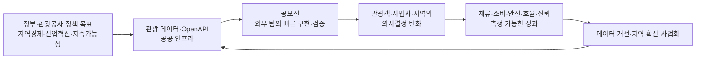

# 2026 관광데이터 활용 공모전 근본문제·정책·고객 페인포인트 조사

> 조사 기준일: 2026-07-28  
> 조사 대상: 한국관광공사 「2026 관광데이터 활용 공모전(웹·앱 구현 부문)」  
> 조사 목적: 아이디어를 먼저 만들기보다, 공모전 발주자인 한국관광공사와 최종 사용자가 실제로 해결하려는 문제를 정책·통계·기사·공고 구조에서 역추적한다.

## 0. 먼저 바로잡을 명칭과 조사 원칙

- 공식 기관명은 **한국관광공사(KTO)**다. 이하 ‘관광공사’로 표기한다.
- 공고문과 지정과제 원문, 정부·관광공사·한국문화관광연구원 자료를 1차 근거로 삼고, 언론 기사는 현장 사례와 비판적 관점을 보완하는 데 사용했다.
- 아래 내용은 다음처럼 구분한다.
  - **확인된 사실**: 공고·정책·통계·조사 원문에 명시된 내용
  - **해석**: 여러 사실을 연결해 도출한 발주자 의도 또는 구조적 문제
  - **검증가설**: 인터뷰나 파일럿으로 추가 검증해야 하는 내용
- 지정과제 10개는 공사가 독자 조사로 뽑은 ‘국내 관광 10대 문제’라고 단정할 수 없다. 공고상 **AI 아이디어 기획 공모전(프롬프톤) 수상작을 웹·앱 구현 과제로 구체화한 목록**이다.

---

## 1. 한 문장 결론

**이 공모전은 관광지 정보를 하나 더 보여주는 앱을 찾는 사업이 아니라, 관광공사가 개방한 데이터를 실제 작동하는 서비스로 전환하여 관광객의 선택, 지역의 체류·소비, 사업자의 운영, 공공부문의 정책 의사결정을 바꿀 수 있는지를 검증하는 공공혁신 실험에 가깝다.**

다만 위 문장은 공사의 공식 슬로건이 아니라, 다음 근거를 종합한 해석이다.

1. 관광공사 OpenAPI를 반드시 사용해야 한다.
2. 아이디어 문서만이 아니라 **구현 완료된 웹·앱**으로 기능심사와 발표심사를 받는다.
3. 지정과제는 관광객 불편뿐 아니라 지역소멸, 오버투어리즘, 축제 예산·운영, 관광기업의 마케팅처럼 정책·산업 문제까지 포함한다.
4. 관광공사의 2026~2030 전략은 지역관광, 관광산업 경쟁력, AI·데이터 혁신, 데이터 개방·활용, 지속가능성을 함께 추진한다.
5. 정부는 관광을 외래객 유치만이 아니라 지역경제와 지방소멸 대응을 위한 국가전략산업으로 다루고 있다.

### 공모전이 구매하려는 가치의 흐름

핵심은 데이터 사용 자체가 아니라 **데이터 → 행동 변화 → 공공·사업 성과 → 재학습**의 폐쇄형 흐름을 만드는 것이다.

---

## 2. 왜 이 공모전을 시행하는가

### 2.1 공공데이터를 ‘개방 실적’에서 ‘사용 가치’로 전환하기 위해

**확인된 사실**

- 2026 구현 부문은 지정과제 10개 중 하나를 선택하고 관광공사 OpenAPI를 필수로 사용해야 한다. 예선·오리엔테이션 뒤 실제 개발, 기능심사, 발표심사까지 이어지며 22개 팀을 선발한다. [2026 웹·앱 구현 부문 공고](https://touraz.kr/announcementList/pssrpView?curPage=1&pssrpSeqEnc=XXqklEQwafIN2rakpflRgQ%3D%3D)
- 관광공사는 TourAPI를 관광정보·이미지·영상·POI 등 민간의 서비스 개발과 사업화 수요에 맞춰 개방해 왔고, 과거 공모전을 통해 서비스 개발, 컨설팅, 홍보, 창업 지원을 연결해 왔다. [관광공사 2023 보도자료](https://kto.visitkorea.or.kr/upload/flexer/upload/ktobiz/20230412/76208107-d8c2-11ed-9757-01577215c2d9.hwp.files/Sections1.html)
- 2026년 공모전 소개 기사에서 활용 가능한 관광 데이터는 약 750만 건이며, 수상팀에는 민간 테스트베드와 창업지원 연계가 제공된다고 설명한다. [연합뉴스, 2026-03-30](https://www.yna.co.kr/view/AKR20260330044800030)

**해석**

공사가 원하는 결과는 API 호출 횟수나 데이터 노출 화면이 아니다. 공공데이터가 민간 서비스, 지역 현장, 창업·사업화로 이어졌다는 **사용 증거**가 필요하다. 따라서 수상 가능성이 높은 서비스는 “KTO 데이터도 사용했다”가 아니라 “이 데이터가 없으면 핵심 기능이 성립하지 않는다”는 구조를 가져야 한다.

### 2.2 아이디어에서 작동하는 서비스로 넘어가는 전환율을 높이기 위해

**확인된 사실**

- 2026년에는 개발 공모전, AI 아이디어 기획 공모전, 웹·앱 구현·개선 부문이 단계적으로 운영된다. 구현 부문은 프롬프톤 수상 아이디어를 지정과제로 받아 **완성된 서비스**를 심사한다. [연합뉴스, 2026-03-30](https://www.yna.co.kr/view/AKR20260330044800030)
- 공식 용역 자료상 공모전 참여 규모는 2024년 321건에서 2025년 541건으로 커졌고, 2026년에 웹·앱 구현 부문이 새로 추가됐다. [문체부 2026 관광데이터 활용 공모전 통합운영 용역](https://www.mcst.go.kr/site/s_notice/notice/bidView.jsp?pSeq=18418)

**해석 — 근거 강도 중간**

아이디어 공급은 늘었지만, 아이디어를 안정적으로 작동하는 제품과 검증 가능한 성과로 바꾸는 단계가 상대적으로 취약했을 가능성이 크다. 구현 부문 신설은 이 간극을 줄이려는 제도 설계로 읽힌다. 다만 공개 자료만으로 과거 아이디어의 실제 사업화 실패율까지 확인할 수는 없다.

### 2.3 관광 데이터는 많지만 현장 의사결정에 바로 쓰기 어렵기 때문에

**확인된 사실**

- 관광 데이터랩은 2021년 출범 당시 분산된 공공·민간 데이터를 통합하고, 민간 데이터 구매 비용과 적시 데이터 채널 부재를 해결하려는 플랫폼으로 소개됐다. 당시 관광공사는 관광업계의 큰 애로로 관광객 이동을 적시에 파악할 데이터 부재를 지목했다. [관광 데이터랩 출범 자료](https://kto.visitkorea.or.kr/upload/flexer/upload/ktobiz/20210217/8683e690-70b3-11eb-b2a5-cd0c845fb4ec.hwp.files/Sections1.html)
- 2022년 개편에서는 고객 설문과 이용 의견을 반영하고, 사용자별 데이터 분석 역량 차이를 고려한 기능·교육·컨설팅을 강화했다. [관광 데이터랩 개편 자료](https://kto.visitkorea.or.kr/upload/flexer/upload/ktobiz/20220228/e5431537-9835-11ec-8ab7-d15ef8c5d574.hwp.files/Sections1.html)
- 데이터랩은 방문자 수와 관광소비액을 총량이 아닌 추세 분석용으로 사용할 것을 안내한다. 지표별 집계 기준이 다르고, 같은 사람이 여러 날 방문하면 일자별로 중복 집계될 수 있으며, AI 분석은 시범 기능으로 해석 오류 가능성을 고지한다. [관광 데이터랩 데이터 유의사항](https://datalab.visitkorea.or.kr/datalab/portal/loc/getAreaDataForm.do?SGG_CD=26140)
- 2026년 관광공사는 관광기업 27개사를 대상으로 데이터 분석 환경과 AI 데이터 마케팅 컨설팅을 지원한다. [2026 관광기업 데이터·AI 활용 지원사업](https://touraz.kr/announcementList/pssrpView?bbsSeq=651194&tabMode=other)

**해석**

공급 문제는 “데이터가 없다”에서 “데이터를 올바르게 해석하고 행동으로 바꾸기 어렵다”로 이동했다. 공사가 필요로 하는 것은 원천 데이터를 다시 나열하는 앱보다, 출처·기준·갱신시각·불확실성을 설명하고 특정 의사결정에 맞춰주는 **신뢰 가능한 의사결정 계층**이다.

### 2.4 수도권·유명지 집중을 지역 체류와 소비로 전환하기 위해

**확인된 사실**

- 정부의 2026 관광전략은 관광을 경제성장과 지방소멸 대응을 견인하는 국가전략산업으로 규정한다. 2025년 방한 외래객은 1,894만 명으로 역대 최대였지만, 80% 이상이 수도권에 체류했다. 지역 전환에는 입국 관문, 숙박, 관광자원, 이동수단이 함께 필요하며, 관광객은 행정구역 단위로 움직이지 않는다는 점도 명시한다. [제11차 국가관광전략회의](https://www.mcst.go.kr/site/s_notice/tv/tvView.jsp?pMenuCD=0307010000&pSeq=2609)
- 2024년 외래객 방문지역은 중복응답 기준 서울 78.4%, 부산 16.2%, 경기 10.0%, 제주 9.9%였다. 평균 체류기간은 2023년 7.8일에서 2024년 6.7일, 1인 총지출은 1,513.3달러에서 1,372.4달러로 감소했다. 반면 일평균 지출은 228.5달러에서 236.4달러로 늘었다. [한국문화관광연구원 2024 외래객조사 분석](https://www.kcti.re.kr/web/board/boardContentsView.do?board_id=14&contents_id=969e40a59b534173bb2911c714ae929d)
- 관광공사의 2026~2030 국내관광 전략은 비수도권 방문과 숙박, 체류형 관광, 생활인구, 주민 참여, 지역관광조직의 자립을 주요 과제로 둔다. [관광공사 국내관광 사업전략](https://knto.or.kr/business02)

**해석**

근본 문제는 ‘숨은 관광지를 몰라서’만이 아니다. 서울·핫스팟은 교통, 숙박, 결제, 다국어 정보, 후기, 예약 가능성 등 **선택 실패 위험이 낮은 곳**이다. 지역 추천 목록을 늘리는 것만으로는 이동·체류·소비가 바뀌지 않는다. 서비스는 대체 목적지의 불확실성과 이동비용을 실제로 낮춰야 한다.

### 2.5 공공기관 내부 개발만으로 빠르게 검증하기 어려운 문제를 외부 혁신으로 시험하기 위해

**확인된 사실**

- 공모전은 개발 컨설팅, 민간 테스트베드, 창업지원과 연결된다.
- 관광공사는 별도로 관광 스타트업과 대기업·중견기업을 매칭해 현장 실증을 지원하는 오픈이노베이션 사업도 운영한다. [2026 관광 글로벌 오픈이노베이션](https://touraz.kr/announcementList/pssrpView?curPage=1&pssrpSeqEnc=JF2NV89GVzUTN%2AA2chUVHw%3D%3D)

**해석**

공모전은 값싼 외주개발이라기보다, 여러 접근을 동시에 시험하여 제품 가능성, 현장 수용성, 데이터 수요를 빠르게 학습하는 **외부 실험 포트폴리오** 역할을 한다. 서비스 이용 과정에서 어떤 API가 부족하고 어떤 정보가 자주 틀리는지도 공사에는 데이터 개선 신호가 된다.

---

## 3. 정부정책과 공사 전략이 공모전에 요구하는 방향

| 정책·전략 축 | 공식 방향 | 공모전 아이디어가 증명해야 할 것 |
|---|---|---|
| 방한관광의 양·질 동시 성장 | 외래객 확대와 체류·소비 개선 | 단순 조회·가입자가 아니라 여행 선택, 일정, 체류, 구매 변화 |
| 지역관광 대도약 | 수도권 집중 완화, 광역 동선, 지역 숙박·소비 | 특정 지역으로 실제 이동할 이유와 이동 마찰 감소 |
| 지방소멸·생활인구 대응 | 반복 방문, 관계인구, 주민 참여, 지역 수익 | 일회성 방문객 수가 아닌 재방문·체류·지역상권 효과 |
| 관광산업 경쟁력·DX | 기업별 수준에 맞는 데이터·AI 활용 | 소규모 사업자가 쓰는 반복 업무도구와 비용·시간 절감 |
| AI·데이터 혁신 | 세분화 데이터 개방, 초개인화, 지역 문제 진단 | 추천의 설명 가능성, 데이터 출처·신선도·불확실성 관리 |
| 지속가능성·수용력 | 관광객·주민 공존, 혼잡·안전·환경 관리 | 관광객을 다른 주거지로 떠넘기지 않는 안전장치 |
| 포용 관광 | 반려동물, 장애인, 고령자 등 조건별 접근성 | ‘가능’이라는 모호한 표기 대신 조건·제약·확인 절차 |

관광공사의 2026~2030 전략은 지역관광 발전, 관광산업 외연 확대와 경쟁력, AI·데이터 혁신, 데이터 개방·활용, 지속가능경영을 동시에 제시한다. [관광공사 비전·전략](https://knto.or.kr/value) 관광공사는 2030년까지 AI 친화 관광 데이터 69만2천 건 개방, 초개인화 정보, 지역 특화 스마트 생태계, 관광기업별 데이터 활용 지원 등을 목표로 제시하고 있다. [관광공사 AI·데이터 혁신 사업](https://knto.or.kr/eng/TourismIndustryAIInnovation)

따라서 정책 정합성이 높은 아이디어는 다음 두 질문을 동시에 통과해야 한다.

1. **사용자에게 더 나은 결정을 만들어 주는가?**
2. **그 결정이 지역·산업·공공정책의 성과로 연결되는가?**

둘 중 하나만 있으면 각각 ‘좋은 소비자 앱이지만 공모전 이유가 약한 서비스’ 또는 ‘정책 구호는 크지만 아무도 쓰지 않는 서비스’가 된다.

---

## 4. ‘고객’은 한 명이 아니다: 다층 고객 구조

| 고객층 | 해결하려는 일 | 현재 페인포인트 | 기대 성과 |
|---|---|---|---|
| 관광공사·문체부 | 공공데이터를 국민·산업·지역 성과로 전환 | 개방 데이터의 실제 사용가치 입증, 지역편중, 산업 DX, 서비스 지속성 | 데이터 활용 사례, 행동 변화, 확산·사업화, 정책 KPI |
| 지자체·RTO·축제 조직 | 한정 예산으로 방문·안전·상권·주민 만족을 함께 관리 | 사후 집계 중심, 기관별 데이터 분절, 주관적 계획, 성과 정의 불일치 | 예측 가능한 운영, 예산 근거, 지역소비, 주민 수용성 |
| 관광객 | 실패 위험이 낮은 여행을 빠르게 결정 | 실시간 변수, 이동·언어 정보, 조건부 입장, 정보 최신성, 혼잡 | 탐색시간 감소, 실패·헛걸음 감소, 안전하고 만족스러운 일정 |
| 관광사업자·시설 운영자 | 상품·마케팅·운영을 적은 인력으로 개선 | 여러 API 해석 부담, 채널 분산, 마케팅·데이터 전문인력 부족 | 업무시간·비용 감소, 전환·예약 증가, 반복 가능한 운영 |
| 지역 주민·상인 | 관광 편익을 얻되 생활피해는 줄임 | 소음·쓰레기·사생활 침해, 수익의 역외 유출, 혼잡 전가 | 공식 동선, 수용력 준수, 지역 매출, 주민 참여·만족 |
| 서비스 개발팀·플랫폼 파트너 | 지속 가능한 제품과 사업모델을 검증 | API 품질·갱신주기, 초기 사용자 확보, 현장 파트너·정답 데이터 부족 | 테스트베드, 재현 가능한 KPI, 운영주체·수익모델 |

### 발주자와 최종 사용자의 요구가 충돌하는 지점

- 관광객은 ‘유명한 곳을 빠르게 선택’하고 싶지만, 정책은 ‘지역 분산’을 원한다.
- 지자체는 방문객 증가를 원하지만, 주민은 생활권 침해를 우려한다.
- 축제 조직은 높은 방문객 수를 성과로 제시하고 싶지만, 안전·주민만족·1인당 소비까지 보면 평가가 달라질 수 있다.
- 반려인은 확정적인 입장 보장을 원하지만, 최종 결정권은 시설 운영자에게 있다.
- 개발팀은 개인화·예측을 강조하고 싶지만, 원천 데이터의 집계 기준과 정답 라벨이 부족할 수 있다.

좋은 아이디어는 이 충돌을 숨기지 않고 **누가 어떤 조건에서 최종 결정권을 가지는지** 제품에 명시한다.

---

## 5. 지정과제 10개를 관통하는 근본문제

지정과제는 표면적으로 서로 다르지만 네 묶음으로 재구성할 수 있다.

| 문제 묶음 | 관련 지정과제 | 표면 문제 | 더 깊은 문제 |
|---|---|---|---|
| 여행 의사결정·실패 위험 | 1, 2, 3, 5, 6 | 실시간 변수, 혼잡, 콘텐츠 편중, 식당·입장 불확실성 | 맥락별 정보가 없거나 최신성·신뢰도가 낮아 사용자가 안전한 선택만 반복 |
| 지역 체류·소비 | 2, 3, 4, 10 | 수도권·유명지 집중, 일회성 방문, 잠재력 미활용 | 접근성·숙박·동선·상품·상권 연결이 끊겨 방문이 지역가치로 남지 않음 |
| 사업자·공공부문 운영역량 | 7, 8, 9, 10 | 상품기획 지연, 마케팅 분절, 축제 수요예측 실패 | 데이터가 많아도 업무 흐름과 성과평가에 연결되지 않음 |
| 지속가능성·사회적 수용성 | 2, 4, 9, 10 | 혼잡, 주민 갈등, 예산 낭비, 지속 불가능한 지역전략 | 관광 편익과 비용이 이해관계자 사이에 불균등하게 분배됨 |

### 근본문제 1. 데이터 풍부함과 의사결정 빈곤의 역설

관광 데이터가 수백만 건이어도 사용자는 “오늘 비가 오는데 반려견과 갈 수 있는가”, 축제 담당자는 “이번 주말 인력을 얼마나 배치할 것인가”처럼 하나의 결정을 내려야 한다. 원천 데이터 목록과 대시보드는 결정을 대신하지 못한다.

**제품 기회:** 사용자 역할과 결정 시점을 먼저 정하고, 필요한 데이터만 결합해 다음 행동과 근거를 제시한다.

### 근본문제 2. ‘정보 존재’와 ‘신뢰 가능한 행동’ 사이의 간극

공공데이터도 지연·누락·집계 차이가 있다. 서울 실시간 도시데이터는 수집 주기와 대상 장소가 제한되며, 2026년 7월에는 통신 집계 누락으로 다수 장소의 인구가 과소 추정되는 품질사고가 공지됐다. [서울 실시간 도시데이터 안내](https://data.seoul.go.kr/dataVisual/seoul/guide.do), [품질오류 공지, 2026-07-22](https://data.seoul.go.kr/together/notice/datasetNoticeView.do?bbsCd=10008&ditcCd=&pageIndex=1&seq=80d6f0ee7267f416f3f199e85d4da68e)

**제품 기회:** 출처, 최종 갱신시각, 결측, 집계 기준, 품질사고, 대체 데이터, 신뢰등급을 기능의 일부로 설계한다.

### 근본문제 3. 지역은 ‘발견’보다 ‘확실성’에서 불리하다

유명지는 정보·후기·교통·예약·결제·외국어 대응이 촘촘해 실패 위험이 낮다. 지역관광 문제를 추천 알고리즘만으로 풀면 클릭은 생겨도 실제 이동·숙박·소비가 일어나지 않을 수 있다.

**제품 기회:** 추천 수보다 이동 가능성, 영업·예약 확인, 날씨 대안, 숙박과 상권 연결, 공식 동선, 귀가 가능성까지 포함한 ‘여행 가능성’을 높인다.

### 근본문제 4. 데이터가 아니라 운영주체와 갱신 책임이 분절돼 있다

반려동물 시설은 담당기관과 시설마다 체중·견종·구역·동반 조건이 다르고 바뀔 수 있다. 지역 교통·숙박·축제 역시 여러 공공·민간 운영자가 관여한다. 정보가 틀렸을 때 누가 확인하고 고칠지가 불명확하면 서비스 신뢰는 빠르게 무너진다.

**제품 기회:** 시설 확인, 관리자 수정, 사용자 제보, 만료일, 변경이력, 분쟁처리까지 포함한 데이터 운영체계를 만든다.

### 근본문제 5. 추천·계획·운영·성과가 하나의 피드백 루프로 연결되지 않는다

방문객 수, 체류, 지역소비, 주민 만족, 안전은 각각 다른 데이터와 담당부서에 있다. 추천 클릭이나 행사 방문자만으로 지역관광 성공을 판단하면 비용과 편익을 놓친다.

**제품 기회:** 사전 목표 → 현장 운영 → 사후 결과 → 다음 계획을 같은 KPI 체계로 연결한다.

### 근본문제 6. 아이디어·프로토타입 이후의 운영 지속성이 약하다

**검증가설 — 근거 강도 중간:** 구현 부문 신설과 창업·테스트베드 연계는 아이디어 이후의 제품화·지속운영이 중요한 정책과제임을 시사한다. 그러나 공개자료만으로 기존 수상작의 생존율은 확인되지 않는다.

**제품 기회:** 수상 이후 데이터 갱신비, 고객획득, 운영주체, 수익·조달 모델, 지역 확산 단가를 제안 단계부터 제시한다.

### 근본문제 7. 관광의 편익과 비용이 서로 다른 사람에게 간다

북촌에서는 관광객의 생활권 침해를 줄이기 위해 출입 제한구역과 시간제한·과태료가 도입됐다. 이는 오버투어리즘이 단순한 ‘혼잡한 사용자 경험’이 아니라 주민의 권리와 정책 집행 문제임을 보여준다. [서울시 북촌 특별관리지역 안내](https://english.seoul.go.kr/notice-on-restrictions-for-tourist-visits-to-bukchon-special-management-area-effective-from-november-2024/)

**제품 기회:** 주민 동의를 받은 시설·공식 동선만 추천하고, 수용력과 민감시간을 반영하며, 지역 상권에 편익이 남는지 측정한다.

---

## 6. 고객의 근본문제를 하나로 정의하면

### 통합 문제정의

> **관광공사는 대규모 관광 데이터를 보유·개방하고 있지만, 관광객·지역·사업자가 이를 맥락에 맞고 신뢰할 수 있는 행동으로 전환하기 어렵다. 그 결과 관광객은 실패 위험이 낮은 기존 유명지로 집중되고, 지역 방문은 체류·소비로 충분히 연결되지 않으며, 사업자와 공공부문은 분절된 데이터로 주관적·사후적 의사결정을 반복한다.**

### 관광공사의 근본 페인포인트

1. **공공데이터의 가치 입증:** 개방량은 늘지만 실제 행동·산업·지역 성과로 이어진 증거가 필요하다.
2. **수도권 집중과 지역경제 전환:** 방문객 증가를 비수도권 체류·소비와 지방소멸 대응으로 연결해야 한다.
3. **관광기업의 활용역량 격차:** 데이터가 있어도 소규모 조직이 복잡한 분석과 마케팅을 수행하기 어렵다.
4. **데이터 신뢰·품질 책임:** 서로 다른 집계 기준, 갱신주기, 누락과 오류를 사용자에게 안전하게 설명해야 한다.
5. **공공정책의 측정 가능성:** 방문객 수 이외에 안전, 주민수용성, 지역소비, 예산효율을 함께 입증해야 한다.
6. **서비스의 지속성과 확산:** 공모전 데모가 수상 이후에도 운영되고 다른 지역에 복제될 구조가 필요하다.

### 최종 사용자의 근본 페인포인트

1. 관광객은 더 많은 정보보다 **실패하지 않을 확실한 다음 행동**이 필요하다.
2. 지역 담당자는 더 많은 차트보다 **예산·인력·동선을 정할 근거**가 필요하다.
3. 사업자는 더 많은 API보다 **기존 업무시간을 줄이고 매출로 연결되는 도구**가 필요하다.
4. 주민은 더 많은 관광객보다 **생활피해를 통제하고 편익을 공유하는 관광**이 필요하다.

---

## 7. 선택한 2·6·9번 과제의 근본 재정의

### 7.1 지정과제 2: 오버투어리즘

#### 표면 문제

유명 관광지에 방문객이 집중되어 혼잡하고, 관광객 만족과 주민 삶의 질이 낮아진다.

#### 5 Why 분석

1. 왜 혼잡한가? 관광객이 같은 장소·시간대에 집중한다.
2. 왜 같은 곳을 고르는가? 후기, 이동, 예약, 언어 정보가 풍부해 실패 위험이 낮다.
3. 왜 대체 지역은 덜 선택되는가? 교통·영업·숙박·귀가·콘텐츠의 확실성이 낮고 정보가 흩어져 있다.
4. 왜 단순 추천으로 해결되지 않는가? 클릭 이후 실제 이동·체류·소비까지의 마찰을 없애지 못하기 때문이다.
5. 왜 정책 성과가 불분명한가? 혼잡을 다른 주거지로 옮길 수도 있고, 지역 상권·주민 편익을 측정하지 않기 때문이다.

#### 근본 문제정의

> 관광객이 **낮은 위험으로 선택할 수 있는 검증된 대안 동선**이 부족하고, 분산 추천이 주민 수용력·지역소비와 연결되는지 확인할 체계가 없다.

#### 공사가 사고 싶은 결과

- 혼잡 시간·장소 회피가 아니라 실제 시간대 분산
- 공식 동선과 주민 동의 시설 중심의 안전한 대안
- 대체지역 체류시간·상권 이동·숙박·재방문 증가
- 민감 주거지 노출과 혼잡 전가 방지

#### 최소 KPI

- 제안 수락률이 아닌 **실제 대체지 이동률**
- 혼잡 시간대 방문 비율 변화
- 대체지역 체류시간·지역상권 방문 또는 결제 대리지표
- 주민 민감구역 추천 0건, 민원·안전 관련 가드레일
- 재방문·추천 만족도

#### 해결 범위 밖

앱만으로 지역 교통·숙박 공급을 늘리거나 관광객의 소비를 보장할 수 없다. 북촌 사례를 전국으로 일반화해서도 안 된다.

### 7.2 지정과제 6: 반려동물 동반여행 정보 불확실성

#### 확인된 고객 문제

관광공사의 반려동물 동반여행 조사에서 보호자 2,144명과 공급자·전문가 10명을 조사했다. 공급자 면접에서는 담당기관별 답변 불일치, 온라인 정보만으로 입장 가능 여부 판단 곤란, 체중·견종·단체·이용구역별 규정 차이, 규정 변경 후 업데이트 필요가 반복됐다. 이용자가 원하는 정보는 동반 가능 숙박 49.4%, 음식점·카페 45.4%, 관광지 38.9%였다. [관광공사 반려동물 동반여행 조사](https://datalab.visitkorea.or.kr/site/portal/ex/bbs/View.do?bcIdx=307494&cbIdx=1129), [보고서 원문 PDF](https://datalab.visitkorea.or.kr/common/board/Download.do?bcIdx=307494&cbIdx=1129&streFileNm=395a52b8-0cab-4ff6-b71a-9e9805cb6fb2.pdf)

#### 5 Why 분석

1. 왜 헛걸음·거절이 발생하는가? ‘동반 가능’ 표기만 있고 실제 조건이 다르다.
2. 왜 조건이 다른가? 시설별로 체중, 견종, 이동장, 구역, 시간, 단체 규칙이 다르다.
3. 왜 온라인 정보가 따라가지 못하는가? 운영자가 바뀐 규정을 여러 채널에 반복 수정해야 하고 확인일·책임자가 없다.
4. 왜 플랫폼이 입장을 보장할 수 없는가? 최종 결정권은 시설 운영자에게 있고 현장 상황도 달라진다.
5. 왜 추천 목록만으로 부족한가? 추천 정확성보다 **검증과 갱신의 운영체계**가 문제이기 때문이다.

#### 근본 문제정의

> 반려동물 장소가 부족한 문제와 별개로, **시설별 조건부 규정을 표준화하고 최신 상태로 검증할 책임·절차가 없어** 사용자가 입장 실패 위험을 떠안는다.

#### 공사가 사고 싶은 결과

- `가능 / 조건부 / 확인 필요`의 3단계 상태
- 체중·견종·이동장·동반구역·추가비용·예약 필요 여부의 구조화
- 최종 확인일, 확인주체, 연락처, 만료예정일, 변경이력
- 시설 운영자 수정과 사용자 제보를 포함한 갱신 흐름
- 헛걸음·전화확인·일정 재작성 시간 감소

#### 최소 KPI

- 규정 필드 완성률과 최근 N일 내 검증률
- 시설 확인 응답시간
- 사용자 추가전화·현장거절·헛걸음률
- 잘못된 정보의 수정 리드타임
- 조건 적합 일정 완성률

#### 해결 범위 밖

서비스는 시설의 최종 입장 결정을 대체하거나 입장을 보장할 수 없다. 또한 반려동물 친화 시설의 절대적 공급 부족, 대중교통 제약, 사회적 갈등까지 앱 하나로 해결한다고 주장하면 안 된다.

### 7.3 지정과제 9: 지역축제 수요예측·운영

#### 확인된 정책 문제

- 정부의 문화관광축제 평가는 전문가 평가뿐 아니라 소비자 만족, 주민평가, 바가지요금, 수용태세를 함께 본다. 2026년 관련 예산은 65억 원에서 104억 원으로 확대되고 AI 기반 수용태세 개선과 연계 관광상품을 추진한다. [2026~2027 문화관광축제 정책](https://www.korea.kr/news/policyNewsView.do?newsId=148958491&pWise=sub&pWiseSub=C1)
- 관광 데이터랩은 축제 기간과 주변지역의 방문·소비를 분석해 경제효과 평가와 다음 기획·마케팅 개선에 활용하도록 지원한다. [관광 데이터랩 행사·축제 분석 안내](https://datalab.visitkorea.or.kr/html/serviceguide/serviceguide.jsp?mode=3)
- 언론이 인용한 2026년 나라살림연구소 분석에서는 축제 수와 대규모 예산 축제는 늘었지만 외부 방문객·지역소비·주민 참여가 같은 비율로 개선되지 않은 사례가 제시됐다. 이는 전국 모든 축제의 인과효과를 확정하는 자료가 아니라, 성과관리 문제를 보여주는 보조 근거다. [세계일보, 2026-03-02](https://www.segye.com/newsView/20260301508552)

#### 5 Why 분석

1. 왜 예측이 빗나가는가? 날씨, 교통, 홍보, 프로그램, 경쟁행사, 현장 수용력 등 변수가 많다.
2. 왜 모델 정확도가 낮은가? 일정·장소 데이터만으로는 실제 방문자 정답값을 만들 수 없다.
3. 왜 정답값이 부족한가? 무료·개방형 축제의 입장 계수 방식이 일관되지 않고 부서·채널별 데이터가 분절돼 있다.
4. 왜 방문객 수만 맞혀도 충분하지 않은가? 안전, 체류, 지역소비, 주민 참여, 예산효율이 정책 성과이기 때문이다.
5. 왜 매년 같은 문제가 반복되는가? 사전계획, 현장운영, 사후평가가 동일한 데이터·KPI로 이어지지 않기 때문이다.

#### 근본 문제정의

> 축제 담당자가 불확실한 수요 아래 예산·인력·동선·안전을 결정해야 하지만, **신뢰할 정답 데이터와 계획–운영–평가의 일관된 성과체계가 부족하다.**

#### 공사가 사고 싶은 결과

- 단일 숫자 예측보다 상·중·하 수요 시나리오와 위험요인
- 예측 근거, 오차범위, 결측, 데이터 기준의 표시
- 혼잡도에 따른 인력·셔틀·주차·동선 대응안
- 방문객 수와 체류시간·지역상권 이동·주민참여·1인당 소비의 동시 평가
- 행사 종료 후 실제값을 반영해 다음 기획으로 학습

#### 최소 KPI

- 기준모델 대비 예측오차와 백테스트 재현성
- 혼잡 임계치 초과시간, 안전 대응 리드타임
- 체류시간·주변 상권 이동·1인당 소비 대리지표
- 예산 1원당 성과와 주민·방문객 만족
- 사후보고서 작성시간과 다음 계획 반영률

#### 해결 범위 밖

과거 입장계수, QR·게이트, 날씨, 교통, 홍보비, 프로그램 변경 등 정답 데이터가 없으면 ‘정확한 AI 수요예측’을 약속해서는 안 된다. 이 경우 제품 표현을 **수요·혼잡 위험 시나리오와 의사결정 지원**으로 낮추는 편이 타당하다.

---

## 8. 2·6·9번 과제의 심사위원 관점 비교

| 항목 | 2번 오버투어리즘 | 6번 반려동물 | 9번 축제 |
|---|---|---|---|
| 정책 정합성 | 매우 높음 | 높음 | 매우 높음 |
| 고객 문제 근거 | 강함, 단 지역별 차이 큼 | 매우 강함 | 중간~강함 |
| API만으로 MVP 가능성 | 중간 | 높음 | 낮음~중간 |
| 추가 현장 데이터 필요 | 이동·혼잡·주민 민감구역 | 시설 검증·변경이력 | 실제 방문자·홍보·운영·소비 정답값 |
| 가장 강한 가치 | 지역분산과 주민 공존 | 헛걸음·거절 위험 감소 | 예산·안전·지역효과 의사결정 |
| 최대 심사 리스크 | 추천이 혼잡을 다른 주거지로 전가 | 정보 최신성과 입장 보장 책임 | 정답 데이터 없는 과장된 AI 예측 |
| 방어적인 제품 포지션 | 검증된 공식 대안동선 | 규정 검증·신뢰 인프라 | 적응형 운영·성과관리 도구 |
| 권장 파일럿 | 1개 혼잡지+2개 공식 대체권역 | 50~100개 시설 | 과거자료 있는 1~2개 축제 |

### 현 단계의 판단

- **문제–MVP 적합도가 가장 높은 것은 6번**이다. 문제 근거가 구체적이고, 사용자의 실패 비용과 데이터 운영 기능이 직접 연결된다.
- **정책 파급력이 가장 큰 것은 2번과 9번**이다. 다만 현장 파트너와 추가 데이터 없이는 정책 구호나 데모 수준에 머물 위험이 크다.
- 2번은 ‘숨은 명소 추천’, 6번은 ‘반려동물 지도’, 9번은 ‘AI 방문객 숫자 예측’으로 축소하면 각각 근본문제를 놓친다.

---

## 9. 공모전이 해결할 수 있는 것과 없는 것

### 공모전 서비스가 직접 개선할 수 있는 것

- API 출처·최종갱신·결측·품질사고·신뢰등급을 보여주는 정보 신뢰 계층
- 반려동물 시설 규정을 조건별로 구조화하고 확인 절차를 줄이는 기능
- 주민 동의 시설과 공식 동선 안에서만 혼잡 대체지를 제시하는 안전한 분산 추천
- 축제의 방문객뿐 아니라 체류, 상권 이동, 주민 참여, 소비를 함께 보는 운영·평가 화면
- 소규모 사업자의 데이터 입력·해석·보고서 작성 시간을 줄이는 업무도구
- 데이터가 확보된 한두 지역·시설군·축제에서 사전등록 KPI를 검증하는 파일럿

### 공모전 서비스만으로 해결할 수 없는 것

- 교통·숙박·반려동물 친화시설의 물리적 공급 확대
- 주민 수용력 기준, 출입시간, 과태료, 보상정책의 결정·집행
- 원천 API의 오류·지연·누락 자체 수정
- 시설 운영자의 최종 입장 결정 대체
- 정답 데이터 없는 축제 방문객·매출·정책효과의 정확한 예측
- 관광중소기업의 자본·전문인력·OTA 협상력 문제
- 추천 클릭만으로 지역분산·주민갈등 감소의 인과효과 입증

심사자료에서는 이 한계를 먼저 인정한 뒤, “전국 관광문제 해결”보다 **신뢰 가능한 의사결정과 검증 가능한 지역 파일럿**으로 범위를 좁히는 것이 방어력이 높다.

---

## 10. 수상 아이디어가 반드시 답해야 할 8가지

1. **누구의 어떤 결정인가?** 관광객의 장소 선택인지, 시설의 규정 갱신인지, 축제 담당자의 인력 배치인지 한 문장으로 특정한다.
2. **왜 관광공사 데이터가 필수인가?** KTO API를 빼면 핵심 가치가 무너지는 구조를 설명한다.
3. **표면 기능이 아니라 어떤 실패비용을 줄이는가?** 헛걸음, 탐색시간, 혼잡, 예산 낭비, 보고서 작성시간 등으로 표현한다.
4. **데이터를 왜 믿을 수 있는가?** 출처·확인일·집계 기준·결측·오차·변경이력을 노출한다.
5. **행동 변화를 어떻게 측정하는가?** 클릭이 아니라 이동, 입장 성공, 체류, 구매, 운영 의사결정으로 측정한다.
6. **정책성과와 사용자 가치가 함께 있는가?** 지역분산을 강요해 사용자 만족을 낮추거나 주민피해를 늘리면 안 된다.
7. **파일럿의 정답 데이터가 있는가?** 특히 2·9번은 파트너 지역과 역사 데이터를 먼저 확보해야 한다.
8. **수상 뒤 누가 갱신하고 비용을 내는가?** 운영자, 고객, 수익모델, 확산단가를 제시한다.

---

## 11. 다음 단계: 가설을 고객 문제로 확정하는 조사 설계

인터넷 조사는 문제의 존재와 정책 맥락을 보여주지만, 사용자가 실제로 돈·시간을 들여 해결하려는지까지 증명하지 못한다. 다음 단계는 ‘아이디어 선호도’가 아니라 **최근 실제 행동과 실패사례**를 묻는 인터뷰다.

### 공통 인터뷰 원칙

- “이 기능을 쓰겠습니까?” 대신 “마지막으로 이 문제를 겪은 상황을 처음부터 설명해 달라”고 묻는다.
- 의견보다 현재 사용하는 대안, 시간, 비용, 실패빈도, 책임소재를 확인한다.
- 문제를 겪지 않은 사람보다 최근 3개월 내 실제 경험자를 우선한다.
- 인터뷰 전 KPI와 탈락 기준을 미리 정한다.

### 2번 오버투어리즘: 최소 12명

- 관광객 5명: 마지막 혼잡 경험, 대체지로 이동하지 않은 이유, 교통·시간·후기의 우선순위
- 지자체·RTO 2명: 혼잡 판단 기준, 공개 가능한 민감구역·공식동선, 성과 KPI
- 주민·상인 3명: 피해 시간대·구역, 허용 가능한 동선, 관광 편익 체감
- 교통·관광 운영자 2명: 실시간 데이터와 실제 대응 사이의 지연

**파일럿 통과 기준 예시:** 공식 대체동선 제안을 받은 사용자 중 실제 이동률이 비교군보다 유의하게 높고, 주민 민감구역 추천이 0건이며 만족도가 하락하지 않는다.

### 6번 반려동물: 최소 15명·시설 50곳 데이터 점검

- 최근 헛걸음·거절 경험 보호자 7명
- 숙박·음식점·관광지 운영자 각 2명 이상
- 반려동물 여행상품 기획자 또는 지역 담당자 2명
- API 표기와 전화 확인 결과를 50개 시설에서 교차검증

**파일럿 통과 기준 예시:** 주요 규정 필드 완성률 90% 이상, 90일 내 확인률 80% 이상, 사용자 추가 확인시간 50% 감소, 현장거절률 기준 대비 감소.

### 9번 축제: 최소 1개 조직·과거 2~3년 자료

- 총괄·안전·교통·마케팅·상권 담당 각 1명 이상
- 상인·주민 4명, 방문객 5명
- 과거 방문자 집계 방식, 일별·시간별 입장, 날씨, 교통, 홍보비, 프로그램, 소비 대리지표 확보

**파일럿 통과 기준 예시:** 단순 전년도 동일값 기준보다 수요구간 예측오차가 낮고, 운영자가 실제 인력·셔틀·동선 결정 중 하나를 변경하며, 종료 후 같은 KPI로 성과보고서가 생성된다.

---

## 12. 심사자료에 바로 쓸 수 있는 문제 서술

### 공통 버전

> 관광공사가 보유한 관광 데이터는 풍부하지만, 관광객과 지역 운영자가 필요한 것은 데이터 목록이 아니라 지금 내릴 결정을 뒷받침하는 신뢰 가능한 근거입니다. 정보의 최신성·조건·집계기준이 불명확하고, 추천 이후의 이동·체류·소비·주민 영향을 측정하지 못해 데이터가 행동과 정책 성과로 충분히 전환되지 않습니다. 본 서비스는 KTO 데이터를 특정 의사결정에 연결하고, 출처와 불확실성을 공개하며, 파일럿에서 행동 변화를 검증합니다.

### 2번 버전

> 오버투어리즘은 단순히 사람이 많은 문제가 아니라, 관광객이 실패 위험이 낮은 유명지에 반복적으로 집중되고 그 비용을 주민이 떠안는 문제입니다. 우리는 숨은 명소를 무작위로 노출하지 않고, 주민 동의 시설·공식 동선·실시간 수용력을 결합해 안전한 대체동선을 제시하고 실제 이동·체류·상권 효과를 검증합니다.

### 6번 버전

> 반려동물 여행의 핵심 불편은 장소 검색이 아니라 ‘동반 가능’이라는 표기가 실제 조건과 달라 현장에서 거절될 수 있다는 불확실성입니다. 우리는 시설 규정을 표준 필드와 `가능/조건부/확인 필요` 상태로 구조화하고, 확인일·확인주체·변경이력을 관리해 헛걸음과 확인시간을 줄입니다.

### 9번 버전

> 지역축제의 핵심 문제는 방문객 숫자 하나를 맞히는 것이 아니라, 불확실한 수요 아래 예산·인력·교통·안전을 결정하고 결과를 다음 기획에 학습시키는 체계가 부족하다는 점입니다. 우리는 예측구간과 위험요인을 제시하고, 현장 대응과 체류·상권·주민 지표를 같은 흐름에서 관리하는 적응형 의사결정 도구를 만듭니다.

---

## 13. 근거 강도와 주의해서 써야 할 주장

| 주장 | 근거 강도 | 안전한 표현 | 피해야 할 과장 |
|---|---:|---|---|
| 외래관광의 서울·수도권 집중 | 강함 | 서울 방문 비중이 압도적이며 정부도 수도권 체류 집중을 정책문제로 본다 | 지역 비율을 단순 합산해 수도권 점유율로 제시 |
| 오버투어리즘과 주민 갈등 | 강함 | 북촌 등 실제 규제·갈등 사례가 있으며 지역별 진단이 필요하다 | 북촌 한 사례를 전국 모든 관광지에 일반화 |
| 공공데이터의 지연·오류·집계차이 | 강함 | 원천별 갱신주기와 품질 한계를 제품에서 관리해야 한다 | 국민 전체가 공공 관광정보를 신뢰하지 않는다고 단정 |
| 관광중소기업의 데이터 활용 부담 | 중간 | 소규모 사업자가 여러 데이터와 지표를 해석하는 부담을 줄인다 | 대부분의 관광기업이 데이터를 전혀 못 쓴다고 주장 |
| 반려동물 규정 불확실성 | 매우 강함 | 시설·조건별 차이와 갱신 필요가 조사에서 확인됐다 | 전국 시설의 오류율을 임의 수치화하거나 입장 보장 |
| 축제 성과 불일치 | 중간~강함 | 방문객·소비·주민·예산을 연결한 일관된 평가가 필요하다 | 축제 평가가 전혀 없거나 모두 예산 낭비라고 주장 |
| 아이디어→사업화 간극 | 중간 | 구현부문 신설은 제품화 검증 강화로 해석된다 | 과거 수상작 대부분이 실패했다고 단정 |

---

## 14. 조사 한계와 아직 모르는 것

1. 관광공사 내부의 부문별 KPI, 예산 우선순위, 공모전 수상작 생존율은 공개자료만으로 확인하지 못했다.
2. 지정과제 10개는 프롬프톤 수상작 기반이므로, 공사가 조사한 문제 우선순위와 동일하다고 볼 수 없다.
3. 정책 정합성이 높아도 실제 사용자 수요, 지불의사, 조직 도입 가능성이 자동으로 증명되지는 않는다.
4. 관광 데이터랩과 실시간 데이터는 추세·대리지표일 수 있으며, 실제 방문·입장·매출의 정답값과 다를 수 있다.
5. 오버투어리즘과 축제 문제는 지역별 편차가 크다. 전국형 제품을 먼저 약속하기보다 한 지역의 재현 가능한 파일럿이 필요하다.
6. 반려동물 조사에서 공급자·전문가 심층면접은 10명이므로, 현장 문제의 구조를 보여주지만 전국 오류율로 정량 일반화할 수 없다.

---

## 15. 핵심 출처 목록

### 공모전·관광공사

- [2026 관광데이터 활용 공모전 웹·앱 구현 부문 공고](https://touraz.kr/announcementList/pssrpView?curPage=1&pssrpSeqEnc=XXqklEQwafIN2rakpflRgQ%3D%3D)
- [2026 관광데이터 활용 공모전 기사, 연합뉴스](https://www.yna.co.kr/view/AKR20260330044800030)
- [한국관광공사 2026~2030 비전·전략](https://knto.or.kr/value)
- [한국관광공사 국내관광 사업전략](https://knto.or.kr/business02)
- [한국관광공사 AI·데이터 혁신 사업](https://knto.or.kr/eng/TourismIndustryAIInnovation)
- [관광 데이터랩 출범 자료](https://kto.visitkorea.or.kr/upload/flexer/upload/ktobiz/20210217/8683e690-70b3-11eb-b2a5-cd0c845fb4ec.hwp.files/Sections1.html)
- [관광 데이터랩 데이터 유의사항](https://datalab.visitkorea.or.kr/datalab/portal/loc/getAreaDataForm.do?SGG_CD=26140)

### 정부정책·연구

- [제11차 국가관광전략회의: 방한관광 대전환 및 지역관광 대도약](https://www.mcst.go.kr/site/s_notice/tv/tvView.jsp?pMenuCD=0307010000&pSeq=2609)
- [제6차 관광진흥기본계획 2023~2027](https://www.korea.kr/news/policyNewsView.do?newsId=156541994)
- [한국문화관광연구원 외래관광객 지역분산 연구](https://www.kcti.re.kr/web/board/boardContentsView.do?LISTOP=&board_id=2&cate_id=42f27c1f6c0e459cb029bf0806a4b935&contents_id=aafe2dfd57004fbdbdf97a39c70b1d8c&miv_pageNo=&miv_pageSize=&mode=W&report_end_year=&report_start_year=&searchkey=ALL&searchtxt=&total_cnt=)
- [한국문화관광연구원 오버투어리즘 정책 연구](https://www.kcti.re.kr/web/board/boardContentsView.do?board_id=2&contents_id=dc55e2603daf40a1bd29f8d74d1a2b89&link_g_homepage=F&link_g_submenu_id=&link_g_topmenu_id=)
- [관광산업 디지털 전환 정책 연구](https://www.kcti.re.kr/web/board/boardContentsView.do?LISTOP=&board_id=2&cate_id=160bcb16c21d471a9509cf3a41cb70e0&contents_id=f5f1766468b04f3fbbe142bc9c2eb0f1&etc10=&link_g_homepage=F&link_g_submenu_id=0382ccddbde44a91bd57a705ed56aade&link_g_topmenu_id=15f51238586a425981abe0b5f685d43a&miv_pageNo=1&miv_pageSize=&mode=W&report_start_year=&searchkey=ALL&searchtxt=&total_cnt=)
- [2026~2027 문화관광축제 정책](https://www.korea.kr/news/policyNewsView.do?newsId=148958491&pWise=sub&pWiseSub=C1)

### 고객·현장 문제

- [2024 외래관광객조사 분석](https://www.kcti.re.kr/web/board/boardContentsView.do?board_id=14&contents_id=969e40a59b534173bb2911c714ae929d)
- [관광공사 반려동물 동반여행 조사](https://datalab.visitkorea.or.kr/site/portal/ex/bbs/View.do?bcIdx=307494&cbIdx=1129)
- [서울시 북촌 특별관리지역 안내](https://english.seoul.go.kr/notice-on-restrictions-for-tourist-visits-to-bukchon-special-management-area-effective-from-november-2024/)
- [서울 실시간 도시데이터 안내](https://data.seoul.go.kr/dataVisual/seoul/guide.do)
- [지역축제 증가와 성과 논쟁, 세계일보](https://www.segye.com/newsView/20260301508552)

---

## 최종 판단

관광공사의 가장 근본적인 고객 문제는 **관광 데이터 부족**이 아니라 **데이터가 신뢰 가능한 행동과 측정 가능한 지역·산업 성과로 전환되지 않는 것**이다. 따라서 향후 아이디어 고도화의 중심도 기능 수가 아니라 다음 구조가 되어야 한다.

> **명확한 결정 순간 → KTO 데이터의 필수 역할 → 신뢰·갱신 체계 → 실제 행동 변화 → 정책성과 → 운영·재학습**

2번은 ‘대체 명소 추천’이 아니라 **주민과 공존하는 검증된 대안동선**, 6번은 ‘반려동물 지도’가 아니라 **시설 규정의 검증·갱신 인프라**, 9번은 ‘AI 방문객 숫자’가 아니라 **축제 계획–운영–평가의 적응형 의사결정 체계**로 재정의할 때 공모전의 시행 목적과 가장 잘 맞는다.
