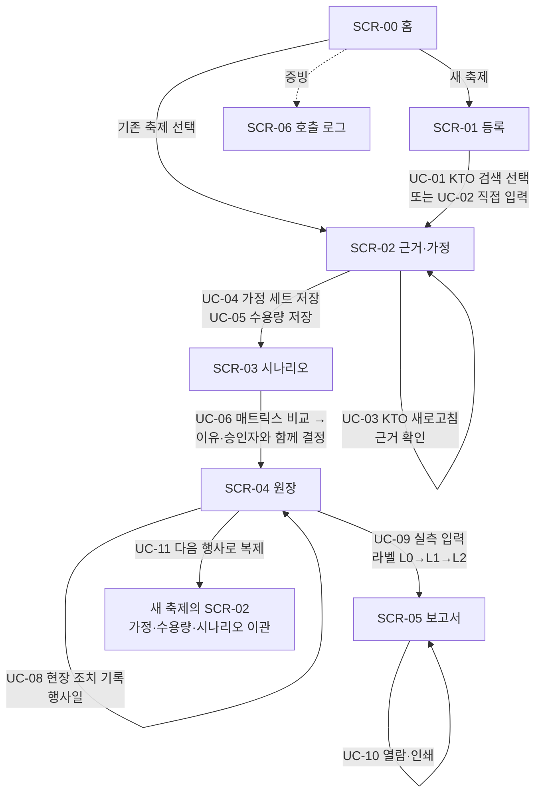
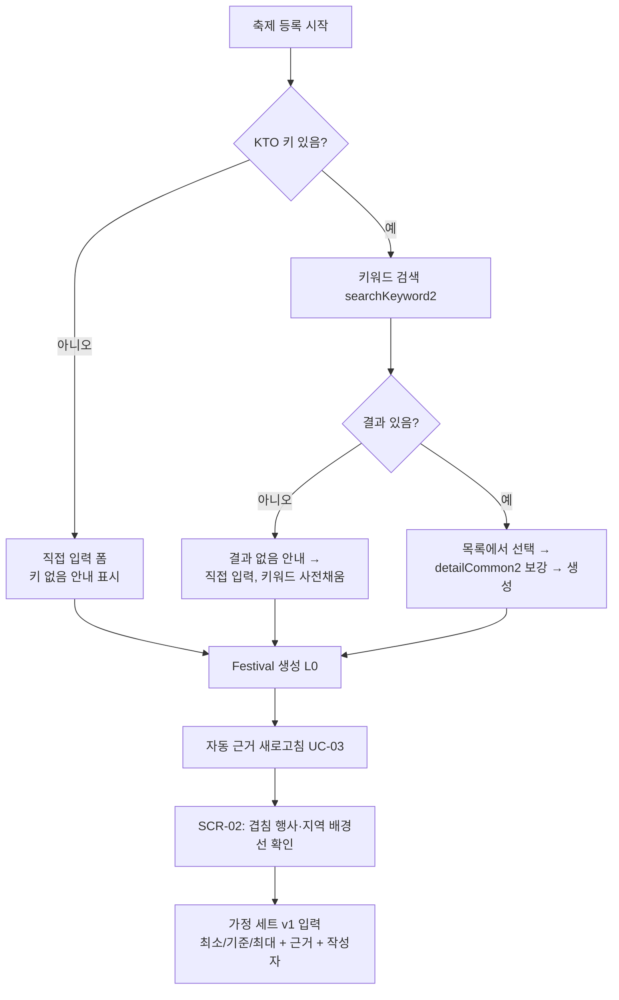
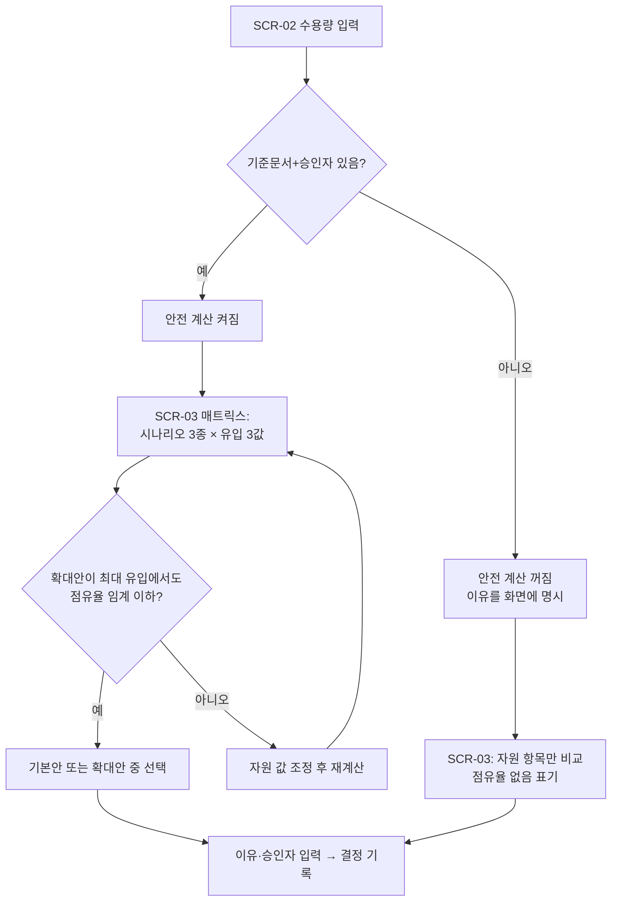
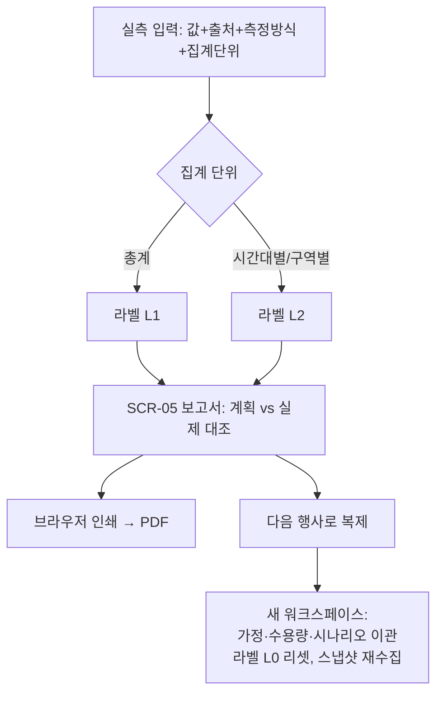

# 02. 사용자 플로우

> FEST Compass MVP · 2026-08-30 · ID 참조: 화면 [03_화면설계서.md](03_화면설계서.md), 유스케이스 [01_유스케이스.md](01_유스케이스.md)

## 1. 정보 구조 (IA)

```text
/                          SCR-00 홈 (축제 목록)
/festivals/new             SCR-01 신규 등록 (KTO 검색 + 직접 입력)
/festivals/[id]            → /festivals/[id]/evidence 로 리다이렉트
/festivals/[id]/evidence   SCR-02 근거·가정
/festivals/[id]/scenarios  SCR-03 시나리오 비교
/festivals/[id]/ledger     SCR-04 결정·성과 원장 (+트리거 섹션 [신규 D2])
/festivals/[id]/report     SCR-05 사후보고서
/logs                      SCR-06 API 호출 로그
```

축제 내부 탭 순서(FestivalNav): 근거·가정 → 시나리오 → 결정·성과 → 보고서.
이 순서는 사용자 여정(D-90 → D+14)과 일치하며 변경하지 않는다.

## 2. 전체 여정 플로우 (FLOW-MAIN)

개선안 §2.2 대표 시나리오(○○군 봄꽃축제, L1)를 관통하는 기본 경로.
90초 데모 스크립트(개선안 §2.3)와 동일한 순서다.



## 3. 시점별 상세 플로우

### FLOW-D90 — 기획 초기 (UC-01/02/03/04)



핵심 판단: **겹침 행사**(같은 기간·지역의 다른 행사)를 보고 일정·회차를 재고,
**전년 동기간 배경선**을 보고 유입 가정 범위를 정한다. 배경선 카드에는
"행사장 입장객이 아닙니다" 가드레일이 항상 붙는다.

### FLOW-D30 — 자원 계획 (UC-05/06)



### FLOW-DAY — 행사일 (UC-08)

등록된 트리거 목록이 원장 상단에 보인다. 조치 입력 시 트리거를 선택하면
"계획된 대응이 실행됨"으로, 자유 입력이면 "계획 밖 대응"으로 구분되어
사후 학습(계획된 트리거의 적중 여부)이 가능하다.

### FLOW-D14 — 사후 학습 (UC-09/10/11)



## 4. 예외 상태 플로우 (FLOW-ERR)

기획서 §6.4의 규칙을 화면 행동으로 전개한 것. 모든 예외에서 공통 원칙:
**빈 값을 0으로 채우지 않는다 · 이전 값을 최신처럼 보이지 않는다 · 다음 행동을 안내한다.**

| 상태 | 발생 지점 | 화면 표시 | 사용자의 다음 행동 |
|---|---|---|---|
| 키 없음 | UC-01/03 | SCR-01 "검색을 건너뜁니다" / SCR-02 결측 패널 `key_absent` | 직접 입력 계속, 키 설정 후 새로고침 |
| API 오류 | UC-03 | 스냅샷 status=error, 이전 성공값이 있으면 "이전 성공값(최신 아님)" 배지 | "다시 불러오기" 1회 재시도 |
| 빈 결과 | UC-03 | "없음" 표기 (예: 집중률 미지원 관광지) | 해당 근거 없이 가정 입력 진행 |
| 지역코드 매핑 없음 | UC-02/03 | 결측 패널 "배경선 호출 건너뜀" | 지역코드 수정 |
| 라벨 L0 | 상시 | 라벨 게이트 배너 "실측 라벨 없음 — 가정·시나리오만" | 시나리오 모드로 진행 (정상 동작) |
| 가정 결측 | UC-06 | 매트릭스 셀 "없음" | SCR-02로 돌아가 가정 입력 |
| 안전 계산 꺼짐 | UC-05/06 | "기준문서·승인자 미확인 — 안전 계산 꺼짐" | 기준문서·승인자 입력 |
| stale 스냅샷 | UC-03 실패 후 | 기존 카드 유지 + stale 배지 | 새로고침 재시도 |

## 5. 데모 경로와의 관계

개선안 §2.3의 90초 데모는 FLOW-MAIN의 부분 경로다:
SCR-02(가드레일 확인·가정 입력 30초) → SCR-03(비교·결정 30초) → SCR-04·05(조치·보고서·복제 30초).
시드 데이터(○○군 봄꽃축제)는 이 경로가 입력 없이도 시연 가능하도록 각 단계의 완료 상태를 미리 담고 있다.
설계 변경(D1 매트릭스, D2 트리거) 반영 시 `prisma/seed.ts`와 `scripts/demo-e2e.mjs`의 검증 문구도 함께 갱신해야 한다.
