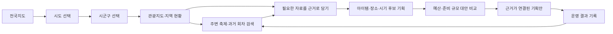

# 지자체 관광데이터에서 올해 축제 기획으로 이어지는 마일스톤

기준일: 2026-09-08. 사용자가 주 타겟·정보 수요·최종 의사결정을 명확히 한 내용을 반영한다.
이 문서는 앞으로의 제품 우선순위와 완료 기준의 정본이다. 기존 설계·검증 문서는 구현 이력과 근거로 유지한다.
M1의 첫 구현과 로컬 검증을 추가했다. 실제 제공 범위·공개 반영은 [M1 검증](../validation/20-region-explorer.md)을 따른다.

## 제품 목표와 사용자

**지자체 축제 담당자가 자기 지역의 관광데이터와 주변·과거 축제의 근거를 살펴보고,
올해 어떤 축제를 어떤 아이템으로, 어느 장소·시기에, 어느 정도 예산과 준비 규모로 기획할지 판단한다.**

- 1차 정보 수요: 담당 지자체의 관광자원·방문 추세·기존 행사와 지역 특성을 파악한다.
- 2차 정보 수요: 주변 지자체의 현재 등록된 축제와 과거 회차를 검색·비교한다.
  이 우선순위는 사용자가 제시한 가설이며 실제 담당자 과제 관찰로 확인한다.
- 최종 산출물: 축제 주제·아이템, 대상 방문층, 후보 장소·시기, 운영 규모, 항목별 예산,
  대안 비교와 선택 이유가 공공데이터 근거에 연결된 기획안이다.
- 예측은 위 판단에 필요한 보조 정보다. 추가 정확도 연구보다 지도·조회·비교·기획 연결을 우선한다.

## 현재까지 가능한 일과 빠진 부분

| 범위 | 현재 상태 | 근거와 한계 |
|---|---|---|
| 공공데이터 연결·논산 과거 이력·방문 추세 실험·매일 수집 | 사용 가능, 논산 사례 중심 | `docs/validation/05~15`, `/forecast*`. 모든 지자체의 동일 범위 확보를 뜻하지 않음 |
| 축제 이름 검색·동기간 행사·연관 관광지 조회 | 현재 등록 행사 검색 사용 가능, 장기 행사 겹침·연관 관광 확장 후속 | `/compare`에서 지역 최대 3곳의 기간 내 시작 행사 조회. `/regions`에서 관광자원 조회. 전수 일정 겹침·거리순 검색은 후속 |
| 내 지자체 선택·관광지도·지도와 차트의 연동 | 첫 기능 구현·검증 | `/regions` 전국→시도→시군구·현재 관광자원/행사·논산 방문 이력·개인 근거 보관. 정식 행정경계와 전국 방문 이력은 후속 |
| 주변·과거 축제의 조건 검색과 나란히 비교 | 첫 기능 사용 가능 | `/compare`에서 8회차 조건 검색·자료 확보 현황·일정/방문/비용 그래프·근거 사본. 전국 과거자료 확장과 일반 비용 증감은 후속 |
| 데이터에서 축제 아이템·장소·시기를 도출하고 근거로 담기 | 첫 기능 사용 가능 | `/planning/options`에서 사업·두 후보·장소·준비 과제와 선택 당시 지도/비교 근거를 연결 |
| 운영안·총예산·결정·현장·실측·보고서·다음 회차 | 개인 기록 기능 사용 가능, 기획 근거 연결은 개발 필요 | `/workspace`는 브라우저 저장. 항목별 예산은 `/planning/budget`에 별도 연결. 기획안 보관·출력은 `/planning/proposal`에 연결. 기존 운영 결과 연결과 공동 승인은 후속 |

2026-09-08 현재 **전국 조회·주변/과거 비교·개인 근거 보관과 운영 계획/기록의 첫 흐름**을 사용할 수 있다.
지도 탐색부터 축제 기획을 결정하는 제품 전체 MVP가 완료된 상태는 아니다.

## 제품 마일스톤

기존 7단계는 조사·설계·검증을 진행하는 작업 절차다. 아래 M1~M6는 사용자가 실제로 할 수 있어야 하는 일이다.

| ID | 마일스톤 | 사용자가 할 수 있는 일 | 현재 상태 | 완료 기준 |
|---|---|---|---|---|
| M1 | 내 지자체 관광지도와 현황 | 시군구를 선택하고 관광자원·등록 축제·지역 방문 추세를 지도·차트로 탐색 | 첫 기능 구현·검증, 지역별 확대 후속 | 선택 지역·기간이 지도/목록/차트에 함께 적용됨. 항목 선택으로 상세·출처·기준일·자료 단위를 확인하고 근거로 담을 수 있음 |
| M2 | 주변·현재·과거 축제 비교검색 | 주변 지역과 과거 회차를 기간·거리 또는 지역·주제 등의 조건으로 찾고 비교 | 첫 기능 구현·검증. 전국 확장·일반 비용 증감 후속 | 비교할 축제와 회차를 구분하고 같은 조건으로 나란히 조회. 일정 중복·지역 연계 자원·자료 누락을 확인하고 검색 조건과 근거를 보관 |
| M3 | 축제 아이템·장소·시기 기획 | 지역 강점과 비교 사례로 주제·아이템·대상·장소·일정 후보를 구성 | 첫 기능 구현·검증, 실무자 관찰 후속 | 적어도 두 기획 대안에 선택한 지도 항목·지표·사례를 연결. 각 후보를 선택하거나 제외한 이유를 근거와 함께 설명 |
| M4 | 예산과 준비 규모 비교 | 프로그램·공간·시설·인력·교통·홍보 등 준비 내역과 비용을 비교 | 첫 기능 구현·검증, 실무자 관찰 후속 | 수량×단가·출처·가정·제약을 추적하고 항목 합계와 총액이 일치. 서로 다른 규모의 안을 같은 기준으로 비교하고 예산 한도 초과를 표시 |
| M5 | 근거가 연결된 기획안과 결정 | 왜 이 축제·아이템·장소·예산인지 설명하는 기획안을 보관·출력 | 첫 기능 구현·검증, 실무자 관찰 후속 | 조회 조건과 선택 당시 자료·대안·비용·판단 이유가 기획안에 남음. 이후 자료가 갱신돼도 결정 당시 근거를 재확인 가능 |
| M6 | 운영 결과와 다음 회차 재사용 | 실제 운영·성과·비용을 계획과 비교하고 다음 기획에 활용 | [M6 첫 구현·검증](../validation/25-planning-outcomes.md), 전국 집행 자료·실무 검증 확장 필요 | 원래 계획과 정의가 같은 실측을 비교. 회차별 결과를 M2의 과거 사례로 다시 찾고 M3의 새 기획 근거로 사용 |

2026-09-08 후속 지시로 **D0 기획·요구사항·화면설계·와이어프레임 검수**를 개발 앞에 둔다.
검수 정본은 [개정 기획서](../sdlc/0-planning/product-plan.md)와
[검수 안내](../review/2026-09-planning-review.md)다. 이번 산출물은 개발 전 시안이며 실무 검수 완료가 아니다.
사용자가 v3 검토 후 M1 개발 진행을 승인했다. 개발 순서는 **M1 → M2 → M3**이다. M4 예산·준비 규모의 첫 구현과 자동 검증을 추가했다. M5 기획안 보관·사업설명/준비 목록 출력을 구현·검증했다. M6는 공개 비용 조회·개인 결과 비교·불변 결과 출력과 다음 회차 기획을 연결한다.
M1은 논산의 검증 자료로 첫 동선을 확인하되 시군구 선택과 데이터 보유 범위를 드러낸다.
다른 지자체를 선택했을 때 논산 자료를 대신 보여주지 않는다. M2에서 다른 지역과 여러 회차로 확장한다.
전국의 모든 과거 자료 확보를 M1 시작의 선행 조건으로 만들지 않는다.

## 화면에서 이어져야 하는 행동

첫 화면은 전국지도이며 시도→시군구로 좁혀 간다. 우리 지역은 명시적 바로가기로 제공한다. 지역·기간·자료 종류를 바꾸면 지도와 요약 차트가 함께 바뀌고,
마커나 지역을 선택하면 상세가 열린다. 사용자는 자료의 지표·기간·공간 범위·출처를 확인해
‘기획 근거에 담기’로 선택한다. 분석 페이지 링크만 붙이거나 지도 위에 점만 표시하면 연결 완료가 아니다.

근거에는 출처·조회 조건·지역 단위·기준 기간·수집 시각과 선택 당시 값을 남긴다.
기획안에서는 각 근거가 어떤 아이템·장소·예산 판단에 쓰였는지 다시 찾아갈 수 있어야 한다.

## 데이터와 의사결정 표현 기준

- 시군구 방문 통계는 해당 지역 단위로 표현한다. 자료가 없는 행사장·도로·시간대의 혼잡으로 세분화하지 않는다.
- 관광지·축제 위치는 확인한 좌표로 표시하고 좌표가 없으면 목록과 누락 상태로 남긴다.
- ‘현재 축제’는 조회 시점에 확인한 등록 일정이다. 현장의 실시간 운영 상태로 표현하지 않는다.
- 조회 기간·장소·회차가 다르거나 실측 정의가 다른 값은 동일 지표처럼 합산·순위화하지 않는다.
- 축제 주제·성공 사례의 상관관계를 개최 효과로 단정하지 않는다. 후보별 근거·제약·미확인 사항을 보여준다.
- 예산·현장 입장·프로그램 원가가 공공데이터에서 확인되지 않으면 사용자 견적·가정을 명시한다.
  현재 연결한 축제 API만으로 최적 예산·안전 규모·흥행 효과를 자동 산출한다고 약속하지 않는다.
- 모델 적용은 검증한 지역·지표·기간 안에서만 한다. 논산 모델을 모든 지자체에 바로 적용하지 않는다.

지도 서비스·경계 자료·좌표 품질·관광자원 분류·과거 회차 보유 범위는 M1~M2 착수 시 검증한다.
새 자격 발급·비용 발생·공개 서버 편집에는 기존 운영 정책을 적용한다.

## MVP 전체 완료와 검증

전체 MVP 완료는 지자체 담당자가 **전국에서 자기 지역 선택 → 지도 조회 → 주변/과거 비교 → 근거 선택 →
아이템·장소·시기·예산·준비 규모 대안 → 기획안**을 끊김 없이 수행할 수 있을 때 판단한다.
현재 개인 기록 E2E 통과는 이 완료 기준을 대체하지 않는다.

첫 실무 과제는 “담당 지역의 올해 축제 기획안 2개를 비교해 하나를 선택하고, 자료를 근거로 설명하라”다.
과제 완료 여부·소요 시간·근거 추적 가능성·정보 수요 순서·지표 오해·추가 자료 요청을 관찰한다.
자료를 못 찾는 상황과 다른 지역으로 전환하는 과제도 포함한다. 실제 담당자 검증은 아직 미실시다.

## 공개 사례 반영 v2의 완료 조건 보완

개발 순서는 유지한다. [요구사항 v2](../sdlc/1-analysis/srs.md)와 [화면 v2](../sdlc/2-design/screens.md)에 아래 깊이를 반영했다.

| 마일스톤 | 추가로 확인할 완료 조건 |
|---|---|
| M1 | 사업·예산 정보 없이 탐색하고 장소 관광정보와 사용 가능 확인을 구분 |
| M2 | 전체/부분 비용·문서 단계·부서·재원·세금 기준이 다르면 비교 계산 보류 |
| M3 | 사업연도·부서·수행 관계, 설치/행사/철거·조건과 담당/기한/선행 과제를 연결 |
| M4 | 재원/지출 분리, 기간 중복 계산 방지, 단계별 금액·연도별 분류·기준 버전 대비 증감 이유 |
| M5 | 같은 기획 버전으로 사업설명·준비 목록 출력, 미확인과 출처 유지 |
| M6 | 재원별 실제 사용·잔액/반납/이자·증빙 상태, 개선의 차기 준비/예산 연결, 결과 버전 출력 |

문서 v2와 내부 검수 사이트의 갱신은 개발 완료가 아니다. 신규 인수 시나리오는 구현 후 실행 증거를 추가한다.

## 전국·그래프 검수 v3

- M1: 전국→시도→시군구와 상위 복귀, 자료 확보 범위·첫 페이지 제한·지역 코드/경계 검증, 지도/목록 대체를 완료 조건에 포함한다.
- M2: 회차별 보관·지표별 확보 현황, 실제 값의 선·막대·일정 그래프와 출처 표, 선택 구간 근거 저장을 검증한다.
- M4: 재원/지출 구성과 후보 비교를 시각화하되 미산정·분모 미확인·총액 0의 파이를 보류한다.
- M5~M6: 선택 당시 그래프·표·출처의 출력과 같은 정의 계획/결과 비교를 연결한다.

[시각화 설계](../sdlc/2-design/data-visualization.md)와 [자료 점검](../research/2026-09-historical-comparison-review.md)이 세부 기준이다. 신규 기능 구현·실무자 관찰은 개발 필요다.

## M5 첫 구현 (2026-09-09)

두 후보와 선택 이유가 있는 기획안을 같은 버전으로 보관·출력한다. [사용 흐름](../sdlc/2-design/proposal-implementation.md)과 [검증·게시 상태](../validation/24-planning-proposal.md)를 따른다. M6 결과·다음 회차 연결은 [별도 검증 기록](../validation/25-planning-outcomes.md)을 따른다. 실제 담당자 관찰은 아직 완료하지 않았다.
