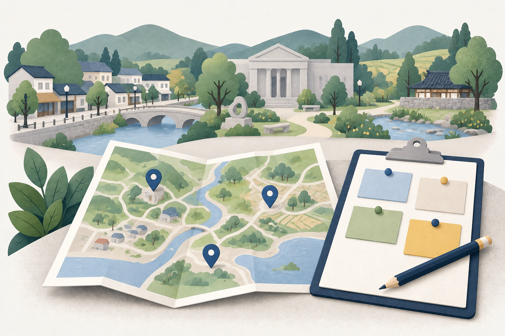

# 관광자원 탐색의 시각 설계

상태: 설계·구현·로컬 검수 완료, 공개 반영 진행 중. [검수 기록42](../validation/42-resource-experience.md)를 따른다. 설계19의 데이터·주소·상태 계약을 유지한다.
사용자가 승인한 범위는 두 관광자원 화면의 시각화와 첫 화면 목적 카드 이미지다.
전역 메뉴·방문 추이 차트·시기 달력의 전면 개편은 다음 작업에서 같은 기준을 확장한다.

## 화면 목표와 핵심 행동

담당자가 선택한 지역에서 함께 방문하고 식사하고 머물 장소를 찾고, 위치·소개·기준점과의 거리를 비교한다.
관광지·문화시설·음식점·숙박을 같은 위계로 제공한다. 어떤 축제에서도 같은 조작을 사용한다.
데이터가 답하지 못하는 관광객 목표나 방문 이유를 필수로 입력하게 하지 않는다.

## 기준과 참고 화면

devkit `dev-standard/policy/product-experience.md`와 design-reference 기준에 따라 다음 후보를 비교했다.
2026-09-26 기존 화면은 기록41의 PC·모바일 캡처와 실제 소스를 확인했다.

| 후보 | 장점 | 적용 판단 |
|---|---|---|
| 현재 관광자원 번호 마커·목록 | 목록 번호와 위치 연결이 직관적 | 번호와 상세 연결 유지. 밀집 시 마커 겹침은 교체 |
| 저장소의 지역 탐색 지도 `RegionStreetMap` | 묶음 개수와 장소 선택 목록, 동일 좌표도 선택 가능 | 주 참고. 상태·접근성과 대량 처리 비용을 개선해 관광자원에 적용 |
| [Mapbox 공식 군집 예제](https://docs.mapbox.com/mapbox-gl-js/example/cluster/) | 군집 개수로 밀도를 보여주고 확대 시 분리 | 개수 표현 참고. 확대만으로 동일 좌표가 분리되지 않으므로 선택 목록을 기본 행동으로 채택 |

Mapbox는 공식 예제의 동작·코드를 참고했으며 라이브러리·유료 지도·토큰을 추가하지 않는다.
지역 탐색의 별도 지도와 전역 CSS는 이번 변경으로 덮어쓰지 않는다.

## 배치와 표현 규칙

```text
관광자원                      지역명
[관광지 ✓  N건] [문화시설 ✓ N건] [음식점] [숙박]
기준점 이름 / 반경 / 정렬 / 기준점 해제
현재 목록 N건 · 지도 M건
┌ 장소 목록 (약 40%) ─────┬ 지도 (약 60%) ─────────┐
│ 번호 · 이름           │ 단일 장소: 번호        │
│ 유형 · 주소 · 거리    │ 밀집: N곳              │
│ 선택 상태/함께 보기   │ 묶음 → 장소 선택 목록  │
└─────────────────────┴───────────────────────┘
선택 장소 이름                                    닫기
유형 · 주소 · 직선거리 / 기준점 지정 / 소개 / 출처
새 축제: 함께 보기(최대 두 곳)
```

- PC는 목록·지도 2열. 모바일은 기존 목록/지도 전환과 상세 하단 배치를 유지한다. 200% 확대에서는 자연스럽게 한 열로 전환한다.
- 선택 유형의 건수·불러오기·실패 상태를 유형 선택 영역과 가까이 배치한다. 목록과 지도 개수는 실제 표시 자료에서 계산한다.
- 이름은 16px/600~700, 본문·주소·조작은 14~16px, 섹션 제목은 20px 이상. 출처 등 보조 정보도 원칙상 13px 이상.
- 본문은 충분한 행간(약 1.5), 긴 한국어 이름과 주소는 줄바꿈한다. 숫자는 tabular-nums, 큰 건수는 천 단위 구분, 단위는 항상 함께 표시한다.
- 기존 남색(#071a33, #10233d)·파랑(#2667e8)·밝은 배경(#f6f7f4)을 유지한다. 파랑은 선택/행동, 회색은 보조 정보, 실패는 명시적 상태와 재시도로 전달한다.
- 선택은 색만 쓰지 않고 체크·테두리·aria-pressed와 함께 표현한다. 함께 보기는 별도 표식/레이블로 구분한다.
- 클릭 영역은 최소 44px를 목표로 하고 키보드 focus-visible을 명확히 한다. 버튼과 본문을 겹쳐 놓지 않는다.
- 한 화면의 카드·구분선·여백을 일관되게 묶되 장식용 카드와 설명문을 늘리지 않는다. 내부 검증·호출 한도·정제 절차를 화면 문구로 쓰지 않는다.
- 데이터 출처, 지도 저작권 귀속, 직선거리 의미, 조회 실패와 복구 행동은 짧게 유지한다. 제공되지 않는 소개 영역은 생략한다.

## 군집 지도 행동

1. 화면 좌표로 가까운 마커를 묶는다. 단일 마커는 목록 번호, 군집은 실제 장소 수를 표시한다. 인접 격자 경계에서도 버튼이 겹치지 않게 처리한다.
2. 군집 선택은 그 묶음의 번호·이름이 있는 실제 버튼 목록을 연다. 같은 좌표의 모든 장소를 직접 선택할 수 있어야 한다. 많은 장소는 제한 높이 안에서 스크롤한다.
3. 군집의 장소를 선택하면 기존 상세 선택과 동일하게 상세 제목에 초점을 옮긴다. 군집 열기 자체는 상세·기준점·필터·함께 보기 상태를 바꾸지 않는다.
4. 군집에는 명시적 닫기와 Escape 닫기를 제공하고 닫으면 가능한 원래 군집 버튼으로 초점 복귀한다. 지도 확대·이동·리사이즈 시 사라진 버튼에 초점을 남기지 않는다.
5. 선택 장소가 군집에 포함되면 선택 표식을 군집에 표시한다. 별도 마커를 중복 생성하지 않는다. 함께 보기 여부도 접근 가능한 레이블에 포함한다.
6. 지도 이동·확대는 목록/반경 조건이나 기준점을 자동 변경하지 않는다. 기준점은 명시적 버튼으로만 바뀐다.
7. 좌표 없는 장소는 목록에 남고, 번호는 현재 목록 순서와 일치한다. 초기 fitBounds와 사용자 조작 후 지도 상태를 불필요하게 초기화하지 않는다.
8. 최대 네 유형 8,000건에서 군집 계산 비용을 확인한다. 새 의존성을 추가하지 않는 순수 함수와 투영 캐시를 우선한다.

## 첫 화면 이미지

두 목적 카드에 같은 스타일의 작은 가로 일러스트를 제공한다. 기존 제목·설명·CTA를 HTML로 유지하고 이미지 안에는 문자를 넣지 않는다.
이미지는 장식용으로 빈 alt를 사용하며 기존 축제 개선과 새 축제 기획의 다른 행동을 시각적으로 보조한다.
모바일에서는 이미지 때문에 첫 CTA가 화면 아래로 크게 밀리지 않게 높이를 제한한다.

- 기존 축제: 작은 축제 광장·부스와 계획 지도/기록을 살펴보는 장면.
- 새 축제: 지역 장소와 빈 계획 보드/지도 위의 가능성을 연결하는 장면.
- 공통: 남색·파랑·차분한 녹색·따뜻한 종이색, 절제된 입체 종이 일러스트. 실제 지역·행사·성과·수치·공식 로고를 재현하지 않는다.
- 제작: 내장 imagegen. 두 이미지의 문자·실제 장소 재현 없음과 스타일 일치를 주 담당자가 직접 확인했다. 1536×1024 원본을 프로젝트에 보존하고 화면에서는 Next Image로 크기별 최적화한다.




생성 프롬프트(첫 이미지):

> Create one polished landscape editorial illustration for a Korean public tourism planning web app's purpose card: reviewing and improving an existing local festival. Landscape 3:2 composition. A small generic Korean town plaza with three modest festival booths, bunting, a few tiny visitors, trees and a civic-building silhouette. In the foreground a large folded planning map and a simple blank observations clipboard, with a navy pencil, suggest looking back and improving. Refined dimensional cut-paper / soft matte illustration, minimal gentle paper grain, crisp shapes, restrained and professional rather than toy-like. Palette: warm off-white #f6f7f4 background, deep navy #071a33 and ink #10233d, cobalt #2667e8 accents, muted sage green, tiny warm ochre details. Soft natural shadows and generous breathing room at edges, centered grouped composition readable at small card size. No text, letters, numerals, logos, charts, badges, labels, identifiable real location, photorealistic landmarks, borders, gradients overwhelming the scene, or UI controls. Artwork only, no webpage mockup. Visually communicate assessing a festival that already exists; do not suggest measured attendance or business success. Save as a usable image asset.

생성 프롬프트(두 번째 이미지, 첫 이미지 파일을 스타일 참고로 제공):

> Create a companion illustration for the SECOND purpose card of the same Korean tourism planning app. Use attached image ONLY as style/palette reference, not an edit target. Match refined dimensional cut-paper, gentle paper grain, soft matte shapes and natural shadows, warm off-white background, deep navy and cobalt, muted sage and small ochre accents. Landscape 3:2. This distinct scene communicates planning a NEW festival by exploring regional tourism resources: a large folded regional map in foreground with a few simple navy/cobalt map pins, a blank planning board with several blank movable color cards and a navy pencil beside it. In the background a small Korean town and calm countryside with hills, a stream, a modest generic museum and a park connected visually by paths. NO festival tents, bunting or existing event crowds, because this is a yet-to-be-planned event. Generous breathing space, readable at small card size, calm professional civic planning rather than toy/game style. No text, letters, numerals, logos, labels, charts or data, no real identifiable location or famous landmark. No webpage, UI screenshot, frames or borders. A cohesive but clearly different companion to the first image.

## 유지해야 할 계약

기본 유형 12/14, 모두 해제 `types=none`, 독립 조회·실패·재시도, 기존 일회성 `resource=<kind>:<id>` 도착,
필터 밖 상세·함께 보기·기준점 보존, 성공한 전체 목록에서의 삭제 확인, 새 축제 year/month 보존은 설계19를 따른다.
앱 DB·공식 데이터 수집·예측 모델·배포 정책을 변경하지 않는다.

## 검수 기준

- 같은 좌표 2곳과 가까운 장소를 두 흐름에서 실제 포인터 click으로 각각 선택한다. 강제 클릭이나 dispatchEvent를 겹침 해결 증거로 쓰지 않는다.
- 군집 Enter/Space, 목록 Tab/Shift+Tab, Escape와 닫기, 상세 제목·닫기 초점 복귀를 확인한다. 모바일의 숨긴 목록에는 초점을 보내지 않는다.
- 기존 650건 조건은 전수 목록 유지와 군집을 통한 선택을 검사한다. 8,000건 군집 계산에서 번호·ID 누락/중복·버튼 겹침과 처리 비용을 확인한다.
- 320/390/1440px, 200% 실제 페이지 확대, 긴 한국어 이름, 데이터 없음, 부분 실패·재시도·지도 실패를 검수한다. deviceScaleFactor만 바꾼 검사는 확대 검사로 세지 않는다.
- 공식 실제 데이터와 통제 시험을 구분해 기록한다. UI 계약 회귀, 전체 필수 검사, 이미지 포함 빌드, 공개 화면 확인 후 D 드라이브 검토 사본을 전달한다.
- 목표·흐름 / 위계 / 문구 경계 / 상태·복구 / 접근성·반응형 / 고지를 각각 충족·수정 필요·미평가·해당 없음으로 기록한다.
