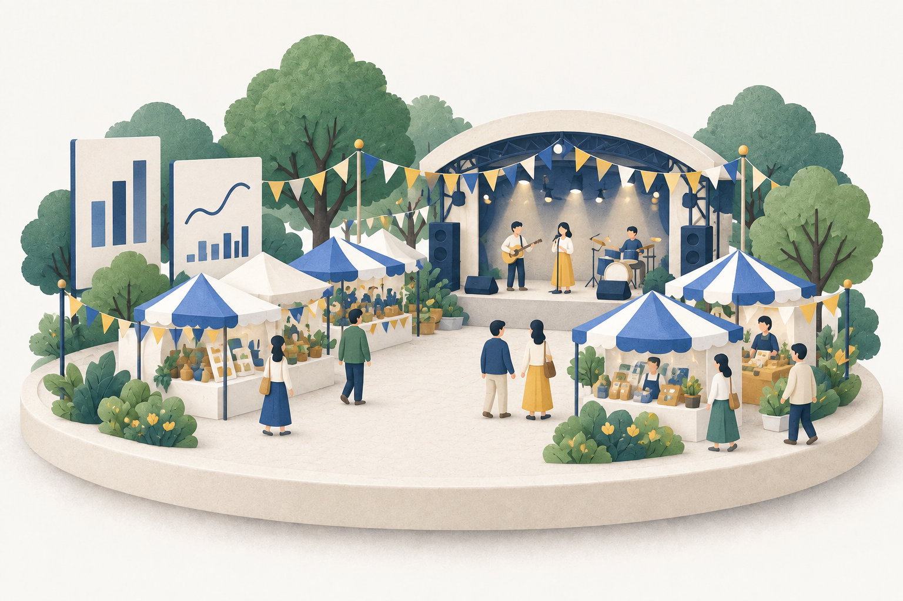
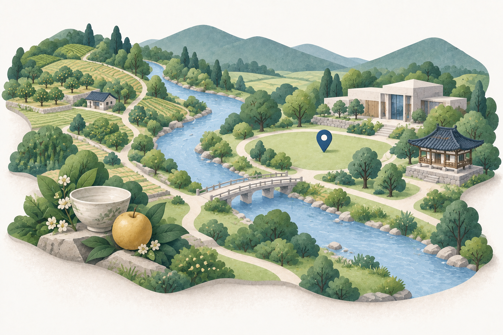

# PC 중심 조사·기획 경험

상태: 설계·구현·로컬 검증 완료. 공개 적용 상태는 [검수 기록43](../validation/43-desktop-research-experience.md)을 따른다.
사용자는 2026-09-27 목적 이미지의 구도 차별화·확대, 과밀한 헤더와 홈 강조 순서 개선,
PC 기준 자료 조사·비교·기획 경험의 재설계를 요청했다. 이 요청이 앞선 작은 이미지·모바일 중심 배치보다 우선한다.
관광 활성화·지역 공무원·기존/새 축제 두 목적·선택적 기록 원칙은 유지한다.

## 과업과 완료 결과

- 첫 방문: 기존 축제를 고르거나 지역부터 살펴보는 두 진입을 구별하고 바로 자료 조회를 시작한다.
- 반복 조사: 고른 축제/지역·조건을 유지하면서 방문·관광자원·시기 정보를 비교한다.
- 자료 정리: 필요할 때만 담은 근거·기획 후보·예산·출력·운영 기록으로 이동한다. 작성은 조회의 선행 조건이 아니다.
- PC 1366/1440/1920px에서 충분한 자료 폭과 동시에 읽는 배치를 제공한다. 좁은 창·200% 확대의 접근성과 기능은 보존한다.

## 비교한 화면과 선택

주 담당자가 기존 공개 홈·관광자원 캡처와 소스를 확인했고 별도 두 에이전트가 메뉴·과업·시험 계약을 감사했다.
위임된 디자인 범위 안에서 아래 방향을 선택한다. 수치는 이 프로젝트의 제안이며 외부 공식 토큰을 복제하지 않는다.

| 후보·근거 | 관찰과 적용 |
|---|---|
| 기존 홈·AppShell·검증42의 공개 화면 | 12개 전역 링크, 본문 최대1152px, 목적 이미지264px. 하단 남색 기록/파란 예측 블록이 핵심 탐색보다 강함. 경로와 기능은 유지하고 위계 교체 |
| [Carbon global header](https://carbondesignsystem.com/patterns/global-header/) | 전역 탐색과 현재 과업 분리. 단일 헤더와 기획 도구 묶음에 적용. 브랜드·48px 헤더 수치는 가져오지 않음 |
| [Carbon data table](https://carbondesignsystem.com/components/data-table/usage/) | 제목→조건/도구→넓은 자료와 선택 상세 구조. 자원·방문 분석에 적용하며 자료를 임의 표/가상 수치로 바꾸지 않음 |

## 공통 프레임·탐색

```text
pickDday   기존 축제   새 축제   관광지도   축제 비교      기획 도구 ▾
────────────────────────────────────────────────────────────────
현재 축제/지역 · 선택 변경/관련 검색
과거 방문 흐름 | 주변 관광자원 | 개최 시기
조건·필터
넓은 자료 작업 영역
────────────────────────────────────────────────────────────────
pickDday · 개인정보·분석
```

- 헤더 PC 한 줄, 약64~72px. 로고는 홈 링크. 핵심4개 링크+기획 도구 펼침으로 제한한다.
- 기획 도구: 담은 근거, 기획 후보, 예산·준비, 기획안·출력, 비용·결과, 내 작업공간. 편집 모드에서만 새 기록·호출 로그.
- 펼침은 버튼·aria-expanded·실제 링크를 사용하고 Escape/바깥 클릭/경로 이동으로 닫는다. Escape는 연 버튼으로 초점을 돌린다.
- 개인정보·분석은 푸터에서 항상 접근한다. 헤더에 법적 고지 전문이나 모든 부가 링크를 반복하지 않는다.
- 본문은 최대1760px, PC 좌우32px, 홈은 최대1440px. 긴 글 페이지는 자체 읽기 폭을 유지한다.
- 1024px 미만은 메뉴 접기로 폭을 확보하며 200% 확대에서도 모든 기능을 이용한다. 모바일 전용 기능·재설계는 추가하지 않는다.
- 현재 경로·선택 표시, 기존 URL·자료·탭·초점 계약을 유지한다. 저장 안내는 실제 기록 도구 맥락에만 제공한다.

## 시작 화면

```text
축제 자료를 살펴보고, 다음 기획을 준비하세요.
┌ 기존 축제 개선 ─────────────────┐ ┌ 새 축제 기획 ───────────────────┐
│ 큰 축제 장면 일러스트           │ │ 큰 지역 탐색 일러스트          │
│ 제목 · 짧은 목적 설명           │ │ 제목 · 짧은 목적 설명          │
│ [기존 축제 찾기 →]              │ │ [지역부터 살펴보기 →]           │
└───────────────────────────────┘ └───────────────────────────────┘
자료 조사·비교                기획 자료 정리                내 작업공간
관광지도 / 축제 비교          담은 근거 / 기획 후보         선택적 운영 기록
참고 자료 ▾  예측 연구 / 사전 기록 / 공개 운영 예시
```

- 기존 h1과 CTA 이름·href는 재사용해 익숙한 진입을 유지한다. 설명은 각각 한두 줄.
- PC 이미지는 카드 폭을 충분히 쓰고 높이260~300px(약390~450px 이상의 실제 그림 폭)를 목표로 한다.
- 두 목적은 같은 중요도. 전체 카드가 큰 색 면적이 되지 않게 흰 표면·얇은 테두리와 제한된 파란 CTA를 사용한다.
- 하위 도구는 중립 표면의 짧은3열, 강한 배경·큰 그림자·장문의 단계 안내를 제거한다.
- 예측·공개 운영 예시는 ‘참고 자료’ 펼침에 보존한다. 예측의 지역/연도·검증 범위와 예시/실측 구분은 열었을 때 유지한다.
- 편집 환경의 새 기록 만들기 기능도 보존한다. 자료가 없는 경우 빈 참조 목록을 성공 자료처럼 꾸미지 않는다.

## 목적 이미지

내장 imagegen 편집으로 기존 소재의 종이·무광 질감과 색조를 유지하며 구도 전체를 바꾼다.
기존 원본은 보존하고 v2 파일을 사용한다. 프롬프트 원문은 아래 생성 기록에 둔다.

- 기존 축제: 낮은 정면 시점의 무대·부스·사람이 있는 축제 디오라마. 작고 추상적인 분석 패널은 보조 요소. 지도·노트 없음.
- 새 축제: 높은 사선 시점의 강·숲·경작지·문화공간을 연결하는 열린 지형. 실제 축제 무대·부스·사람·노트 없음.
- 차이는 색보다 주체·실루엣·시점으로 전달한다. 공통 남색·녹색·크림색, 이미지 안 문자/실제 실적/실제 장소 없음.
- HTML 제목·설명·CTA가 의미를 전달하며 장식 이미지 alt는 비운다. 최적화·크기 예약으로 이동을 줄인다.

## PC 자료 작업 배치

- 관광자원: 목록·지도는 기존대로 유지하고 선택 상세를 같은 grid의 세 번째 영역으로 둔다.
  1400px 이상은 목록 약320~400px / 가변 지도 / 상세320~360px의3열. 상세가 없으면 목록/지도의2열이다.
  1024~1399px는 목록/지도2열+하단 상세, 좁은 창은 기존 목록/지도 전환과 상세를 유지한다.
- 상세를 열어도 지도 중심·선택·반경·목록·함께 보기 조건은 바꾸지 않는다. 영역 재배치 시 지도 크기 갱신 경로를 재사용한다.
- 목록은 연속 행으로 읽기 쉬운 밀도, 선택된 행에만 강조. 이름16px·주소14px와44px 이상의 조작 영역을 유지한다.
- PC에서는 유형 버튼과 현재 목록·지도 건수를 한 행으로 묶어 자료 작업 영역의 시작을 당긴다. 오류·기준점 조건은 아래에 유지한다.
- 방문: 새 축제의 월별·요일별 패턴을 PC에서 주/보조 열로 배치하고 월 선택 상세를 월별 근처에서 읽는다.
  기존 지역 방문과 상세 그래프의 불필요한 max-width 제한을 줄여 실제 분석 폭을 사용한다. 수치·집계·시계열 의미는 바꾸지 않는다.
- 기존 등록 축제에서는 선택한 달의 수치 표·일정 연결을 일별 그래프 아래에 두어 같은 달의 자료를 한 영역에서 읽는다.
- 시기·비교·기획 도구는 넓은 공통 프레임을 활용한다. 전역CSS로 개별 표/차트의 의미나 내부 계산을 덮어쓰지 않는다.
- 남색=제목/구조, 파랑=행동/선택, 회색=보조. 경고색은 실제 상태에만 쓴다. 데이터가 없는 결과·출처·단위는 기존 계약을 보존한다.

## 검수

1366/1440/1920px에서 헤더 한 줄·실제 그림 폭·첫 CTA·보조영역 대비·자료 작업 폭을 확인한다.
관광자원 선택 시 목록/지도/상세 동시 표시·긴 이름·650건·조건/중심 보존·키보드 복귀를 확인한다.
기존/새 축제 방문·시기, 기획 도구 모든 경로·편집 전용 경계·개인정보 진입을 검사한다.
좁은 화면320/390px·실제200% 확대·헤더 열기/닫기·포커스·인쇄 기능을 확인한다.
실제 공공자료 공개 검수와 가상 응답 회귀를 구분하며 프로젝트 원본과 D 확인용 사본을 함께 갱신한다.
주 담당자가 목표/흐름·위계·문구·상태/복구·접근성/반응형·고지를 직접 판단하고 실행 근거를 남긴다.

## 생성 기록

내장 imagegen으로 기존 두 원본을 각각 편집했다. 모두1536×1024 PNG이며 이전 파일은 보존했다.
직접 확인 결과 기존은 전면 무대·부스·인물, 신규는 사선 강줄기·문화공간·열린 부지로 구별된다.
추상 분석 패널에 실제 수치/문자·지역 식별은 없고 두 이미지 모두 지도·노트가 없다.





입력: `apps/web/public/images/purpose/existing-festival.png`. 출력: `existing-festival-v2.png`.
최종 프롬프트:

```text
Create a completely recomposed replacement illustration for the EXISTING FESTIVAL ANALYSIS entry of pickDday, a Korean public tourism research desktop application. The attached image is the edit target: preserve its tasteful miniature paper-cut / matte clay texture, soft natural light, muted navy blue, sage green, warm cream, and tiny golden accents, but replace the composition completely. Landscape 3:2. Main subject is an established lively Korean regional festival seen from a LOW THREE-QUARTER FRONT VIEW: a small open performance stage, a semicircle of blue-and-cream festival market tents, subtle bunting overhead, about eight understated tiny visitors moving between stalls, mature trees. The entire scene forms one contained theatrical diorama on a simple low oval cream platform. At the back-left of this physical scene place two slim understated freestanding analytical panels showing only a few abstract navy bars and simple curves, NO words, NO numbers, no axis labels; these are decorative metaphors for reviewing prior results, not real data. Make the stage and activity the dominant silhouette, not office stationery. All scene objects contained within a comfortable margin, pale warm white background. Sophisticated editorial illustration for adults doing planning and analysis; restrained and legible at 500px wide. Absolutely NO paper map, NO clipboard, NO notebook, NO pencil, NO laptop, NO magnifying glass, no real landmarks, no logos, no text. This must look radically different from a countryside discovery landscape while keeping the original visual craft. Do not create a UI screenshot or a contact sheet; deliver one complete raster illustration.
```

입력: `apps/web/public/images/purpose/new-festival.png`. 출력: `new-festival-v2.png`.
최종 프롬프트:

```text
Create a completely recomposed replacement illustration for the NEW FESTIVAL DISCOVERY AND PLANNING entry of pickDday, a Korean public tourism research desktop application. Attached illustration is the edit target: keep its fine paper-cut / matte clay material, sophisticated soft editorial rendering, quiet sage and forest greens, pale river blue and cream, but REPLACE THE MAP-AND-CLIPBOARD COMPOSITION entirely. Landscape 3:2. One sculptural terrain diorama viewed from HIGH DIAGONAL THREE-QUARTER OVERHEAD: an elegant winding blue river curves from back left towards front right, hillside orchards and vegetable fields on one side, a tiny Korean tiled-roof cultural pavilion and small modern cultural center on the other side, a footbridge connects them. At front-left an attractive small cluster of three symbolic local materials, a ceramic bowl, leaves and a golden fruit, represent possible festival themes; they emerge naturally from the terrain, not as loose office props. Several pale cream paths connect the landscape resources; one single subtle blue location pin identifies an open grassy gathering place, with NO stage, NO tents and NO visitors. Composition has clear diagonal movement, generous breathing room and a stepped asymmetric terrain silhouette. Wide pure warm-white background, keep all objects comfortably in frame. Contrast strongly with a frontal existing festival scene: this is exploration of a whole region, nature/culture and possibilities, quiet and spacious. No paper map, clipboard, notebook, pencil, desk, laptop, bar chart, signboard, numbers, lettering, real landmarks or logos. No text. NOT a UI screenshot or contact sheet. One complete raster illustration, mature enough for a government planning and research tool, not a children's toy.
```

Opus 5.5 설계 검토를 요청했으나 제공자의 사용량 한도로 호출이 거부됐다. 성공한 Opus 작업으로 기록하지 않는다.
이번 구현은 사용 가능한 협업 에이전트에 헤더/홈·관광자원·시험을 분담하고 주 담당자가 설계·방문 화면·최종 검수를 수행한다.
