# 축제 기획 길잡이와 화면 이미지 체계

상태: **묶음 1 구현 — 19절.** 2026-10-03 사용자 요청으로 현황 분석·조사·기획을 하고 Codex(gpt-6-astra, xhigh)와 Fable의 독립 검토를 받아 고쳤다.
같은 날 사용자가 개선안 전체와 D1~D6 제안을 승인하고, 문장을 줄여 아이콘·이미지·시각 도구로 보이도록 방향을 조정했다.
1~18절은 승인된 계획이며 아래 시안(`*-v2.jpg`)은 구현 전 제안 화면이다. 실제 구현과 계획의 차이는 19절에 적는다.
검토받은 v1 시안(`*-v1.jpg`)과 v1 본문은 저장소 이력(`f5dd781`)에 그대로 있다.

## 1. 요청과 초기 사용자 의견

2026-10-03 사용자가 초기 사용자들과 논의한 결과를 전했다. 이 문서는 사용자가 전달한 의견을 근거로 삼으며,
우리가 직접 관찰한 사용성 시험 결과로 표시하지 않는다.

| 의견 | 해석 |
|---|---|
| 첫 화면에서 쓰임을 **기존 축제 개선·새 축제 기획** 둘로 나눈 것이 아주 좋았다 | 두 흐름의 구분은 유지한다. 바꾸는 것은 각 흐름의 안쪽이다. |
| 각 흐름의 **달성 목표와 과정이 흔들린다** | 흐름마다 무엇을 얻고 끝나는지, 어떤 순서로 무엇을 정하는지 화면이 말하지 않는다. |
| 첫 화면의 **명확한 시각 이미지**가 호응이 좋았다 | 다른 화면에도 같은 계열의 이미지를 적극적으로 쓴다. 장식이 아니라 길 찾기를 돕는 위치에 둔다. |

대상 사용자는 순환보직으로 축제 업무를 처음 맡을 수 있는 지역 공무원이다. 그래서 자료 화면만이 아니라
**각 단계의 목표, 확인할 것, 읽으면 좋을 자료**로 의사결정을 안내하는 길잡이가 필요하다.
이는 [기획 기준](../product/planning-principles.md)이 “가이드는 무엇을 고려하고 자료를 어떻게 읽으며 어디까지 판단할 수 있는지
안내한다. 세부 구성은 후속 논의에서 정한다”라고 남긴 부분을 구체화하는 작업이다.

## 2. 현황 분석

2026-10-03 공개 서비스의 18개 화면을 PC 1440px로 열어 제목·버튼·이미지·첫 화면 문구를 수집하고 직접 확인했다.

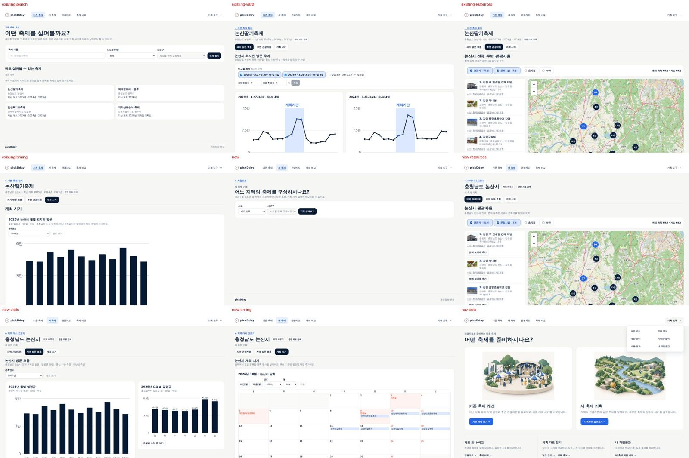

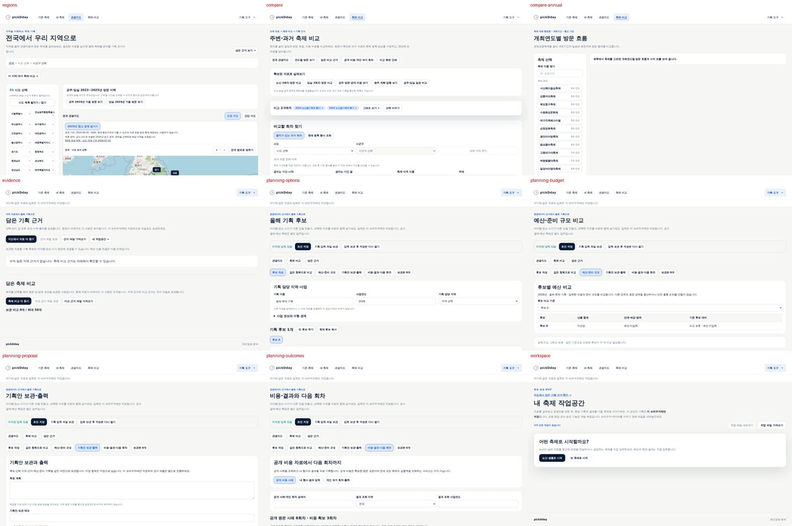

| 번호 | 확인한 사실 | 사용자에게 생기는 문제 |
|---|---|---|
| F1 | 축제를 고르면 `과거 방문 흐름 / 주변 관광자원 / 개최 시기` 세 탭만 보인다. 새 축제도 `지역 관광자원 / 지역 방문 흐름 / 개최 시기`다. 탭 이름이 **자료 종류**다. | 지금 무엇을 정하는 단계인지, 어떤 순서가 좋은지 알 수 없다. |
| F2 | 각 화면은 차트·지도·목록을 보여 주지만 “이 화면에서 정할 것”이나 “다 봤다면 다음”이 없다. 마지막 탭에서 흐름이 끝난다. | 흐름의 **끝과 결과물**이 없다. 무엇을 손에 쥐고 나가는지 모른다. |
| F3 | 기획 후보·예산·기획안·결과·작업공간은 헤더의 `기획 도구` 펼침 메뉴에 따로 있다. 두 흐름의 화면에서 이 도구로 이어지는 안내가 없다. 흐름 화면에는 근거 담기도 없다. | 자료를 본 뒤 기획 문서로 넘어가는 시점과 방법을 모른다. |
| F4 | 축제 찾기(`/existing/search`)와 지역 고르기(`/new`)는 입력 칸 외에 화면 대부분이 비어 있다. | 출발 직전에 흐름 전체를 보여 줄 수 있는 자리가 쓰이지 않는다. |
| F5 | 홈 외 화면에는 일러스트가 없다. 자료 화면은 차트·지도, 도구 화면은 입력 양식과 긴 설명이다. | 홈에서 받은 명확한 인상이 두 번째 화면부터 끊긴다. |
| F6 | 자료의 한계는 부제(`통신 기반 추정 · 축제장 입장객 수 아님`)와 `출처·산식 보기`로 전달된다. 차트를 읽는 법이나 이 자료로 판단할 수 없는 것은 따로 안내하지 않는다. | 처음 보는 사람은 지역 방문을 입장객이나 축제 효과로 오해하기 쉽다. |
| F7 | 예산 요구·안전관리계획·발주·정산 같은 행정 절차는 제품 어디에도 없다. 조사 자료([업무 사례](../research/2026-09-municipal-festival-cases.md))에만 있다. | 처음 맡은 담당자는 전체 일정 속에서 지금 할 일과 pickDday의 쓰임을 알기 어렵다. |
| F8 | `담은 근거`·`기획 후보`·`비용·결과` 같은 도구 이름은 쓰임을 설명하지 않는다. 도구 화면 위에는 저장 위치 안내 문장이 반복된다. | 익숙하지 않은 사람에게는 언제 어떤 도구를 쓰는지가 가장 어렵다. |

정리하면 **두 흐름의 진입은 명확하지만, 진입한 뒤에는 목표·순서·끝이 화면에 없다.**
자료 기능은 충분히 쌓였지만 처음 맡은 담당자에게 필요한 “왜 이 화면을 보는가, 무엇을 정하는가, 다 보면 무엇을 하는가”가 빠져 있다.

## 3. 목표와 성공 기준

| 목표 | 확인 방법(구현 후) |
|---|---|
| 각 흐름의 **목표·순서·끝(얻는 것)**을 첫 탭에 들어가기 전에 안다 | 시작 화면을 본 뒤 “이 흐름으로 무엇을 하고 무엇을 얻나요?”를 자기 말로 설명 |
| 자료 화면에서 **지금 살펴볼 것과 다음 화면**을 찾는다 | 다음 행동을 가리키고, 이 자료로 알 수 없는 것을 한 가지 말하기 |
| **판단은 담당자의 몫**임을 알고 판단할 거리를 안다 | 기존 축제의 유지·변경 이유, 새 축제의 소재·시기 대안, 다음 협의 대상을 자기 말로 짚기 |
| 처음 맡은 담당자가 **전체 준비 과정 속 위치**와 협의할 곳을 안다 | 전체 과정 안내를 본 뒤 “pickDday로 할 일”과 “부서에 확인할 일” 구분 |
| 안내가 **자료 탐색을 막지 않는다** | 안내를 닫고 아무것도 표시하지 않아도 모든 자료 기능 이용(자동 시험) |

제목을 5초 안에 설명하는 것만으로 “목표와 과정이 안정됐다”고 판정하지 않는다. 회차 자료 없음·후보 하나·저장하지 않음·새로 고침 같은 경우도 함께 본다.
데이터가 결정을 대신하지 않는다는 원칙, 기록은 선택이라는 원칙은 그대로다([비목표](../product/non-goals.md)).

## 4. 조사에서 확인한 것

두 조사를 했다. 자세한 근거와 출처 확인 상태는 각 문서에 있다.

- [공식 자료·절차 조사](../research/2026-10-novice-planner-sources.md): 처음 맡은 담당자에게 쓸모 있는 공식 안내서, 법령·행정 체크포인트, 추진 흐름.
- [단계 안내·체크리스트·이미지 UX 조사](../research/2026-10-guidance-ux-patterns.md): 정부 디자인 시스템과 연구 근거.

### 4.1 처음 맡은 담당자에게 필요한 공식 정보

- 실제로 펼쳐 쓸 공식 안내서는 많지 않다. 쓸모가 큰 것은 행정안전부 「지역축제장 안전관리 매뉴얼」(2024.9.),
  문화체육관광부 「2026 문화관광축제 평가 및 지정편람」의 별첨 서식, 행정안전부 「지방재정 투자심사 및 타당성조사 운영기준」(2025.4.)이다.
- **돈과 절차의 관문이 개최 시기보다 먼저 온다.** 행사성 사업은 총사업비·추진 주체에 따라 사전심사·재정영향평가·투자심사를 거칠 수 있고,
  예산안 제출에는 법정 기한이 있다(지방재정법·같은 법 시행령, 지방자치법). 처음 맡은 담당자가 가장 놓치기 쉬운 부분이다.
  금액·기한의 적용 대상과 조건은 [조사 4장](../research/2026-10-novice-planner-sources.md#4-법령행정-체크포인트-현행-원문-기준)에 있다.
- **지역 방문 흐름은 계절·요일 여건을 설명하는 참고자료다.** 행사 수요나 참가 규모의 근거가 아니며, 공식 서류의 수요·참가 규모는 별도 조사·집계로 뒷받침해야 한다.
- **자료 읽는 법을 공식 문구로 뒷받침할 수 있다.** 한국관광공사는 방문자가 관광객과 같지 않고, 일별 방문 수를 더하면 같은 사람이 여러 날 포함될 수 있으며,
  광역·기초 수치를 임의로 합산할 수 없다고 설명한다. 공식 축제 빅데이터 보고서는 축제 기간과 전후 4주를 비교한다(pickDday 기본 표시는 전후 7일).
- 안전관리계획의 “개최 3주 전 제출”은 시행령상 **민간 개최자**의 기한이고, 지자체 직접 개최의 심의 일정은 매뉴얼 절차다.
  안전관리계획 대상은 순간 최대 인원뿐 아니라 개최 장소·위험 물질로도 정해진다. 제품 문구는 법령·행정규칙·매뉴얼·정책 방향을 구분해야 한다.
- 문화체육관광부·한국관광공사 자료 다수는 공공누리 4유형(변경금지)이고 행정안전부 매뉴얼은 복제를 금지한다. **링크와 직접 쓴 짧은 안내만** 쓴다.

### 4.2 UX 근거가 바꾼 설계

| 처음 생각 | 근거 | 바꾼 설계 |
|---|---|---|
| 탭을 ①②③④ 번호 단계 표시로 바꾼다 | GOV.UK는 순서가 없거나 읽기 위주의 여정에 단계 안내를 쓰지 말라 하고, USWDS는 비선형 흐름에 단계 표시기를 금지한다 | **탭은 번호 없이 유지**하고 할 일 이름으로 바꾼다. 권장 순서는 탭 밖(시작 화면의 흐름 지도, 화면 끝 `이어서`)에서만 알린다 |
| 모든 단계 화면에 체크리스트 | “체크리스트는 가르치는 도구가 아니다”(Checklist for Checklists). 길어지거나 의무처럼 보이면 형식적으로 체크한다 | 자료 화면에는 **살펴볼 질문**만. 확인할 일 목록은 멈추는 자리(모아 보기, 전체 과정)에 둔다 |
| “여기서 정할 것” | 추천·기본값은 결론처럼 읽혀 판단을 끌고 간다(자동화 편향) | **질문**으로 쓰고, 순서 안내(“처음이라면 이 순서”)와 내용 판단(“이 시기가 좋다”)을 섞지 않는다 |
| 길잡이를 늘 펼쳐 둔다 | 시작 시 튜토리얼은 효과가 약하고, 숙련자에게 안내는 역효과다 | 화면마다 **짧은 안내 영역**만 늘 보이고, 자세한 **길잡이 패널**은 사용자가 연다 |
| 모든 화면에 큰 이미지 | 정보 없는 장식 이미지는 시선에서 무시되고 이해를 소폭 해친다 | “모든 화면에 **목적 있는 시각 요소**”: 큰 그림은 홈·시작·전체 과정, 자료 화면은 차트·지도·사진이 주인공 |

## 5. 검토로 바뀐 것(v1 → v2)

Codex(gpt-6-astra, xhigh)와 Fable이 v1을 따로 검토했다. 두 검토가 겹친 지적을 중심으로 고쳤고, 항목별 반영은 18절에 있다.

| v1 | v2 | 근거 |
|---|---|---|
| 정리 탭은 3번째 묶음 | **모아 보기(요약·인쇄·다음에 확인할 일 목록)를 첫 배포에** | 흐름의 ‘끝’을 약속하고 나중에 주면 안내가 거짓이 된다(두 검토) |
| 파란 질문 칩 | **평문 질문 2개** | 이 제품에서 파란 칩은 선택 조작이다(두 검토) |
| 안내 줄·부제·패널이 같은 경고 반복 | 부제는 대상·단위·출처, 안내 줄은 **이 자료로 알 수 없는 것**, 패널은 그 이유 | 중복은 읽히지 않고 자료만 밀린다(두 검토) |
| 첫 방문에 패널 자동 열림, 헤더 덮음 | **버튼으로만 열림**, 넓은 화면은 헤더 아래 옆 열, 좁은 화면·확대는 대화상자 | 처음 온 사람이 패널을 닫아야 자료를 본다(두 검토) |
| `봤음` 표시, `정리(선택)` | 둘 다 뺌. 마지막 탭은 `모아 보기` | 근거가 약하고 완료처럼 읽힌다. 한 탭만 ‘선택’이면 나머지가 필수처럼 보인다 |
| “얼마나 준비할까”를 위한 질문만 있음 | 시작 화면에 **담당자가 판단할 것**(유지·변경 이유, 방문 대상·이유, 신설 필요성, 조건) | 데이터 설명에 치우쳐 판단이 빠졌다(Codex) |
| 지난 회차 비교를 모든 기존 축제에 약속 | **자료 범위에 따라** 회차 비교 / 한 회차 / 기록 없음 안내 | 회차 자료가 없는 축제가 많다(Codex) |
| “방문 흐름이 공식 서류의 수요·참가규모 근거” | **계절·요일 여건의 참고자료**로 정정 | 지역 방문 추정은 수요·참가 규모가 아니다(Codex) |
| 전체 과정: 예산 확정 뒤 추진 방식 결정 | **방향·추진 방식·대략 비용 → 심사·편성 → 발주·협약**, 장소·안전 협의는 앞당겨 병행 | 추진 방식이 편성 방법을 바꾼다(Codex) |
| 금액·기한 숫자를 근거 층 배지와 함께 표시 | 첫 배포는 **질문·협의할 곳·원문**만. 숫자는 출처 대장과 갱신 담당이 정해진 뒤 | 적용 대상·조건이 빠지면 틀린 안내가 된다(두 검토) |
| 정리에서 기획 후보 입력 칸 채우기 | **별도 기능**으로 분리 | 기존 기획안의 ‘후보 둘·선택 이유’ 조건과 초안 병합 설계가 필요하다(Codex) |
| 자료 화면 작은 그림 96px | **당분간 없음**, 작은 크기 전용 그림 세트를 만든 뒤 검토 | 지금 그림을 잘라 쓰면 읽히지 않고, 시기 그림은 색이 튄다(두 검토) |
| 기존 흐름 그림: 흐린 지난 회차·선명한 최근 회차 | 최종본은 **동등한 두 회차**로 다시 그림 | ‘최근이 나아졌다’는 인상을 준다(Codex) |

## 6. 길잡이의 원칙

1. **길잡이는 양식이 아니다.** 목표·질문·자료 읽는 법·읽을거리는 아무것도 입력하지 않아도 읽는다.
2. **막지 않는다.** 순서를 건너뛰어도, 길잡이를 열지 않아도, 확인할 일을 비워 둬도 모든 기능을 쓴다. 완료율·점수·잠긴 탭을 만들지 않는다.
3. **권장 순서는 탭 밖에서 알린다.** 탭은 번호 없는 이동 메뉴(지금처럼 주소 이동·`aria-current`)로 두고, 흐름 지도와 `이어서`로 “처음이라면 이 순서, 순서는 자유”를 전한다.
4. **결론을 대신 말하지 않는다.** 질문은 판단을 열어 두고, 화면은 조회 결과를 중립적으로 보여 준다. “확인했어요·적합해요·추천 시기” 같은 완료·평가 문장을 자동으로 만들지 않는다.
5. **해석에 꼭 필요한 것은 본문에, 겹치지 않게.** 대상·단위·출처는 지금처럼 차트 부제에, 이 자료로 알 수 없는 것은 안내 영역 한 줄에 둔다. 패널은 같은 말을 되풀이하지 않고 이유를 설명한다.
6. **자료 범위에 맞게 말한다.** 회차 자료·후보·조회 결과가 없거나 실패한 경우를 정상 상태로 다루고, 없는 것을 약속하지 않는다.
7. **확인할 일은 멈추는 자리에만.** 모아 보기와 전체 과정에 다음 행동과 협의할 곳으로 쓰고, 법령 근거 있음·담당 부서 확인·기획 참고를 구분한다. 체크가 적법성 확인처럼 보이지 않게 한다.
8. **공식 정보는 관리될 때만 숫자로 쓴다.** 원문은 연결만 하고, 금액·기한은 적용 대상·조건·조문·시행일·확인일이 붙고 갱신 담당이 있을 때만 쓴다.
9. **선택 상태는 이 브라우저에만.** 서버·분석으로 보내지 않고, 저장이 막혀도 화면이 동작한다. 내부 규칙·구성요소 작동법은 문구로 쓰지 않는다.

## 7. 두 흐름의 목표·결과물·화면

탭 주소와 자료 기능은 그대로 두고 탭 이름을 **할 일**로 바꾼다. 자료 이름은 탭 아래 작은 글씨로 남긴다. 마지막 탭 **모아 보기**를 더한다.

### 7.1 기존 축제 개선

**목표:** 지난 회차와 지역의 방문 흐름을 돌아보고, 다음 회차에서 무엇을 유지하고 바꿀지 근거와 함께 정리한다. 
**얻는 것:** 검토한 방문 흐름·연계 후보·후보 기간과 다음에 확인할 일을 한 장으로(인쇄 가능). 
**담당자가 판단할 것(자료만으로 답할 수 없음):** 지난 회차에서 유지할 점과 바꿀 문제, 늘리거나 바꾸려는 방문(누구의 어떤 방문인가), 바꾸기 어려운 조건(예산·인력·장소·준비 기간).

| 탭(할 일 / 자료) | 이 화면의 목표 | 이 자료로 알 수 없는 것 | 살펴볼 질문 |
|---|---|---|---|
| 방문 흐름 돌아보기 / 과거 방문 흐름 | 축제 기간과 그 앞뒤에 지역 방문이 어떻게 달랐는지 보고, 다음 회차를 견줄 기준을 잡는다 | 축제장 입장객 수, 축제의 효과 | 개최 기간 일평균은 앞뒤 기간보다 얼마나 높았나요? 회차마다 요일·일수 구성이 같았나요? |
| 연계 관광 찾기 / 주변 관광자원 | 축제 방문을 지역 관광으로 이어 줄 만한 관광지·음식점·숙박 후보를 찾는다 | 영업·예약·수용 가능 여부, 실제 이동 | 축제장 가까이에 함께 들를 곳은? 축제 기간에도 이용할 수 있나요? |
| 개최 시기 검토하기 / 개최 시기 | 월별 방문·공휴일·같은 지역 등록 행사를 보고 다음 회차의 후보 기간을 좁힌다 | 등록 행사의 실제 개최 확정 | 지금 시기를 유지할 이유와 옮길 이유는? 다른 행사·연휴와 겹치면 피할까요, 연계할까요? |
| 모아 보기 / 검토 내용 한 장으로 | 지금까지 고른 내용과 다음에 확인할 일을 한 장으로 모아 인쇄한다 | — | — |

**자료 범위에 따른 첫 탭:** 확인된 회차가 둘 이상이면 회차끼리 견준다. 하나면 그 회차의 개최 기간과 앞뒤 기간을 본다.
지난 개최 기록이 연결되지 않은 축제는 지역의 월별·요일별 흐름과 기관의 결과보고서로 시작하도록 안내한다. 과거 개최일을 추정하거나 빈값을 0으로 채우지 않는다.

### 7.2 새 축제 기획

**목표:** 우리 지역의 관광자원과 방문 흐름을 근거로 축제의 소재·장소·시기 후보를 좁힌다. 
**얻는 것:** 살펴본 소재·장소 후보, 시기 방향과 후보 기간, 다음에 확인할 일을 한 장으로(인쇄 가능). 
**담당자가 판단할 것:** 누구의 방문을 만들려는가와 그들이 와야 할 이유, 기존 행사와의 차이(기존 행사를 고치는 편이 나으면 기존 축제 흐름으로 가는 것도 정상 결과), 예산·인력·장소·준비 기간.

| 탭(할 일 / 자료) | 이 화면의 목표 | 이 자료로 알 수 없는 것 | 살펴볼 질문 |
|---|---|---|---|
| 지역 자원 살펴보기 / 지역 관광자원 | 방문 이유가 될 소재와 행사를 열 만한 장소 후보를 찾는다 | 장소 사용 허가·수용 조건 | 이 지역에서만 볼 수 있는 자원·산물·이야기는? 장소 후보가 있다면 접근·규모·주변 자원이 어떻게 다른가요(하나여도 괜찮다)? |
| 방문 흐름 읽기 / 지역 방문 흐름 | 외지인 방문이 많고 적은 때를 보고, 비수기를 채울지 기존 방문과 이어질지 생각한다 | 축제·장소별 방문자 수, 방문 목적 | 방문이 적은 달을 채울까요, 많이 오는 달에 얹을까요? 주말에 얼마나 몰리나요? |
| 개최 시기 검토하기 / 개최 시기 | 공휴일·같은 지역 등록 행사와의 겹침을 보고 소재·운영 조건에 맞는 후보 기간을 좁힌다 | 등록 행사의 실제 개최 확정 | 겹치는 행사가 있으면 피할까요, 연계할까요? 소재의 계절 조건과 맞나요? |
| 모아 보기 / 검토 내용 한 장으로 | 지금까지 고른 내용과 다음에 확인할 일을 한 장으로 모아 인쇄한다 | — | — |

두 흐름 모두 첫 탭부터 보기를 권하지만 어느 탭으로든 바로 간다. 축제 비교(`/compare`; `/compare/annual`은 2026-10-04 ADR-0003으로 제거)는
비슷한 축제를 볼 때의 연결로 둔다(새 축제의 지역 자원·시기, 기존 축제의 방문 흐름).

## 8. 화면 구성

### 8.1 홈

두 목적 카드와 큰 그림, 지금의 명료함을 유지한다. 카드 설명 아래에 **얻는 것 한 줄**만 더하고,
카드 아래에 낮은 위계로 “축제를 처음 맡으셨나요? 축제 준비 전체 과정 보기”를 둔다. 순서·판단 질문은 시작 화면에서 보여 준다.

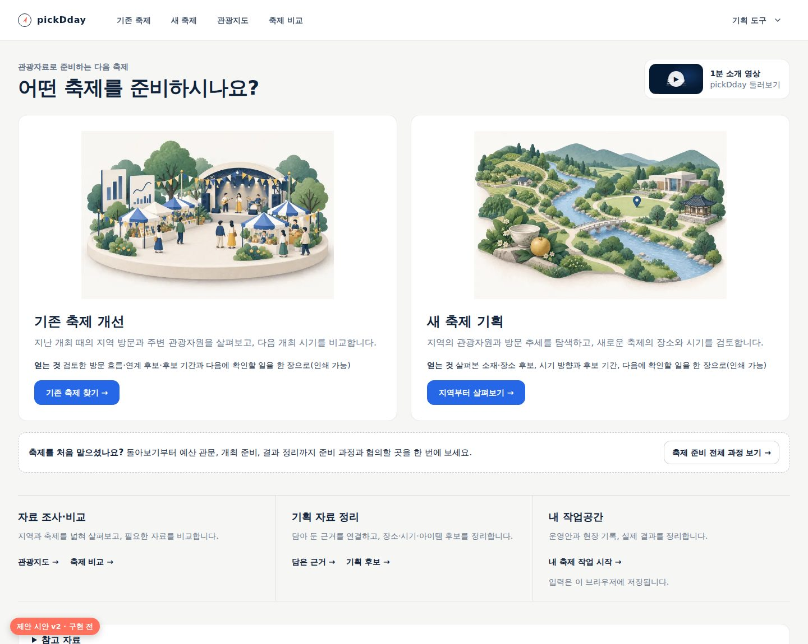

### 8.2 흐름 시작 화면(축제 찾기·지역 고르기)

검색·지역 선택은 맨 위 그대로 둔다. 그 아래 **흐름 지도**: 홈 그림을 작게 재사용(새 그림 불필요), 목표,
“처음이라면 이 순서로 보면 흐름이 이어져요. 순서는 자유이고, 입력 없이 볼 수 있어요.”(본문 크기), 네 탭의 이름과 한 줄 목표(가로 네 칸, 번호 없음),
**담당자가 판단할 것**(자료만으로 답할 수 없다는 말과 함께), 얻는 것. 축제 목록은 PC 첫 화면 안에 남는다.
지금 부제의 “차례와 상관없이 볼 수 있어요”는 흐름 지도 문장과 겹치므로 하나로 합친다.

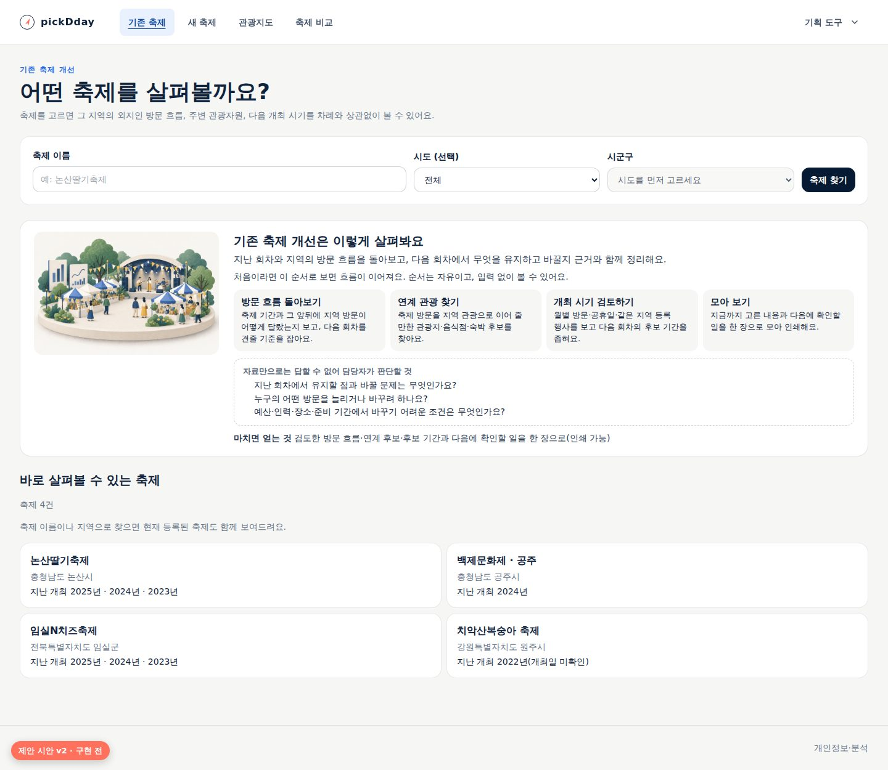

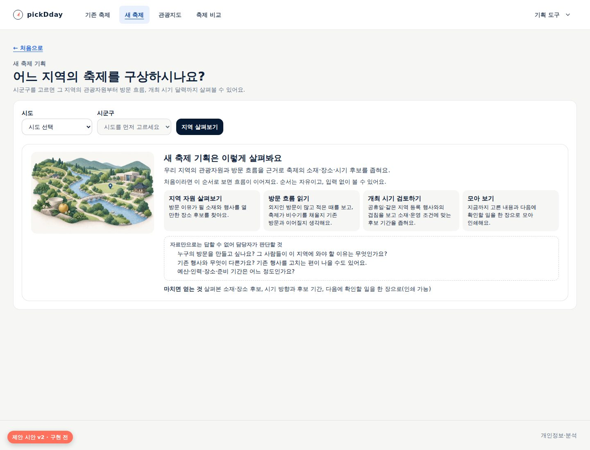

### 8.3 자료 화면: 할 일 탭 + 안내 영역 + 이어서

- **할 일 탭:** 번호·상태 표시 없이 큰 글씨는 할 일, 작은 글씨는 자료 이름. 지금처럼 주소 이동과 `aria-current="page"`, 이동 후 화면 제목으로 초점을 옮긴다.
- **안내 영역:** 목표 한 문장, 이 자료로 알 수 없는 것 한 줄, 살펴볼 질문 2개(평문 목록), 자료 범위에 따른 한 줄(해당할 때만), 오른쪽 `? 길잡이` 버튼.
  그림은 넣지 않는다. 버튼 위치는 모든 자료 화면에서 같다.
- **하단 줄:** 지금 탭마다 다른 하단 교차 연결(`지역 방문 흐름 보기` 등)을 한 줄로 바꾼다. 왼쪽에 강조한 `이어서: 연계 관광 찾기 — …`, 오른쪽에 나머지 탭. 이름은 할 일 이름으로 통일하고 모든 탭에 둔다.
- **작은 자료 추가:** 방문 흐름 회차 카드에 `개최 전 N일 · 종료 후 N일 일평균`(표시 기간 관측값의 평균)을 더한다. 첫 질문에 화면 수치로 답할 수 있게 하는 것이며 추정·예측이 아니다. 공식 보고서의 전후 4주와 기간이 다름을 길잡이에서 설명한다.

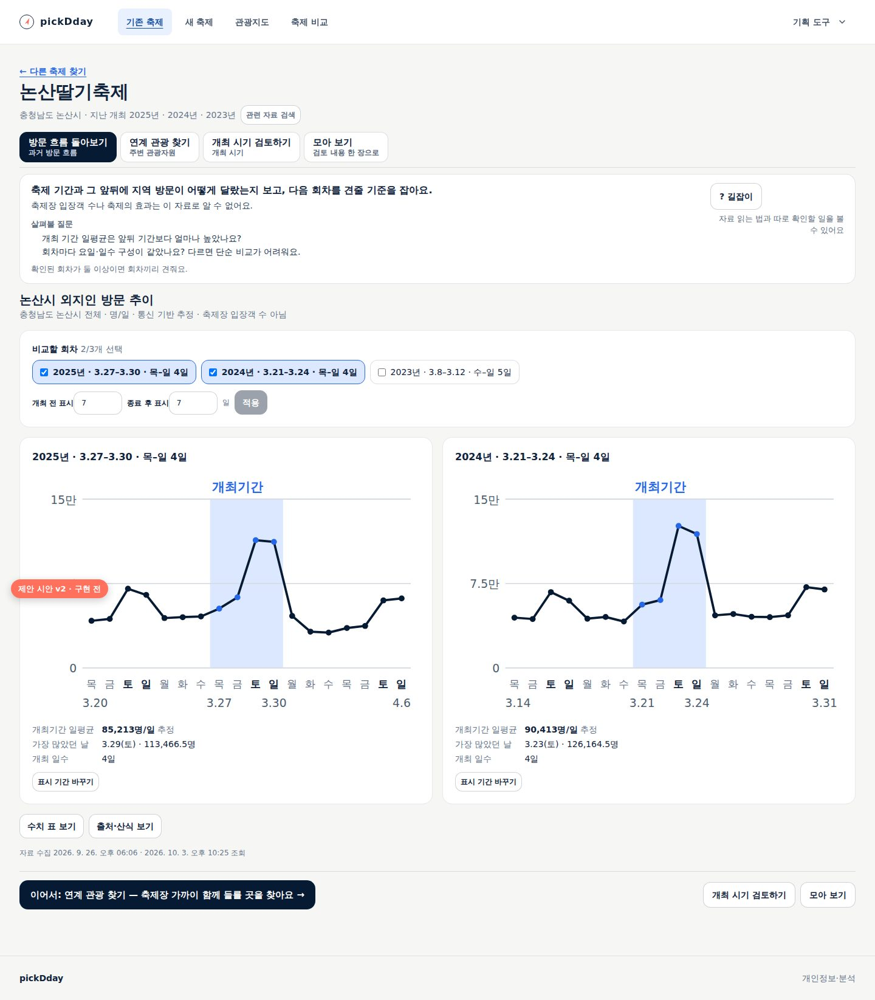

### 8.4 길잡이 패널(요청형)

`? 길잡이` 버튼을 눌렀을 때만 열린다. 처음 온 사람에게는 버튼 옆 한 줄(“자료 읽는 법과 따로 확인할 일을 볼 수 있어요”)로 존재를 알린다.

- **넓은 화면(1440px 이상, 확대 없음):** 헤더 아래에서 시작하는 옆 열. 본문을 덮지 않고 좁힌다. 비모달이라 초점을 가두지 않는다. 버튼에 열림 상태를 알린다.
- **좁은 화면·200% 확대:** 대화상자. 제목, 초점 이동, Esc 닫기, 배경 비활성, 호출 버튼으로 초점 복귀.
- **내용:** `자료 읽는 법`(왜 이렇게 읽는지)과 `따로 확인할 일(부서·공식 절차)`은 펼친 채, `예시로 읽기`(다른 축제 화면에 읽는 순서를 주석으로 단 그림, 예시 표시)·`용어`·`더 읽어보기`(질문별 2~3개, 어디를 왜 읽는지)는 접어 둔다.
- 마지막으로 열었는지 닫았는지만 이 브라우저에 기억한다.

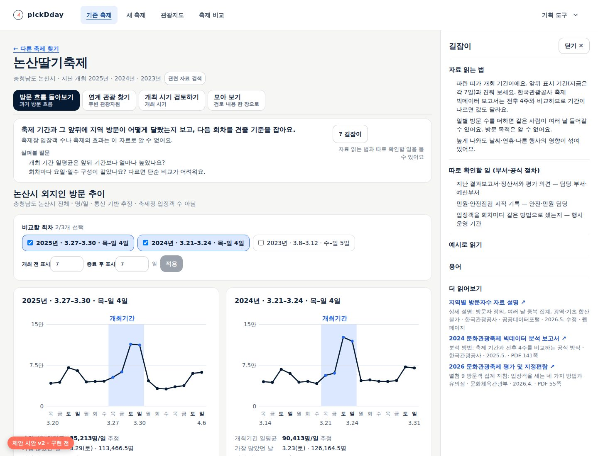

### 8.5 모아 보기

두 흐름의 마지막 탭. 입력 없이 **지금 고른 것만** 모아 한 장으로 보여 주고 인쇄한다. 자동 평가·추천 문장은 만들지 않는다.

| 항목 | 기존 축제 | 새 축제 | 남는 범위 |
|---|---|---|---|
| 방문 흐름 | 비교 중인 회차의 개최 전·개최기간·종료 후 관측 일평균, 지역·단위·출처·수집 시각 | 고른 연도의 월별·요일별 관측값 중 가장 큰 달·작은 달(값 그대로) | 주소에 있는 조건이라 새로 고쳐도 남는다 |
| 장소 | 지금 선택한 장소 하나와 기준점·반경(정했다면) | 함께 보기에 넣은 장소(0~2곳) | 탭 임시 기억. 새로 고침·축제(지역) 변경 시 사라진다 |
| 후보 기간 | 후보 기간(0~2개)과 그 기간의 같은 지역 등록 행사·공휴일 **조회 결과**(없음·미확인 포함) | 같음 | 탭 임시 기억(새 축제는 지역을 바꿔도 남음) |
| 판단 메모 | 유지할 점·바꿀 문제와 이유(선택) | 우선 후보와 이유(선택) | 인쇄할 때까지 화면에만 |
| 다음에 확인할 일 | 3~5개, 할 일과 협의할 곳, 구분(법령 근거 있음·담당 부서 확인·기획 참고) | 같음 | 첫 배포는 목록만, 상태 저장은 묶음 3 |

- 고른 것이 없으면 각 탭으로 가는 연결과 “아직 모은 내용이 없어요”를 보여 준다. 일부만 있어도 그 부분만 보여 준다. 주소로 바로 들어와도 같다.
- 인쇄본에는 각 수치의 지역·기간·단위·출처·수집 시각과 “개인 검토 자료이며 공식 문서가 아님”을 함께 싣는다.
- 기획 도구로 옮기기는 이 화면에 두지 않는다(8.7).

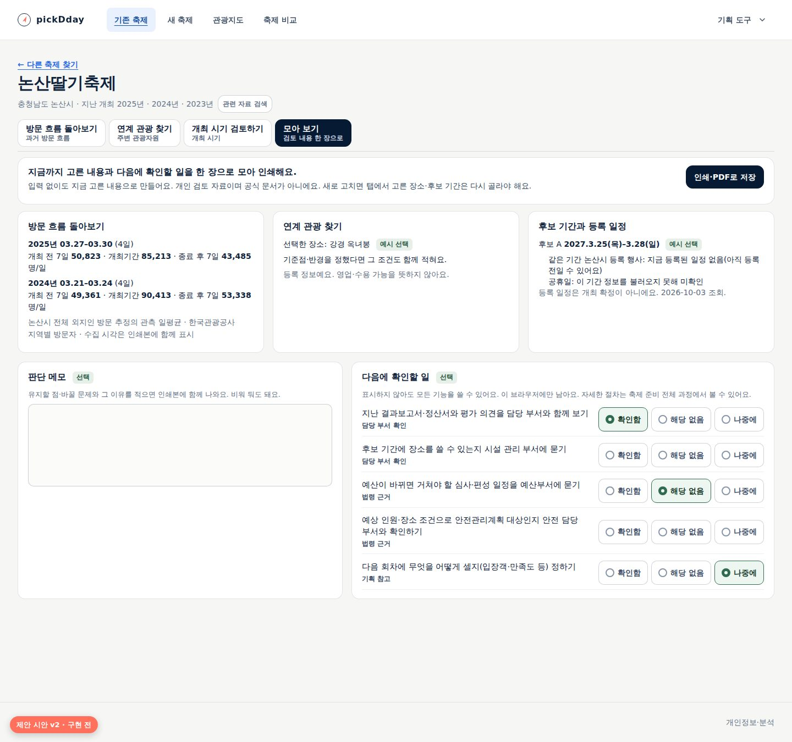

시안의 회차 일평균은 공개 화면의 일별 표(논산딸기축제 2025·2024)에서 계산한 실제 관측값이고, 장소·후보 기간은 예시 선택이다.
2027년 3월 후보 기간의 등록 행사·공휴일은 2026-10-03 공개 화면의 실제 조회 결과(등록 일정 없음, 공휴일 정보 미확인)다.

### 8.6 축제 준비 전체 과정(새 안내 화면 `/guide`)

처음 맡은 담당자를 위한 한 화면 안내다. 전체 과정 그림 아래에 준비 단계를 순서대로 보여 주고, 단계마다 **하는 일, 확인할 질문, 협의할 곳, 원문**을 둔다.
pickDday로 살펴볼 수 있는 단계(돌아보기·살펴보기, 방향 정하기, 결과·다음 회차)를 강조한다. 기관마다 순서와 일정이 다르다는 점을 머리에 밝힌다.

| 단계 | 하는 일 | 확인할 질문 | 협의할 곳 |
|---|---|---|---|
| 1. 돌아보기·살펴보기 | 기존: 지난 결과·정산·평가 모으기 / 신규: 지역 자원·비슷한 행사·방문 흐름 살펴보기 | 무엇을 유지하고 바꿀까요? 꼭 새 축제여야 할까요? | 담당 부서, 예산부서 |
| 2. 방향·추진 방식·대략 비용 | 소재·장소·시기 후보, 직접 시행·보조·위탁 협의, 대략적 총사업비 | 추진 방식에 따라 편성 방법이 달라요. 어떤 방식이 맞을까요? | 예산부서, 시설·안전 부서(장소·안전 사전 협의) |
| 3. 심사 확인·예산 편성 | 사전심사·재정영향평가·투자심사 대상 확인, 예산 요구 | 어떤 심사를 거치나요? 내부 예산 요구 마감은 언제인가요? | 예산부서, 투자심사 담당 |
| 4. 발주·협약·계약 | 확정된 방식에 따른 발주·보조 공모·협약 | 공고·심의 기간이 충분한가요? | 계약 부서, 보조금 담당 |
| 5. 개최 준비 | 안전관리계획·인허가, 가격·환경·홍보, 결과를 무엇으로 셀지 정하기 | 예상 인원·장소·위험 요소로 안전관리계획 대상인가요? | 안전 담당 부서, 경찰·소방 |
| 6. 개최·운영 | 상황실·안전·가격 신고센터 운영 | 비상 연락과 현장 판단 기준을 모두 아나요? | 안전·민원 부서 |
| 7. 결과·다음 회차 | 결과·정산, 개선 과제를 다음 회차로 | 다음 회차에 무엇을 유지하고 바꿀까요? | 담당 부서, 예산부서 |

**금액·기한은 첫 배포에 쓰지 않는다(D5).** 출처 대장(9절)과 갱신 담당이 정해지면 숫자마다 적용 대상(시·군·구/시·도)·조건·조문·시행일·확인일을 붙여 더한다.
예시 일정(“10월 개최를 가정한 순서”)도 그때 조사의 계산 예시를 바탕으로 [합성] 표시와 함께 검토한다. 5·6단계의 세부 점검은 행정안전부 매뉴얼 부록 점검표 연결로 대신한다.

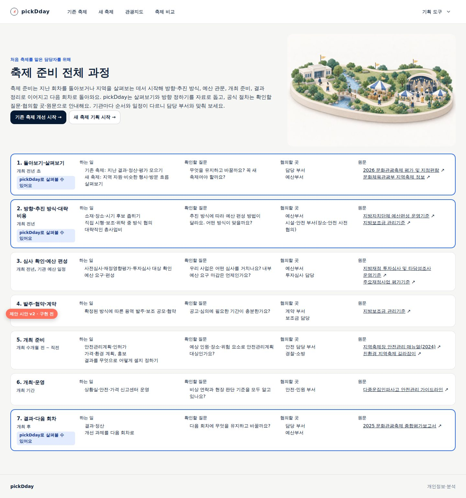

### 8.7 기획 도구

헤더 `기획 도구` 메뉴 항목에 쓰임 한 줄을 붙이고(예: `기획 후보 — 장소·시기·소재 후보를 나란히 적어 비교`), 도구 화면 머리에 “이 도구는 언제 쓰나요”와 전체 과정의 위치를 둔다.
**모아 보기 → 기획 후보 옮기기는 별도 기능으로 설계한다.** 옮길 자료 형식, 연도·지역 맞춤, 장소·기간을 후보로 묶는 방법, 기존 초안 보존·추가, 사용자의 명시 저장을 정해야 하고,
기존 기획안 보관 조건(후보 둘·우선 후보·선택 이유)이 모아 보기·인쇄에 끼어들지 않게 분리해야 한다. 이 작업은 기획 도구의 입력 조건 재검토와 함께 한다.

## 9. 내용과 출처 관리

길잡이 문장과 읽을거리는 화면 코드가 아니라 **내용 자료**로 관리하고, 공식 출처는 작은 **출처 대장**으로 묶는다.

| 대장 항목 | 내용 |
|---|---|
| 출처 ID | 조사 문서의 S·L 번호와 같게 |
| 공식 게시 페이지·원문 | 게시 페이지 우선. 첨부를 다시 올리지 않음 |
| 적용 대상·조건 | 예: 시·군·구 시행 행사성 사업, 민간 개최자, 문화관광축제 |
| 관련 절·쪽·조문 | 읽을 위치. 법령은 조문 번호 |
| 시행일·개정일, 확인일 | 확인일이 오래되거나 원문이 사라지면 해당 숫자 안내를 내린다 |
| 이용조건 | 공공누리 유형, 복제 금지 여부 |
| 관리 담당 | 법령 개정·연간 편람·예산편성 기준 통보 때와 해당 화면 배포 전에 다시 확인 |

- 읽을거리는 질문마다 2~3개, “어디를 왜 읽는가”를 붙인다. 링크가 열린다는 것만으로 최신성 확인으로 보지 않는다.
- 제한 자료의 표·그림을 옮기지 않고, 직접 쓴 안내와 원문 연결을 구분한다.
- 내용 자료에는 자동 시험을 둔다: 모든 탭에 목표·질문이 있고 질문은 2개 이하, 읽을거리마다 출처 ID·확인일이 있으며, 금지 표현(“추천 시기·적합한 주제·입장객 추정” 등)이 없다.
- 지금 초안은 기존 축제 첫 탭만 패널 내용까지 있다. 나머지 다섯 탭의 패널 내용과 자료 범위별 문장은 묶음 2에서 쓰고 업무 경험자 검수를 받는다.

## 10. 화면 시각 요소 체계

“모든 화면에 이미지”를 **“모든 화면에 목적 있는 시각 요소”**로 옮긴다. 자료 화면에서는 차트·지도·공공 사진이 주인공이다.

| 종류 | 첫 배포 | 이후 | 규칙 |
|---|---|---|---|
| 큰 그림 | 홈(유지), 시작 화면 2곳은 **홈 그림 재사용**, 전체 과정 1장 | 기존 흐름 그림을 동등한 두 회차로 다시 그림 | 첫 화면의 주요 그림 하나에만 우선 불러오기 |
| 작은 그림 | 없음 | 작은 크기 전용 세트(1:1, 요소 3개 이하, 사람 없음, 128~144px, 같은 받침·팔레트)를 만든 뒤 자료 화면·빈 상태·도구 머리에 쓸지 결정(D3) | 지금 디오라마를 잘라 쓰지 않음 |
| 정보 그림 | 예시로 읽기의 주석 그림(묶음 2) | 전체 과정 도식 | 코드로 그려 글자·수치가 정확하고, 같은 내용을 글로도 제공 |

공통 규칙: 그림 안에 글자·숫자·로고·실제 명소·실제 수치를 넣지 않는다. 장식 그림만 `alt=""`이고 의미가 있는 도식은 글로 같은 정보를 준다.
실제 장소는 공공 사진만 쓴다. 숨긴 그림도 내려받을 수 있으니 반응형 파일·`sizes`·크기 예약을 쓰고, 첫 화면 성능·전송량·화면 밀림은 구현 후 측정한다.
제작은 홈 그림처럼 홈 v2 두 장을 참고 이미지로 편집 생성하고, 사용자 확인 후 채택하며 최종 프롬프트를 남긴다. 시기 그림은 홈 팔레트(크림·세이지·황토·흰)로 다시 만든다.

### 10.1 시안 이미지(v1, 채택 전)

방향 확인용 네 장이다. 제품에 넣지 않았다. 홈 v2 두 장을 참고 이미지로 Codex 내장 이미지 생성(1536×1024)으로 만들고 문서용 1200×800으로 줄였다.

| 시안 | 쓰일 곳(v2 기준) | 검토 후 판단 |
|---|---|---|
|  | 기존 흐름의 큰 그림 후보 | 가족 일관성은 좋음. 흐림·선명 대비가 ‘최근이 나아졌다’로 읽혀 동등한 두 회차로 다시 그림 |
| 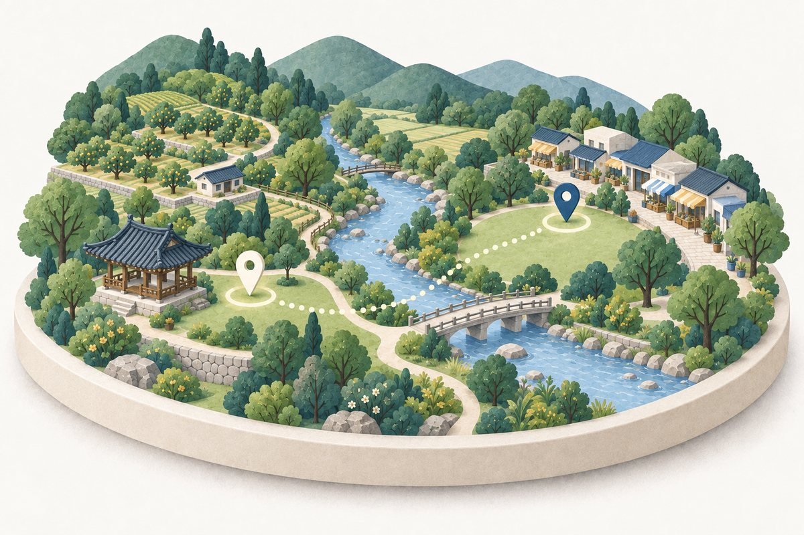 | 새 흐름의 큰 그림 후보 | 홈 새 축제 그림과 잘 이어짐. 작게 쓰면 핀이 사라져 작은 그림으로는 쓰지 않음 |
|  | 보류 | 벚꽃 분홍·단풍 주황이 홈 팔레트를 벗어나 자료 화면에서 시선을 끎. 다시 그릴 때 2톤 계절로 |
| 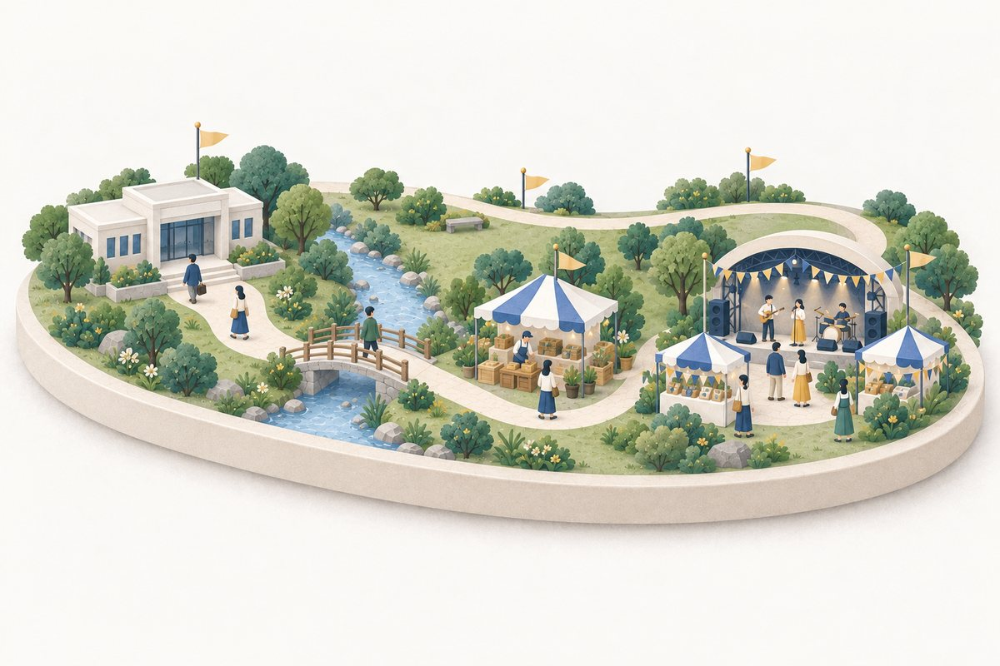 | 전체 과정 안내 | 왼쪽→오른쪽 순서와 돌아오는 길이 읽힘. 일곱 단계의 정확한 도식은 아니므로 단계 설명은 글이 맡음 |

장면별 최종 프롬프트는 [시안 생성 기록](../assets/design-24/samples/prompts.md)에 있다.

## 11. 레퍼런스 선택 기록

| 항목 | 내용 |
|---|---|
| 대상·목표 | 두 흐름의 자료 화면에 안내·도움을 붙이고 시작 화면·전체 과정 안내를 만든다. PC 업무 화면, 자료 밀도 높음, 한국어, 처음 맡은 공무원 |
| 상태 | 위임 선택 완료(방향 제안). 최종 채택은 사용자 결정(16절) |
| 비교한 화면(2026-10-03 headless 확인) | GOV.UK [Learn to drive a car: step by step](https://www.gov.uk/learn-to-drive-a-car)(여정 지도), [Apply for your first provisional driving licence](https://www.gov.uk/apply-first-provisional-driving-licence)(본문 옆 단계 목록), GOV.UK Design System [Complete multiple tasks](https://design-system.service.gov.uk/patterns/complete-multiple-tasks/), [KRDS](https://www.krds.go.kr/) 도움 패널·단계 표시기·탭 규칙 |
| 결정 | 여정 지도(GOV.UK step by step)의 **내용 구성**(목표·할 일·한 줄 설명)만 시작 화면에 쓴다. 자료 화면은 지금의 링크형 탭 + KRDS **요청형 도움 패널** + GOV.UK 페이지 넘김식 `이어서` |
| 택하지 않은 것 | 번호 단계 표시기(USWDS·KRDS 순차형): 자유 이동 화면을 입력 양식처럼 보이게 한다. 작업 목록(GOV.UK task list): ‘모두 완료해야 진행’ 규칙이 기록 선택 원칙과 맞지 않는다. 자동 열림·코치마크: 처음 온 사람이 닫아야 자료를 본다 |
| 조정 | 번호·방문 표시·완료율 없음. 질문은 평문. 패널은 버튼으로만 열고 넓은 화면은 헤더 아래 옆 열 |

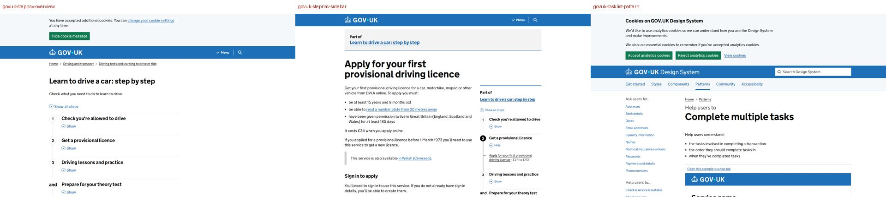

참고 화면 출처: GOV.UK(Open Government Licence v3.0). KRDS 화면은 링크로만 참조한다.

## 12. 단계별 추진

첫 배포에서 **목표·순서·끝**을 한 번에 연결하고, 초기 사용자에게 다시 확인한 뒤 도움 내용을 채운다.

| 묶음 | 범위 | 해결 | 규모 |
|---|---|---|---|
| 1. 흐름의 처음과 끝 (첫 배포 제안) | 할 일 탭 이름, 시작 화면 흐름 지도(홈 그림 재사용)·판단 질문, 자료 화면 안내 영역(목표·알 수 없는 것·질문 2), 하단 `이어서` 줄 재편, 회차 카드의 개최 전·후 일평균, **모아 보기**(지금 고른 것·출처 포함 인쇄·다음에 확인할 일 목록), 홈 한 줄과 전체 과정 띠, **전체 과정 안내**(질문·협의할 곳·원문, 숫자 없음, 그림 1장) | F1·F2·F4·F6·F7 | 중간. 자료 기능은 일평균 한 줄만 추가 |
| 2. 길잡이 패널 | 여섯 탭의 자료 읽는 법·따로 확인할 일·예시 주석 그림·용어·읽을거리, 자료 범위별 문장, 출처 대장, 업무 경험자 검수 | F6 | 중간. 내용 작성·검수가 대부분 |
| 3. 확인할 일 상태와 공식 수치 | 다음에 확인할 일의 `확인함 / 해당 없음 / 나중에`(이 브라우저, 흐름·축제/지역·연도·항목 판 구분), 전체 과정 단계별 확인 목록, (D5 승인 시) 금액·기한 표시 | F7 | 중간 |
| 4. 기획 도구 연결 | 모아 보기 → 기획 후보 옮기기(별도 설계), 기획안 보관 조건 재검토, 도구 메뉴 한 줄·머리 안내 | F3·F8 | 중간~큼 |
| 5. 시각 요소 확장 | (D3에 따라) 작은 그림 세트, 기존 흐름 큰 그림 다시 그리기, 빈 상태·도구 그림 | F5 | 중간. 생성·검수 반복 |

## 13. 인수 기준 초안

묶음 1을 시작할 때 `TS-FC-021`로 확정한다.

| 기준 | 확인할 결과 |
|---|---|
| G1 | 홈 카드에 얻는 것 한 줄, 두 시작 화면에 목표·네 탭·“처음이라면 이 순서, 순서는 자유”·담당자가 판단할 것·얻는 것이 있고, 축제 목록·지역 선택이 PC 첫 화면에 남는다 |
| G2 | 자료 탭은 번호·상태 표시 없이 할 일 이름과 자료 이름을 보이며, 주소·뒤로 가기·`aria-current`·이동 후 제목 초점이 지금과 같다 |
| G3 | 모든 자료 화면에 안내 영역(목표·알 수 없는 것·평문 질문 2개 이하)이 있고, 같은 경고가 부제와 겹치지 않는다. 체크 상자·칩 모양 질문이 없다 |
| G4 | 회차·후보·조회 결과가 없거나 실패한 경우에 맞는 문장과 다른 탭 연결이 나온다. 과거 개최일 추정·빈값 0 표시가 없다 |
| G5 | 모아 보기는 입력 없이 지금 고른 것만 보여 주고, 일부만 있거나 없을 때·새로 고침·주소 직접 진입에서 남는 것과 사라지는 것이 설계표와 같다. 인쇄본에 지역·기간·단위·출처·수집 시각이 있다. 완료·평가 문장을 자동으로 만들지 않는다 |
| G6 | 전체 과정 안내에 일곱 단계의 하는 일·확인할 질문·협의할 곳·원문이 있고, 숫자 기준은 D5 결정 전까지 없다. 원문은 공식 게시 페이지로 새 탭에서 열린다 |
| G7 | 길잡이는 버튼으로만 열리고(묶음 2), 넓은 화면은 헤더를 덮지 않는 옆 열, 좁은 화면·200% 확대는 대화상자(초점·Esc·복귀)다. 저장이 막혀도 동작한다 |
| G8 | 화면 문구에 내부 개발·검증 절차와 “추천 시기·적합한 주제·입장객 추정” 같은 내용 판단이 없다. 지역 방문을 행사 수요·참가 규모로 부르지 않는다 |
| G9 | 390·1440·1920px, 200%·400% 확대, 키보드만으로 탭·안내·모아 보기·인쇄를 쓴다. 첫 화면 성능(LCP)·전송량·화면 밀림이 지금보다 나빠지지 않는다 |

## 14. 확인 계획

- **묶음 1 뒤 초기 사용자 재확인:** 처음 축제를 맡았다고 가정하고 두 흐름을 각각 진행한다. 정답이나 문서 완성을 요구하지 않고 다음을 자기 말로 설명하는지, 어디서 막히는지 본다.
  - 이 흐름으로 무엇을 하고 무엇을 얻는지
  - 기존 축제의 유지·변경 이유 또는 새 축제의 소재·시기 대안
  - 이 자료로 알 수 없는 것
  - 다음에 누구와 무엇을 확인할지
- **함께 볼 경우:** 회차 자료 없는 축제, 후보 하나, 아무것도 고르지 않음, 새로 고침, 주소로 모아 보기 직접 진입, 공용 PC.
- **내용 검수(묶음 2):** 질문·자료 읽는 법·따로 확인할 일 문장을 축제 업무 경험자에게 읽혀 틀린 말과 현장에 맞지 않는 말을 고친다.
- 성과는 이해와 길 찾기로 보고 완료율·체크 개수를 지표로 삼지 않는다. 다른 분야의 체크리스트 연구를 이 제품의 효과 근거로 확대하지 않는다. 담당자 관찰 없이 “사용성 검증 완료”라고 쓰지 않는다.

## 15. 위험과 피할 것

| 위험 | 대응 |
|---|---|
| 안내가 길어 자료가 밀리고 읽히지 않는다 | 안내 영역은 목표·알 수 없는 것·질문 2개, 겹치는 경고 제거, 자세한 내용은 요청형 패널 |
| 질문·확인할 일이 의무나 적법성 확인처럼 느껴진다 | 자료 화면에는 체크 없음, 확인할 일은 다음 행동과 협의할 곳으로, 세 가지 구분, 개수·완료율 없음 |
| 지역 방문 자료가 행사 수요로 오해된다 | 안내 영역·패널·인쇄본에 같은 원칙, 공식 서류에는 별도 조사·집계가 필요하다고 안내 |
| 공식 기준이 바뀌어 틀린 안내가 된다 | 첫 배포는 숫자 없이, 출처 대장·갱신 담당·확인일 규칙이 생긴 뒤 숫자 추가 |
| 모아 보기가 선택 상태와 맞지 않는다 | 항목별 남는 범위를 설계표로 고정하고 시험에 포함 |
| 그림이 산만하고 무겁다 | 자료 화면은 그림 없이 시작, 작은 그림은 전용 세트로만, 성능 측정 |
| 모아 보기가 공식 문서처럼 오해된다 | “개인 검토 자료이며 공식 문서가 아님”을 화면과 인쇄본에 |

## 16. 사용자 결정이 필요한 것

| 번호 | 결정 | 선택지 | 제안(두 검토 의견) |
|---|---|---|---|
| D1 | 순서 안내 | (가) 번호 없는 할 일 탭 + 흐름 지도·`이어서` (나) 번호 단계 표시 | **(가)**. Codex·Fable 모두 동의 |
| D2 | 체크리스트 위치 | (가) 자료 화면은 질문, 확인할 일은 모아 보기·전체 과정 (나) 모든 자료 화면에 체크 목록 | **(가)**. 첫 배포에 모아 보기가 함께 나가므로 Fable의 조건 충족. 상태 저장은 묶음 3 |
| D3 | 자료 화면 그림 | (가′) 당분간 그림 없음 → 작은 크기 전용 그림 세트 시안을 만든 뒤 결정 (나) 지금 큰 그림(시안 v1 대안) | **(가′)**. 두 검토 모두 (나)에 반대. 홈 인상은 시작 화면·전체 과정의 큰 그림으로 잇는다 |
| D4 | 첫 배포 범위 | 묶음 1(흐름의 처음과 끝) / 묶음 1의 일부 | **묶음 1 전체**. 목표·순서·끝을 한 번에 확인할 수 있다 |
| D5 | 공식 기준 숫자 | (가) 갱신 담당을 정하고 출처 대장과 함께 숫자 표시 (나) 질문·협의할 곳·원문만 | 담당이 정해질 때까지 **(나)**. 담당이 생기면 (가)로 올린다 |
| D6 | 기획 도구로 옮기기 | 첫 배포에 포함 / 별도 설계(묶음 4) | **별도 설계**. 기존 기획안 조건·초안 병합을 함께 정해야 한다 |

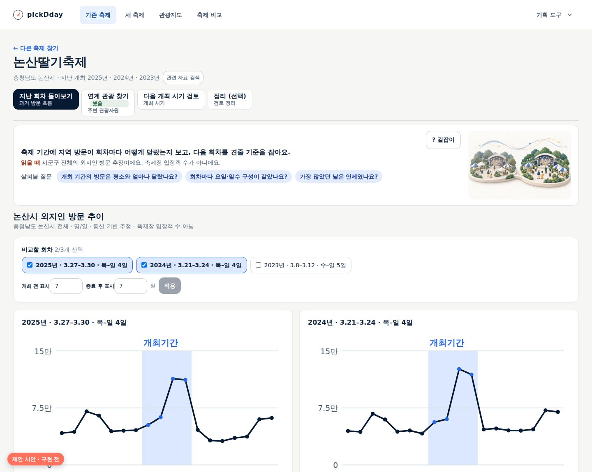

## 17. 사용자에게 묻고 싶은 것

1. 초기 사용자의 “목표와 과정이 흔들린다”는 말은 어느 쪽에 가까웠나요? ① 끝에 무엇을 얻는지 ② 어떤 순서로 볼지 ③ 예산·안전 같은 행정 절차와의 연결. 묶음 1 안의 우선순위가 달라진다.
2. 초기 사용자 중 시·도(광역) 담당자가 있나요? 공식 기준 숫자를 넣을 때 시·군·구와 시·도 기준을 나눠야 한다.
3. 담당자들이 공용 PC를 쓰나요? 이 브라우저에 남기는 상태(길잡이 열림, 확인할 일)의 초기화 방식이 달라진다.
4. 모아 보기 인쇄본은 주로 어디에 쓰일까요(내부 보고, 인수인계, 심사 서류 참고)? 요약 항목의 순서를 맞출 수 있다.
5. 질문·자료 읽는 법 문장을 읽어 줄 축제 업무 경험자가 있나요? 묶음 2 내용 검수에 필요하다.

시안 화면에 쓴 문구 초안은 [내용 초안](../assets/design-24/mockups/content-draft.json)에 있고, 시안은 [만드는 스크립트](../assets/design-24/mockups/render.mjs)로 공개 화면 위에 다시 만들 수 있다.

## 18. 검토 의견과 반영

검토 원문: [Codex 검토](../review/2026-10-03-planning-guide-review-codex.md)(gpt-6-astra, xhigh), [Fable 검토](../review/2026-10-03-planning-guide-review-fable.md). 두 검토 모두 v1을 대상으로 했다.

| 출처·번호 | 지적 | 반영 |
|---|---|---|
| Codex 1 | 판단할 것(방문 대상·이유·신설 필요성·유지·변경 이유)이 약함 | 반영 — 시작 화면의 “담당자가 판단할 것”, 탭 이름 일부, 모아 보기 판단 메모(7·8.2·8.5) |
| Codex 2 | 모든 기존 축제에 회차 비교를 약속할 수 없음 | 반영 — 자료 범위별 첫 탭 안내(7.1), G4 |
| Codex 3 | 지역 방문 추정을 서류의 수요·참가 규모로 연결한 문장 | 반영 — 4.1 정정, 패널 읽는 법 문구, G8 |
| Codex 4 | 전체 과정의 추진 방식 순서 | 반영 — 방향·방식·대략 비용 → 심사·편성 → 발주·협약, 장소·안전 협의 병행(8.6) |
| Codex 5 | 법령 숫자의 적용 대상·조건 누락 | 반영 — 첫 배포 숫자 없음, 출처 대장 뒤 대상·조건·조문·시행일과 함께(8.6·9·D5) |
| Codex 6 | 읽을거리 연결·갱신 계약, 나머지 탭 내용 부족 | 반영 — 출처 대장(9), 다섯 탭 내용은 묶음 2 |
| Codex 7 | 정리 화면이 임시 상태만으로 안 됨 | 반영 — 항목별 남는 범위 설계표, 장소는 현재 선택 하나(8.5), G5 |
| Codex 8 | 기획 도구 연결은 별도 기능, 기획안 조건 충돌 | 반영 — 별도 설계·묶음 4(8.7·D6) |
| Codex 9 | 체크는 법적 완료가 아니라 다음 행동 | 반영 — 행동+협의할 곳, 세 구분, 기본 미선택, 저장 키 구분은 묶음 3 |
| Codex 10 | 자동 열림이 확대 상태에서 본문을 막음 | 반영 — 버튼으로만 열림, 좁은 화면·확대는 대화상자(8.4) |
| Codex 11 | 정보 밀도·홈 캡처 실패 | 반영 — v2 시안 전부 다시 만들고, 스타일·이미지 로드를 확인한 뒤 찍도록 스크립트 수정 |
| Codex 12 | 완료 단정 문구·작동 설명 문구 | 반영 — “후보 기간과 등록 일정”의 중립 조회 결과, 패널 작동 설명 삭제 |
| Codex 13 | 그림 축소, 흐림·선명 대비 | 반영 — 10절, 기존 흐름 그림은 동등한 두 회차로 다시 그림 |
| Codex 14 | 첫 배포를 결과까지 연결 | 반영 — 묶음 1(12) |
| Fable 1 | 약속한 ‘끝’이 묶음 3 | 반영 — 모아 보기를 묶음 1에 |
| Fable 2 | 질문 칩이 버튼처럼 보임 | 반영 — 평문 질문 |
| Fable 3 | 같은 경고 반복 | 반영 — 부제·안내 줄·패널 역할 분리 |
| Fable 4 | 패널이 헤더를 덮고 자동 열림 | 반영(더 보수적으로) — 버튼으로만, 헤더 아래 옆 열, 펼침 구성, 따로 확인할 일을 앞에 |
| Fable 5 | `봤음` 표시 | 반영 — 제외 |
| Fable 6 | `정리(선택)` 한 탭만 선택 표시 | 반영 — `모아 보기`, 점선 제거 |
| Fable 7 | 점검 조작 크기·색 단독·라벨 과다·이중 저장 | 반영 — 44px 선택지+표시, 세 구분, 행동 문장. 단일 저장은 묶음 3 설계 조건 |
| Fable 8 | 첫 질문에 답할 수치 없음 | 반영 — 회차 카드에 개최 전·후 일평균 |
| Fable 9 | 시·군·구 기준·조문·시행일 누락 | 형태를 바꿔 반영 — 첫 배포 숫자 없음, 숫자를 넣을 때 기준·조문·시행일 필수 |
| Fable 10 | 전체 과정에 시간이 없음, 점검 과다 | 일부 반영 — 단계별 확인은 1·2·3·7단계 중심, 5·6단계는 매뉴얼 점검표 연결. 예시 일정은 숫자 기준과 함께 D5 이후 |
| Fable 11 | 홈 카드 과다·시작 화면이 목록을 밀어냄 | 반영 — 홈 한 줄, 시작 화면 가로 네 칸·그림 300px |
| Fable 12 | `이어서`와 기존 하단 연결 중복 | 반영 — 하단 줄 재편, 모든 탭에 |
| Fable 13 | 96px 그림 가독성·시기 그림 팔레트 | 반영 — 자료 화면 그림 없음, 전용 세트 후 결정, 시기 그림 다시 그림 |
| Fable 14 | 문구 | 대부분 반영 — `따로 확인할 일`, 연계 목표 문장, 탭 이름. `기획 후보에 담기`는 연결 기능과 함께 묶음 4 |
| Fable 15 | 좁은 화면·토큰·접근성 | 반영 — 구현은 디자인 시스템 토큰, 지금의 nav·`aria-current` 유지, 도움 버튼 위치 고정 |

## 19. 사용자 결정과 묶음 1 구현 · 2026-10-03

**결정(사용자):** 개선안 전체와 D1~D6 제안을 승인했다. 17절 질문의 답 — “흔들린다”는 ① 끝에 얻는 것과 ② 볼 순서 모두다. ③ 행정 절차와의 연결은
확인해 줄 공무원이 없어 확인하지 못했다. 시·도 담당자는 없고, 모두 개인 PC를 쓰며, 인쇄본은 내부 보고에 쓴다. 내용 검수자는 없어 우리가 정한다.
방향 조정: 문장·설명이 많으면 피로하므로 가능한 한 시각 도구·아이콘·이미지로 줄이고, 팝업·초점 상태의 디자인 시스템도 함께 정제한다.

**구현한 것(묶음 1 전체):**

| 범위 | 구현 | 계획과 다른 점 |
|---|---|---|
| 할 일 탭 | 두 흐름 모두 `아이콘 + 할 일(굵게) + 자료 이름(작게)` 네 탭, 번호·방문 표시 없음, 주소·`aria-current`·제목 초점 유지 | 탭에 아이콘 추가(뜻 하나에 아이콘 하나) |
| 안내 띠 | 목표·이 자료로 알 수 없어요·살펴볼 질문 세 칸, 각 칸 아이콘 배지. 문장은 계획 초안보다 짧게(목표30자·질문28자 이하, 단위 시험) | 모아 보기에는 띠를 두지 않음(머리말과 겹침). 기존 방문 부제에서 입장객 경고를 빼고 띠로 옮김(모아 보기·인쇄 출처 줄에는 유지) |
| 흐름 지도 | 두 시작 화면에 홈 그림(작게)·목표·네 할 일 타일과 화살표·`처음이라면 이 순서로 · 순서는 자유`·판단 세 항목(아이콘)·끝에 얻는 것·전체 과정 연결 | 판단 항목을 질문 대신 짧은 명사구로 |
| 이어서 | 모든 자료 화면 아래 한 줄: 다음 할 일(진한 단추)과 나머지 할 일. 모아 보기 다음은 전체 과정 | 화면마다 다르던 교차 연결과 빈 상태의 탭 연결을 이 줄로 통일 |
| 회차 카드 | 개최 전 N일·개최기간·종료 후 N일 일평균을 같은 축척 막대 셋으로 | 숫자 줄 대신 막대(값·단위 함께) |
| 모아 보기 | `/existing/{id}/summary`, `/new/{지역코드}/summary`. 방문 흐름(주소 조건)·장소·후보 기간(조회 결과)·판단 메모(화면에만)·다음에 확인할 일(아이콘·협의할 곳·세 구분)·인쇄 | 새 축제 방문 흐름은 12달 막대에 가장 많은/적은 달 표시. 메모는 탭 기억에 두어 탭을 오가도 남고 새로 고치면 사라짐. 검색 노출 제외 |
| 홈 | 카드마다 `얻는 것` 한 줄(인쇄 아이콘)과 `축제 준비 전체 과정 보기` 띠(일곱 단계 아이콘) | — |
| 전체 과정 `/guide` | 전체 과정 그림, 개최 전·개최·개최 후로 묶은 일곱 단계 바로가기, 단계 카드(하는 일·확인할 질문·협의할 곳·원문 새 탭·pickDday 연결). 금액·기한 없음(D5) | 시기 표시는 개최 전·개최·개최 후 세 묶음만 |
| 팝업·초점 | 공통 모달 표면·머리글·닫기, 휴대폰 아래 시트, 메뉴 아이콘·안쪽 초점, 초점 고리 2px·입력칸 안쪽 빛·라벨 전체 고리, 선택지 칩([공통 표현](../sdlc/2-design/design-system.md)) | 배경 흐림은 성능 측정 후 뺌 |

**내용 자료:** 문구는 화면 코드가 아니라 `lib/guide/content.ts`(두 흐름)와 `lib/guide/process.ts`(일곱 단계·출처 대장 12건)에 있다.
단위 시험이 순서·길이·질문 수·금지 표현·숫자 기준 없음·출처의 공식 https 주소와 확인일을 지킨다.

**남은 것:** 묶음 2(요청형 길잡이 패널·탭별 자료 읽는 법·읽을거리), 묶음 3(확인할 일 상태·공식 수치 — 갱신 담당이 생기면), 묶음 4(기획 도구 연결),
묶음 5(작은 그림 세트). 검수자가 없으므로 묶음 2의 문장은 출처 대장 원문과 대조해 우리가 정하고 화면에 업무 경험자 검수를 받았다고 쓰지 않는다.

