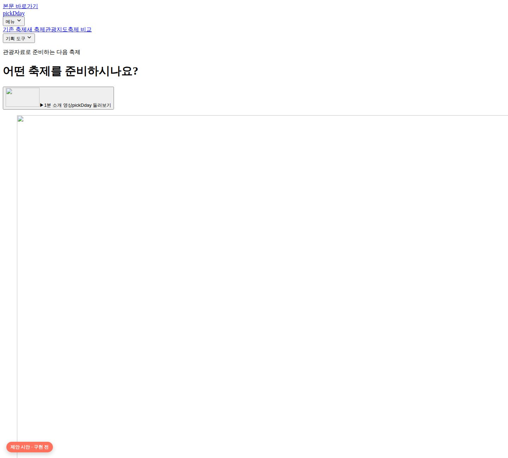
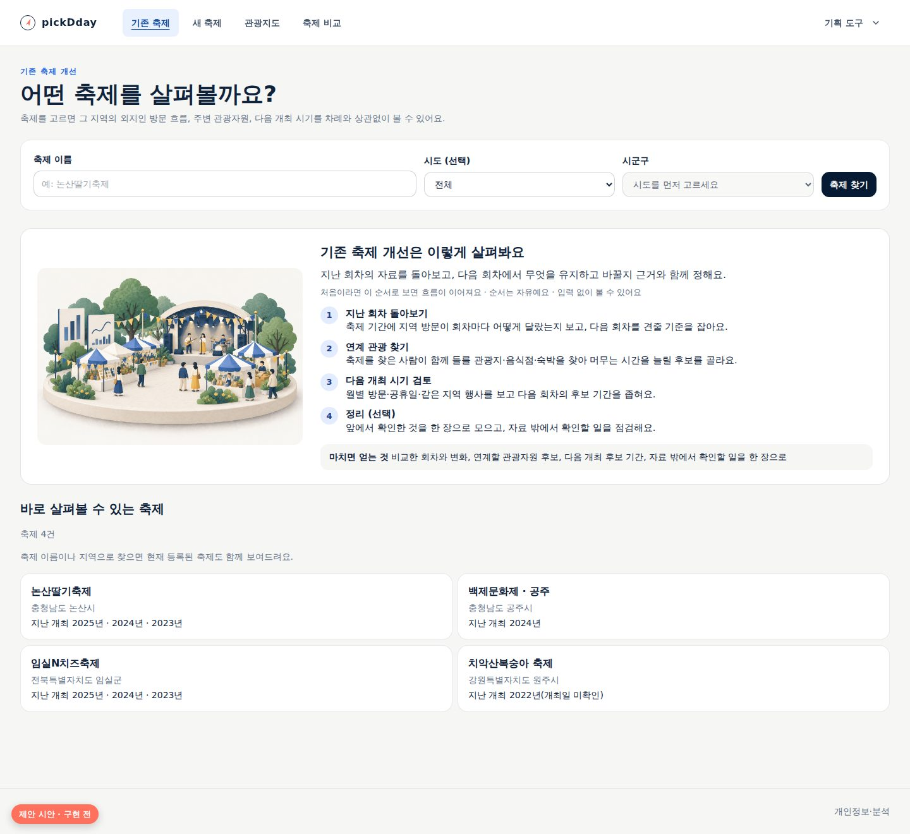
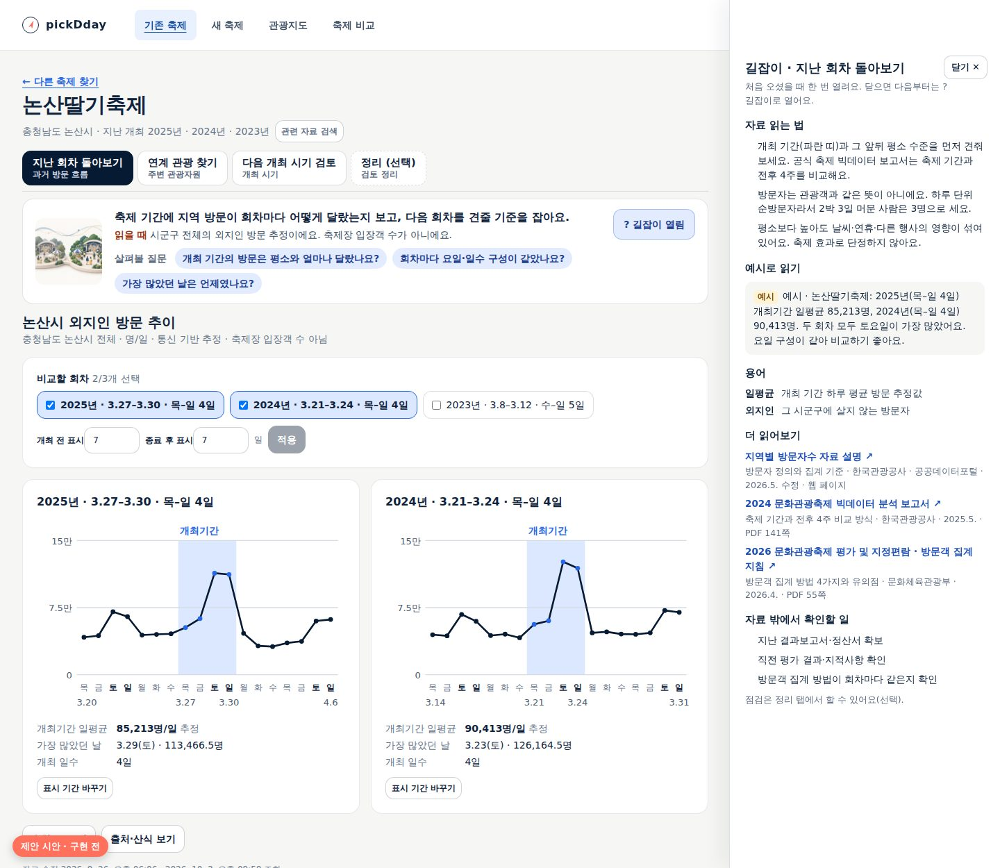
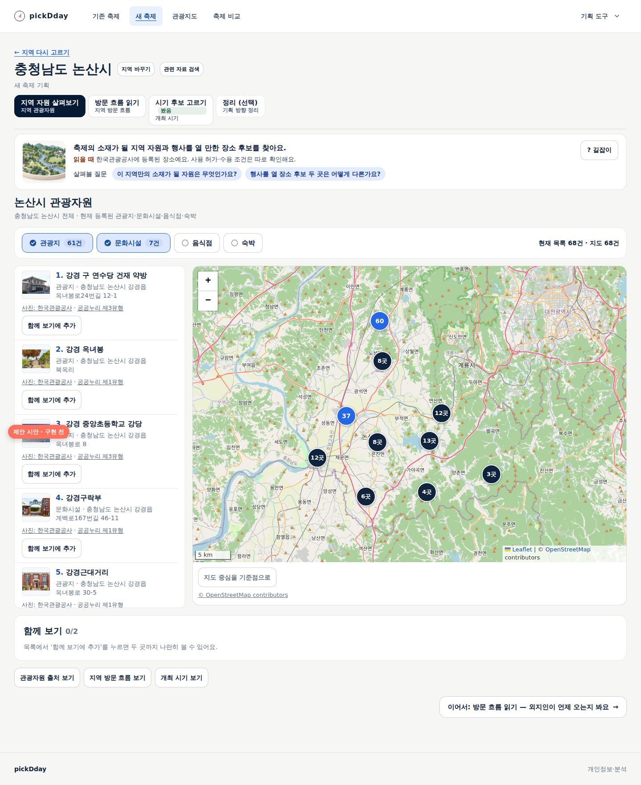
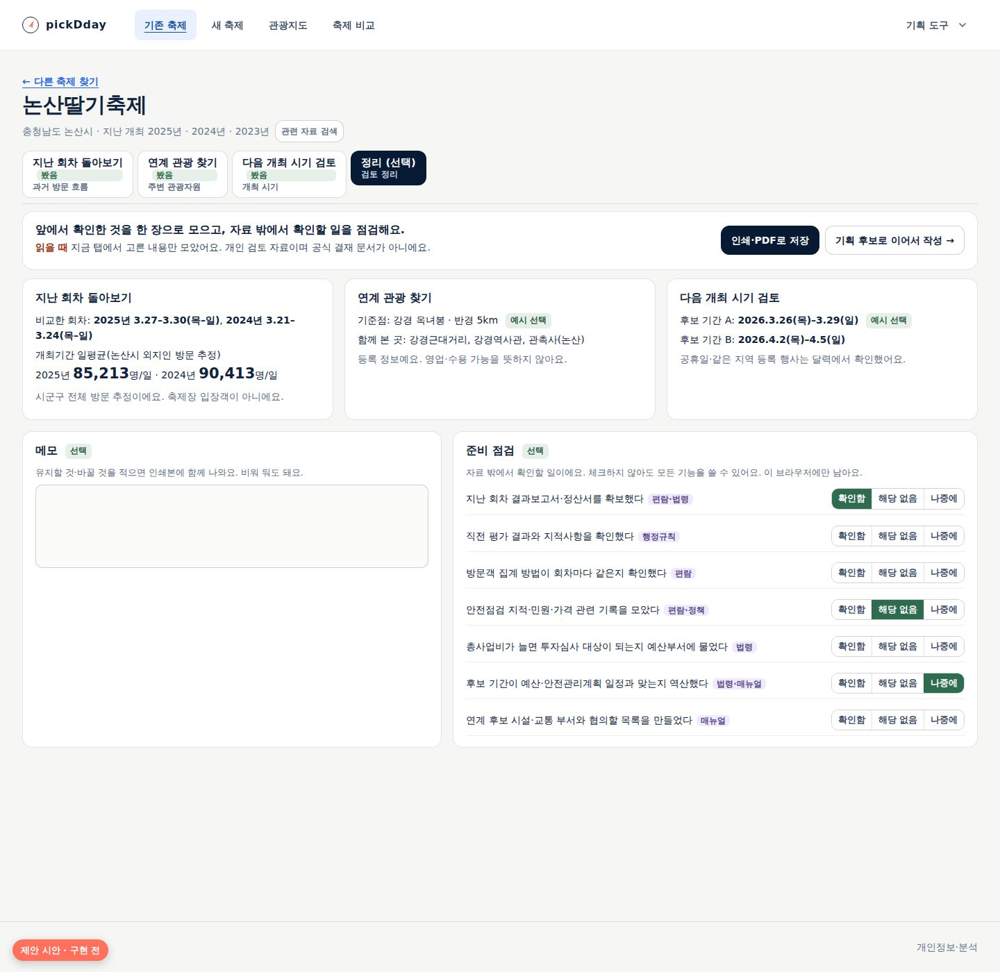
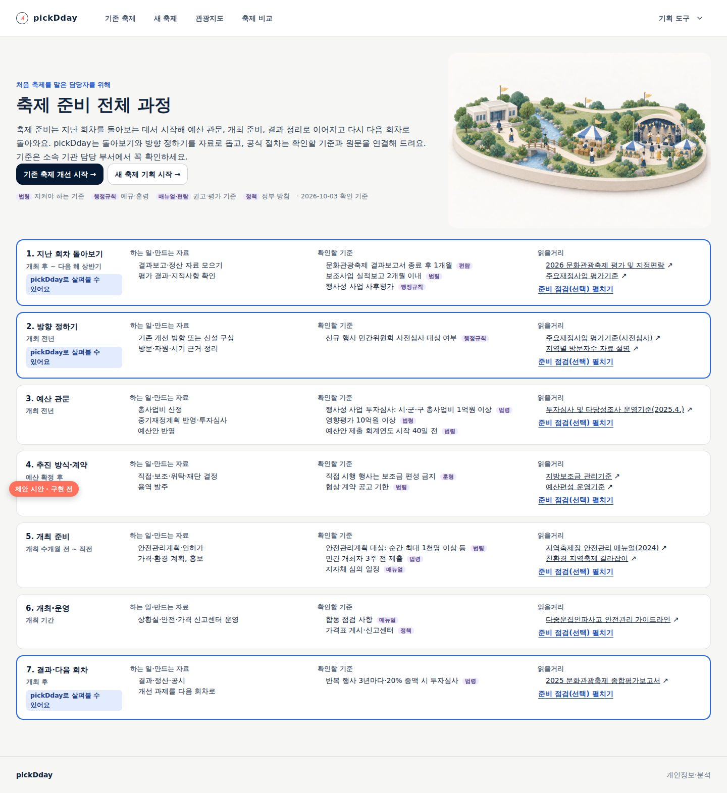

# 축제 기획 길잡이와 화면 이미지 체계

상태: **계획 — 사용자 결정 필요.** 2026-10-03 사용자 요청으로 현황 분석·조사·기획을 했다. 앱·배포는 바꾸지 않았다.
아래 제안 화면은 실제 서비스 화면에 제안 요소를 덧붙여 찍은 시안이며 구현된 기능이 아니다.

## 1. 요청과 초기 사용자 의견

2026-10-03 사용자가 초기 사용자들과 논의한 결과를 전했다. 이 문서는 사용자가 전달한 의견을 근거로 삼으며,
우리가 직접 관찰한 사용성 시험 결과로 표시하지 않는다.

| 의견 | 해석 |
|---|---|
| 첫 화면에서 쓰임을 **기존 축제 개선·새 축제 기획** 둘로 나눈 것이 아주 좋았다 | 두 흐름의 구분은 유지한다. 바꾸는 것은 각 흐름의 안쪽이다. |
| 각 흐름의 **달성 목표와 과정이 흔들린다** | 흐름마다 무엇을 얻고 끝나는지, 어떤 순서로 무엇을 정하는지 화면이 말하지 않는다. |
| 첫 화면의 **명확한 시각 이미지**가 호응이 좋았다 | 다른 화면에도 같은 계열의 이미지를 적극적으로 쓴다. 장식이 아니라 길 찾기를 돕는 위치에 둔다. |

대상 사용자는 순환보직으로 축제 업무를 처음 맡을 수 있는 지역 공무원이다. 그래서 자료 화면만이 아니라
**각 단계의 목표, 확인할 것, 읽으면 좋을 자료**로 의사결정을 안내하는 길잡이가 필요하다.
이는 [기획 기준](../product/planning-principles.md)이 “가이드는 무엇을 고려하고 자료를 어떻게 읽으며 어디까지 판단할 수 있는지
안내한다. 세부 구성은 후속 논의에서 정한다”라고 남긴 부분을 구체화하는 작업이다.

## 2. 현황 분석

2026-10-03 공개 서비스의 18개 화면을 PC 1440px로 열어 제목·버튼·이미지·첫 화면 문구를 수집하고 직접 확인했다.

| 번호 | 확인한 사실 | 사용자에게 생기는 문제 |
|---|---|---|
| F1 | 축제를 고르면 `과거 방문 흐름 / 주변 관광자원 / 개최 시기` 세 탭만 보인다. 새 축제도 `지역 관광자원 / 지역 방문 흐름 / 개최 시기`다. 탭 이름이 **자료 종류**다. | 지금 무엇을 정하는 단계인지, 어떤 순서가 좋은지 알 수 없다. |
| F2 | 각 화면은 차트·지도·목록을 보여 주지만 “이 화면에서 정할 것”이나 “다 봤다면 다음”이 없다. 마지막 탭에서 흐름이 끝난다. | 흐름의 **끝과 결과물**이 없다. 무엇을 손에 쥐고 나가는지 모른다. |
| F3 | 기획 후보·예산·기획안·결과·작업공간은 헤더의 `기획 도구` 펼침 메뉴에 따로 있다. 두 흐름의 화면에서 이 도구로 이어지는 안내가 없다. 흐름 화면에는 근거 담기도 없다. | 자료를 본 뒤 기획 문서로 넘어가는 시점과 방법을 모른다. |
| F4 | 축제 찾기(`/existing/search`)와 지역 고르기(`/new`)는 입력 칸 외에 화면 대부분이 비어 있다. | 출발 직전에 흐름 전체를 보여 줄 수 있는 자리가 쓰이지 않는다. |
| F5 | 홈 외 화면에는 일러스트가 없다. 자료 화면은 차트·지도, 도구 화면은 입력 양식과 긴 설명이다. | 홈에서 받은 명확한 인상이 두 번째 화면부터 끊긴다. |
| F6 | 자료의 한계는 부제(`통신 기반 추정 · 축제장 입장객 수 아님`)와 `출처·산식 보기`로 전달된다. 차트를 읽는 법이나 이 자료로 판단할 수 없는 것은 따로 안내하지 않는다. | 처음 보는 사람은 지역 방문을 입장객이나 축제 효과로 오해하기 쉽다. |
| F7 | 예산 요구·안전관리계획·발주·정산 같은 행정 절차는 제품 어디에도 없다. 조사 자료([업무 사례](../research/2026-09-municipal-festival-cases.md))에만 있다. | 처음 맡은 담당자는 전체 일정 속에서 지금 할 일과 pickDday의 쓰임을 알기 어렵다. |
| F8 | `담은 근거`·`기획 후보`·`비용·결과` 같은 도구 이름은 쓰임을 설명하지 않는다. 도구 화면 위에는 저장 위치 안내 문장이 반복된다. | 익숙하지 않은 사람에게는 언제 어떤 도구를 쓰는지가 가장 어렵다. |

정리하면 **두 흐름의 진입은 명확하지만, 진입한 뒤에는 목표·순서·끝이 화면에 없다.**
자료 기능은 충분히 쌓였지만 처음 맡은 담당자에게 필요한 “왜 이 화면을 보는가, 무엇을 정하는가, 다 보면 무엇을 하는가”가 빠져 있다.

## 3. 목표와 성공 기준

| 목표 | 확인 방법(구현 후) |
|---|---|
| 사용자가 각 흐름의 **목표와 결과물**을 첫 단계에 들어가기 전에 말할 수 있다 | 초기 사용자 과업: 시작 화면을 본 뒤 “이 흐름을 마치면 무엇을 얻나요?”에 답하기 |
| 어느 화면에 있든 **지금 살펴볼 것과 다음 화면**을 찾는다 | 자료 화면에서 다음 행동을 10초 안에 가리키기 |
| 처음 맡은 담당자가 **전체 준비 과정 속 위치**와 pickDday의 쓰임을 안다 | 전체 과정 안내를 본 뒤 “지금 pickDday로 할 일”과 “다른 곳에서 확인할 일” 구분하기 |
| 길잡이가 **자료 탐색을 막지 않는다** | 길잡이를 닫은 채, 점검을 비워 둔 채 모든 자료 화면 이용 가능(자동 시험) |
| 이미지가 길 찾기를 돕고 자료 읽기를 방해하지 않는다 | 이미지 추가 후 첫 화면의 자료 시작 위치·로딩 성능 비교, 사용자 의견 |

데이터가 결정을 대신하지 않는다는 원칙, 기록은 선택이라는 원칙은 그대로다([비목표](../product/non-goals.md)).

## 4. 조사에서 확인한 것

두 조사를 했다. 자세한 근거와 출처 확인 상태는 각 문서에 있다.

- [공식 자료·절차 조사](../research/2026-10-novice-planner-sources.md): 처음 맡은 담당자에게 쓸모 있는 공식 안내서, 법령·행정 체크포인트, 추진 흐름.
- [단계 안내·체크리스트·이미지 UX 조사](../research/2026-10-guidance-ux-patterns.md): 정부 디자인 시스템과 연구 근거.

### 4.1 처음 맡은 담당자에게 필요한 공식 정보

- 실제로 펼쳐 쓸 공식 안내서는 많지 않다. 쓸모가 큰 것은 행정안전부 「지역축제장 안전관리 매뉴얼」(2024.9.),
  문화체육관광부 「2026 문화관광축제 평가 및 지정편람」의 별첨 서식, 행정안전부 「지방재정 투자심사 및 타당성조사 운영기준」(2025.4.)이다.
- **돈이 걸린 관문이 개최 시기보다 먼저 온다.** 시·군·구 행사성 사업은 총사업비 1억원 이상이면 투자심사 대상이고
  (지방재정법 시행령 제41조, 2025.1.7. 개정), 신규 행사는 예산편성 전에 민간위원회 사전심사를 받을 수 있다(행정안전부 예규).
  예산안은 시·군·구가 회계연도 시작 40일 전까지 의회에 낸다(지방자치법 제142조). 처음 맡은 담당자가 가장 놓치기 쉬운 부분이다.
- **pickDday 자료가 공식 서류에 쓰일 자리가 있다.** 투자심사 의뢰서(행사성 사업 서식)는 최근 3년간 참가규모 추이와
  신규 행사의 수요 산출 근거를 요구하고, 문화관광축제 실행계획서는 방문객 및 특성 분석을 요구한다.
- **자료 읽는 법을 공식 문구로 뒷받침할 수 있다.** 한국관광공사는 방문자가 관광객과 같지 않고, 일자별 순방문자라 2박 3일 방문은 3명으로
  집계되며, 광역·기초 수치를 임의로 합산할 수 없다고 설명한다. 공식 축제 빅데이터 보고서는 축제 기간과 전후 4주를 비교한다.
- 안전관리계획의 “개최 3주 전 제출”은 시행령상 **민간 개최자**의 기한이고, 지자체 직접 개최의 3주·2주·10일·5일·1~2일 전 일정은
  매뉴얼 절차다. 제품 문구는 **법령 · 행정규칙 · 매뉴얼·편람 · 정책 방향**을 구분해야 한다.
- 문화체육관광부·한국관광공사 자료 다수는 공공누리 4유형(변경금지)이고 행정안전부 매뉴얼은 복제를 금지한다. **링크와 짧은 요약만** 쓴다.

### 4.2 UX 근거가 바꾼 설계

| 처음 생각 | 근거 | 바꾼 설계 |
|---|---|---|
| 탭을 ①②③④ 번호 단계 표시로 바꾼다 | GOV.UK는 순서가 없거나 읽기 위주의 여정에 단계 안내를 쓰지 말라 하고, USWDS는 비선형 흐름에 단계 표시기를 금지한다. 번호 단계는 입력 양식처럼 보인다 | **탭은 번호 없이 유지**하고 할 일 이름으로 바꾼다. 권장 순서는 탭 밖(흐름 시작 화면의 흐름 지도, 화면 끝의 `이어서` 연결)에서만 알린다 |
| 모든 단계 화면에 체크리스트 | “체크리스트는 가르치는 도구가 아니다”(Checklist for Checklists). 길어지거나 의무처럼 보이면 형식적으로 체크한다 | 자료 화면에는 **살펴볼 질문**(체크 없음). 체크 목록은 멈춰서 점검하는 자리(정리, 전체 과정 안내, 기획 도구)에만, 9개 이하로 둔다 |
| “여기서 정할 것” | 추천·기본값은 결론처럼 읽혀 판단을 끌고 간다(자동화 편향) | **살펴볼 질문**으로 쓰고, 순서 안내(“처음이라면 이 순서”)와 내용 판단(“이 시기가 좋다”)을 섞지 않는다 |
| 길잡이를 늘 펼쳐 둔다 | 시작 시 튜토리얼은 효과가 약하고, 숙련자에게 안내는 역효과다. KRDS 도움 패널은 처음에 열어 존재를 알리되 닫을 수 있게 한다 | 화면마다 **3줄 안내 영역**은 항상, 자세한 **길잡이 패널**은 처음 한 번만 열리고 이후 기억한다 |
| 모든 화면에 큰 이미지 | 정보 없는 장식 이미지는 시선에서 무시되고 이해를 소폭 해친다. 길 찾기·빈 상태·과정 도식은 도움이 된다 | “모든 화면에 **목적 있는 시각 요소**”: 큰 그림은 홈·흐름 시작·전체 과정, 자료 화면은 작은 그림과 그림 설명(예시 주석) |

## 5. 길잡이의 원칙

1. **길잡이는 양식이 아니다.** 목표·살펴볼 질문·자료 읽는 법·읽을거리는 아무것도 입력하지 않아도 읽는다.
2. **막지 않는다.** 순서를 건너뛰어도, 길잡이를 닫아도, 점검 목록을 비워 둬도 모든 기능을 쓴다. 완료율·점수·잠긴 단계를 만들지 않는다.
3. **권장 순서는 탭 밖에서 알린다.** 탭은 번호 없이 두고, 흐름 지도와 `이어서` 연결로 “처음이라면 이 순서, 순서는 자유”를 전한다.
4. **결론을 대신 말하지 않는다.** 질문은 판단할 것을 열어 두고, 자료 읽는 법은 알 수 있는 것과 없는 것을 함께 말한다. “추천 시기·적합한 주제” 같은 내용 판단 문구는 쓰지 않는다.
5. **해석에 꼭 필요한 정보는 화면 본문에 둔다.** 대상·기간·단위와 “입장객이 아님”은 안내 영역과 차트 제목에 늘 보이고, 패널에만 숨기지 않는다.
6. **체크 목록은 멈춤 자리에만 둔다.** 정리·전체 과정·기획 도구에서 자료 밖 확인 일을 점검하며, 항목은 9개 이하, `해당 없음`·`나중에`를 허용한다.
7. **공식 정보는 층을 밝히고 연결만 한다.** 법령·행정규칙·매뉴얼·편람·정책 방향을 구분해 표시하고, 금액·기한은 시행일·확인일과 함께 쓰며, 적용 여부는 소속 기관 담당 부서 확인으로 안내한다. 원문은 복제하지 않고 공식 게시 링크로 연다.
8. **선택 상태는 이 브라우저에만.** 패널 열림·점검 표시는 축제·지역별로 이 브라우저에 남고 지울 수 있으며, 저장이 막혀도 화면이 동작한다. 서버·분석으로 보내지 않는다.
9. **내부 규칙은 문구로 쓰지 않는다.** 담당자의 업무 언어로 쓴다.

## 6. 두 흐름의 목표·결과물·화면

탭 주소와 자료 기능은 그대로 두고 탭 이름을 **할 일**로 바꾼다. 자료 이름은 탭 아래 작은 글씨로 남긴다.
각 흐름 끝에 선택 화면 **정리**를 더한다. 번호는 흐름 지도에서만 “처음이라면 이 순서”의 의미로 쓴다.

### 6.1 기존 축제 개선

**목표:** 지난 회차의 자료를 돌아보고, 다음 회차에서 무엇을 유지하고 바꿀지 근거와 함께 정한다. 
**얻는 것(선택):** 다음 회차 검토 정리 — 비교한 회차와 변화, 연계할 관광자원 후보, 다음 개최 후보 기간, 자료 밖에서 확인할 일.

| 탭(할 일 / 자료) | 이 화면의 목표 | 살펴볼 질문 |
|---|---|---|
| 지난 회차 돌아보기 / 과거 방문 흐름 | 축제 기간에 지역 방문이 회차마다 어떻게 달랐는지 보고, 다음 회차를 견줄 기준을 잡는다 | 개최 기간의 방문은 평소와 얼마나 달랐나요? 회차마다 요일·일수 구성이 같았나요? 가장 많았던 날은 언제였나요? |
| 연계 관광 찾기 / 주변 관광자원 | 축제를 찾은 사람이 함께 들를 관광지·음식점·숙박을 찾아 머무는 시간을 늘릴 후보를 고른다 | 축제장 가까이에 함께 들를 곳이 있나요? 축제 기간에도 문을 여나요? 머물 숙박은 어디에 있나요? |
| 다음 개최 시기 검토 / 개최 시기 | 월별 방문·공휴일·같은 지역 행사를 보고 다음 회차의 후보 기간을 좁힌다 | 지금 시기를 유지할 이유와 옮길 이유는 무엇인가요? 연휴·다른 행사와 겹치나요? |
| 정리(선택) / 검토 정리 | 확인한 것을 한 장으로 모으고 자료 밖에서 확인할 일을 점검한다 | 무엇을 유지하고 무엇을 바꿀까요? 예산·안전 일정에 맞나요? |

### 6.2 새 축제 기획

**목표:** 우리 지역의 관광자원과 방문 흐름에서 축제의 소재·장소·시기 후보를 좁히고 근거를 모은다. 
**얻는 것(선택):** 기획 방향 정리 — 소재·장소 후보 두 곳의 비교, 방문 흐름에서 본 시기 방향, 후보 기간, 신설에 필요한 확인 일.

| 탭(할 일 / 자료) | 이 화면의 목표 | 살펴볼 질문 |
|---|---|---|
| 지역 자원 살펴보기 / 지역 관광자원 | 축제의 소재가 될 지역 자원과 행사를 열 만한 장소 후보를 찾는다 | 이 지역만의 소재가 될 자원은 무엇인가요? 행사를 열 장소 후보 두 곳은 어떻게 다른가요? |
| 방문 흐름 읽기 / 지역 방문 흐름 | 외지인이 언제 많이·적게 오는지 보고 축제가 겨냥할 시기 방향을 정한다 | 방문이 적은 때에 새 방문을 만들까요, 많은 때의 방문과 이어질까요? 주말 집중은 어느 정도인가요? |
| 시기 후보 고르기 / 개최 시기 | 공휴일·같은 지역 행사와의 겹침을 보고 후보 기간을 좁힌다 | 피해야 할 기간은 언제인가요? 소재의 계절 조건과 맞나요? |
| 정리(선택) / 기획 방향 정리 | 소재·장소·시기 후보를 한 장으로 모으고 신설에 필요한 확인 일을 점검한다 | 우선 후보와 그 이유는 무엇인가요? 신설 절차를 확인했나요? |

두 흐름 모두 첫 탭부터 보기를 권하지만 어느 탭으로든 바로 간다. 축제 비교(`/compare`, `/compare/annual`)는
안내 영역의 “비슷한 축제 보기” 연결로 둔다(새 축제의 지역 자원·시기, 기존 축제의 지난 회차).

## 7. 화면 구성

### 7.1 홈

두 목적 카드와 큰 그림은 유지한다. 카드 설명 아래에 **목표 한 줄, 처음이라면 볼 순서, 얻는 것**을 짧은 띠로 붙인다.
카드 아래에는 낮은 위계로 “축제를 처음 맡으셨나요? 축제 준비 전체 과정 보기”를 둔다.

### 7.2 흐름 시작 화면(축제 찾기·지역 고르기)

검색·지역 선택은 그대로 맨 위에 두고, 그 아래 비어 있던 자리에 **흐름 지도**를 둔다.
흐름 그림(홈 그림과 같은 장면), 목표, 처음이라면 볼 순서(번호 + 한 줄 목표), “순서는 자유예요 · 입력 없이 볼 수 있어요”, 얻는 것.
별도 관문 페이지를 만들지 않아 클릭 수는 늘지 않는다.

### 7.3 자료 화면: 할 일 탭 + 안내 영역 + 이어서

- **할 일 탭:** 번호 없는 탭. 큰 글씨는 할 일(`지난 회차 돌아보기`), 작은 글씨는 자료(`과거 방문 흐름`). 이미 본 탭에는 `봤음` 글자 표시(탭 안 임시 기억, 저장 안 함). 네 번째 탭은 `정리(선택)`.
- **안내 영역(항상, 3줄 이내):** 이 화면의 목표 한 문장, 해석에 꼭 필요한 한 줄(예: “시군구 전체 외지인 방문 추정이에요. 축제장 입장객이 아니에요.”), 살펴볼 질문 2~3개(체크 없음).
  왼쪽에 작은 단계 그림(약 96px), 오른쪽에 `길잡이` 버튼.
- **화면 끝 `이어서`:** “이어서: 연계 관광 찾기 — 축제장 가까이 함께 들를 곳을 찾아요 →” 연결 하나. 마지막 탭은 정리로 잇는다.

### 7.4 길잡이 패널

KRDS 도움 패널처럼 오른쪽에 열린다. PC(1280px 이상)에서는 본문을 좁히며 옆에 붙고, 좁은 화면·200% 확대에서는 전체 화면 창으로 바뀐다.
**흐름의 첫 방문에만 자동으로 열리고**, 닫으면 이 브라우저가 기억해 이후에는 `길잡이` 버튼으로만 연다. 자동 투어·말풍선은 쓰지 않는다.

| 칸 | 내용 |
|---|---|
| 자료 읽는 법 | 이 차트·지도를 읽는 순서, 공식 정의(방문자는 관광객과 다름, 일자별 순방문자, 광역·기초 합산 불가), 이 자료로 알 수 없는 것 |
| 예시로 읽기 | 실제 축제 자료(예: 논산딸기축제 두 회차)에 주석을 단 그림. `예시` 표시, 정답처럼 쓰지 않음. 두 번째 방문부터 접힘 |
| 용어 | 일평균·추정·외지인·관측연도 같은 지표 용어 2~4개 |
| 더 읽어보기 | 공식 자료 2~3개. 무엇을 알 수 있는지 한 줄, 발행기관·발행 시점·형식·용량, 새 탭 |
| 자료 밖에서 확인할 일 | 이 단계와 관련된 확인 일 미리보기. 점검은 정리 화면에서 한다 |

### 7.5 정리(선택)

두 흐름의 마지막 탭. 입력 없이도 지금 탭에서 고른 내용으로 한 장을 만든다.

- 기존 축제: 비교한 회차·개최 기간 일평균, 함께 본 관광자원(선택 장소·기준점·반경), 후보 기간.
- 새 축제: 함께 보기 두 곳, 고른 연도의 월별·요일별 특징, 후보 기간.
- 메모(선택): 유지할 것·바꿀 것 또는 우선 후보와 이유. 비워 둬도 된다.
- **준비 점검(선택):** 자료 밖에서 확인할 일 7개 안팎. 항목마다 `확인함 / 해당 없음 / 나중에`, 근거 층(법령·규칙·매뉴얼)과 원문 연결. 개수·완료율은 보여 주지 않는다.
- 행동: `인쇄·PDF로 저장`, `기획 후보로 이어서 작성`(지금 고른 지역·기간·장소를 기획 후보 입력 칸에 채워 연다. 저장은 사용자가 할 때만).

지금 탐색 선택은 새로 고치면 사라지는 탭 임시 상태다. 정리 화면도 같은 경계를 따르며, 남기려면 인쇄하거나 기획 도구로 옮긴다.
고른 것이 없으면 각 탭으로 가는 연결과 함께 “아직 모은 내용이 없어요”를 보여 준다. 새 서버 저장은 만들지 않는다.

### 7.6 축제 준비 전체 과정(새 안내 화면 `/guide`)

처음 맡은 담당자를 위한 한 화면 안내다. 전체 과정 그림 아래에 준비 단계를 시간 순서로 보여 준다.
각 단계에 **하는 일·만드는 자료, 확인할 기준(근거 층 표시), 협의할 곳, 읽을거리, pickDday로 할 수 있는 일**을 둔다.
pickDday가 직접 돕는 단계(돌아보기·방향 정하기)는 강조하고, 예산·안전·계약 같은 공식 절차는 기준과 원문 연결로만 안내한다.
시점은 공식 근거가 있는 것만 적고, 순서를 이해하도록 엮은 부분은 “예시 순서”로 표시한다. 단계마다 **준비 점검(선택)**을 둔다.

| 단계 | 시점 | 하는 일 | 확인할 기준(층) | pickDday |
|---|---|---|---|---|
| 1. 지난 회차 돌아보기 | 개최 후~다음 해 상반기 | 결과보고·정산·평가 결과 모으기 | 문화관광축제 결과보고서 종료 후 1개월(편람), 보조사업 실적보고 2개월(법령), 행사성 사업 사후평가(행정규칙) | 기존 축제 흐름 |
| 2. 방향 정하기 | 개최 전년 | 기존 개선 방향 또는 신설 구상, 근거 자료 정리 | 신규 행사 민간위원회 사전심사 대상 여부(행정규칙) | 두 흐름과 정리 |
| 3. 예산 관문 | 개최 전년 | 총사업비 산정, 중기재정계획 반영, 영향평가·투자심사, 예산안 | 행사성 사업 투자심사 시·군·구 총사업비 1억원 이상, 영향평가 10억원 이상, 예산안 제출 회계연도 40일 전(법령) | 수요 근거·참가규모 추이 자료 |
| 4. 추진 방식·계약 | 예산 확정 후 | 직접·보조·위탁·재단 결정, 용역 발주 | 직접 시행 행사는 보조금 편성 금지(훈령), 협상 계약 공고 기한(법령) | — |
| 5. 개최 준비 | 개최 수개월 전~직전 | 안전관리계획·인허가·가격·환경·홍보 | 안전관리계획 대상(순간 최대 1천명 이상 등)·민간 개최자 3주 전 제출(법령), 지자체 심의 일정(매뉴얼), 공연 재해대처계획 14일 전(법령) | — |
| 6. 개최·운영 | 개최 기간 | 상황실·안전·가격 신고센터 운영 | 매뉴얼·정책 방향 | — |
| 7. 결과·다음 회차 | 개최 후 | 결과·정산·공시, 개선 과제 연결 | 반복 행사 3년마다·20% 증액 시 투자심사(법령) | 기존 축제 흐름으로 돌아감 |

금액·기한은 2026-10-03 조회 기준이며 화면에는 시행일·확인일과 함께 표시하고 “소속 기관 담당 부서에서 확인하세요”를 붙인다.
원가회계 공시 금액 기준처럼 출처가 엇갈리는 값은 쓰지 않는다. 근거는 [공식 자료·절차 조사](../research/2026-10-novice-planner-sources.md) 4·5장이다.

### 7.7 기획 도구

헤더 `기획 도구` 메뉴 항목에 쓰임 한 줄을 붙인다(예: `기획 후보 — 장소·시기·소재 후보를 나란히 적어 비교`).
도구 화면 위에는 작은 그림과 “이 도구는 언제 쓰나요” 한 줄, 전체 과정에서의 위치를 둔다. 반복되는 저장 위치 안내는 한 번만 짧게 보이게 한다.
기능과 저장 형식은 바꾸지 않는다. 예산·기획안 도구의 선택 점검 목록은 묶음 4 이후 검토한다.

## 8. 화면 시각 요소 체계

“모든 화면에 이미지”를 **“모든 화면에 목적 있는 시각 요소”**로 옮긴다. 그림은 길 찾기·정체성·빈 상태·과정 설명에 쓰고,
자료 화면에서는 차트·지도·사진이 주인공이다. 홈 그림(종이 공예·무광 점토 질감, 남색·세이지·크림·금색, 밝은 바탕의 작은 모형)을 한 가족으로 넓힌다.

| 종류 | 쓰는 곳 | 크기(PC) | 규칙 |
|---|---|---|---|
| 큰 그림 | 홈(유지), 흐름 시작 화면 2, 전체 과정 1 | 가로 420~520px | 첫 화면 그림은 바로 불러오고 우선순위를 준다 |
| 작은 그림 | 자료 탭 안내 영역 8(두 흐름 × 네 탭), 정리, 기획 도구 6, 빈 상태 2~3 | 약 96~160px | 같은 흐름은 같은 시점(기존: 정면의 축제장, 새 축제: 위에서 본 지형). 1280px 미만에서는 숨김 |
| 아이콘+이름 | 탭, 기획 도구 메뉴 | 24px | 아이콘만 쓰지 않는다 |
| 정보 그림 | 예시 주석이 달린 차트, 전체 과정 도식 | 본문 폭 | 코드로 그려 글자·수치가 정확하다. 같은 쪽에 글 설명을 둔다 |

공통 규칙: 그림 안에 글자·숫자·로고·실제 명소·실제 수치를 넣지 않는다. 의미는 제목·문장이 전하고 그림은 장식(`alt=""`)이다.
실제 장소는 계속 공공 사진만 쓰고 생성 그림으로 대신하지 않는다. 웹 최적화 이미지와 크기 예약으로 화면 밀림을 막고, 첫 화면 밖 그림은 늦게 불러온다.
제작은 홈 그림을 만든 방식대로 홈 v2 두 장을 참고 이미지로 편집 생성하고, 사용자 확인 후 채택하며 최종 프롬프트를 이 문서에 남긴다.

### 8.1 시안 이미지

방향 확인용 네 장이다. **채택 전 시안**이며 제품에 넣지 않았다. 홈 v2 두 장을 참고 이미지로 넣어 Codex 내장 이미지 생성(1536×1024)으로 만들고 문서용 1200×800으로 줄였다.

| 시안 | 쓰일 곳 | 확인한 점 |
|---|---|---|
|  | 기존 축제 첫 탭(작은 그림), 기존 흐름 시작 화면 | 흐릿한 지난 회차와 선명한 최근 회차를 길로 잇고 위에 흐름 리본. 홈 기존 축제 그림과 같은 정면 시점 |
|  | 새 축제 첫 탭, 새 흐름 시작 화면 | 강·정자·과수원·시장과 두 후보지 표시. 작게 쓰면 세부가 많아 작은 그림용은 단순화가 필요 |
|  | 두 흐름의 시기 탭 | 사계절이 한 판에 이어지고 천막은 한 계절에만. 가을 색이 홈보다 진해 최종본은 채도를 낮춤 |
|  | 전체 과정 안내 | 청사 → 다리 → 준비 천막 → 축제장 → 출발점으로 돌아오는 길. 왼쪽에서 오른쪽으로 순서가 읽힘 |

장면별 최종 프롬프트는 [시안 생성 기록](../assets/design-24/samples/prompts.md)에 있다.

## 9. 레퍼런스 선택 기록

| 항목 | 내용 |
|---|---|
| 대상·목표 | 두 흐름의 자료 화면에 단계 안내·도움을 붙이고 시작 화면·전체 과정 안내를 만든다. PC 업무 화면, 자료 밀도 높음, 한국어, 처음 맡은 공무원 |
| 상태 | 위임 선택 완료(방향 제안). 최종 채택은 사용자 결정(14절) |
| 비교한 화면(2026-10-03 headless 확인) | GOV.UK [Learn to drive a car: step by step](https://www.gov.uk/learn-to-drive-a-car)(여정 지도), [Apply for your first provisional driving licence](https://www.gov.uk/apply-first-provisional-driving-licence)(본문 옆 단계 목록), GOV.UK Design System [Complete multiple tasks](https://design-system.service.gov.uk/patterns/complete-multiple-tasks/), [KRDS](https://www.krds.go.kr/) 도움 패널·단계 표시기·탭 규칙 |
| 결정 | 여정 지도(GOV.UK step by step)의 **내용 구성**(목표·할 일·한 줄 설명·연결)만 흐름 시작 화면에 쓴다. 자료 화면은 KRDS **탭 + 도움 패널**과 GOV.UK 페이지 넘김식 `이어서` 연결을 쓴다 |
| 택하지 않은 것 | 번호 단계 표시기(USWDS·KRDS 순차형): 자유 이동 화면을 입력 양식처럼 보이게 한다. 작업 목록(GOV.UK task list): ‘모두 완료해야 진행’ 규칙이 기록 선택 원칙과 맞지 않는다. 자동 코치마크: KRDS가 자동 실행을 금지한다 |
| 조정 | 번호는 흐름 지도에서만 “처음이라면” 의미로. 상태는 `봤음` 글자만(완료율 없음). 패널은 첫 방문만 자동으로 열림 |

참고 화면 출처: GOV.UK(Open Government Licence v3.0). KRDS 화면은 링크로만 참조한다.

## 10. 단계별 추진

초기 사용자가 지적한 “목표와 과정”부터 해결한다. 묶음마다 따로 배포·확인한다.

| 묶음 | 범위 | 해결 | 규모 |
|---|---|---|---|
| 1. 흐름의 뼈대 | 할 일 탭 이름·`봤음` 표시, 안내 영역(목표·필수 해석·살펴볼 질문), `이어서` 연결, 흐름 시작 화면의 흐름 지도, 홈 카드 한 줄 | F1·F2·F4 | 작음. 문구·구성요소 중심, 자료 기능 변경 없음 |
| 2. 길잡이 패널 | 자료 읽는 법·예시로 읽기·용어·더 읽어보기, 첫 방문 열림 기억, 좁은 화면 전체 창 | F6 | 중간. 내용 작성·출처 확인이 대부분 |
| 3. 정리와 전체 과정 | 정리 탭(요약·메모·준비 점검·인쇄·기획 후보로 이어 쓰기), `/guide` 전체 과정 안내와 단계별 준비 점검 | F2·F3·F7 | 중간. 탭 임시 선택을 모으고 기존 도구와 연결 |
| 4. 시각 요소 | 시작 화면 2·작은 그림 8·전체 과정 1·도구 6·빈 상태, 예시 주석 차트 | F5 | 중간. 생성·검수 반복 |
| 5. 기획 도구 정돈 | 메뉴 쓰임 한 줄, 도구 머리 안내, 예산·기획안 선택 점검 목록 검토 | F8 | 작음~중간 |

권장 순서는 1 → 2 → 3이며 4는 1과 함께 시작해 묶음마다 해당 그림을 넣는다. 묶음 1 뒤 초기 사용자에게 같은 과업으로 다시 확인한다.

## 11. 인수 기준 초안

묶음 1을 시작할 때 `TS-FC-021`로 확정한다.

| 기준 | 확인할 결과 |
|---|---|
| G1 | 홈 카드와 두 흐름 시작 화면에 목표·처음이라면 볼 순서·얻는 것이 보이고, 순서가 자유라는 문장이 있다 |
| G2 | 자료 탭은 번호·잠금 없이 할 일 이름과 자료 이름을 함께 보이며, 주소·뒤로 가기·초점 이동이 지금과 같다. 본 탭은 글자로 `봤음`을 표시한다(색만으로 구분하지 않음) |
| G3 | 모든 자료 화면에 안내 영역(목표·필수 해석·살펴볼 질문)이 있고 체크 상자가 없다. 해석에 필요한 대상·기간·단위·“입장객 아님”이 패널을 열지 않아도 보인다 |
| G4 | 길잡이 패널은 흐름의 첫 방문에만 자동으로 열리고 닫으면 기억한다. 저장이 막혀도 화면이 동작한다. 좁은 화면·200% 확대에서 전체 창으로 열리고 Esc·초점 복귀가 된다 |
| G5 | 더 읽어보기 항목마다 발행기관·발행 시점·형식·확인일이 있고 공식 게시 페이지가 새 탭으로 열린다. 법령·기준 수치는 근거 층·시행일·확인일과 함께 표시한다 |
| G6 | 정리 화면은 입력 없이 지금 고른 내용으로 요약을 만들고 인쇄된다. 준비 점검은 9개 이하, `해당 없음`·`나중에`가 있고 개수·완료율을 보이지 않으며 이동을 막지 않는다 |
| G7 | 그림은 장식이며 글자·숫자·실제 장소가 없다. 1280px 미만에서 작은 그림이 자료를 밀어내지 않고 첫 화면 성능(LCP)이 나빠지지 않는다 |
| G8 | 화면 문구에 내부 개발·검증 절차가 없고, “추천 시기·적합한 주제·입장객 추정” 같은 내용 판단 문장이 없다 |
| G9 | 390·1440·1920px, 200%·400% 확대, 키보드만으로 탭·안내·패널·점검을 쓴다. 화면 낭독기에 현재 탭과 패널 상태가 전달된다 |

## 12. 확인 계획

- **묶음 1 뒤 초기 사용자 재확인:** 처음 축제를 맡았다고 가정하고 두 흐름을 각각 진행한다. 시작 화면을 5초 본 뒤 “이 흐름으로 무엇을 하나요?”, 자료 화면에서 “지금 무엇을 살펴보나요? 다음은?”에 답하는지, 어디서 멈추는지 기록한다. 순서대로 갔는지가 아니라 길을 잃었는지를 본다.
- **길잡이 패널(묶음 2):** 첫 방문 자동 열림이 도움인지, 광고처럼 무시되는지, 다시 여는지를 본다.
- **내용 검수:** 살펴볼 질문·자료 읽는 법·준비 점검 문장을 축제 업무 경험자에게 읽혀 틀린 말과 현장에 맞지 않는 말을 고친다. 공식 자료 링크와 수치는 법령 개정·편람 개정 때, 그리고 분기마다 다시 확인한다.
- **시각 요소(묶음 4):** 같은 화면의 그림 있음·없음을 비교해 자료 찾기 시간과 인상을 묻는다.
- 성과는 완료율·체크 개수가 아니라 이해(목표를 말할 수 있는가)와 길 찾기(다음 행동을 찾는가)로 본다. 담당자 관찰 없이 “사용성 검증 완료”라고 쓰지 않는다.

## 13. 위험과 피할 것

| 위험 | 대응 |
|---|---|
| 안내 글이 길어 자료가 밀리고 아무도 읽지 않는다 | 안내 영역 3줄 제한, 자세한 내용은 패널. 패널 자동 열림은 첫 방문 한 번 |
| 질문·점검이 의무처럼 느껴진다 | 자료 화면에는 체크 없음. 점검은 멈춤 자리에만, `해당 없음`·`나중에`, 개수·완료율 없음 |
| 권장 순서가 “답은 마지막 탭에” 같은 결론 순서로 읽힌다 | 번호는 흐름 지도에서만, “처음이라면 · 순서는 자유” 문장과 함께 |
| 법령·기준 수치가 바뀌어 틀린 안내가 된다 | 근거 층·시행일·확인일 표시, 정기 재확인, 적용 여부는 판정하지 않고 담당 부서 확인 안내 |
| 공식 자료의 복제 금지·변경 금지 조건 위반 | 링크와 짧은 요약만, PDF 재게시 없음 |
| 그림이 많아져 무겁고 산만하다 | 종류·크기 규칙, 자료 화면은 작은 그림만, 좁은 화면 숨김, 최적화·늦게 불러오기 |
| 정리 화면이 공식 문서처럼 오해된다 | “검토 정리(개인 자료)”로 이름 붙이고 결재·승인 표현을 쓰지 않음 |

## 14. 사용자 결정이 필요한 것

| 번호 | 결정 | 선택지 | 제안 |
|---|---|---|---|
| D1 | 순서 안내 방식 | (가) 번호 없는 할 일 탭 + 흐름 지도·`이어서`로 권장 순서 안내 (나) 탭을 ①②③④ 번호 단계로 | **(가)**. 정부 디자인 시스템이 자유 이동 화면에 번호 단계를 쓰지 말라고 한다 |
| D2 | 체크리스트 위치 | (가) 자료 화면은 살펴볼 질문, 체크는 정리·전체 과정·기획 도구에만 (나) 모든 자료 화면에도 체크 목록 | **(가)**. 체크리스트는 가르치는 도구가 아니고, 탐색 화면에서는 형식적 체크가 된다 |
| D3 | 자료 화면 그림 크기 | (가) 작은 그림 약 96px (나) 큰 그림 약 250×167px | **(가)**. 자료가 먼저 보이고 그림은 길 찾기 표시. (나)는 홈의 인상을 더 이어 가지만 자료가 약 70px 내려간다 |
| D4 | 첫 구현 범위 | 묶음 1만 / 묶음 1+시작 화면 그림 / 묶음 1~3 | **묶음 1 + 시작 화면 그림 2장**. 초기 사용자의 “목표와 과정” 의견을 가장 빨리 확인한다 |
| D5 | 공식 기준 수치 표시 | (가) 전체 과정 안내에 금액·기한을 근거 층·시행일·확인일과 함께 표시 (나) 수치 없이 원문 연결만 | **(가)**. 처음 맡은 담당자에게 가장 쓸모 있는 정보다. 분기마다 재확인한다 |

시안 화면에 쓴 문구 초안은 [내용 초안](../assets/design-24/mockups/content-draft.json)에 있고, 시안은 [만드는 스크립트](../assets/design-24/mockups/render.mjs)로 공개 화면 위에 다시 만들 수 있다.

## 15. 검토 의견과 반영

검토 후 기록한다.
