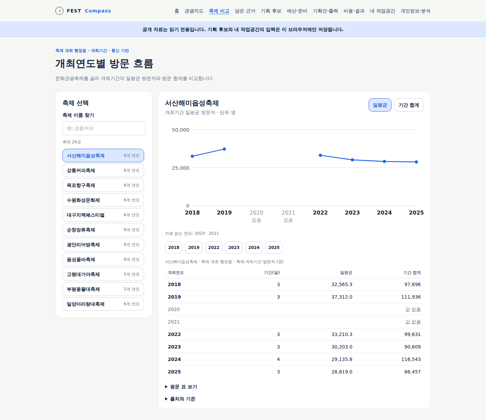
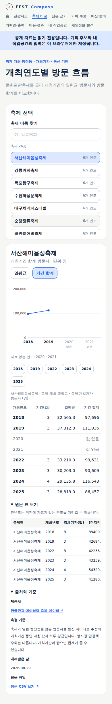

# 저장소 통합 보고

현재 제품명은 **pickDday**다. 아래는 FEST Compass라는 이름으로 진행한 통합 당시 기록이며,
후속 두 목적 흐름의 상태는 [기존 축제](../validation/34-existing-festival-journey.md)와
[새 축제·이름 변경](../validation/35-pickdday-new-festival.md) 검증 기록을 따른다.

## 결론

**pickDday의 정본은 `gitvssh/fest-compass` 하나다.** 팀 저장소 `travel-resolver/pick-d-day`에서
같은 축제 제품의 최신 문서·시안과 축제 자료만 골라 이 저장소로 옮겼다. 원본 저장소는 지우거나 옮기지 않았고,
다른 제품은 가져오지 않았다. 모노레포 전체를 이전한 작업이 아니다.

| 구분 | 상태 |
|---|---|
| 최신 문서·시안 62개 이관 | 이관·검수·게시 완료 |
| 데이터랩 원자료 CSV 304개·문서 5개 보존 | 이관 완료. 원본 바이트 일치 확인 |
| 새 연도별 방문 화면 `/compare/annual` | 사용 가능 — [검증 결과](#검증-결과) |
| 개최 일정·앱 내 이동·추가 CSV 연결 | 사용 가능 |
| v7 두 목적 전체 흐름 | 개발 필요 |

## 정본과 작업 위치

- 원격 정본: [gitvssh/fest-compass](https://github.com/gitvssh/fest-compass). 로컬 기준 체크아웃: WSL `~/dev/side/fest-compass`.
- 수정은 `~/dev/worktrees/fest-compass-<topic>`의 전용 브랜치에서 한다. 작업 공간 점유 선언과 병합 후 정리는
  [WSL 개발환경](wsl-development.md)을 따른다. 이번 통합 브랜치는 `feat/consolidate-tourism-planning`이다.
- 사람이 확인할 사본은 [검토 사본 전달](review-delivery.md)에 따라 Windows 검토 폴더로 복사하며 원본은 이 저장소에 둔다.

## 가져온 것

### 최신 문서·시안 62개

원본 커밋 [`f362e65`](https://github.com/travel-resolver/pick-d-day/tree/f362e65ba9e1cac18757951236484cff666c2696/developer/shlee/fest-compass)의
`developer/shlee/fest-compass/`에서 이 저장소의 직전 커밋과 다른 파일 62개(기존 파일 변경 32개·신규 30개)를 옮겼다.
대상은 `docs/` 55개, `.ai/` 3개, 루트 `AGENTS.md`·`README.md`·`traceboard.yaml`, `tools/` 1개다.
원본의 앱 코드·배포 선언(`infra/`)·CI(`.github/`)는 이 저장소 직전 커밋과 차이가 없어 이관 대상이 아니었다.

- 처음 옮긴 62개 파일은 원본 커밋과 바이트를 대조했다. 이후 독립 저장소에서 사용할 경로·현행 상태·색인과 검토 사본 내보내기를 의도적으로 수정했다:
  [검토 사본 전달](review-delivery.md), [기획 기준](../product/planning-principles.md), [데이터 현황](../research/2026-09-data-inventory.md),
  [현행 점검](../review/2026-09-current-state.md), [내보내기 도구](../../tools/export-review.py).
  데이터 원본과 달리 이 제품 문서들은 앞으로도 정본에서 갱신한다.
- 루트 [AGENTS](../../AGENTS.md)·[README](../../README.md)·
  [프로젝트 헌장](../../.ai/projects/fest-compass-evolution/CHARTER.md)은 원본과 다르게 이 저장소의 정본·배포 경계를 유지한다.
- 이 저장소에만 있던 개발 표준·Git 설정 7개는 보존했다.
- 프로젝트 진행 기록(`.ai/projects/fest-compass-evolution/`)은 원본의 revision 29→37 연속 기록을 옮겼다.
  이후 기록은 이 저장소에서만 이어 쓴다.

### 데이터랩 원자료

원본 `developer/hkjin/plan-03-datalab/`의 CSV 304개와 문서 5개를
[원본 보관 폴더](../research/imported/hkjin-plan-03/README.md)의 `original/`에 바이트 그대로 두었다.
[목록 파일](../research/imported/hkjin-plan-03/manifest.json)은 파일마다 크기·SHA-256·원본 Git blob ID·원본 URL·사용 구분을 기록한다.

- 이 문서 작업에서 309개 파일 전부를 목록과 대조했다. 누락 0, 크기·SHA-256 불일치 0이고,
  현재 파일의 Git blob ID가 목록 및 원본 커밋 `f362e65`의 트리와 309개 모두 일치했다.
- 공식 제공처는 [한국관광 데이터랩 축제 데이터](https://datalab.visitkorea.or.kr/datalab/portal/fes/getFesDataForm.do)다.
  이번 통합에서 새로 내려받거나 수집하지 않았다.
- 앱이 쓰는 것은 `연도별 방문자 추이` 26개(147행)뿐이다. 나머지 278개 CSV와 문서는 보존만 한다.
  데이터랩의 원본 작업 폴더 `work/`, 분석 설계 문서, `PROMPT-desktop.txt`는 가져오지 않았다.

## 가져오지 않은 것과 경계

- **다른 제품은 흡수하지 않았다.** 에움길·ROOTS·반려여행 등 같은 팀 저장소의 다른 제품은 이 저장소 범위가 아니다.
- **같은 축제 제품의 기능·축제 자료만 선별했다.** K-Festival Navigator 코드는 가져오지 않았고, 데이터 현황 문서의
  Navigator 설명은 원본 고정 커밋의 파일 링크로 바꿨다.
- **원본은 참고 사본으로 남는다.** `pick-d-day`의 `developer/shlee/fest-compass/`는 `f362e65` 시점의 참고 사본이다.
  코드와 기획 사본은 보존하고, 원본 저장소의 안내 문서 4개에 정본 위치를 알린다. 이후 제품 변경은 이 저장소에서만 한다.
- **저장소 밖 상대 링크 14개를 정리했다.** 가져온 데이터랩 문서·폴더를 가리키던 9개는 `imported/hkjin-plan-03/original/…`로,
  가져오지 않은 Navigator 코드 4개와 9월 13일 선택과 집중 회의 문서 1개는 원본 고정 커밋 URL로 바꿨다.
  원본 저장소의 `main` 등 움직이는 브랜치로는 연결하지 않는다.

## 자료를 읽는 기준

새 화면의 값은 **축제가 열린 행정동의 통신 기반 방문 추정**을 개최기간 동안 더한 값과 하루 평균이다.
기존 논산·공주·임실의 **시군구 일별 외지인 방문**과 다른 지표이고, 둘 다 행사장 입장객이 아니다.

- 26개 축제·147행, 개최연도 2018·2019·2022·2023·2024·2025. 2020·2021은 자료가 없다.
- 논산딸기축제는 26개 목록에 없다. 임실N치즈축제는 두 자료에 모두 있지만 지표가 다르다.
- `문화관광축제 주요 지표`의 축제×연도 154개 관측이나 상대지수를 연도별 추이에 섞지 않는다.

상세 단위·범위·화면 동작은 [데이터 현황](../research/2026-09-data-inventory.md#축제-개최기간-연도별-방문-추이-연결)에 있다.

## 연결한 기능

- `/compare/annual`: 축제 검색·선택, 일평균/기간 합계 전환, 개최일수·원문 수치 표·출처. 빠진 연도는 0으로 채우거나 선으로 잇지 않는다.
- `/regions`의 축제·행사: 조회한 기간 안의 월별 달력과 기존 지도·목록·상세가 같은 선택을 공유한다. 월을 넘길 때 조회 범위나 목록을 바꾸지 않는다. 주소로 조회 조건·월을 복원하고, 화면에서 돌아왔을 때 유효한 선택과 초점을 복원한다.
- 행사 CSV: 관광지도에서는 조회된 전체 행사, 비교에서는 적용한 조건의 목록을 내보낸다. 원래 일정·출처·조회 조건을 보존하고 일부 지역 조회 실패와 결과 없음은 구분한다. 수식 실행을 막고 빈 값을 0으로 바꾸지 않는다.
- 현재 메뉴: 실제 경로와 하위 화면에 따라 현재 위치를 표시한다. 공개 서버의 읽기 전용 경계는 유지한다.
- 담당자 조사: plan-04의 최근 실제 결정·근거·보고서·기획 시점을 묻는 방법을 [질문지](../research/festival-officer-interview.md)에 반영했다. 인터뷰를 수행한 결과는 아니다.

## 검증 결과

Claude Opus 5.5에 조사·구현·문서 정리를 위임하고 통합 담당이 코드·원자료·실제 화면을 직접 검수했다.
기존 Cursor 경로의 사용량 제한 뒤 같은 모델의 Claude CLI 경로를 사용했다. 다른 모델로 대체하지 않았다.

| 검증 | 결과 |
|---|---|
| Node 24.20.0, `npm test` | 239건 통과(228+11). 생성 자료와 원본 무결성 검증 포함 |
| `npm run typecheck`, `npm run build` | 통과. 레이아웃 보완 후 `test:e2e`의 제품 빌드도 통과 |
| `npm run test:e2e` | 16개 headless 브라우저 시나리오 스크립트 통과. 새 연도별 화면·일정/CSV와 기존 기획·예산·결과까지 확인 |
| 배포 계약 검사·인프라 단위 시험 | 17개 리소스 검사와 40개 시험 통과 |
| 운영 의존성 검사 | high 기준 취약점 0건 |
| 원본 보존 | 커밋된 CSV 304개·문서 5개의 Git blob이 원본과 309/309 일치 |
| 검토 사본 | 27개 HTML·14개 Mermaid·이미지 누락 0 확인. 390px 전체 페이지 넘침 0 |

연도별 화면의 모바일 가로 넘침을 발견해 원문 표의 접근성 텍스트가 자기 스크롤 영역 안에 있도록 고쳤다.
차트의 최소 너비와 키보드 스크롤도 보완했다. 재실행에서 페이지 너비 390px, 차트·원문 표의 내부 스크롤을 확인했다.
달력 검증에는 `검증용` 행사 응답을 사용했고, 연도별 화면은 실제 보관 CSV에서 나온 값을 대조했다.

| UI/UX 검수 범위 | 판정·근거 |
|---|---|
| 목표·흐름 | 충족 — 기록 없이 축제 선택·지표 전환·행사 선택·CSV 이용 |
| 시각적 위계 | 충족 — 선택·차트·수치 표·접는 출처 구분. 최종 시각 디자인은 후속 |
| 문구 경계 | 충족 — 신규 영역의 해시·수집 절차 설명 제거, 대상·기간·단위·출처 유지. 기존 화면 전체의 문구 개편은 v7 후속 |
| 상태·복구 | 충족 — 자료 없는 연도, 없는 축제, 행사 없음/실패, 늦은 응답, 부분 실패 CSV 검증 |
| 접근성·반응형 | 충족 — 390px, 키보드 선택·현재 메뉴·목록 초점 복원, 표·차트 내부 스크롤 |
| 출처·필요 고지 | 충족 — 기존 개인정보·지도 출처 유지, 데이터 제공처·원문 링크 확인 |

## 운영 반영

**사용 가능.** [연도별 방문 흐름](https://pickday.damecasol.com/compare/annual), [관광지도](https://pickday.damecasol.com/regions), [축제 비교](https://pickday.damecasol.com/compare)에 반영했다.

- 검증·이미지 게시: [GitHub Actions 35824313294](https://github.com/gitvssh/fest-compass/actions/runs/35824313294) 성공. 앱 커밋 `a889be5a803ff8c813448d42f1fe00c8291d087f`.
- 배포 선언: `05716b4efbb20eeec412c18730e725ec93c3bf64`. 이미지 `sha256:0f2e11eac39bde149f6ee09e3f4a42b666b6115a43daf778f5caae5e82920f88`를 원격 검증 뒤 고정했다.
- 등록 앱 `fest-compass-prod`: Synced·Healthy, Deployment generation 25/observed 25/ready 1. 기존 Deployment와 PVC의 UID 유지, SQLite 업무 데이터 9개 테이블의 행수·내용 해시가 배포 전후 같다.
- 공개 headless 확인: 실제 26개 축제, 서산 2018년 개최 3일·일평균 32,565.3·합계 97,696, 2020년 값 없음, 지표 선택 복원, 원문 링크, 390px 너비. 화면·API 응답을 시험 값으로 대체하지 않았다.
- 실제 논산 행사 조회: HTTP 200·조회 완료·5건. 행사 달력과 CSV 내려받기를 확인했다. CSV 검증용 데이터와 구분한다.
- 공개 브라우저 오류 0. Python 기본 요청의 Cloudflare 403은 기존 동작이며 정상 Chromium으로 공개 주소를 확인했다.
- CI는 저장소 전용 ARC `homelab-fest-compass`의 수동 `workflow_dispatch`를 유지한다. GitHub cache/artifact나 배포 트리거를 추가하지 않았다.
- [ADR-0001](../decisions/0001-public-readonly-sqlite-boundary.md)의 공개 읽기 전용·단일 SQLite 쓰기·RWO PVC 경계를 유지한다.
- `pick-d-day`의 안내 변경은 `6288436ea9e07bd8f5fa5188bb7d6c533dab0fe0`으로 게시했다. 다른 제품은 수정·이동·삭제하지 않았다.
- 확인용 문서와 화면은 `D:\download\project\fest-compass\index.html`에서 연다. 프로젝트 원본과 [검증 근거](../validation/evidence/2026-09-23-consolidation.json)는 이 저장소에 남긴다.

## 다음 작업

v7의 **기존 축제 개선·새 축제 기획 전체 여정은 개발 필요**다. 이번 통합과 기존 화면 보강을 28개 인수 기준 전체 완료로 보지 않는다.
공통 자료 연결을 바탕으로 기존 축제 여정부터 구현한다. 성·연령·목적지·소비·Foundry 상세 연결과 갱신은 후속이며,
뉴스 검색·원문 연결은 핵심 구현 뒤, AI 요약은 나중에 검토한다.

- [현행 기능·문서·데이터 점검](../review/2026-09-current-state.md)
- [데이터 확보·연결 현황](../research/2026-09-data-inventory.md)
