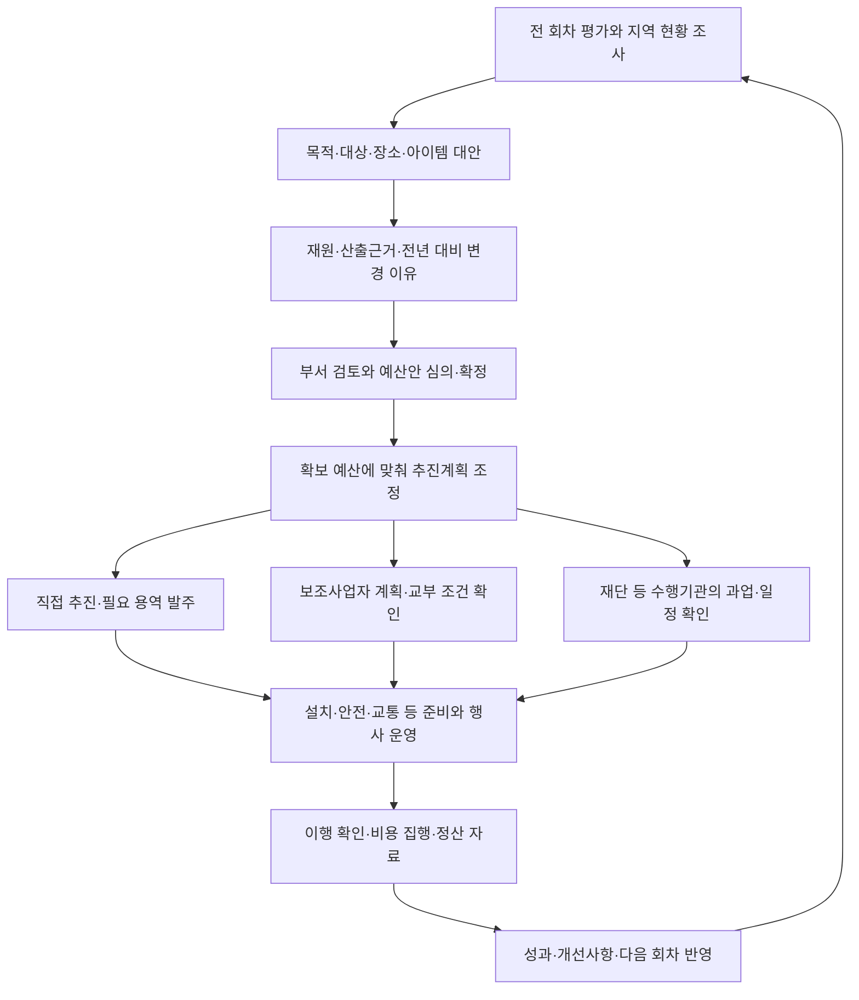

# 지자체 축제 준비·예산 업무 사례 조사

**현재 지도→사례 비교→기획안 방향은 유효하지만, 예산 요구를 설명하고 집행 결과를 다음 회차에 반영하는 업무가 더 구체적이어야 한다.**
공개자료에서 관찰한 핵심은 ‘얼마를 쓰는가’뿐 아니라 ‘왜 필요한가, 어느 재원으로 누가 수행하는가,
언제까지 무엇을 준비하는가, 집행 후 무엇을 개선하는가’였다.

이번 결과는 문헌 조사다. 공무원 인터뷰나 실제 업무시간 측정은 하지 않았다.
원문에서 확인한 사실, 개별 문서의 주장, 제품 보완 제안을 구분한다.
아래 사례의 금액을 올해의 표준단가나 적정 예산으로 추천하지 않는다.
[출처와 확인 범위](2026-09-municipal-festival-sources.md),
[요구사항·화면 보완안](2026-09-municipal-requirement-proposals.md)을 함께 읽는다.

## 조사 범위

선정 기준은 유명도보다 업무 문서의 설명력이다. 직접 추진, 재단 발주, 민간 보조,
다부서 협업과 정산 검토를 서로 다른 자료로 살폈다.
동일 축제 한 회차의 계획→의결→계약→최종 결산을 모두 확보한 조사는 아니다.
서로 다른 사례를 이어 만든 공통 흐름을 특정 축제의 실제 진행 이력으로 읽으면 안 된다.

| 핵심 사례 | 확인 문서·시점 | 확인하려는 업무 |
|---|---|---|
| 경기 광주시민의 날 연계 드론아트 공연 | 2025년 2회 추경 검토보고서·사업설명서 | 예산 요구, 산출근거, 유사 사례, 의회 검토 |
| 논산딸기축제 | 2025년 주 무대 설치·운영 용역 공고 | 재단의 과업 구체화, 발주 일정, 취소 시 정산 조건 |
| 원주 치악산복숭아 축제 | 2022년 지원사업 정산검사서 | 보조금·자부담별 계획/집행과 다음 회차 개선 |
| 제주시 익명 처리 축제·체험사업 | 2022~2023년 사업을 다룬 2025년 감사, 2026년 공개 | 비용·수량·수행 사실을 입증하는 자료의 필요성 |
| 중랑서울장미축제 | 2024년 12월의 2025년도 예산 심의 회의록 | 기간 연장에 따른 부서별 비용과 효과 설명 |

서대문구의 계절별 축제 계획, 춘천시의 원가회계 공표 항목, 행정안전부의 2027년도 예산편성 기준도 참고했다.
서대문 PDF는 검색 도구의 본문은 읽었으나 현재 직접 다운로드가 404여서 보조 근거로만 사용했다.

## 1. 예산안은 금액과 함께 사업의 필요성을 설명한다

경기 광주시의 2025년 8월 11일 추경 검토보고서에는 시민의 날과 연계할 드론 공연의
**요구액 120,000천원**이 제시된다. 사업설명서는 시비 100%, 직접 추진으로 적고,
드론 1,000대와 안전관리 등을 포함한 110,000천원, 무대·홍보 등 10,000천원으로 나눈다.
전년도·본예산·추경 요구액, 과거 확보액과 집행률, 사전절차, 장소, 추진 일정도 함께 제시한다.

전문위원은 짧은 단독 공연의 효과를 검토하고 다른 프로그램과의 연계를 제안한다.
붙임의 타 지역 비교도 공연 횟수·시간·드론 수·무대 포함 여부를 함께 표시한다.
따라서 단순한 타 지역 가격 평균보다 **사업 범위가 같은 사례와 필요성 설명**이 중요하다.
이 문서는 요구·검토 단계의 증거다. 1억 2천만원의 최종 의결·계약·집행 완료를 확인한 것은 아니다.
출처: [SRC-MUN-01, 본문 3~4쪽·붙임 6~9쪽](https://www.gjcouncil.go.kr/kr/bbs/download.do?bbs_id=budgetSettlement&uid=2EA438D99B8BF3573C3BB7E1C2C5013B).

**제품 해석:** 현재 기획안에 사업 목적·대상·지역적 필요성·전년 대비 변경 이유를 넣고,
비교표에 ‘전체 축제/부분 프로그램/용역’ 범위를 표시해야 한다. 비교 결과를 사업설명 자료에 재사용한다.

## 2. 기획을 발주 가능한 과업과 일정으로 바꾼다

논산문화관광재단의 2025년 2월 17일 공고에서 주 무대 설치·행사운영 용역의
**기초금액은 110,000,000원, 부가세 등 포함**이다. 전체 딸기축제 예산이 아니다.
무대·음향·조명·영상·연출 인력과 구조물 안전을 과업으로 적고,
사전규격심사→공고→제안서 접수→평가 일정을 제시한다.
행사는 3월 27~30일, 용역은 4월 4일까지여서 행사 기간과 계약 수행 기간도 다르다.

취소·변경 가능성과 취소 통보일까지의 객관적 지출 증빙에 따른 정산 조건이 있다.
축제 과업 문의와 계약 문의 담당도 나뉜다.
공고의 예규 날짜에 문서 작성 시점과 맞지 않는 표기가 있어 그 법령 인용은 현행 규칙으로 사용하지 않는다.
출처: [SRC-MUN-02, PDF 1~4쪽](https://www.nonsan.go.kr/cntf/html/sub05/0503.html?dlgt=N&file_id=184487&mode=D&no=2a5451006dff034d8a709772015d9b8d).

**제품 해석:** 장소·아이템을 선택하면 필요한 시설, 인력, 설치·철거 기간, 담당 조직,
견적·과업 근거와 변경 사유를 연결한다. 이 공고의 장비 사양·기간을 모든 축제의 기본값으로 복제하지 않는다.

## 3. 정산은 다음 축제의 예산 요구 근거가 된다

원주시가 공개한 치악산복숭아 축제 지원사업의 2022년 9월 30일 정산검사서는
보조금과 자부담을 나눠 수입·지출의 계획/집행을 보여준다.

| 원문 구분 | 계획 지출(원) | 집행 지출(원) |
|---|---:|---:|
| 보조금 | 30,000,000 | 30,000,000 |
| 자부담 | 5,000,000 | 5,118,200 |
| 합계 | 35,000,000 | 35,118,200 |

검사서는 홍보와 농가 참여, 출하 상품 품질관리의 개선 필요성을 적고,
다음 축제의 홍보예산 편성을 조치 방향으로 남긴다.
즉 ‘다 썼는가’와 ‘사업을 어떻게 개선할 것인가’를 함께 살핀다.
표의 잔액·이자 칸은 원문에서 ‘-’이므로 자동으로 숫자 0으로 바꾸지 않는다.
정산검사서에 첨부라고 적힌 세금계산서 등 개별 증빙 원문은 공개 첨부에서 확보하지 않았다.
출처: [SRC-MUN-03, 정산검사서 1쪽](https://www.wonju.go.kr/www/selectBbsNttView.do?bbsNo=117&key=2481&nttNo=408840&pageIndex=1&pageUnit=10&searchCnd=all).

**제품 해석:** 현재 결과 화면의 ‘실제 비용’ 한 칸은 부족하다.
재원별 계획·실제 비용과 지적사항→개선 조치→다음 회차 예산 항목을 연결해야 한다.
위 집행 증가분은 자부담 증가이며 보조금 초과 집행으로 표시하면 안 된다.

## 4. 금액 입력만으로 실제 수행을 확인할 수 없다

제주 감사위원회가 2026년 4월 공개한 2025년 특정감사에는 익명 처리된 축제의 정산 문제가 나온다.
2022년 사업에서 장비 임차 7,899천원의 계약 관련 서류, 실제 임차 수량·현장 확인이 충분하지 않았고,
홍보·티셔츠 제작 수량 및 참여 실적을 뒷받침할 자료도 지적됐다.
2023년 체험사업에는 장비 보유 여부와 비교견적 진위 확인 문제가 있었다.
공개된 익명 명칭을 실제 축제명으로 역추정하지 않았다.
출처: [SRC-MUN-04, 인쇄 19~25쪽](https://audit.jeju.go.kr/news/activity/result.htm?act=view&seq=40368).

**제품 해석:** 예산 항목에는 단가뿐 아니라 규격·수량·사용 기간·견적 출처가 필요하고,
결과에는 이행 확인 자료의 종류와 확인 상태가 필요하다.
‘파일 있음’과 ‘내용 확인 완료’를 구분해야 한다. 제품이 계약 적정성이나 정산 승인을 자동 판정하지 않는다.

## 5. 하루 연장의 비용은 여러 부서에 걸친다

중랑구의회 2024년 12월 13일 회의에서는 장미축제의 다음 해 메인 행사 하루 연장에 대해 질의했다.
의원은 문화재단의 행사운영비 **1억 7,900만원 증액** 외에 행사장 관리·판매장터·청소 등
다른 부서도 합친 **약 2억 5,700만원 증액**을 언급했고 재단은 구 전체 증가 규모에 답변했다.
기간을 늘릴 이유, 주민 의견, 안전관리 비용, 축제의 내실을 함께 논의했다.

이는 회의 발언에 나온 예산안 수치다. 확정 결산액이 아니고,
회의에서 언급한 방문객·경제효과도 측정 원자료를 확인하지 않아 검증된 성과로 사용하지 않는다.
출처: [SRC-MUN-05, 문화재단 예산 질의 중 이은경 위원·문화경영본부장 답변](https://council.jungnang.go.kr/viewer/minutes.do?uid=6579).

**제품 해석:** 예산 비교에는 담당 부서·재원·포함 범위를 붙이고,
일정·규모 변경 시 관련 항목을 재검토하도록 해야 한다.
재단 예산에 다른 부서 사업비가 포함됐는지 모르면 임의로 합산하지 않는다.

## 지도와 관광자료를 어디에 쓰는가

서대문구의 2024년 업무계획은 안산·홍제천의 봄빛축제, 형무소역사관·독립공원의 독립축제,
대학이 모인 신촌의 대학문화축제를 장소·계절·프로그램과 연결한다.
독립축제 준비도 위원회 회의, 프로그램 기획, 종합계획·협조 점검, 개최·평가로 나뉜다.
이 자료는 지역 자원에서 아이템을 도출하는 사례로 참고한다.
다운로드 재확인이 실패한 자료이므로 일정·금액의 현재 운영 근거로 쓰지 않는다.
출처: [SRC-MUN-06, 인쇄 175~177쪽](https://www.sdmcouncil.go.kr/CLRecords/Files/FileAppendix/a9/A011350.pdf).

이를 FEST Compass에 적용하면 아래 연결이 필요하다. 다음은 자료를 종합한 **제품 설계 제안**이다.

| 담당자의 결정 | 지도·공공자료의 역할 | 추가로 확인할 현장 조건 |
|---|---|---|
| 어떤 아이템인가 | 지역 자원·계절·기존 축제·주민과 관광객 대상의 근거 | 참여 기관·상인·주민 의견, 실제 운영 주체 |
| 어디서 여는가 | 후보지와 주변 관광·교통 자원을 함께 보기 | 장소 사용 가능, 전력·화장실·접근성, 설치·철거 조건 |
| 언제·얼마나 여는가 | 과거 방문 추세, 주변 행사 일정과 중복 | 대관 일정·준비 소요일·계절 조건, 일정 연장 비용 |
| 어느 규모로 준비하는가 | 범위가 같은 사례의 시설·프로그램·비용 참조 | 견적·안전·청소·교통 등 관련 담당자의 확인 |
| 무엇을 성과로 볼 것인가 | 기획 시점의 지역 추세·참고 회차를 기준선으로 보관 | 현장 측정 방법, 주민 편익·상권·참여 결과의 증거 |

지역 일별 외지인 수는 지역 수요의 참고 자료다. 특정 행사장 수용 인원이나 축제 유발 순증으로 환산하지 않는다.

## 공개자료를 종합한 업무 흐름

조직마다 문서명·결재선·순서가 다르며, 아래는 관찰 자료에서 재구성한 업무 모형이다.
계약·보조·출연을 모두 거쳐야 하는 단일 절차가 아니다.

| 시점·담당 역할 | 작성·확인할 자료 | FEST Compass의 지원 범위 |
|---|---|---|
| 예산 요구 전, 사업 담당 | 필요성·자원 조사, 대안, 전년 평가, 재원·산출근거 | 근거 수집·대안 비교·사업설명용 자료 |
| 예산 검토, 사업·예산 부서와 의회 | 요구/조정/확정 금액, 변경 이유, 사전절차 해당 여부 | 외부 검토 상태와 원문 참조 기록 |
| 추진 준비, 사업 담당·수행기관·협조 부서 | 과업·일정·견적·장소 조건·담당·산출물 | 준비 항목과 기한, 미확인 사항 표시 |
| 계약 수행·보조사업 진행, 해당 계약/보조 담당 | 계약·교부 조건, 변경, 이행·지출 근거 | 요약 기록과 근거 문서 참조 |
| 종료 후, 사업 담당·정산 검토자 | 계획 대비 집행, 재원별 정산, 실적·증빙·조치 | 비용·성과 비교와 다음 회차 재사용 |

공식 결재·예산 편성 확정·입찰·송금·정산 승인은 기관의 별도 업무다.
제품이 이를 실행하거나 대체하는 범위는 제안하지 않는다.

## 예산 화면에서 반드시 분리할 의미

행안부의 2027년도 세부사업설명서 서식은 회계연도·회계·조직·사업 체계,
목적·규모·지원 형태·재원 조건·위치·시행 주체·추진근거·사전절차·산출근거를 포함한다.
또한 2027년도 개정 안내에는 임시·일회성 행사 시설물 비용의 통계목 통합이 있다.
따라서 예산 과목은 명칭 하나로 영구 고정할 수 없다.
출처: [SRC-MUN-08, 인쇄 21쪽·147~148쪽](https://www.mois.go.kr/frt/bbs/type001/commonSelectBoardArticle.do?bbsId=BBSMSTR_000000000016&nttId=129229).

| 구분 | 화면에 필요한 정보 | 혼동하면 생기는 문제 |
|---|---|---|
| 회계연도·적용 기준 | 행사 연도, 예산 연도, 기준 문서 버전 | 작년 과목을 올해에 그대로 적용 |
| 금액의 단계 | 요구액, 확정 예산, 계약액, 집행액, 정산 확인액 | 요구액을 이미 쓸 수 있는 돈으로 표시 |
| 재원과 비용 | 시군구비·국도비·자부담 등 / 실제 지출 항목 | 보조금과 총사업비를 중복 합산 |
| 사업 범위 | 전체 축제, 부분 프로그램, 용역, 타 부서 연계사업 | 일부 무대비를 전체 행사비로 비교 |
| 증액의 이유 | 수량·단가·기간·범위 변경과 설명 | 총액만 늘고 무엇이 달라졌는지 알 수 없음 |
| 공개 원가와 직접 지출 | 원가 공시인지, 사업비 정산인지 | 공시 수치를 계약·지급액으로 취급 |

춘천시는 행사·축제 공표 항목에 예산액·집행액, 인건비·행사비·홍보비·시설장비비·감가상각비 등과
효과를 명시한다. 공공 비교 자료의 후보이지만, 이번에는 목록·공표 항목을 확인한 단계이며
각 축제 수치의 수집·연도 간 정합 검증까지 완료한 것은 아니다.
출처: [SRC-MUN-07, 공표세부내용 및 2024회계연도 첨부 목록](https://www.chuncheon.go.kr/cityhall/information-disclosure/advance-info-disclosure/cliassification-by-field/?bbsId=BBSMSTR_000000000235&flag=view&nttId=193340).

## 이번 조사로 결정할 수 있는 것과 남은 확인

기존 기획에 **예산 단계·재원·범위, 사업 필요성과 증감 이유, 준비 담당·기한, 정산 후 개선 연결**을
추가할 근거는 확보했다. 구체적인 화면 변경은 [8개 보완안](2026-09-municipal-requirement-proposals.md)에 제시한다.
새로운 기능을 개발 완료나 사용자 승인 완료로 처리하지 않았다.

남은 확인은 실제 담당자의 문서 작성 순서·반복 입력·최종 제출 서식, 개별 사업의 의결·계약·지급 연결,
기관별 사전절차 적용 판단이다. 투자심사·보조·안전·계약의 금액 문턱이나 법정기한을
이번 사례에서 일반 규칙으로 추출하지 않는다. 해당 연도·기관 기준을 별도로 확인해야 한다.
현재 목표인 지도 기반 기획 MVP를 유지하고, 회계·계약 시스템 연동은 후속 범위로 둔다.
