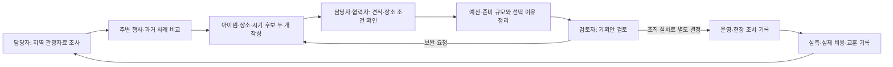

# 지자체 축제 기획 업무 흐름

시작은 올해 행사 방향과 예산을 검토해야 하는 시점이다. 종료는 선택 근거가 남은 기획안과
다음 회차에 재사용할 결과를 보관하는 시점이다. 실제 부서별 결재·계약 절차를 제품이 대신하지 않는다.
이 흐름은 초기 기획의 D-90~D+14 여정을 확장한 업무 가설이며 현장 관찰은 미실시다.

2026-09-08 [공개 사례 조사](../../research/2026-09-municipal-festival-cases.md)에서
예산 요구·심의, 수행 방식별 준비, 재원별 정산을 확인했다.
[보완안](../../research/2026-09-municipal-requirement-proposals.md)의 8개 방향을 아래 v2 업무·자료·화면에 반영했다.
사례별 준비 기간을 공통 D-90 일정으로 고정하지 않으며, 실제 담당자 업무 관찰은 여전히 미실시다.

| 업무 단계 | 입력 | 남길 결과 | 자료 부족·반려 때 |
|---|---|---|---|
| 지역 이해 | 자원·방문 추세·기존 행사 | 출처와 조회 조건이 있는 기획 근거 | 부족한 지역·기간을 표시하고 가정으로 분리 |
| 비교 조사 | 주변 행사·과거 회차·지역 제약 | 참고·제외 사례, 일정 중복 | 정의가 다른 성과·비용은 비교 보류 |
| 기획 대안 | 주제·아이템·대상·장소·기간 | 두 후보와 근거 연결 | 장소·수요 확인 항목을 남기고 추가 조사 |
| 준비·예산 | 견적·수량·단가·시설 조건 | 확인 합계·미산정·한도 비교 | 부족 항목 입력 또는 후보 수정 |
| 검토·보관 | 후보·선택 이유·근거·비용 | 기획안 보관본·출력 | 보관본을 바꾸지 않고 새 초안 생성 |
| 운영·평가 | 현장 조치·실측·실제 비용 | 계획 대비 결과와 다음 회차 교훈 | 지표가 다르면 계산을 보류하고 사유 보관 |

도입 후 실제 결재시간 단축·비용 절감·흥행 개선은 아직 검증되지 않았다.
[화면 흐름](../2-design/flows.md)은 이 업무 중 제품이 지원하는 행동을 구체화한다.

## 수행 관계별 실제 업무와 제품 지원

공개 문서에서 확인한 단계들을 연결한 업무 설계다. 한 축제의 전 과정을 모두 관찰한 기록은 아니다.
참고: [사례와 확인 범위](../../research/2026-09-municipal-festival-cases.md).

| 업무 | 담당자가 확인할 내용 | FEST Compass에서 남길 자료 | 외부 조직에서 수행할 일 |
|---|---|---|---|
| 사전 조사 | 내 지역 자원·방문 추세, 유사 회차·일정, 전회차 개선점 | 지도 근거·비교 조건·장소 확인 과제 | 장소 관리기관·협력 부서 협의 |
| 사업 구상 | 연도·부서·목적·신규/계속, 수행기관과 업무 범위 | 사업 정보와 두 후보의 아이템/장소/설치·행사·철거 일정 | 사업 추진 방식 결정 |
| 예산 요구·심의 대응 | 재원 상태, 수량/단가 근거, 전년 대비 증감·타 부서 포함 범위 | 요구 단계 산출과 사업설명 자료, 미확인 목록 | 예산안 작성 시스템 입력·심의·편성 |
| 시행 준비 | 대상 여부, 선행 절차, 과업 범위·견적·안전/교통·장소 조건 | 담당·기한·의존·필요 자료·외부 확인 기록 | 해당 기관 기준 검토·결재·협의 |
| 용역 등이 있는 경우 | 과업 기간과 행사 기간, 부분 업무 범위, 계약 자료 | 입찰 기초/계약 금액 참조와 준비 현황 | 공고·평가·계약 체결 |
| 운영·집행 | 현장 조치, 완료 확인, 재원별 실제 사용 | 지급 자료의 범위·참조·확인 상태와 성과 | 검수·지급·기관 회계 처리 |
| 보조사업 등이 있는 경우 | 보조금/자부담·실사용·잔액/이자/반납·증빙 | 결과 버전과 재원별 내역·검토 필요 사항 | 정산 제출·검토·반납 결정 |
| 다음 회차 | 성과 정의, 문제 원인, 개선 과제·추가 비용 근거 | 결과/개선 자료와 새 초안의 확인 과제 | 차기 사업·예산 의사결정 |

재단 수행, 용역, 보조는 서로 배타적인 행사 유형이 아니다. 하나의 사업에 해당 관계와 부분 업무가 함께 있을 수 있다.
모든 축제에 공통으로 투자심사·의회 절차·공고 기한을 강제하지 않는다. 적용 연도·기관·사업 조건의 확인 과제를 남긴다.
MVP의 자료 참조·확인 상태는 조직의 공식 승인이나 회계 시스템 상태를 대신하지 않는다.

## 첫 사용에서 요청할 정보

지역·조회 기간만 선택해 탐색을 시작한다. 근거를 담은 후 올해 기획을 만들 때 사업연도·목적과 두 후보를 입력한다.
부서·수행 관계·장소 세부 조건은 접을 수 있는 사업 정보/준비 항목에서 보완한다.
예산은 재원→지출 산출→이전 안 대비 변경→확인 과제 순서로 검토한다. 미확인 항목이 있어도 초안은 저장하며 누락을 숨기지 않는다.
기획안 보관은 두 후보와 이유가 있을 때 가능하고, 공식 예산 확정·외부 검토 완료를 보관의 선행 조건으로 삼지 않는다.
