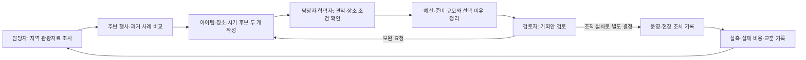

# 지자체 축제 기획 업무 흐름

시작은 올해 행사 방향과 예산을 검토해야 하는 시점이다. 종료는 선택 근거가 남은 기획안과
다음 회차에 재사용할 결과를 보관하는 시점이다. 실제 부서별 결재·계약 절차를 제품이 대신하지 않는다.
이 흐름은 초기 기획의 D-90~D+14 여정을 확장한 업무 가설이며 현장 관찰은 미실시다.

| 업무 단계 | 입력 | 남길 결과 | 자료 부족·반려 때 |
|---|---|---|---|
| 지역 이해 | 자원·방문 추세·기존 행사 | 출처와 조회 조건이 있는 기획 근거 | 부족한 지역·기간을 표시하고 가정으로 분리 |
| 비교 조사 | 주변 행사·과거 회차·지역 제약 | 참고·제외 사례, 일정 중복 | 정의가 다른 성과·비용은 비교 보류 |
| 기획 대안 | 주제·아이템·대상·장소·기간 | 두 후보와 근거 연결 | 장소·수요 확인 항목을 남기고 추가 조사 |
| 준비·예산 | 견적·수량·단가·시설 조건 | 확인 합계·미산정·한도 비교 | 부족 항목 입력 또는 후보 수정 |
| 검토·보관 | 후보·선택 이유·근거·비용 | 기획안 보관본·출력 | 보관본을 바꾸지 않고 새 초안 생성 |
| 운영·평가 | 현장 조치·실측·실제 비용 | 계획 대비 결과와 다음 회차 교훈 | 지표가 다르면 계산을 보류하고 사유 보관 |

도입 후 실제 결재시간 단축·비용 절감·흥행 개선은 아직 검증되지 않았다.
[화면 흐름](../2-design/flows.md)은 이 업무 중 제품이 지원하는 행동을 구체화한다.
