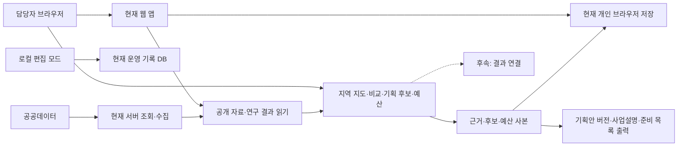

# 기획 기능의 연결과 저장 경계

## 근거

현재 구성은 apps/web/app, apps/web/lib/workspace.ts, apps/web/lib/kto,
apps/web/prisma/schema.prisma와 기존 [운영 경계 결정](../../decisions/0001-public-readonly-sqlite-boundary.md)에 근거한다.
신규 객체와 화면은 [자료 정의](../1-analysis/data-contract.md)·[화면설계](screens.md)의 제안이다.
M1~M6는 기존 공개 읽기 전용·개인 브라우저 저장 경계에 연결했다. 운영 DB·수집기·모델 구조는 유지한다. [M3 저장 계약](planning-options-implementation.md)과 [M4 파일 v2 호환 계약](budget-implementation.md)을 따른다.

## 현재 구성과 연결 제안

실선은 현재 구성, 점선은 연결 개발이 필요한 제안이다.
공공 자료를 읽는 경로와 개인 기획안을 저장하는 경로를 구분한다.
지도 공급자의 타일·경계·좌표 계약과 캐시 구현은 실제 이용 조건 확인 후 정한다.

## 지켜야 할 계약

- 개인 기록은 서버·분석 이벤트로 자동 전송하지 않는다. 공동 저장·인증·공식 승인은 후속 결정이다.
- API 키는 기존 서버 경계에서만 사용하며 지도 브라우저 설정이 필요하면 제공처의 공개용 자격 정책을 확인한다.
- 신규 근거·후보·예산·회차 객체를 기존 파일 형식에 추가할 때 버전과 참조 검증을 먼저 정의한다.
- 보관본은 당시 값의 사본이다. 원천 자료 갱신이나 초안 삭제가 보관본을 바꾸지 못한다.
- 지역/기간 요청 버전을 공유하고 이전 요청 결과가 최신 선택을 덮지 않도록 한다.
- 목록 탐색을 지도 실패의 대체 경로로 둔다. 지역 자료 미수집을 다른 지역 데이터로 대체하지 않는다.

## 구현 전에 확정할 것

지도 공급자·행정경계·지역 코드 매핑과 자료 가용성, 신규 파일 형식의 용량·이전 버전 복원 정책,
조회 캐시와 공급 한도는 M1 착수 단계의 확인 항목이다.
새 REST API나 DB 마이그레이션이 필요하다고 미리 가정하지 않는다. 실제 구현 경로가 정해지면
유스케이스와 실행 계약·시험을 연결한다.

## v2 연결 범위

BusinessContext·DeliveryRelation·FundingPlan·AmountRecord·ReadinessTask·OutcomeRevision은 개인 기획 저장 경계 안의 신규 설계다.
M3 사업·준비와 M4 재원·지출·원문 기록은 구현했다. 기획 v1을 읽고 v2로 저장하되 불변 보관본은 변경하지 않는 경로를 검증했다. OutcomeRevision은 후속이다.
금액의 단계·대상 범위와 불변 버전 참조를 분리하고 준비 과제 의존 순환을 검사한다.
외부 증빙은 공개 링크 또는 사용자 문서 식별 메모로 참조한다. 원본 파일 보관·기관 시스템 연결을 새로 추가하지 않는다.
결과 출력은 기획 사본과 결과 사본 쌍을 사용해 이후 수정과 분리한다.

M5는 [v3 개인 파일 계약](proposal-implementation.md)을 사용한다. 출력은 선택한 불변 보관본만 읽고 최신 API를 재조회하지 않는다. 기존 운영 DB·예측 기록은 변경하지 않는다.

## M6 결과와 기획의 연결

`/planning/outcomes`와 기획 탭은 같은 개인 파일 v4를 사용한다. 결과 저장·검증·불변 보관·파일 병합은 `lib/planning/outcome-*`와 기존 저장의 잠금/충돌 검사를 따른다.
공개 비용은 기존 회차 원문 표본을 읽고 내 행사 결과는 개인 파일에서 읽는다. 서버 쓰기·기관 원장 연동 없이 출처를 구분한다.
출력은 고정 P/R 사본과 당시 근거만 읽는다. [상세 계약](outcome-implementation.md)을 따른다. 기존 `/workspace` 파일과 자동 병합하지 않는다.
