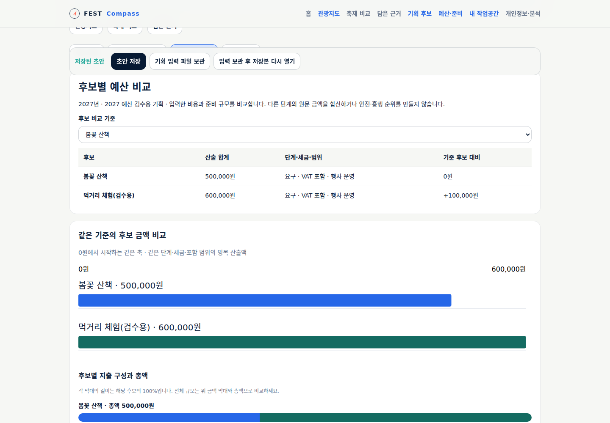
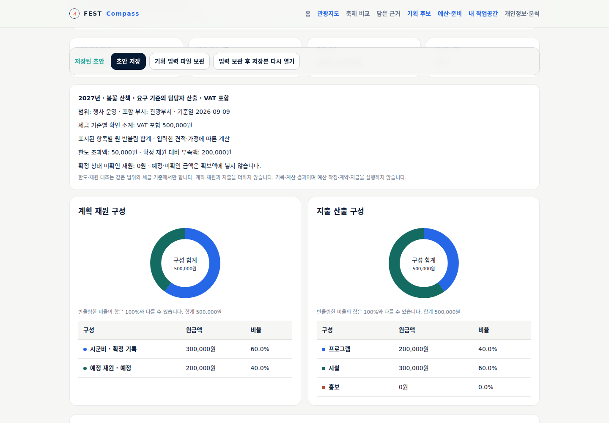
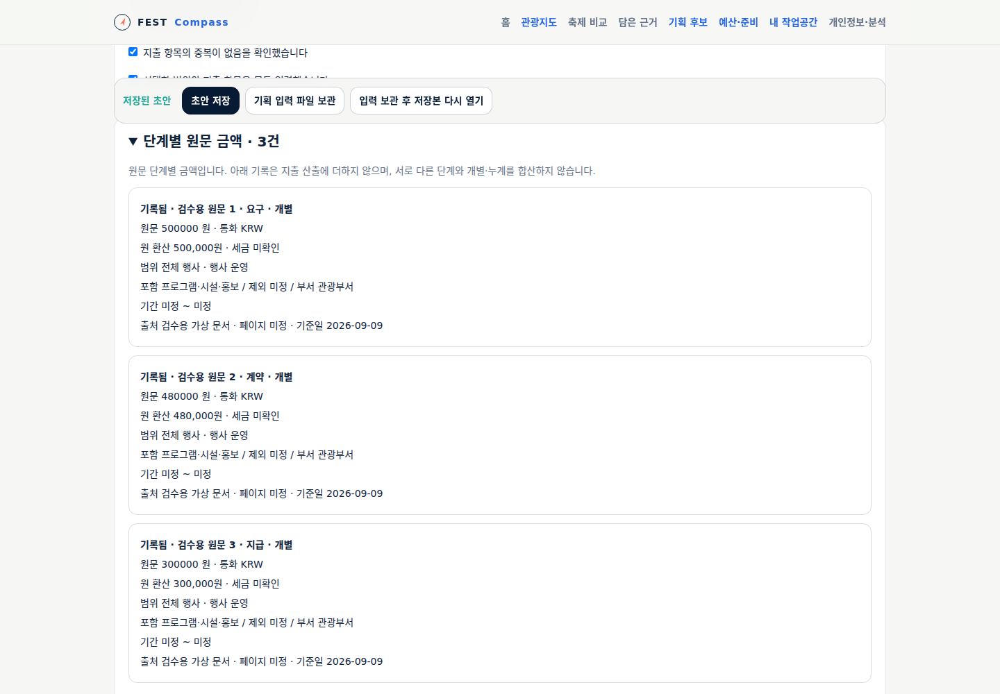
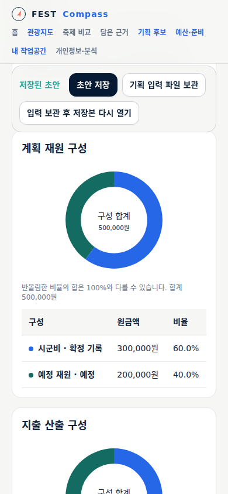

# 후보별 예산과 준비 규모

SCR-FC-005와 FR-BGT-1~3, UC-FC-005의 첫 구현이다. 기존 기획의 후보·자료·보관본을 함께 사용한다.
기획 후보의 **예산·준비 규모** 탭과 `/planning/budget`에서 같은 초안을 연다.
이 문서의 금액·기관·분류·장소는 검수용 입력이며 실제 예산안이나 확인 결과가 아니다.

## 사용할 흐름

1. 기획 후보에 지도·축제 비교 자료와 준비 과제를 연결한다.
2. 예산을 작성할 후보를 선택하고 비용 단계·전체/부분 범위·포함 항목·부서·한도를 입력한다.
3. 재원에는 제공 주체·전달 관계·식별 메모·계획액과 확정/예정/미확인을 따로 기록한다.
4. 지출에는 규격·수량·단위·단가·포함 기간·세금·견적/가정을 입력한다. 항목에 보관 자료·준비 과제를 연결한다.
5. 전체 항목·중복·범위를 확인한 뒤 재원/지출 구성과 후보 금액을 비교한다. 미산정·비교 보류 이유를 확인한다.
6. 예산을 기획 보관본으로 남기고 이전 보관본을 기준으로 변경 이유를 기록한다.

상단은 후보별 수치 표와 비교 가능한 금액 막대, 선택 후보의 기준·요약·재원/지출 도넛이다.
상세 재원·지출·단계별 원문·기준 버전은 펼쳐서 확인한다. 작은 화면의 넓은 표는 표 내부에서 이동한다.

## 금액을 잘못 합치지 않는 기준

| 입력과 상황 | 화면과 계산 |
|---|---|
| 프로그램 2회×100000원 | 200000원 |
| 시설 1식×300000원, 2일 포함 | 300000원. 기간을 다시 곱하지 않음 |
| 임차 3대×2일×50000원/대·일 | 300000원. 기간당 단가 여부 미확인이면 미산정 |
| 수량 1.5×1001원 | 항목 마지막에서 한 번 반올림한 1502원 |
| 미입력 단가와 0원 | 각각 미산정과 명시적 0원. 미산정은 완전 총액에 넣지 않음 |
| VAT 포함/별도/면세/미확인 혼재 | 기준별 소계. 근거 없는 세율을 자동 적용하지 않고 총액 비교를 보류 |
| 별도 세금액 직접 입력 | VAT 별도 항목에 근거를 적고 합한 뒤 한 번 반올림. 적용 세율 자동 추정 없음 |
| 확인 지출 소계 500000원·미산정 1건·한도 450000원 | 같은 기준이면 최소 초과액 50000원. 전체 초과액 확정은 아님 |
| 확정 재원 300000원·예정 200000원 | 확보 기록은 300000원. 계획 재원과 지출을 더하지 않음 |
| 위 재원과 지출 소계 500000원·미산정 1건 | 같은 범위·세금일 때 최소 부족액 200000원. 나머지 비용은 미확정 |
| 요구 500000원·계약 480000원·지급 300000원 | 각각 원문 기록. 단계 사이 자동 합산·복제·덮어쓰기 없음 |

숫자는 음수·쉼표·지수 없이 소수 6자리까지 입력한다. 정수 연산으로 항목별 원 반올림 후 합산한다.
개별 값·환산·합계가 안전한 정수 범위를 넘으면 계산이나 저장을 보류한다. 오류 입력을 자동으로 0으로 바꾸지 않는다.
지출 전체·중복·부서 범위가 미확인이면 완전 총액을 제공하지 않는다. 동일 지출 행과 같은 재원 식별 메모의 중복도 안내한다.
상위 총액과 하위 분담액은 한 수준만 선택한다. 여러 단계 아래 분담액의 합계도 알려진 상위 금액과 대조한다.

## 시각자료와 비교 조건

- 재원 도넛은 **계획 재원 구성**이며 예정·미확인 상태를 함께 표시한다. 확보액은 별도다.
- 지출 도넛은 미산정 없이 범위·세금·중복을 확인한 양수 총액에서만 제공한다.
- 전체 분모 미확인·중복·금액 미입력·총액 0은 구성비를 보류하고 원금액을 표에 남긴다.
- 후보 금액은 같은 단계·세금·범위 이름·포함/제외 항목·부서에서만 0축 막대로 비교한다.
  비교 가능한 후보가 둘 이상이면 그 후보만 그리며 나머지 후보의 보류 이유는 표에 남긴다.
- 후보별 구성비 막대에는 각각의 총액과 항목 금액을 병기한다. 비율만으로 큰 예산과 작은 예산을 같게 보이지 않게 한다.
- 이전 보관본과 현재의 명목 차액을 표시하고 수량·단가·기간·범위·관련 부서 변경 이유를 기록한다.
  다른 정의의 금액을 순위화하거나 물가·효율·안전 효과를 자동 추론하지 않는다.

## 원문과 재확인

원문 기록에는 개별/누계·포함 기록, 금액 단계, 원문 표기·단위·통화·세금·기간·범위·출처·페이지·기준일을 남긴다.
원/천원·KRW가 확인된 숫자만 환산한다. '-', 빈칸·미공개·단위 미확인은 원문과 이유를 보존한다.
작성 중인 원문 입력도 초안·파일에 들어가며 ‘기록됨’과 구분한다. 기록으로 추가하려면 이름·출처·기준일과 필요한 결측 이유가 있어야 한다.
추가한 기록은 읽기 전용이며 정정은 새 기록으로 남긴다. 외부 기관의 실제 계약·지급은 실행하지 않는다.

원문 분류에는 적용 회계연도·지침명/버전/출처·분류명/코드·확인일을 남긴다. 사업연도와 다르면 재확인 대상으로 표시한다.
장소·시기·아이템·대상·사업연도·담당 지역/부서가 바뀌면 예산·재원의 현재 적용을 보류한다.
현재 조건으로 다시 검토할 때 직전 기획을 보관하고 재원 확정·분류·전체/중복 범위 확인을 초기화한다.
원문 분류명·과거 적용 연도와 금액 기록의 원래 조건은 유지한다. 후보 복사도 확인 상태·단계 기록·기준 버전 선택을 새 초안으로 초기화한다.
준비 과제 연결은 담당·기한·현재 재확인 여부를 보여주며 완료·외부 확인을 자동 처리하지 않는다.

## 저장과 호환

기존 개인 저장 키 `fest-compass.planning.v1`을 유지하고 기획 파일 형식은 **v2**로 구분한다.
기존 M3 v1 파일을 읽을 수 있고 저장 시 루트 형식만 v2로 바꾸며 이미 보관한 기획 사본은 수정하지 않는다.
구버전 앱은 v2 저장값을 읽지 못하므로 새 예산 필드를 모르는 구버전 쓰기가 중단된다.
기존 다른 창 충돌·공간 부족·손상 파일 방어와 최대 20개 보관본·5MB 제한을 그대로 사용한다.
후보별 지출 최대 100개·재원 40개·단계별 원문 100개를 관리한다. 공동 저장·공식 승인 기능은 아니다.

## 실제 구현 화면

2026-09-09 로컬 운영 빌드를 headless로 확인했다. 1440px 데스크톱과 390px 모바일 화면이다.
아래 후보·금액·기관·분류·원문 기록은 검수용 가상 입력이다. 연결한 논산 방문 근거는 실제 보관 자료다.

## 검수 과제와 남은 기능

검수용 40만원 안을 보관한 뒤 프로그램 수량을 1회 늘려 50만원이 되는지 확인한다.
미산정 홍보를 0원으로 바꿨다 되돌리고, 부서 범위 미확인·재원 중복·VAT 미확인에서 차트가 보류되는지 확인한다.
후보를 복사해 다른 규모를 비교하고 과거 분류·금액·근거가 보관본에서 유지되는지 확인한다.
[검증 기록](../../validation/23-planning-budget.md)에서 단위·브라우저 결과를 확인한다.

다음은 M5 완성 기획안·사업설명/준비 목록 출력과 M6 결과·다음 회차 연결이다.
지도 품질·전국 과거 자료 완비·실무자 관찰·정형 OpenAPI/Spec/Run 연결은 이번 완료에 포함하지 않는다.
