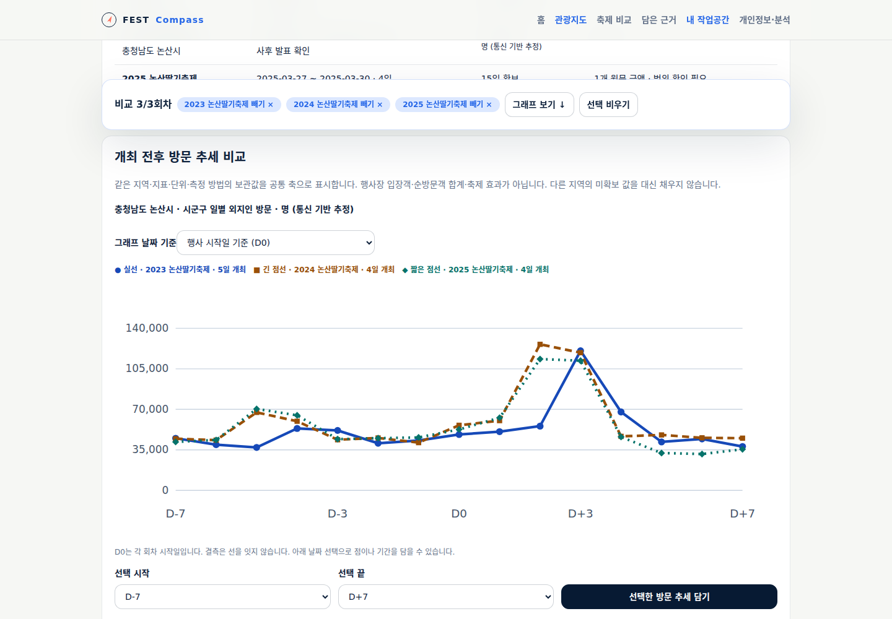
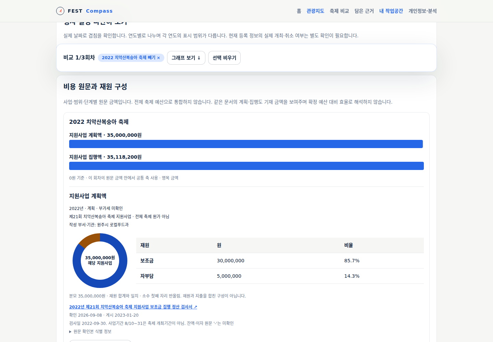
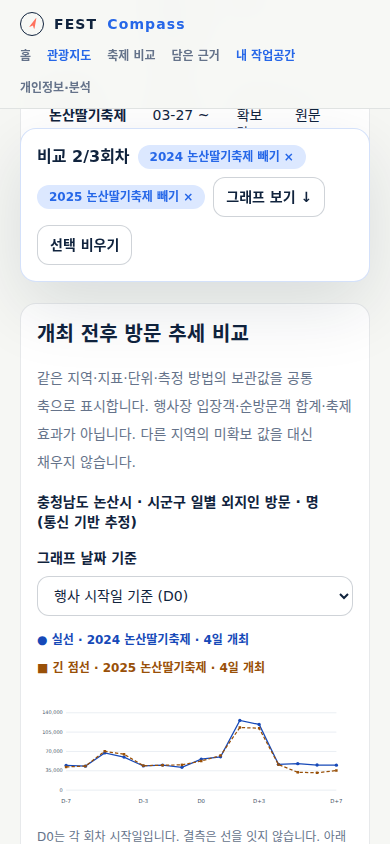

# 주변·과거 축제 비교의 첫 구현

`/compare`에 SCR-FC-002의 첫 기능을 추가했다. 지역 지도에서 선택한 지역·기간을 전달하고,
현재 등록 행사와 독립적으로 보관한 과거 회차를 찾는다. `/evidence#comparisons`에서 당시 비교를 다시 읽고 파일로 보관한다.
앱의 지도 경로·선택창·지도 제목·접근성 이름·검색 설명은 사용자 요청대로 **전국**으로 통일했다.
지도 품질 보완은 별도 후속이며 이번은 M2 비교 흐름 구현이다.

## 사용할 수 있는 행동

1. 과거 회차를 지역·겹치는 기간·이름·주제로 찾는다. 개최일이 없으면 사업연도 조건으로 남긴다.
2. 현재 등록 행사는 직접 선택한 지역 1~3곳과 시작일 기간으로 조회한다. 지역별 전체 페이지·건수·조회 시각과 실패를 표시한다.
3. 최대 3회차를 골라 자료 확보 현황, 실제 일정 겹침, 방문 추세, 비용 원문과 재원 구성을 확인한다.
4. 방문 그래프의 실제 날짜/D0 기준을 바꾸고 키보드 선택창으로 점·기간을 선택한다. 선택 범위의 원값·날짜·출처를 표에서 확인한다.
5. 회차 전체·선택 방문 범위·비용 항목을 참고 이유와 함께 담는다. 필터·현재 자료가 바뀌어도 선택·보관 사본은 유지한다.
6. 담은 비교에서 그래프·표·출처·당시 검색 조건을 다시 확인하고 파일 보관/가져오기를 수행한다. 같은 근거는 중복 보관하지 않고 손상 파일은 기존 자료를 유지한다.

브라우저 개인 저장이다. 지역 자료 파일과 비교 근거 파일은 별도이며 기존 지역 파일을 그대로 사용할 수 있다.
공동 저장·공식 승인·후보 기획안 연결은 아직 제공하지 않는다.

## 실제 연결 자료

| 회차 | 일정·출처 | 방문·비용 |
|---|---|---|
| 논산딸기축제 2023·2024·2025 | 시 사후 발표·2025 공식 공고. 2025 일부 프로그램 변경은 공식 홈페이지의 사후 기사 재게시로 표시 | D-7~D+7 각 15일, 총 45개 보관 원값. 2025 주 무대·운영 용역 기초금액 110,000,000원, VAT 포함 |
| 임실N치즈축제 2023·2024·2025 | 연도별 제전위원회 홈페이지. 일수 4·4·5일 | 연속 방문 자료·공통 비용 미확보 |
| 백제문화제 공주 2024 | 공주시 결산 재정공시 PDF 97쪽(인쇄 91쪽), 9/28~10/6 | 방문 측정 방법·비용 수치 연결 미확보. 부여와 합치지 않음 |
| 치악산복숭아 축제 제21회 2022 | 원주시 지원사업 정산 검사서. 사업기간을 개최일로 사용하지 않음 | 계획 35,000,000원·집행 35,118,200원. 보조금/자부담 분해. 세금 기준·잔액·이자는 미확인 |

이 8회차는 전국 과거 전수 목록이 아니다. [후보 조사](../../validation/05-festival-selection.md),
[업무 사례 출처](../../research/2026-09-municipal-festival-sources.md),
[시각화 자료 검토](../../research/2026-09-historical-comparison-review.md)에서 검토한 사실만 연결한다.
과거 자료 생성 명령은 `node apps/web/scripts/build-comparison-assets.mjs`이며 결과는 `apps/web/data/festival-editions.json`이다.
확인본 해시는 당시 읽은 원문을 식별한다. 현재 홈페이지 전체 바이트가 그대로라는 보장은 아니며 동적 페이지는 내용이 바뀔 수 있다.

## 그래프와 비교 제한

- **일정:** 실제 날짜로 겹침 일수를 계산한다. 연도별 타임라인의 표시 범위를 명시하고 취소·개최일 미확인은 계산을 보류한다. 상대 날짜 축으로 일정 충돌을 판정하지 않는다.
- **방문:** 같은 지역·지표·단위·방법만 공통 축에 그린다. 0은 값이고 결측은 선을 끊는다. 실제 날짜와 각 회차 4/5일 개최 구간을 표에 표시한다. 방문 추정치를 축제 입장객·효과·순방문객 합계로 바꾸지 않는다.
- **금액:** 원문 단계·회계연도·포함 범위·기관·VAT·원금액을 남긴다. 서로 다른 범위의 무대 용역과 지원사업을 차액·순위로 비교하지 않는다. 동일 정의 비용의 일반 증감 계산은 후속이다.
- **재원:** 원주 지원사업 계획/집행 각각에서 중복 없는 보조금+자부담의 합이 양수 분모와 일치할 때만 도넛을 그린다. 같은 회차의 원문 금액은 0 기준 막대로 표시하며 전체 축제 원가로 확대하지 않는다.
- **현재 조회:** 기존 `/api/regions`의 검증·캐시·호출 제한을 재사용한다. 시작일이 조건 안에 있는 등록 자료만 조회하므로 조건 전에 시작한 장기 행사를 모두 포괄하지 못한다. 현재 상세로 과거 회차를 덮지 않는다.

현재 원천 contentId는 과거 조사 회차와 이름만으로 합치지 않는다. 역사 회차와 제공처 항목 사이의 전국 공통 식별·변경 이력은 추가 검증 대상이다.
지역은 현행 조회 목록으로 찾되 개편 이전 행정명·코드의 통계 합산이나 자동 과거 매핑을 제공하지 않는다.
취소 상태의 계산 규칙은 구현했지만 현재 API의 취소·변경 완전성은 미확인이다.

## 검수할 동선

- 전국 지도에서 시군구 선택 → 이 지역·과거 축제 비교 → 등록 행사 선택.
- 논산 3회차 방문 비교 → D0만 선택 → 2025-03-27의 52,671.5명 확인 → 근거 담기 → 당시 사본 재조회.
- 공주·임실 일정 비교 → 2024-10-03~06의 4일 겹침 확인.
- 원주 계획·집행 보기 → 원금액·재원 합계 확인 → 논산 2025 추가 → 범위 차이로 비교 보류 확인.
- 검색 결과 없음·지역별 오류·개최일 미확인 확인. 이 상태를 0 또는 미개최로 읽지 않는지 점검.

실행 결과와 공개 반영 상태는 [M2 검증 기록](../../validation/21-festival-comparison.md)에 남긴다.
실제 담당자 관찰과 전국 자료 확보, 후보/예산/기획안 연결은 후속이다.

## 실제 화면

headless Chromium에서 로컬 운영 빌드를 확인한 화면이다. 과거 일정·방문·비용은 제품에 연결한 실제 자료다.

