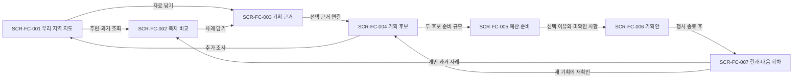
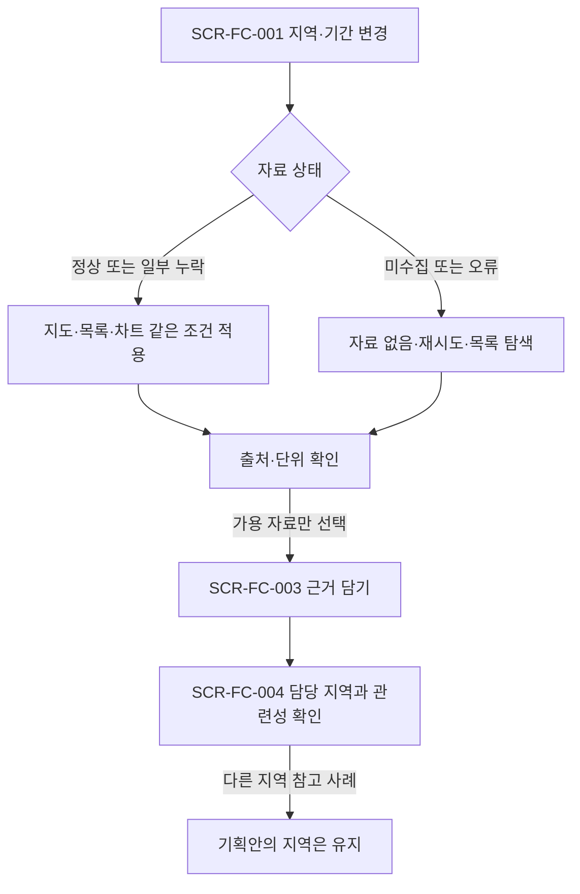
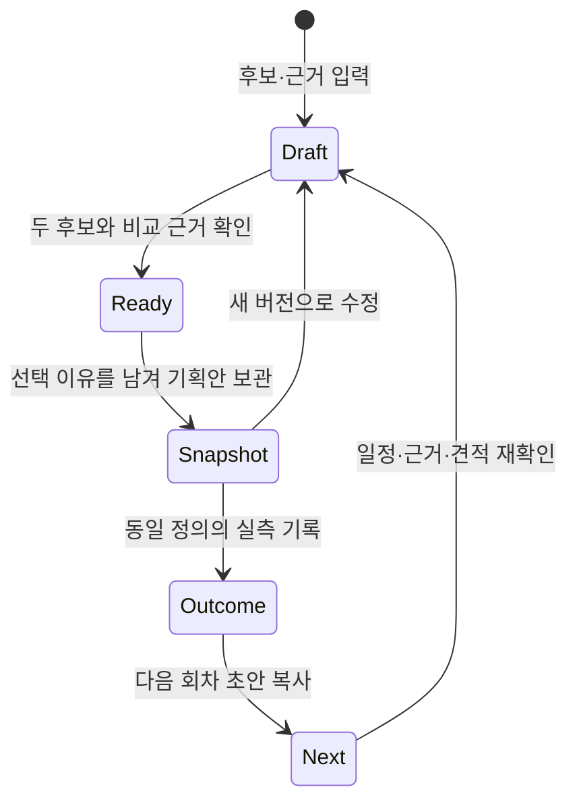

# 사용자 흐름

아래 화면은 [화면설계서](screens.md)의 구현 전 시안이다. 기존 운영 원장과 혼동하지 않는다.

## 지역에서 올해 기획안으로

## 자료가 부족하거나 지역을 바꾸는 경우

## 확정 당시 자료와 수정안

SCR-FC-006의 보관본은 기존 값을 덮지 않는다. SCR-FC-007에서 기준 보관본을 명시한다.
입력 중 자료가 갱신돼도 보관본은 유지하며, 새 버전을 만들 때만 새 자료 선택을 허용한다.
위 '보관'은 개인 결정 기록이며 조직의 공식 승인 상태가 아니다.
