# 사용자 흐름

## 방문 구성과 장기 추세 탐색

기존 축제에서 임실 회차를 적용하면 같은 응답의 일별 지역 방문과 별도 개최 행정동 방문 구성을 읽는다.
`모든 개최연도 보기`는 해당 축제가 선택된 기존 연도별 화면으로 이동한다. 핵심 세 메뉴·현재 관광자원 탐색은 유지한다.
새 축제의 임실군 방문 화면에서는 월·요일 흐름 아래 연간 추세를 보고, `월별로 볼 연도`에서 완전한 일별 자료가 있는
연도를 고른다. 주소·관측연도를 갱신한 뒤 해당 월별 제목으로 이동한다. 후보 일정이나 기획 기록을 자동 생성하지 않는다.
기간이 없는 방문 특성 자료의 수기 입력을 사용자에게 요구하지 않는다. [상세 계약](functional-spec.md#9-방문-구성과-지역-연간-추세).

## 관련 자료 검색과 원문 확인 · 2026-09-24

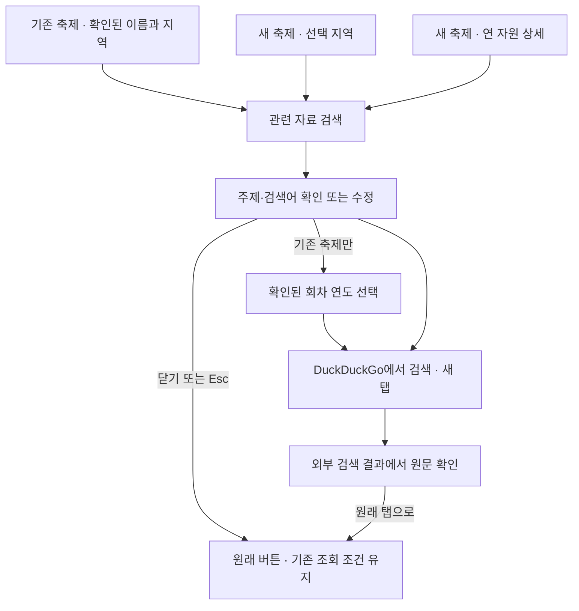

회차 하나를 적용한 방문 화면은 해당 연도, 비교 중이거나 다른 화면이면 연도 전체에서 시작한다.
검색창을 다시 열 때에는 현재 대상과 적용 조건을 다시 읽는다. 지역·자원이 바뀌면 이전 입력을 해제한다.
외부 사이트의 결과·오류는 그 사이트에서 확인하며, 앱의 조회나 선택을 성공 결과로 덮어쓰지 않는다.
동작 계약은 [기능 상세 §8](functional-spec.md#8-관련-자료-검색원문-연결),
구현·실행 상태는 [기록36](../../validation/36-related-material-search.md)에 남긴다.

## v7 기능 연결과 복귀

[기능 상세](functional-spec.md)가 검색·식별, 조건 적용/취소·유지, 자원 선택, 후보 기간과 상태 복구를 구체화한다.
최종 시각 디자인은 사용자 작업이다. 기존 축제의 현재 구현·실행 검증은 [검증 기록](../../validation/34-existing-festival-journey.md)을 따른다.
새 축제 전용 흐름은 `/new` → `/new/{지역코드}/resources·visits·timing`으로 사용 가능하며 결과는 [검증 기록35](../../validation/35-pickdday-new-festival.md)를 따른다.
구현에서 달력의 방문 이동 행동명은 `지역 방문 흐름 보기`, 선택 월의 달력 이동은 `2025년 10월 일정 보기`처럼 실제 연월을 쓴다.

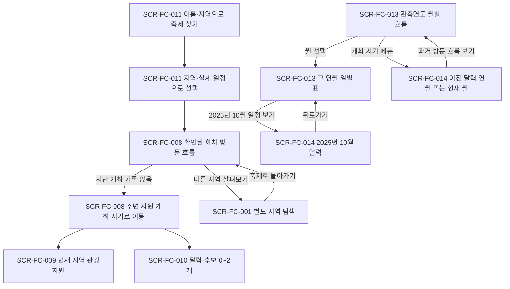

일반 메뉴 이동은 기존 달력 연월을 보존하고 실제 연월이 붙은 링크만 그 연월로 바꾼다.
미래 후보 날짜는 과거 관측값의 조회 연도를 바꾸지 않는다. 현재 등록 목록에서 과거 일정을 얻을 수 없으면
해당 영역의 상태를 보여주며 올해 일정으로 대체하지 않는다. 자원을 선택해도 방문 지표는 지역 전체다.

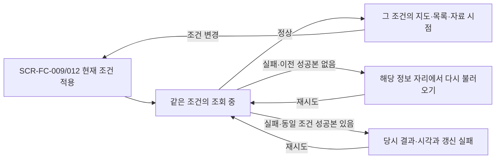

요청 키가 현재 선택과 다르면 늦은 성공/실패 모두 적용하지 않는다. 서로 독립인 방문·자원·상세·일정은
한 자료의 실패로 다른 정상 자료를 지우지 않는다. 전체 완료 전의 결과를 총 0건으로 표시하지 않는다.
이 도식은 조회·복구 계약이다. 기존 축제의 실제 판정은 TS-FC-009와 검증 기록을 따른다. 새 축제의 판정은
[TS-FC-010](../3-testing/scenarios/TS-FC-010.md)과 검증 기록35를 따르며 자동 인수 시험을 통과했다.

2026-09-22 [기획 기준](../../product/planning-principles.md)에 맞춰 기존 축제 개선 v5에 새 축제 기획 v6를 연결한다.
아래 v5·v6 도식은 설계 기준이며 구현 상태는 [화면 레지스터](screens.md)를 참조한다. 기존 축제와 새 축제의 상태를 구분한다.
관련 요구·수용 기준은 기존 축제 [UC-FC-009](../1-analysis/usecases/UC-FC-009.md), 새 축제
[UC-FC-010](../1-analysis/usecases/UC-FC-010.md)을 따른다. 최신 devkit `6e6ce25`의 제품 경험 정책 §6에
따른 사용자·과업·정보·행동·실제 문구·사실과 가정은 [디자인 시스템](design-system.md)의 작업 입력을 따른다.
코드로 확인한 전체 경로와 기록 조건은 [현행 점검](../../review/2026-09-current-state.md)과 아래 현행 도식에 구분한다.

## v6 목적 선택과 기록 없는 두 탐색 흐름

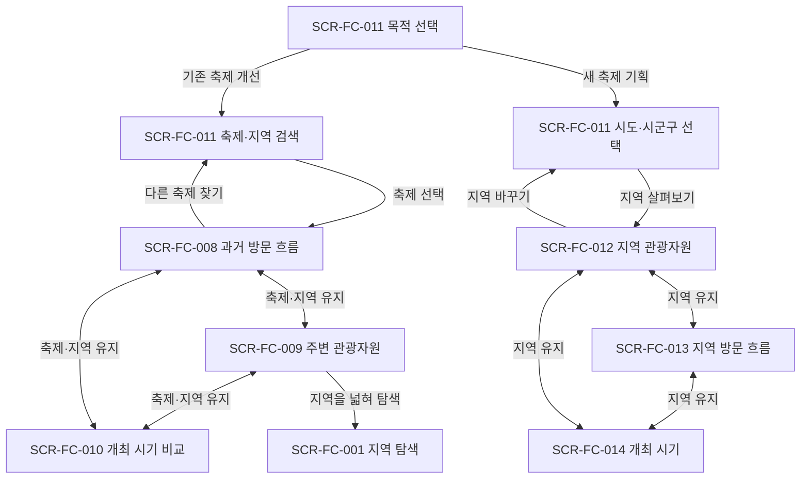

축제·회차·지역·기간·지도 기준점은 조회 조건이다. 목적 서술·선택 이유·메모·기획안 저장은
어느 전이에도 필요하지 않다. 방문 흐름 우선 진입은 정보 우선순위이며 순차 과제나 완료 단계가 아니다.
각 화면에서 같은 축제의 다른 핵심 정보로 곧바로 이동할 수 있고 돌아오면 해당 화면의 조건을 유지한다.
첫 방문 흐름에는 최신 비교 가능한 두 회차를 적용한다. 논산 보관 자료에서는 2025·2024이며,
한 회차만 있는 경우도 해당 흐름을 열 수 있다. 없는 회차를 만들어 기본 개수를 맞추지 않는다.
선택한 자료를 보관하는 행동은 별도 선택이다. 현행 기록 기능의 조건을 이 기본 흐름에 끌어오지 않는다.

새 축제는 기존 축제 검색을 거치지 않는다. `어느 지역의 축제를 구상하시나요?`에서 시도·시군구를 고르면
지역 관광자원부터 열고 `지역 관광자원 / 지역 방문 흐름 / 개최 시기`를 자유롭게 이동한다.
축제 이름·대상 관광객·아이템·방문 이유·기획안은 시작·이동·복귀에 필요하지 않다.
자원·기간 비교는 탐색 조건이며 장소·프로그램을 확정하거나 기록을 만드는 단계가 아니다.

## v6 지역 선택과 관광자원 탐색

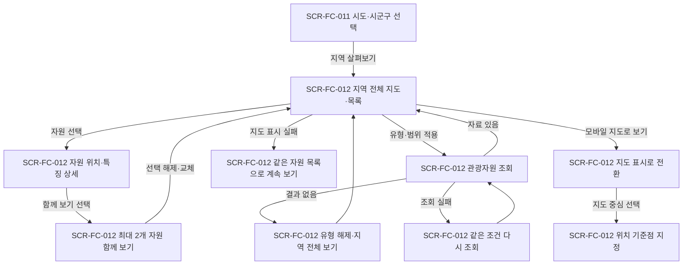

행사장 중심 반경이나 임의 위치를 전제로 하지 않고 지역 전체에서 시작한다. 자원 상세와 함께 보기는
확인된 주소·유형·설명 등 같은 항목을 읽는 탐색이다. 좌표가 없는 자원도 목록에 남기며 지도 표시 문제는
목록 탐색을 막지 않는다. 세 번째 자원 선택에는 기존 선택을 해제·교체할 행동을 제공한다.
자료를 읽기 위해 두 개를 채우도록 요구하지 않는다. 조회 조건의 상세 계약은 [시각화 설계](data-visualization.md)를 따른다.
거리를 살펴볼 때만 별도 `지도 중심 선택`을 열어 위치 기준점을 명시하고 적용한다. 자원 상세·함께 보기
선택이 중심점을 자동 변경하지 않으며 기준점 해제로 지역 전체 탐색에 돌아간다.
모바일의 `지도로 보기`는 목록에서 지도 표시로 전환하는 행동이다. 전환만으로 위치 기준점이나 조회 조건은
바뀌지 않는다. 지도 안의 `지도 중심 선택`으로 별도 조건을 지정한다. 목록은 자원명·유형을 먼저 읽고 주소는 상세에서 확인한다.

## v6 지역 방문 흐름과 개최 시기 탐색

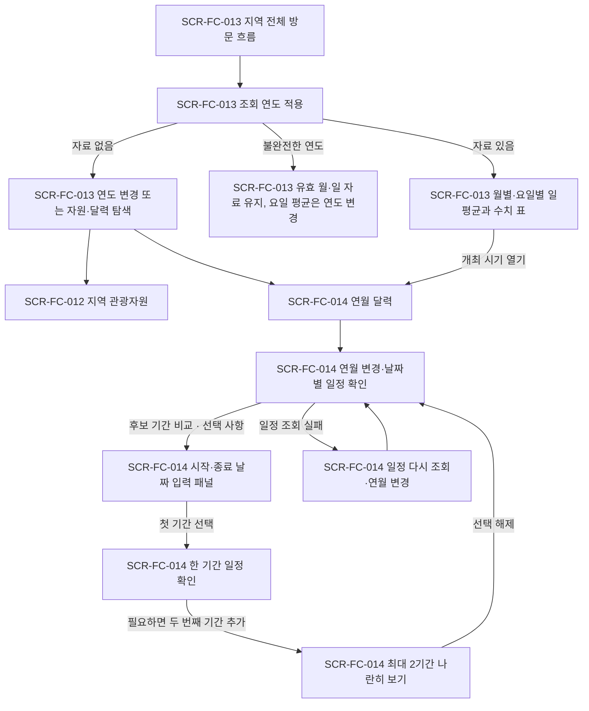

방문 흐름은 축제의 효과나 입장객을 재구성하지 않고 지역 전체의 관측 특성을 읽는다.
행사 회차·D0·행사 음영은 만들지 않는다. 지역별 자료가 없으면 조건 변경 또는 다른 두 탐색으로 이어지며
다른 지역 값을 대신 그리지 않는다. 최근 완전연도를 기본으로 열고, 불완전한 연도를 직접 고르면 유효한
월·일별 자료를 유지하되 연도 기준 요일 평균을 생성하지 않고 연도 변경을 제공한다.
월·요일 평균과 결측 분모는 [시각화 계약](data-visualization.md)이 정한다.
v6의 입력은 조회 연도이며 임의 관찰기간 선택은 후속 범위다. 실제 관측 기간은 차트·표에 계속 표시한다.

개최 시기는 연월 달력을 먼저 연다. 특정 개최일·행사 기간을 미리 정해야 달력을 볼 수 있는 순서를 만들지 않는다.
기본 조회는 현재 연월이고 시안의 2026년 10월은 월 이동 후 예시다. 연결 자료의 실제 연도·날짜·출처를 구분한다.
보조 버튼 `후보 기간 비교`는 시작·종료 날짜 입력 패널을 연다. 첫 기간을 골라 일정을 읽고 필요하면
두 번째를 추가해 날짜·요일·조회된 휴일·행사를 나란히 읽는다. 과거 방문 흐름은 SCR-FC-013으로 이동해
그 관측 연도로 읽으며 달력 연월을 바꾸지 않는다. 미래 예상 방문객이나 추천 점수로 바꾸지 않는다.
미래 일정의 실제 연결 여부는 내부 구현 항목이다.

## v6 새 축제의 상태와 복귀

| 상황 | 화면에서 이어갈 행동 | 유지·복구할 조건 |
|---|---|---|
| 시도만 선택 | 해당 시도의 시군구 선택 | 시도. 지역을 고르기 위해 축제명 입력을 요구하지 않음 |
| 시도 변경 | 새 시도의 시군구 선택 | 이전 시군구가 새 시도에 남지 않음 |
| 자원 없음·유형 결과 없음 | 유형 해제·지역 전체 보기·지역 변경 | 사용자가 적용한 지역·유형 |
| 방문 자료 없음 | 조회 연도 변경·지역 관광자원 보기·개최 시기 보기 | 선택 지역과 각 탐색의 조건 |
| 방문 일부 날짜 누락 | 유효 월·일 자료 확인, 연도 기준 요일 평균 영역에서 연도 변경 | 조회 연도와 실제 관측 기간 표시. 누락을 0으로 바꾸지 않음 |
| 일정 미조회·조회 실패 | 해당 일정 다시 조회·연월 변경 | 달력 연월·사용자가 선택한 기간 |
| 조회 완료 뒤 일정 결과 없음 | 해당 지역·기간의 조회 결과를 확인하고 조건 변경 | 조회한 범위. 행사 부재·개최 안전을 단정하지 않음 |
| 기간 시작·종료 순서 오류 | 해당 날짜 입력에서 수정, 같은 날 시작·종료는 허용 | 잘못된 입력과 다른 정상 기간·달력 유지 |
| 탭 이동·뒤로 돌아오기 | 이전 화면의 선택·스크롤·초점으로 복귀 | 자원 최대 2개, 방문 연도, 달력 연월·기간을 각각 유지 |
| 지역 변경 | 자원 선택·위치 기준점 해제 후 새 지역으로 조회 | 방문 연도·달력 연월·기간 유지. 없는 연도를 자동 대체하거나 이전 지역 결과로 채우지 않음 |

로딩·실패·부분 결과는 해당 정보 자리에서 전달한다. 자료 등급이나 내부 준비 현황을 먼저 확인해야 하는
별도 관문은 없다. 새 축제 기획의 완료 경험은 판단에 필요한 정보를 얻는 것이며 기획안 저장 버튼이 아니다.

## v5 방문 회차·기간 비교

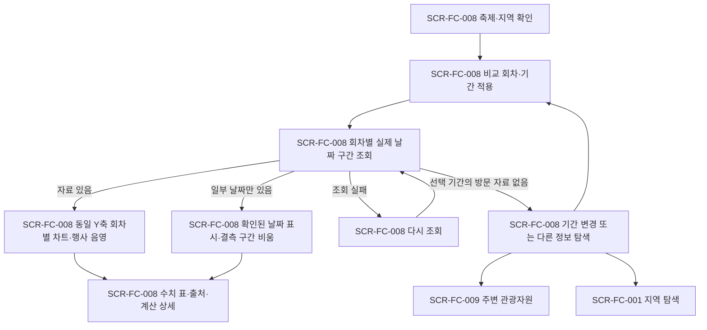

기본 범위는 각 회차의 행사 시작 전 7일과 종료 후 7일을 포함한 실제 날짜다.
행사 시작일 기준 D-7~D+7인 기존 `relativePoints`는 행사 종료 뒤 7일을 포함한다고 볼 수 없으므로
새 조회 구간의 대체 자료로 사용하지 않는다. 실제 날짜·요일·행사 일수를 유지하고 차트 간 Y축을 맞춘다.
월별 요약·비교값의 계산과 결측 처리는 [시각화 계약](data-visualization.md)을 따른다.

## v5 관광자원과 개최 시기

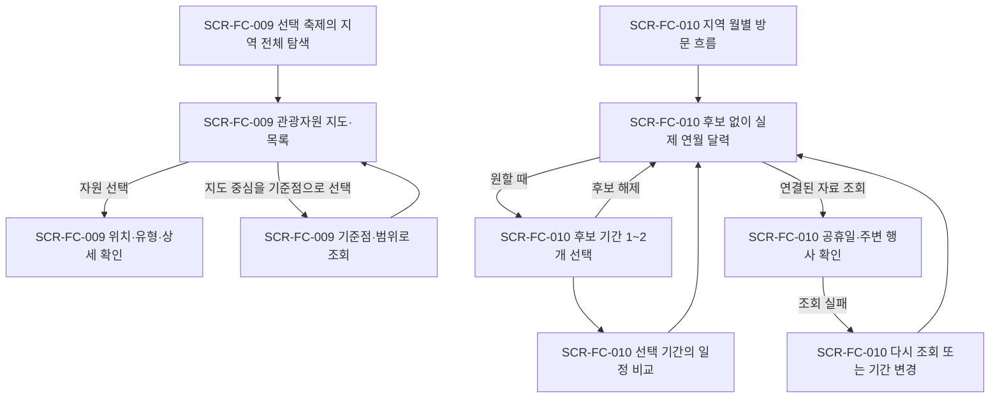

과거 행사장 좌표를 확인하지 못한 회차에서는 지역 전체로 시작한다. 논산 표본도 논산시 전체와
사용자가 명시적으로 선택한 지도 중심을 사용하며, 다른 연도의 행사장이나 미래 등록 행사 좌표를
자동으로 붙이지 않는다. 지도 기준점 선택은 거리·범위 검색이며 장소 확정이나 기획 기록이 아니다.

시기 비교는 지역의 월별 방문 흐름과 후보 달력에서 시작한다. 공휴일·주변 행사는 실제로 연결해
조회한 자료만 표시한다. 미래 자료 연결 여부·수집 점검 항목은 내부 설계 기록에 두고 고객 화면에는
사용자가 실행한 조회의 결과와 재시도·기간 변경을 제공한다. 미조회·조회 실패를 ‘공휴일 없음’이나
‘겹치는 행사 없음’으로 바꾸지 않는다. 날짜를 추천 점수로 평가하거나 최적일로 확정하는 단계는 없다.

## v5 공통 상태와 복귀

| 상황 | 사용자에게 제공할 행동·결과 | 유지할 조건 |
|---|---|---|
| 검색 결과 없음 | 검색어·지역 변경, 지역 관광정보 탐색 | 검색어·지역 |
| 첫 조회·조건 변경 | 바뀐 조건과 로딩 상태를 해당 본문에서 전달 | 선택 축제와 다른 화면 조건 |
| 일부 자료만 표시 가능 | 확인된 값·자원을 먼저 보여주고 해당 날짜·값을 표에서 확인 | 적용 기간·선택 항목 |
| 방문 자료가 없는 지역 | 제공 가능한 자원·지역 탐색으로 이동 | 선택 축제·지역 |
| 지도 표시 실패 | 같은 자원을 목록에서 계속 탐색, 지도 다시 열기 | 자원 선택·종류·기준점 |
| 데이터 조회 실패 | 실패한 조회를 재시도하거나 조건 변경 | 마지막 적용 조건. 이전 성공값을 새 결과처럼 표시하지 않음 |
| 키보드·좁은 화면 | 목록·날짜 입력·수치 표로 같은 선택을 수행 | 선택 항목·조회 조건·복귀 초점 |

자료 확보 행렬·데이터 등급·내부 규약 배너를 통과하는 단계는 없다. 목표·다음 행동·현재 조건은
구조와 문구로 전달하며 상세 출처는 필요할 때 확인한다. 정성·접근성 검수는 렌더된 설계와
해당 동작을 확인한 뒤 기록하고, 이 흐름 작성 자체를 검수 통과로 보지 않는다.

## 현재 구현된 연결

아래 도식은 2026-09-22 점검 당시의 기록 도구 연결이다. 현재 첫 화면은 두 목적 선택이며 기존 축제는 `/existing/search`,
새 축제는 공개 서비스 `/new`(사용 가능)로 진입한다. 아래 기록 도구는 보조 진입으로 남아 있다.

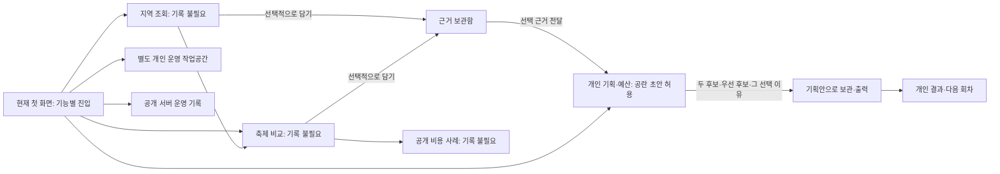

일반 초안 저장과 기획안 보관의 조건은 다르다. 개인 결과는 보관된 기획안을 요구한다.
기획에서 개인 운영 작업공간으로 입력을 자동 이전하는 연결은 확인되지 않았다.
두 후보·선택 이유 등 현행 보관 조건은 [선택적 기록 원칙](../../product/planning-principles.md)에 맞춰 재검토할 대상이다.

이하 도식은 [화면설계서](screens.md) v3의 기존 시안·업무 모델이다.
일부는 후속 구현됐지만 전체 앱의 연결이나 새 두 목적 흐름의 확정안으로 읽지 않는다.

## 기존 시안: 지역에서 올해 기획안으로

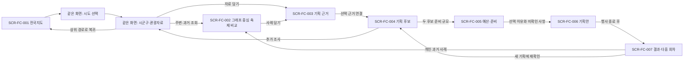

## 자료가 부족하거나 지역을 바꾸는 경우

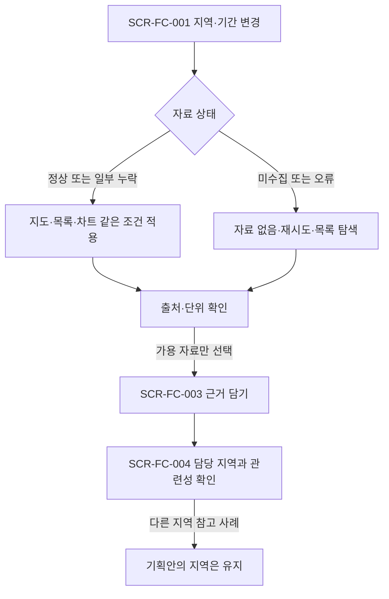

## 보관 당시 자료와 수정안

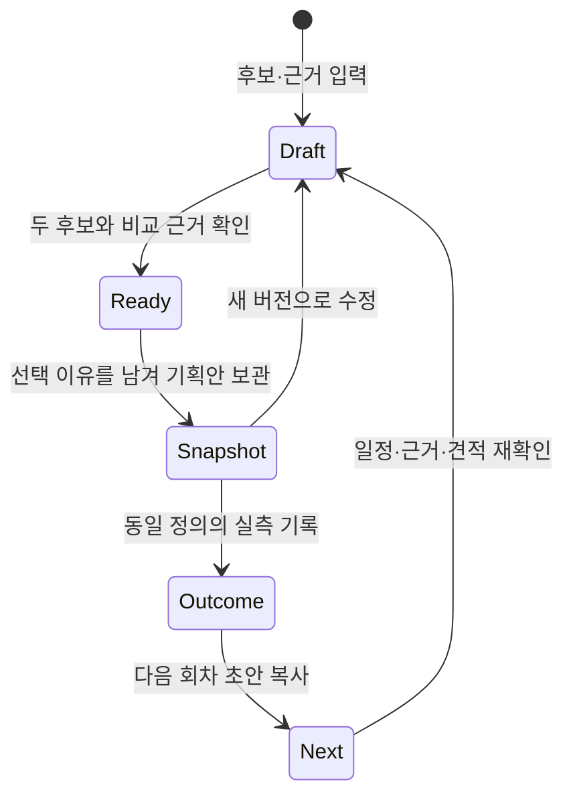

SCR-FC-006의 보관본은 기존 값을 덮지 않는다. SCR-FC-007에서 기준 보관본을 명시한다.
입력 중 자료가 갱신돼도 보관본은 유지하며, 새 버전을 만들 때만 새 자료 선택을 허용한다.
위 '보관'은 개인 결정 기록이며 조직의 공식 승인 상태가 아니다.

## v2: 예산·준비 확인과 결과 출력

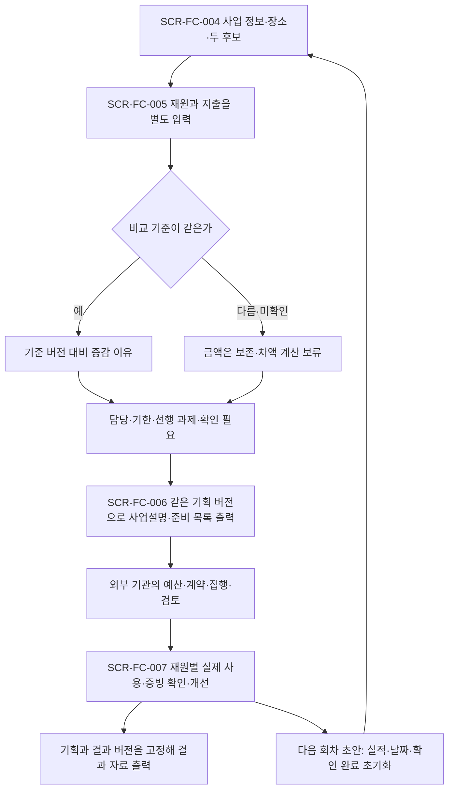

외부 기관 단계는 이 앱의 실행 기능이 아니다. 없는 단계는 미확인으로 남기며 같은 금액을 다음 단계로 자동 옮기지 않는다.
장소·기간·업무 범위 변경 시 관련 준비·견적을 재확인한다. 보관한 확인 기록은 이전 적용 기간과 함께 남는다.

## v3: 같은 기준의 그래프에서 근거로

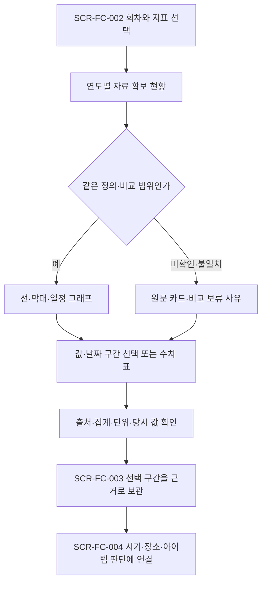

비용 구성비는 전체 분모와 항목을 확인한 경우만 표시한다. 차트 선택은 표의 항목·날짜 입력으로도 가능하며 담기 전까지 개인 기록을 만들지 않는다.

## 임실 2025년 방문자 특성에서 관광자원으로

회차에 2025년 포함 → 성·연령 비율 → 목적지 검색 구분 선택 → 확인된 장소의 `관광자원에서 보기` → 현재 목록 준비 → 해당 장소 상세 선택.
명시적으로 누른 장소가 과거 선택보다 우선하고 이동용 조건은 한 번 처리한다. 실패하면 다시 불러오고,
목록에 장소가 없으면 목록을 유지한다. 뒤로가면 기존 적용 회차·표시 기간을 유지한다.
2025년 해제·다른 축제 전환에는 이전 방문자 특성을 남기지 않는다. 기록·저장은 요구하지 않는다.
[기능 상세 §10](functional-spec.md#10-방문자-특성과-관광자원-연결), [실행 기록38](../../validation/38-visitor-profile.md).
