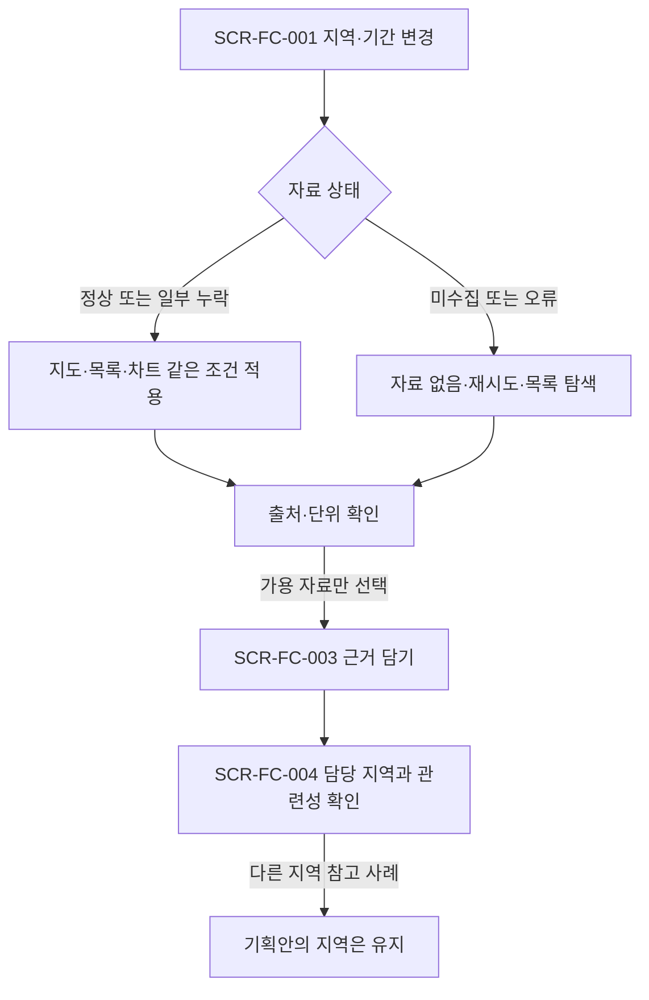
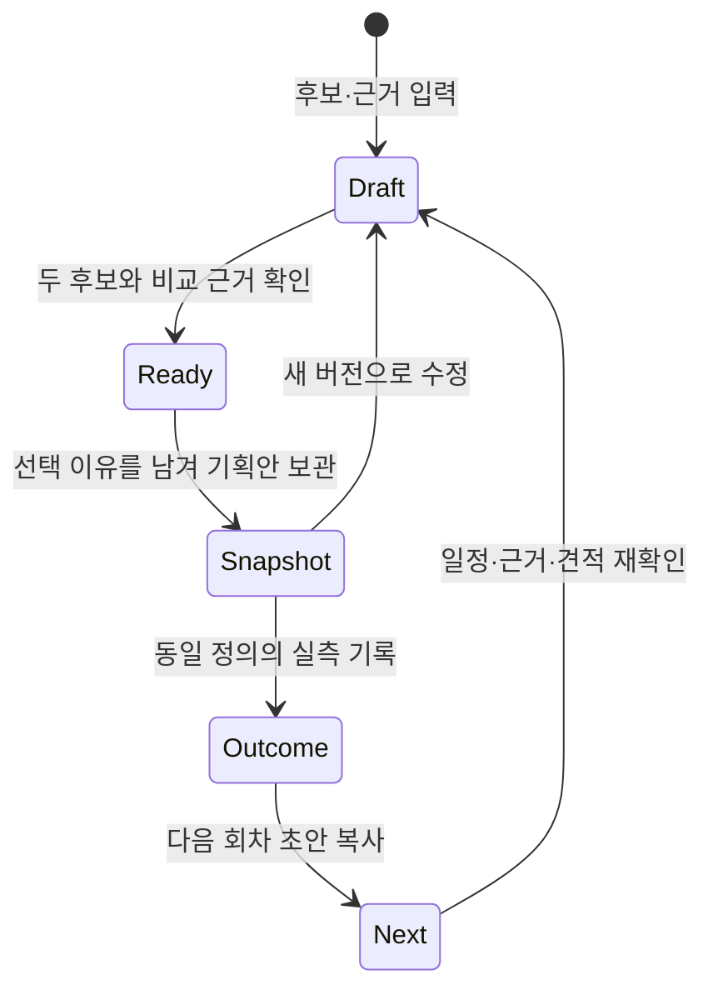
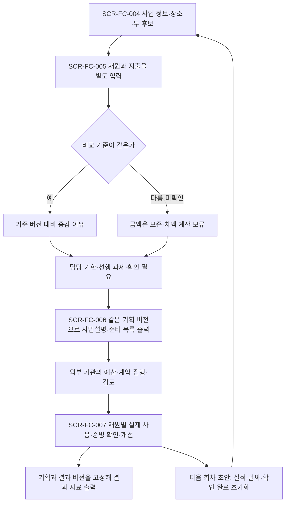
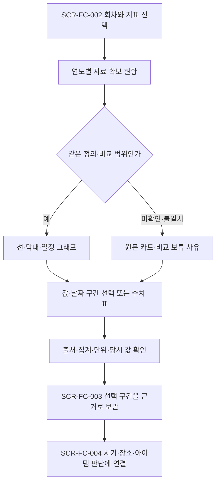

# 사용자 흐름

아래 화면은 [화면설계서](screens.md)의 구현 전 시안이다. 기존 운영 원장과 혼동하지 않는다.

## 지역에서 올해 기획안으로

## 자료가 부족하거나 지역을 바꾸는 경우

## 보관 당시 자료와 수정안

SCR-FC-006의 보관본은 기존 값을 덮지 않는다. SCR-FC-007에서 기준 보관본을 명시한다.
입력 중 자료가 갱신돼도 보관본은 유지하며, 새 버전을 만들 때만 새 자료 선택을 허용한다.
위 '보관'은 개인 결정 기록이며 조직의 공식 승인 상태가 아니다.

## v2: 예산·준비 확인과 결과 출력

외부 기관 단계는 이 앱의 실행 기능이 아니다. 없는 단계는 미확인으로 남기며 같은 금액을 다음 단계로 자동 옮기지 않는다.
장소·기간·업무 범위 변경 시 관련 준비·견적을 재확인한다. 보관한 확인 기록은 이전 적용 기간과 함께 남는다.

## v3: 같은 기준의 그래프에서 근거로

비용 구성비는 전체 분모와 항목을 확인한 경우만 표시한다. 차트 선택은 표의 항목·날짜 입력으로도 가능하며 담기 전까지 개인 기록을 만들지 않는다.
