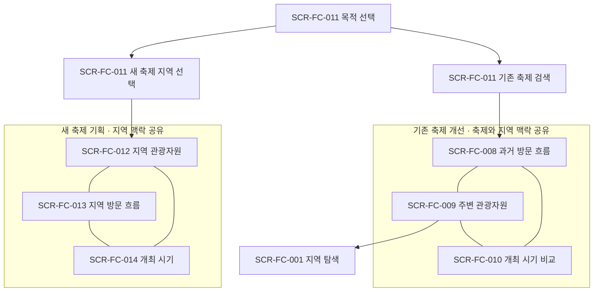

# 정보구조

2026-09-24 관련 자료 검색은 새 메뉴나 필수 단계 없이 기존 축제 머리·새 축제 지역 머리·자원 상세의 보조 버튼으로 연결한다.
작은 창에서 검색어를 확인·수정한 뒤 외부 새 탭을 열며 세 핵심 메뉴와 원래 선택은 유지한다.
[기능 상세 §8](functional-spec.md#8-관련-자료-검색원문-연결--2026-09-24)·[검증 기록36](../../validation/36-related-material-search.md)을 따른다.

2026-09-23 기능 보완은 [기능 상세](functional-spec.md)와 [흐름 v7](flows.md)을 따른다.
두 목적·세 탐색의 구조는 유지하고, 검색의 축제/회차 식별·조건 복귀·실제 관측연월의 달력 연결을 구체화했다.
기존 축제의 지역은 축제에 결속하고, 다른 지역은 SCR-FC-001에서 별도 탐색한 뒤 원래 축제로 돌아온다.
별도 자료 준비 확인 화면이나 기획 필수 작성 단계를 추가하지 않는다. 디자인 작업에는 아래 정보 우선순위와
[화면 목표·기본 배치](screens.md)를 전달하며 색·폰트·간격 등의 시각 스타일은 사용자가 조정한다.

2026-09-22 [확정 원칙](../../product/planning-principles.md)에 따라 두 목적의 진입을 v6로 연결한다.
기존 축제는 v5의 세 핵심 기능을 유지하고, 새 축제는 지역 선택만으로 관광자원·방문 흐름·개최 시기를
살펴보는 목표다. 기존 축제의 현재 구현·검증은 [실행 기록](../../validation/34-existing-festival-journey.md)을 따른다.
새 축제 전용 화면은 사용 가능이다. 공개 서비스의 첫 화면은 새 축제 선택을 `/new`로 연결한다. 실행 결과는 [검증 기록35](../../validation/35-pickdday-new-festival.md)를 따른다.

## v6 근거와 성격

| 항목 | 근거 | 성격 |
|---|---|---|
| 관광 활성화·지역 공무원·세 핵심 기능·선택적 기록 | [기획 기준](../../product/planning-principles.md) | 사용자 확정 요구 |
| 현재 경로·저장·연결 | [현행 점검](../../review/2026-09-current-state.md), `apps/web/app`, `apps/web/components/AppShell.tsx` | 코드로 확인한 현행 |
| 자료의 실제 범위 | [데이터 현황](../../research/2026-09-data-inventory.md) | 보관·연결 상태의 조사 결과 |
| 목적·위계·문구·상태·접근성·작업 입력 | `~/dev/devkit/dev-standard/policy/product-experience.md` §6, `roles/ui-designer.md` | 표준 기준: `6e6ce25215249dded13a233e7407a6440e060e66`. 이번 작업 입력은 [디자인 시스템](design-system.md)에 명시 |
| 아래 화면 묶음·경로·정보 순서 | [화면설계서](screens.md), [사용자 흐름](flows.md), [UC-FC-009](../1-analysis/usecases/UC-FC-009.md), [UC-FC-010](../1-analysis/usecases/UC-FC-010.md) | 승인된 목표를 구체화한 설계. 화면별 구현 상태는 화면설계서 레지스터 |

## v6 목적별 진입과 화면 묶음

기존 축제 개선의 기본 탐색 단위는 **선택한 축제와 지역**이다. 기획안을 만들거나 사용자 목적을
서술하지 않아도 시작한다. 새 축제 기획의 기본 단위는 **선택한 지역**이다. 축제 이름·대상 관광객·
아이템을 정하지 않아도 시작한다. 회차·기간·지도 기준점·함께 볼 자원은 조회 조건이며 기획 기록이 아니다.

| 사용자 상황 | 진입과 제공할 탐색 | 완료 경험 |
|---|---|---|
| 기존 축제의 다음 회차 준비 | SCR-FC-011에서 기존 축제 검색·선택 → SCR-FC-008 방문 흐름 우선 | 과거 흐름·주변 자원·시기별 조건을 살펴보고 판단에 필요한 정보를 얻음 |
| 새 축제 구상 | SCR-FC-011에서 시도·시군구 선택 → SCR-FC-012 지역 관광자원 우선 | 지역 자원·방문 특성·달력에서 구상의 판단에 필요한 정보를 얻음 |
| 과거 방문 자료가 없는 지역 | 선택한 축제·지역 맥락을 유지하고 SCR-FC-009 자원 또는 SCR-FC-001 지역 탐색으로 이동 | 제공 가능한 지역 관광정보를 계속 탐색 |
| 특정 기존 축제 링크 또는 탐색 중 복귀 | 선택 축제와 화면별 조회 조건을 유지 | 목적 선택·기록 입력을 반복하지 않고 해당 정보로 복귀 |
| 새 축제 탐색 중 복귀 | 선택 지역과 화면별 조회 조건을 유지 | 자원·방문·시기 메뉴에서 이전 조건으로 복귀 |

다음은 화면 레지스터가 아닌 묶음 구조다. 번호·상태의 정본은 [screens.md](screens.md)다.

제안 경로는 `/`의 목적 선택 개편, `/existing`의 검색, `/existing/{festivalId}/visits`,
`/existing/{festivalId}/resources`, `/existing/{festivalId}/timing`이다. 새 축제는 `/new`의 지역 선택과
`/new/{regionKey}/resources`, `/new/{regionKey}/visits`, `/new/{regionKey}/timing`을 제안한다.
기존 축제 검색의 실제 경로는 `/existing/search`이며 `/existing`은 이곳으로 이동한다. 세 상세 경로의 ID는 `archive:<festivalId>` 또는 `current:<regionCode>:<contentid>`다.
새 축제는 `/new`와 `/new/{지역코드}/resources·visits·timing`으로 구현했다(사용 가능). 지역코드는 5자리 행정 코드이며
세종은 `/new/36110`이 지역 목록의 `36110/36110` 행에 연결된다. `/new/{지역코드}`만 열면 관광자원으로 이동한다.

## v6 새 축제의 정보 우선순위

첫 질문은 `어느 지역의 축제를 구상하시나요?`다. 시도·시군구를 고르고 `지역 살펴보기`로 진입한다.
지역 관광자원을 먼저 여는 이유는 전국 지역의 기본 자원 탐색을 제공할 수 있기 때문이다.
지역별 과거 방문 자료의 범위 차이를 시작 전 선택 과제로 만들지 않는다. 자료의 실제 확보·연결 상태는
[시각화 계약](data-visualization.md)에 두고, 화면은 실행한 조회의 결과와 다음 행동을 제공한다.

상단은 선택 지역과 `지역 관광자원 / 지역 방문 흐름 / 개최 시기`다. 세 메뉴는 단계나 완료 목록이 아니다.
지역은 공유하고 유형·함께 볼 자원, 방문 조회 연도, 달력 연월·기간은 화면별 조회 조건으로 유지한다.
지역을 바꿀 때 이전 자원 선택·지도 기준점은 해제하고 방문 연도·달력 연월·기간은 유지해 새 지역으로
다시 조회한다. 방문 자료가 없으면 해당 상태를 보이며 다른 연도로 조용히 바꾸지 않는다.
조건을 바꾸지 않은 메뉴로 돌아오면 기존 탐색 상태를 복구한다.

| 화면 | 우선 정보 | 우선 행동 | 완료 경험 |
|---|---|---|---|
| SCR-FC-012 | 지역 전체 관광자원 목록·위치·특징 | 자원 열기, 최대 2개 함께 보기 | 활용을 검토할 자원의 차이를 확인 |
| SCR-FC-013 | 지역 전체의 월별·요일별 일평균 방문 흐름 | 조회 연도 적용 | 지역에 방문이 많은 시기와 요일의 관측 특성을 확인 |
| SCR-FC-014 | 선택 연월의 날짜·요일·연결된 휴일과 행사 | 연월 바꾸기, 선택적으로 최대 2기간 비교 | 일정 조건을 확인하고 필요하면 지역 방문 흐름으로 이동 |

자원 비교와 기간 선택은 탐색 중 기억하는 조건이다. 장소 확정·프로그램 대안·기획안으로 자동 생성하지 않는다.
v6의 방문 조회 입력은 연도 선택이며 실제 관측 기간은 차트·표에 표시한다. 임의 관찰기간 선택은 후속 범위다.
개최 시기의 보조 버튼 `후보 기간 비교`는 시작·종료 날짜 입력 패널을 연다. 첫 기간을 선택하고 필요할 때만
두 번째 기간을 추가한다. 관광자원 모바일의 `지도로 보기`는 표시 전환이고, 지도 안 `지도 중심 선택`은
별도로 위치 기준점을 지정하는 행동이다.
방문 흐름에 가상의 행사명·회차·행사 음영을 붙이지 않으며, 달력은 특정 개최일을 입력하기 전에도 열린다.
대상 관광객·방문 이유·축제명·아이템·메모는 필수 입력이 아니다. AI 테마 추천·추천 점수·앱 내부 뉴스 수집은 포함하지 않는다.
외부 검색 연결은 위 2026-09-24 보조 행동으로 제공한다.
사용자가 원하면 남기는 기록은 별도 선택이며 세 탐색의 완료 조건이 아니다.

## v5 정보의 우선순위와 공통 탐색

상단에는 목적 복귀, 선택 축제·지역, 세 탐색 메뉴를 둔다. 과거 방문 흐름을 먼저 열되
세 메뉴 사이의 이동 순서는 강제하지 않는다. 첫 방문 흐름은 최신 비교 가능한 두 회차를 기본으로 고르며
논산 보관 자료에서는 2025·2024가 된다. 한 회차만 있으면 그 회차를 읽을 수 있다. 방문 회차·비교 기간, 관광자원 종류·지도 기준점,
개최 시기 후보 기간은 각 화면의 조건으로 유지한다. 다른 축제를 고르면 이전 축제의 조건을
새 축제의 사실처럼 적용하지 않는다.

| 화면 | 우선 정보 | 우선 행동 | 보조 행동 |
|---|---|---|---|
| SCR-FC-008 | 같은 지역의 회차별 일별 방문 흐름과 행사 구간 | 비교 회차·기간 적용 | 수치 표·출처·계산 상세 확인, 선택적 보관 |
| SCR-FC-009 | 지역 관광자원 목록과 위치, 선택 자원 상세 | 자원 선택 또는 지도 기준점으로 조회 | 유형·범위 변경, 출처 확인, 선택적 보관 |
| SCR-FC-010 | 월별 방문 흐름과 후보 기간의 실제 날짜 달력 | 후보 기간을 나란히 비교 | 연결된 공휴일·행사 확인, 수치 표·출처 확인 |

주요 본문 앞에 자료 확보 현황 행렬·데이터 등급·보류 사유 배너를 배치하지 않는다.
대상·단위·기간은 제목과 축·열 이름에서 읽을 수 있게 하고 출처·계산은 펼쳐 확인한다.
자료가 없는 항목마다 빈 카드나 경고를 만들지 않는다. 사용자가 지정한 조회가 실패하거나 결과가
없을 때는 해당 자리에서 조건 변경·재시도·다른 탐색으로 이동하는 행동을 제공한다.
자료 부족을 0이나 다른 지역 값으로 메우지 않는 규칙은 유지한다.

보관·메모·기획안은 세 화면의 탐색을 완료하는 조건이 아니다. 기존 개인 기획·예산·운영 공간을
삭제하거나 입력을 자동 이전하는 변경도 이 정보구조 설계에 포함하지 않는다.

## v5 좁은 화면·접근성

390px에서는 축제 맥락→탐색 메뉴→현재 조건→핵심 정보→상세 순서로 읽는다.
방문 회차별 차트는 같은 Y축을 유지한 채 한 열로 쌓고, 자원 화면은 지도/목록을 전환해도 선택을
유지한다. 시기 비교의 표는 필요하면 표 안에서만 가로 이동한다. 지도·차트 선택은 목록·날짜 입력·
수치 표로도 가능해야 한다. 색·hover만으로 선택이나 값을 전달하지 않는다.
구체적 글자·간격·상태 표현은 [디자인 시스템](design-system.md), 지표·차트 계약은
[시각화 설계](data-visualization.md)가 소유한다. 실제 렌더·동작 검수 결과는 별도로 기록한다.

## 현행과 이전 시안의 보존 범위

아래는 v3 당시 정보구조와 M1~M6 구현 이력이다. v5 기존 축제와 v6 새 축제의 정보 우선순위보다 우선하지 않는다.
특히 전국지도 기본 진입, 확보 현황 우선 배치, 근거 담기부터 기획안으로 이어지는 순서는
새 두 목적의 필수 여정이 아니다. 현재 전체 경로·별도 작업공간·기록 조건은
[현행 점검](../../review/2026-09-current-state.md)을 따른다.

2026-09-08 첫 구현: `/regions`에서 전국→시도→시군구 조회, `/evidence`에서 개인 근거 보관을 제공한다.
데스크톱은 시도 선택 뒤 목록을 접고 시군구를 펼치며, 모바일은 두 선택창을 나란히 제공한다.
`/compare`는 지역별 현재 등록 행사·8개 과거 회차·비교 그래프·개인 사본 보관을 추가했다. [M2 구현 범위](festival-comparison-implementation.md)를 따른다.
`/planning/options`는 사업·후보·장소/준비·근거 연결·비교·보관본을 제공한다. [M3 구현 범위](planning-options-implementation.md)를 따른다. `/planning/budget`에는 [M4 예산·준비 비교](budget-implementation.md)를 연결했다. `/planning/proposal`에는 [M5 기획안 보관·출력](proposal-implementation.md)을 연결했다.

### 기존 시안의 근거와 성격

| 항목 | 근거 | 성격 |
|---|---|---|
| 지자체 우선·주변/과거 비교·기획 목표 | [제품 기획](../0-planning/product-plan.md) | 사용자 요구 |
| 현재 경로·개인 저장 | apps/web/app, apps/web/lib/workspace.ts | 현재 구현 근거 |
| 아래 탐색 구조·전역 정보 배치 | [화면설계서](screens.md) | 기존 시안. 실제 제공 경로와 미구현 배치를 구분 |

담당자의 기본 작업 단위는 '내 지역'과 '내 기획안'이다.
지역을 바꿔 탐색하더라도 작성 중인 기획안의 담당 지역은 묵시적으로 바꾸지 않는다.

### 기존 시안의 탐색 구조

- 전국 관광지도: SCR-FC-001에서 전국→시도→시군구 순서로 지역·기간·관광자원·방문 추세를 탐색한다. 우리 지역 바로가기를 별도로 제공한다.
- 축제 비교: SCR-FC-002에서 주변 행사와 과거 회차를 비교한다.
- 기획 근거: SCR-FC-003에서 선택 자료와 어느 후보에 쓸지 관리한다.
- 올해 기획: SCR-FC-004 → SCR-FC-005 → SCR-FC-006에서 후보·예산·기획안을 만든다.
- 결과·다음 회차: SCR-FC-007에서 개인 과거 기록을 재사용한다.

기존 시안은 상단에 담당 지역, 탐색 중인 지역, 기획 연도, 저장 위치를 함께 표시하도록 제안했다.
현재 전역 AppShell에는 이 전체 표시가 구현돼 있지 않다.
조회 기간과 기획 연도는 다른 값이다. 각 화면은 현재 값을 요약해 보여준다.
예측·수집 연구 페이지는 자료 상세의 보조 링크로 둔다.
기존 공개 시연과 호출 로그는 '기존 기능·검증 자료'로 분리한다.

### 기존 시안의 사용자별 진입

| 상황 | 진입·복귀 규칙 |
|---|---|
| 첫 방문 | 제주·도서 지역 포함 전국지도. 위치·담당 지역 입력 없이 시도→시군구로 탐색 |
| 재방문 | 전국을 기본 표시. 우리 지역/이전 탐색은 버튼으로 복귀하고 개인 기획안은 별도 복구. 저장 실패는 파일 복구 안내 |
| 특정 축제 링크 | 해당 회차 상세로 진입하고 지역·출처 확인 후 비교/담기로 이동 |
| 검토자 | 선택 당시 사본이 담긴 기획안 출력본 열람 |
| 다른 기기 | 공공 탐색 가능. 개인 기획안은 파일 가져오기로 복원 |

### 기존 시안의 모바일 표현

390px에서는 지도/목록 전환과 상세 하단 패널을 사용한다.
차트·근거는 접을 수 있으나 출처·기간·단위·결측 표시는 상세에서 항상 접근 가능하다.
비교는 그래프를 한 열로 배치하고 수치 표의 행 제목·단위·출처를 유지한다. 필요하면 표 내부 가로 스크롤을 제공하며 항목을 생략하지 않는다.
공식 승인·팀 작업이 사용 가능한 것처럼 로그인·결재 메뉴를 만들지 않는다.

### v2: 업무 정보의 단계적 공개

지역·비교 메뉴는 사업 정보 없이 탐색한다. 올해 기획에서 사업 정보/후보/장소·준비,
예산에서 재원/지출/변경 이유, 기획안에서 사업설명/준비 목록을 선택한다.
결과에서는 재원별 사용과 증빙 확인/개선 과제/결과 출력을 다룬다. 화면 번호와 메뉴 수는 유지한다.

탐색 연도·기획 회계연도·금액 원문의 적용 연도·기준 기획안 버전은 다른 값이다.
상단에는 현재 작업의 연도를, 비용 상세에는 원문 연도와 단계·범위를 표시한다.
기획 부서·수행 관계는 접을 수 있으나 미확인 요약은 보관·출력 시 남긴다.
390px의 예산 화면은 재원 요약→항목 카드→증감·확인 과제 순으로 구성한다.

### v3: 비교 정보의 순서

자료 확보 현황→방문 추세/일정/비용 그래프→선택 수치·출처→기획 근거 담기를 따른다.
상단 `전국 > 시도 > 시군구` 경로와 전체 보기로 상위 범위에 복귀한다. 확대 깊이와 데이터 확보 수준을 혼동하지 않는다.
자세한 차트 조건과 키보드 대체 동작은 [시각화 설계](data-visualization.md)를 따른다.

### M6 비용·결과와 다음 회차

`/planning/outcomes`는 공개 비용 사례 → 내 행사 결과 입력 → 개인 과거 회차·출력의 세 화면 상태를 제공한다. 전국/지역·사업연도·이름 조건은 공개/개인 탭에서 공유하지만 목록·출처는 구분한다.
축제 비교에서 공개 비용·개인 과거 회차로 이동하고, 보관된 결과에서 다음 회차 기획 후보로 이어진다. [상세 화면](outcome-implementation.md)을 따른다.
