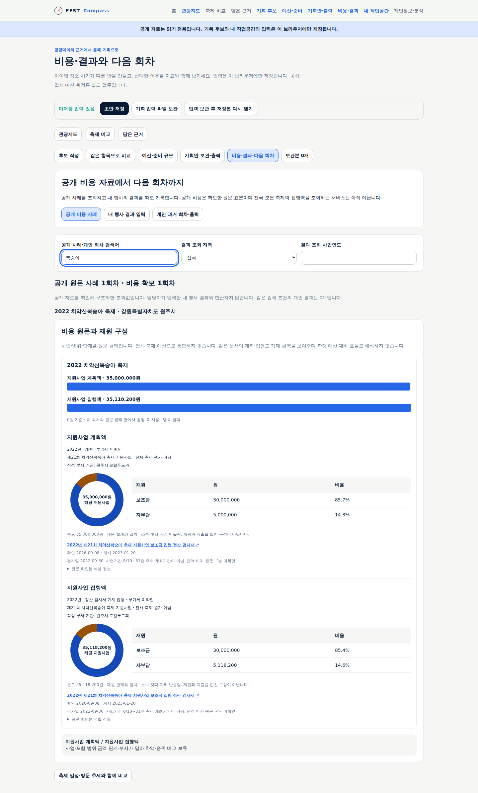
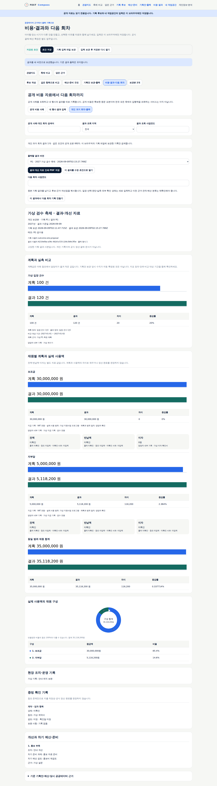
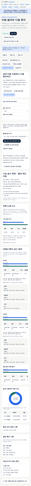
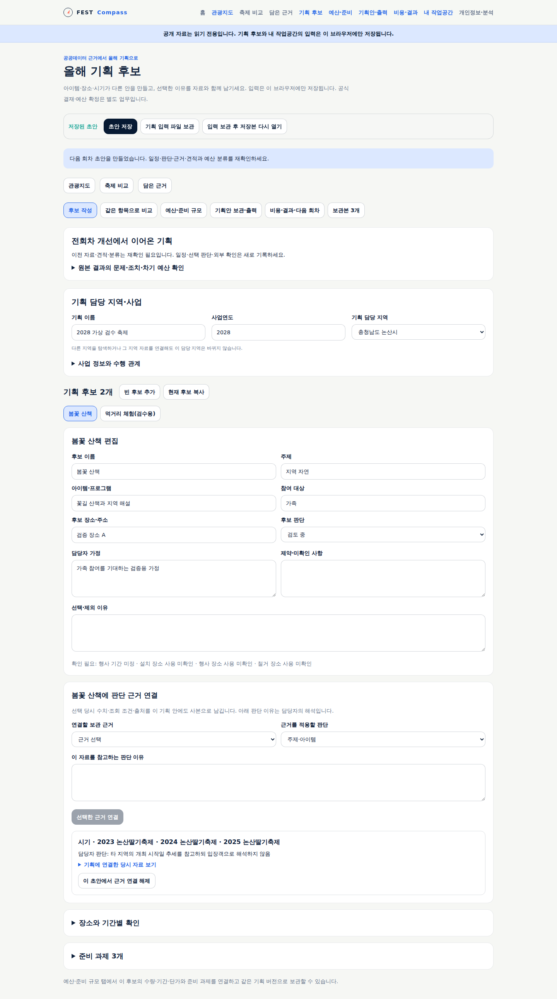
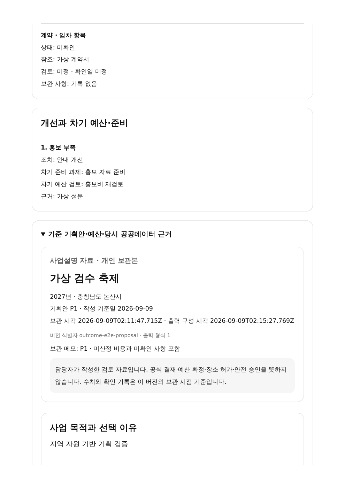

# 공개 비용·행사 결과와 다음 회차 기획

**개발·자동 검증 완료 / 앱 배포 대기.** 이미지 저장소 한도로 운영 반영을 기다리며, 아래 실제 화면은 로컬 검수 결과다.
배포 후 [비용·결과 화면](https://kto.damecasol.com/planning/outcomes)은 공개 사례 조회에서 시작한다.
실제 게시·검증 상태는 [M6 검증 기록](../../validation/25-planning-outcomes.md)을 따른다.
FR-LGR-5/6, FR-RPT-2/3의 결과 부분, UC-FC-007/TS-FC-007, SCR-FC-007에 대응한다.

## 담당자가 사용할 순서

1. **공개 비용 사례**에서 전국 또는 지역·연도·이름으로 확보한 과거 회차를 조회한다. 비용 미확보 회차도 남는다.
2. 원문 금액 단계·사업 범위·부서·연도·출처와 막대·재원 구성을 확인한다. 축제 비교 화면의 일정·방문 자료로 이동할 수 있다.
3. **내 행사 결과 입력**에서 보관한 기획안 P 버전을 선택한다. 선택된 후보의 포함 재원만 결과 행으로 가져오며 실제 사용액은 비워 둔다.
4. 현장 조치, 계획값 근거와 실측 정의·단위·대상 기간, 재원별 실제 사용·잔액·반납·이자를 기록한다. 숫자가 있으면 출처 구분과 참조가 필요하다.
5. 증빙 종류·적용 범위·참조·검토 담당·확인일·상태와 문제→개선 조치→차기 준비/예산 검토를 기록한다.
6. **현재 결과를 새 버전으로 보관**하고 **개인 과거 회차·출력**에서 R 버전을 고른다. 선택한 기획 P와 결과 R로 결과·개선 자료를 PDF 출력한다.
7. 다음 사업연도를 입력해 **이 결과에서 다음 회차 기획 만들기**를 누른다. 원본을 남기고 새 후보를 편집한다.

다른 결과를 시작하거나 기존 보관본을 수정 초안으로 열면 직전 결과 초안도 보관한다.
결과가 없거나 기획안이 없으면 작성 경로를 안내한다. 입력은 개인 브라우저에만 저장한다.

## 실제 비용의 의미와 출처 구분

| 표시 | 실제 제공하는 자료 | 해석 범위 |
|---|---|---|
| 공개 비용 조회값 | 확인한 공식 원문을 구조화한 기존 표본 | 원주 2022 지원사업 계획 35,000,000원·집행 35,118,200원. 전체 축제 원가 아님 |
| 공개 입찰 기초금액 | 논산 2025 일부 무대·운영 용역 110,000,000원 | 실제 집행·정산 금액으로 바꾸지 않음 |
| 담당자 내부 기록 | 내 행사 지출·실측 참조와 입력값 | 앱이 기관 원장·증빙을 검증했다는 의미 아님 |
| 공개 자료 전사 · 담당자 입력 | 담당자가 공개 문서에서 옮겨 적은 값과 참조 | 검증된 조회 표본과 구분. API 검증값으로 승격하지 않음 |
| 미확인 | 빈 금액과 미확인 사유 | 0·잔액·반납·이자를 추정하지 않음 |

전국 모든 축제의 집행액 API 연결은 아직 없다. 공개 원문 표본·내 행사 입력을 합산하지 않는다.
원주 원문의 잔액·이자 `-`는 미확인이고 반납액도 별도 자료가 필요하다.
금액의 사업 범위와 세금 기준이 미확인이면 다른 기획과의 차액·효율 비교를 보류한다.

## 그래프·표·결측

- 성과는 계획/실측 정의·단위가 일치하고 비교 대상 기간·계획 근거·실측 출처가 있을 때만 같은 축의 막대·차이를 표시한다. 계획 0은 비율 미산정이다.
- 계획 지표 숫자는 담당자가 참조를 보고 입력한다. M5의 자유문장 측정 계획에서 자동 추출하거나 과거 기획안에 소급해서 넣지 않는다.
- 재원 계획액은 고정한 기획안에서 읽는다. 중복 여부·기획 조건·사업 범위·세금·실제 사용 단계·출처를 확인한 행만 비교한다.
- 전체 재원 확인·동일 실제 사용 단계·누락 없음일 때만 합계와 재원 도넛을 표시한다. 도넛은 번호·수치 표를 함께 제공하며 합계 0은 구성비를 보류한다.
- 잔액·반납·이자는 각각 값·출처·미확인 사유를 표시한다. 계획과 실제의 차액으로 채우지 않는다.
- 증빙 링크만으로 지출 적정성이나 정산 완료를 판정하지 않는다.

## 결과 출력과 보관

출력은 선택한 기획·결과 ID와 보관 시각, 결과 기준일·메모·금액 단계·미확인·출처를 포함한다.
접힌 기획안·당시 예산·관광자료는 인쇄 시 펼치고 화면 상태를 복원한다.
R1을 출력한 뒤 R2에서 비용을 고쳐도 P1/R1 사본과 출력 내용은 그대로다.
P/R 번호는 해당 개인 파일의 표시 순서이고 식별은 불변 ID를 사용한다.

파일 v4는 기존 v1/v2/v3를 읽는다. `outcomes.draft`는 수정 중인 결과, `outcomes.revisions`는 불변 결과 사본이다.
각 결과는 `proposalId`로 같은 파일의 기획 보관본을 가리킨다. 기획 최대 20개·결과 최대 20개, 전체 5MB다.
가져오기 전 기획·결과 초안과 양쪽 보관본을 보존한다. ID 충돌·기존 보관본 수정/삭제·동시 창 충돌은 저장을 거부한다.
기존 저장 키는 유지한다. 오래된 앱이 v4를 읽어 새 결과를 유실시키지 않도록 버전 검증을 유지한다.

## 다음 회차에 이어지는 정보

원본 P/R은 유지하고 새 기획은 `previousOutcomeId`로 연결한다. 후보·담당 지역·근거 사본·견적 참조·개선점을 복사한다.
새 기획·행사 단계의 날짜·선택 이유·장소 확인·준비 기한/진행/외부 검토·실제 사용 기록은 초기화한다.
재원 확정과 예산 분류는 미확인으로, 예산은 담당자 산출 단계로 돌아간다. 예전 견적·근거 연도는 원문대로 두고 재확인을 표시한다.
선택 후보의 개선점은 새로운 준비 과제로 연결하고 차기 예산 검토 항목과 원본 개선 참조를 남긴다. 새 예산액을 자동 결정하지 않는다.

## 실제 화면 검수

공개 원문 표본과 가상 개인 기획을 분리해 검증한 화면이다. 아래 개인 금액·기관·성과는 가상 입력이다.

## 남은 검증과 확장

실무자 관찰·전체 업무 인수, 전국 실제 집행 자료 수집, 공동 기록·공식 결재/정산은 남아 있다.
기존 `/workspace` 파일을 M6 기획 파일로 자동 통합하지 않는다. 기존 개인 운영 기능은 별도로 유지한다.
정형 API/Spec/Run·티켓 연결을 자동 시험 보고서로 대체하지 않는다.
