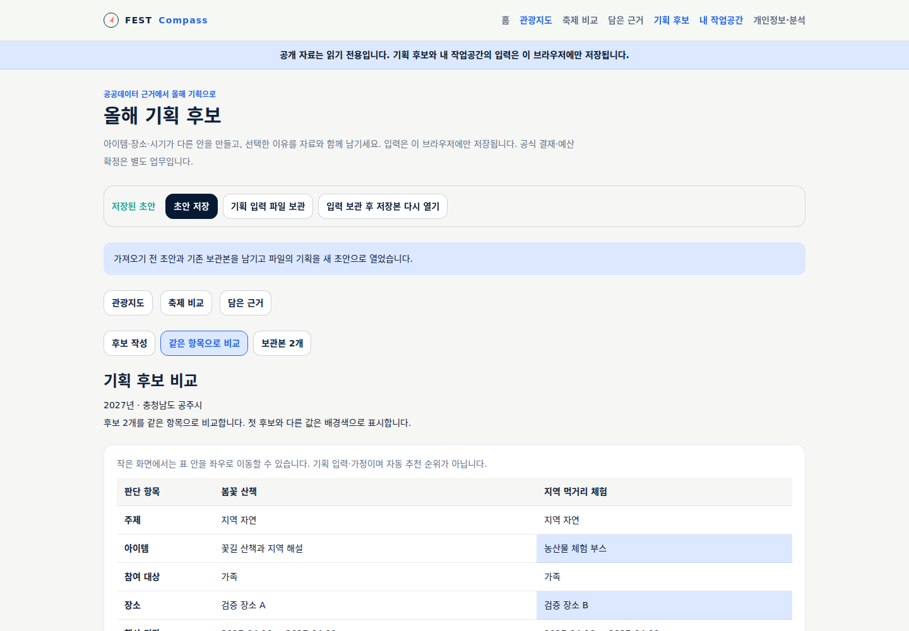
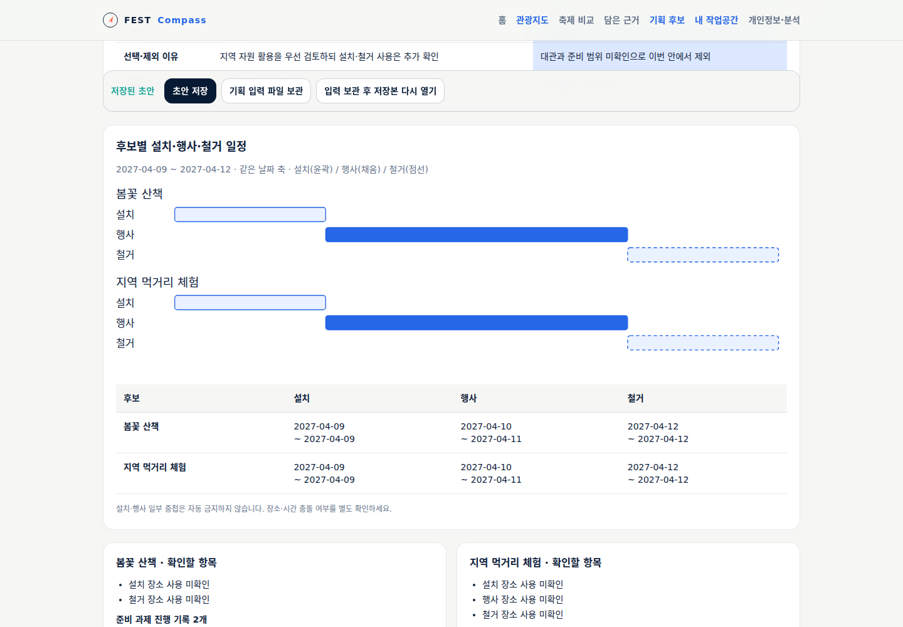
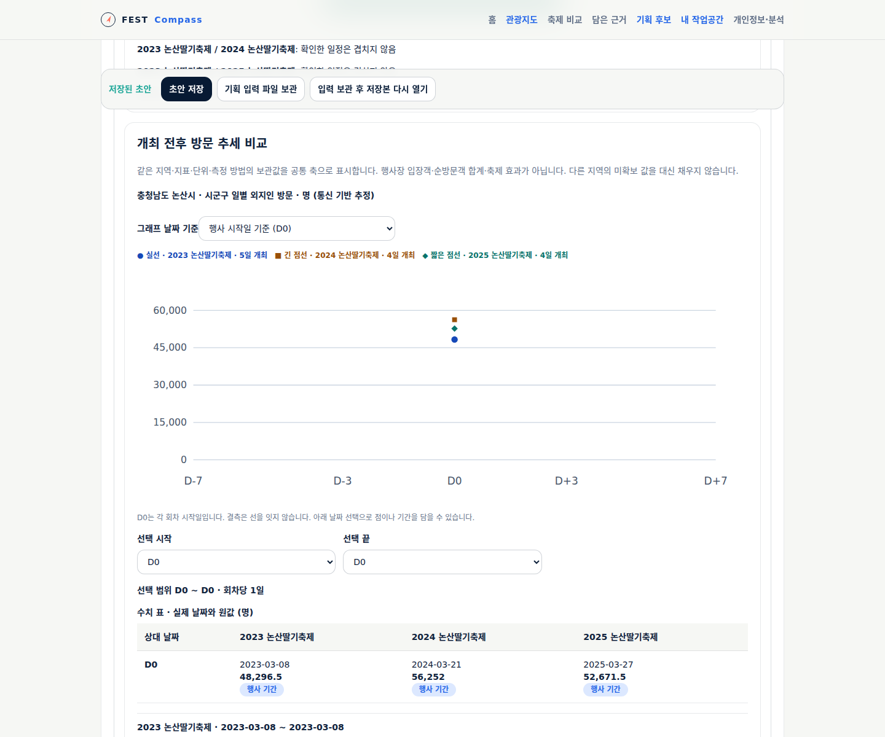
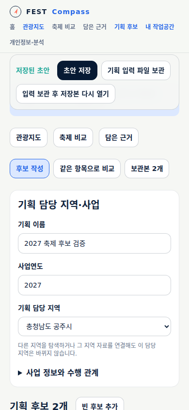

# 근거에서 올해 기획 후보로

[올해 기획 후보 열기](https://kto.damecasol.com/planning/options)에서 사용할 수 있다.
지도·비교에서 먼저 자료를 담으면 후보에 연결할 근거 목록에 나타난다.

대상 화면은 **SCR-FC-003 담은 근거 → SCR-FC-004 올해 기획 후보**다.
기존 [요구사항](../1-analysis/srs.md), [UC-FC-004](../1-analysis/usecases/UC-FC-004.md),
[화면 v3](screens.md)의 M3 범위를 구현한다. 기존 와이어프레임을 당시 시안으로 보존한다.

## 사용 흐름

1. 관광지도나 축제 비교에서 필요한 자료를 근거로 담는다.
2. 담은 근거의 ‘이 근거로 후보 기획’을 누르고 기획 담당 지역·사업연도를 정한다.
3. 주제·아이템·참여 대상·장소·기간을 입력하고 판단 항목별로 근거와 참고 이유를 연결한다.
4. 후보를 복사하거나 추가해 다른 안을 만든다. 같은 항목 비교표와 공통 날짜 축에서 차이를 확인한다.
5. 우선 후보 또는 제외 후보를 표시하고 이유·가정·제약을 적는다.
6. 초안을 저장하고 비교 화면에서 당시 안을 보관본으로 남긴다. 이후 수정은 초안에 반영된다.

입력은 개인 브라우저에만 저장한다. 한 기획의 초안에서 최대 6개 후보·20개 보관본을 관리한다.
자료가 없어도 가정을 적어 초안을 저장할 수 있고, 후보 1개는 비교 전 초안으로 안내한다.
담당 지역은 사용자가 직접 선택한다. 탐색 지역·근거의 지역으로 자동 변경하지 않는다.

## 기록할 수 있는 내용

| 영역 | 내용 | 구분할 상태 |
|---|---|---|
| 사업 | 이름·담당 지역·연도·부서·목적·신규/계속·기간·기준일 | 미정도 초안 저장 가능 |
| 수행 관계 | 기관/역할·직접/재단/위탁/용역/보조·범위·참조·확인일 | 복수 관계를 기록하고 기관 유형으로 분류하지 않음 |
| 후보 | 주제·아이템·대상·장소·기간·선택/제외 이유 | 관측 자료와 담당자 가정·해석 분리 |
| 장소 | 설치/행사/철거별 사용·전력·화장실·접근·교통 | 미확인/조건부 가능/가능/불가, 담당·일자·참조 |
| 준비 과제 | 담당·기한·필요 자료·참조·선행 과제·예외 진행 이유 | 적용 여부, 업무 진행과 외부 확인 각각 기록 |
| 보관 근거 | M1 지역 자료와 M2 비교 자료의 선택 당시 사본 | 원값·결측·단위·조회 조건·출처와 판단 이유 분리 |

장소의 ‘가능’ 등 확인에는 장소·적용 구간·확인 조직/역할·확인일·참조가 필요하다.
행사 기간의 확인은 설치·철거에 적용하지 않는다. 기간 일부 중첩은 자동 금지하지 않고 확인할 수 있게 날짜를 보여준다.
장소·아이템·대상·기간이 바뀌면 준비 과제는 재확인이 필요하다. 이전 조건의 확인 기록은 보존한다.
참조 추가는 완료나 외부 확인을 뜻하지 않는다. 해당 없음에는 사유·판단일을 요구하고
자기 참조·순환·다른 후보의 과제 참조를 거부한다. 선행 미완료 상태로 진행하려면 예외 이유가 필요하다.

## 비교와 자료 확인

- 같은 항목 표에서 첫 후보와 다른 값을 강조한다. 가용 자료를 점수나 흥행 순위로 바꾸지 않는다.
- 설치·행사·철거를 같은 날짜 축에 그린다. 미정 날짜는 표와 미정 표시로 남긴다.
- 준비 과제는 완료·진행·미착수·재확인·해당 없음의 **기록 개수**를 보여준다. 안전 승인이나 준비 완료율이 아니다.
- 연결한 근거를 펼치면 M1 수치 표, M2 방문 추세·일정·비용·재원 그래프와 출처를 다시 볼 수 있다.
- 보관본에서도 당시 사업·수행 관계·장소 확인·준비 과제·근거를 조회한다.

## 저장과 복원 계약

새 저장 키는 `fest-compass.planning.v1`, 파일은 `fest-compass-planning` 형식 v1이다.
M1/M2 보관함에서 자료를 읽고 기획 안에 사본으로 연결하며 기존 저장 형식은 변경하지 않는다.
기획 파일은 최대 5MB, 후보별 준비 과제는 30개다. 파일에 근거 사본과 보관본을 함께 담는다.

- 저장 전 형식·값·날짜·참조·의존 관계·크기를 검증한다. 미정 내용은 확인 필요 상태로 남긴다.
- 이미 보관한 버전을 바꾸거나 제거하는 저장을 거부한다. 초안의 근거 연결 해제는 보관본에 영향을 주지 않는다.
- 후보 복사는 근거와 가정을 가져오되 선택 판단·장소 확인·과제 기한/진행·외부 확인을 초기화한다.
- 파일 가져오기는 직전 초안을 보관하고 양쪽 보관본을 합친 뒤 가져온 기획을 초안으로 연다.
- 보관본을 다시 열 때도 직전 초안을 보관한다. 같은 보관본 ID에 다른 내용이 있으면 거부한다.
- 미저장 상태의 화면 이동을 안내하고 브라우저 종료 시 입력 유실을 알린다. 화면 내 후보/탭 전환은 입력을 유지한다.
- 다른 창의 저장이 감지되면 미저장 입력을 덮어쓰지 않는다. 저장 직전 비교와 지원 브라우저의 Web Locks로 충돌을 차단한다.
- 저장 공간 부족·손상 파일은 기존 값을 유지한다. 입력 파일 보관과 저장본 다시 열기를 제공한다.
- 파일의 형식 검증은 외부 기관 문서의 진위 확인이나 전자결재가 아니다.

## 검수할 과제

‘봄꽃 산책’과 ‘지역 먹거리 체험’ 두 안을 작성하고, 논산의 실제 지역 방문 추세를 시기 판단에 연결한다.
기획 담당 지역을 다른 지역으로 설정해도 논산 자료로 바뀌지 않는지 확인한다.
행사 기간만 장소 사용을 확인한 뒤 종료일을 바꾸고 준비 과제의 재확인 표시와 이전 기록을 살펴본다.
두 안을 보관한 뒤 초안의 근거 연결을 해제하고 보관본의 당시 수치가 그대로인지 확인한다.
이 후보 이름·장소·기간·가정은 **검수용 입력**이며 실제 축제 기획이나 기관의 확인 결과가 아니다.

자동 검증은 [M3 검증 기록](../../validation/22-planning-options.md)에 연결한다.

## 실제 구현 화면

2026-09-08 headless 브라우저로 로컬 운영 빌드를 확인한 화면이다.
기획 후보·사업·장소·담당 역할·확인 메모는 검수용 가상 입력이며, 연결한 논산 방문값은 실제 보관 자료다.
1440px 비교·일정·근거 상세와 390px 모바일을 확인했다.

## 남은 기능

예산 수량×단가 산출과 재원/지출·규모 비교는 M4, 완성 기획안·사업설명/준비 목록 출력은 M5에서 연결한다.
공동 저장·공식 승인·전국 과거자료 확장·지도 품질 보완·실제 담당자 관찰은 이번 구현 완료에 포함하지 않는다.
정형 OpenAPI/Spec/Run 연결도 별도 후속이다.
