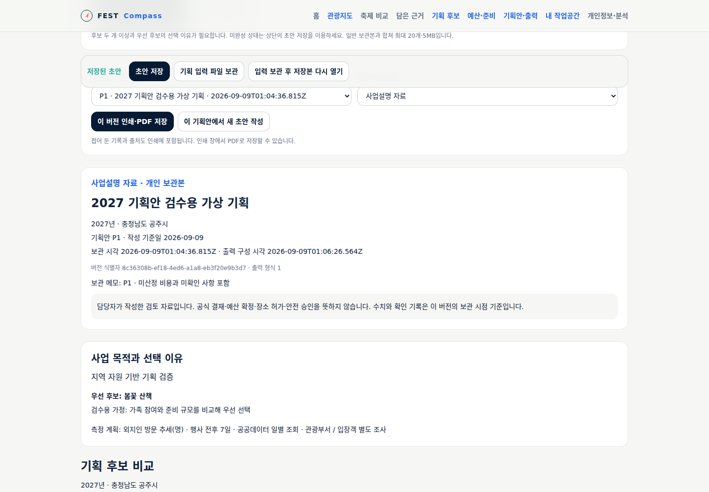
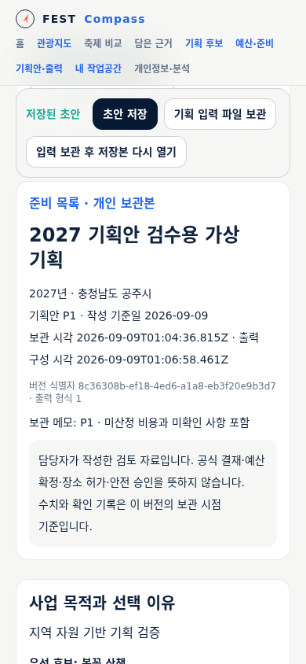
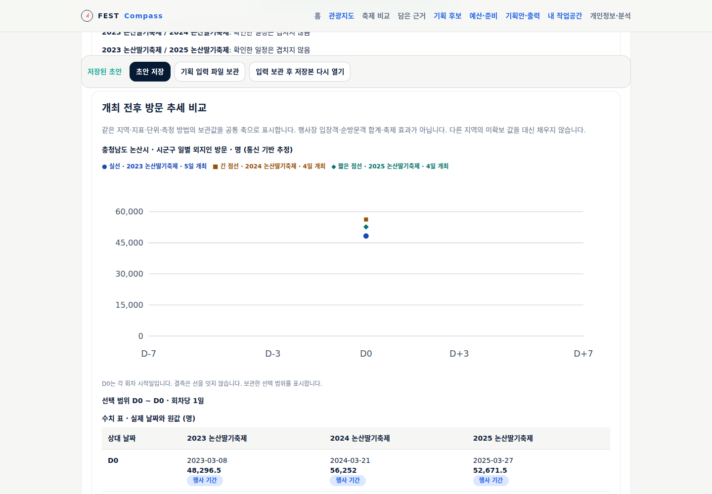
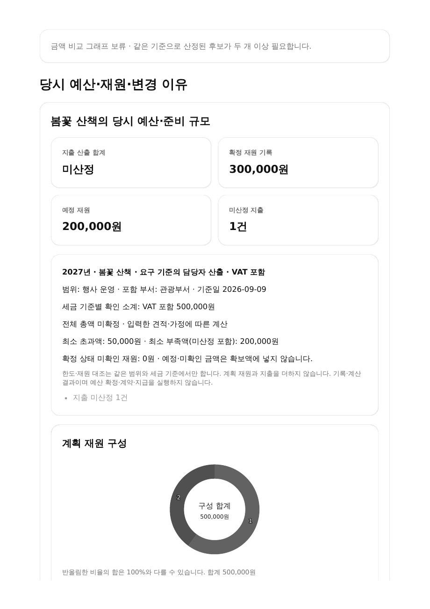

# 근거가 연결된 기획안과 출력

[기획안 화면](https://kto.damecasol.com/planning/proposal)과 기획 화면의 **기획안 보관·출력** 탭에서 같은 개인 초안을 사용한다.
FR-RPT-2/3의 M5 부분, UC-FC-006/TS-FC-006, SCR-FC-006을 구현했다.
실제 제공·게시 확인은 [검증 기록](../../validation/24-planning-proposal.md)을 따른다.

## 담당자가 사용할 순서

1. 전국 관광지도와 축제 비교에서 자료를 담고 기획 후보에 판단 근거로 연결한다.
2. 두 개 이상의 후보를 비교하고 우선 후보 하나와 선택 이유를 적는다.
3. 예산·준비 기록과 측정 계획을 검토한다. 측정 계획에는 지표·단위·기간·방법·담당을 적는다.
4. **현재 초안을 기획안으로 보관**한다. 미산정 비용·미확인 장소·자료 없는 항목은 그 상태로 남는다.
5. P1/P2 등의 버전과 **사업설명 자료 / 준비 목록**을 고른다. 두 자료는 같은 보관본을 사용하며 준비 목록에서는 과제 상세를 먼저 배치한다.
6. **이 버전 인쇄·PDF 저장**으로 출력한다. 접힌 기록과 출처도 포함한다. 인쇄 창에서 PDF를 선택할 수 있다.
7. 수정하려면 **이 기획안에서 새 초안 작성**을 누른다. 직전 초안도 일반 보관본으로 남기며 기존 기획안은 변경하지 않는다.

후보 한 개·우선 후보 없음·선택 이유 공백이면 기획안 보관 버튼을 사용할 수 없다. 초안 저장은 가능하다.
기획안 보관은 공식 결재·예산 확정·장소 허가·안전 승인을 뜻하지 않는다.

## 화면과 출력에 함께 남는 정보

| 내용 | 보관·출력 기준 |
|---|---|
| 지역·사업 | 사업연도·부서·목적·신규/계속·기간·수행 관계·작성 기준일 |
| 대안 판단 | 주제·아이템·대상·장소·설치/행사/철거·가정·제약·선택 이유 |
| 비용 | 재원과 지출 분리, 확정/예정/미확인, 수량·기간·단가·세금·원문 단계·증감 이유 |
| 준비 | 담당·기한·적용 여부·선행 과제·진행·외부 검토·이전 조건 재확인 |
| 공공 근거 | 선택 당시 조회 조건·기간·원값·수집 시각·출처·결측과 담당자의 해석 |
| 버전 | 개인 보관 표기·P 번호·불변 ID·보관 시각·출력 구성 시각·출력 형식 |

P 번호는 이 개인 파일의 기획안 표시 순서다. 식별과 복원에는 불변 ID를 사용한다.
출력 구성 시각은 해당 버전·자료 종류를 고른 시각이며 브라우저/프린터의 실제 완료 시각은 아니다.
담당자가 아직 적지 않은 측정 계획은 미정으로 표시한다. 측정 결과 입력은 M6 범위다.

## 시각화와 자료 해석

일정·준비 기록·비교 가능한 예산 막대·재원/지출 도넛과 같은 값의 표를 함께 제공한다.
방문 추세는 보관한 조회 조건과 선택 범위로 고정하며 출력 화면에서 범위를 다시 선택하지 않는다.
지역 방문 이력도 날짜별 그래프와 수치·품질·보관 식별자를 제공한다. 결측 날짜는 선을 연결하지 않는다.
분모·세금·범위·중복이 미확인인 비용은 그래프/구성비를 보류하고 이유를 남긴다.
방문 추세는 행사장 입장객·고유 인원·축제 효과로 바꾸어 해석하지 않는다.

인쇄에서는 표의 가로·세로 스크롤 제한을 풀고 출처 URL을 문자로 남긴다. 선 형태·기호·번호와 수치 표를 함께 사용한다.
화면의 접힘 상태는 인쇄 후 되돌린다. 넓은 후보 표는 모바일에서 표 내부를 가로로 이동한다.

## 개인 파일의 호환과 복구

저장 키는 기존 `fest-compass.planning.v1`을 유지한다. 기획안·측정 계획 사용 시 파일은 v3가 된다.
v1/v2의 일반 보관본을 기획안으로 소급 승격하지 않으며 기존 보관본의 JSON을 바꾸지 않는다.
v3의 `Revision.proposal.format=1`이 기획안임을 표시한다. 자료·예산·준비·측정 계획은 그 `draft` 사본에 들어 있다.
구 앱이 새 필드를 버리고 저장하지 않도록 v3를 구분한다. 미래 버전·불완전 기획안·같은 ID의 다른 내용은 가져오기를 거부한다.
가져오기 전 초안과 양쪽 보관본을 유지한다. 기존 20개·5MB 제한, 동시 창 충돌 감지와 실패 시 저장값 유지도 적용한다.
PDF는 내려받은 출력물이고 서버 보관/공유 링크는 없다. 기획 입력 JSON 파일은 별도로 백업한다.

## 실제 화면

아래 화면의 후보·예산·기관·확인 내용은 검수용 가상 입력이다. 연결한 논산 과거 방문 자료는 검토된 실제 보관 사본이다.

v3 개발 전 와이어프레임은 당시 제안으로 유지한다. 실제 담당자 과제 관찰·정형 Spec/Run 연결·M6 결과 자료는 후속이다.
