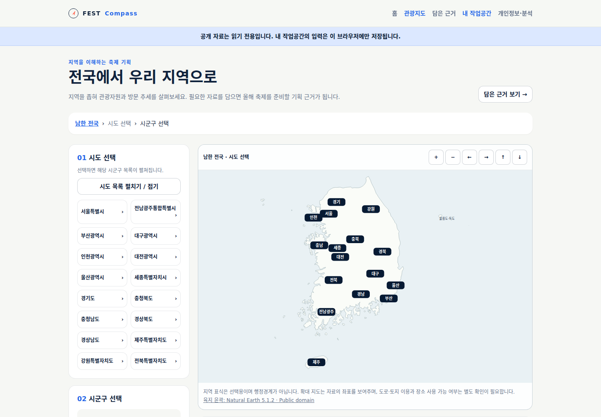
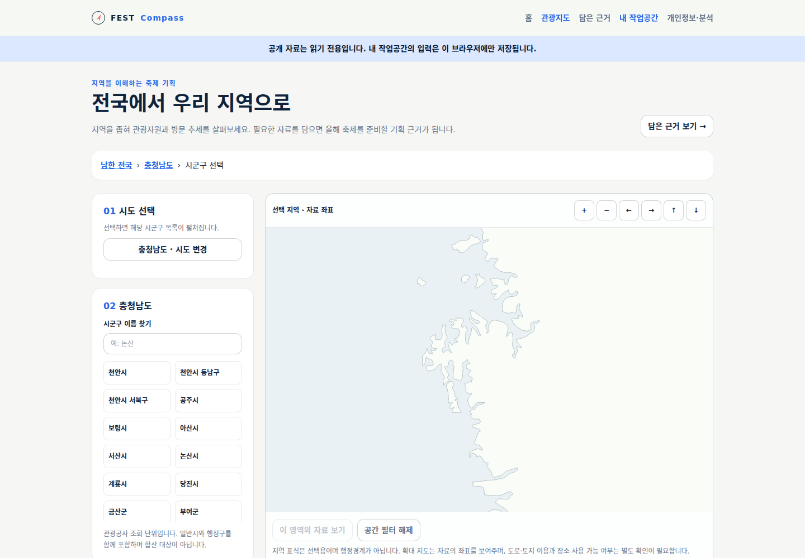
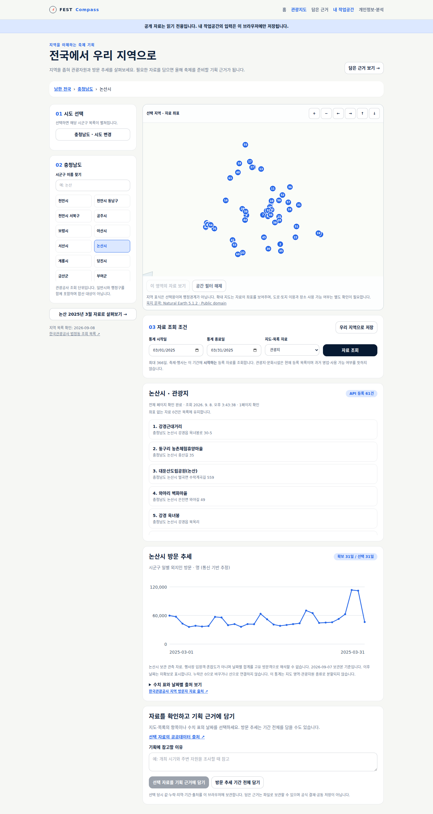
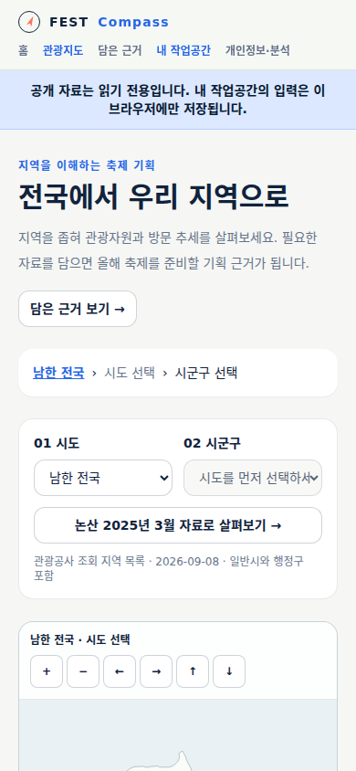

# 전국에서 우리 지역으로 · 첫 구현 검수

전국 지도에서 시도를 선택하면 해당 시군구 목록이 펼쳐진다. 선택 지역의 관광지·문화시설·등록 행사를
지도와 목록으로 확인하고, 논산 방문 추세를 선그래프·수치 표로 조회해 필요한 자료를 담을 수 있다.
실제 서비스의 [전국 관광지도](https://kto.damecasol.com/regions)와 [담은 근거](https://kto.damecasol.com/evidence)를 사용한다.
공개 반영·검증 결과는 [M1 검증 기록](../../validation/20-region-explorer.md)에 기록한다.

## 시도에서 시군구로 좁히는 화면

1. 처음과 일반 재방문에는 제주·도서 지역을 포함한 전국을 표시한다. 위치 권한이나 담당 지역 입력은 필요 없다.
2. 지도 표식 또는 시도 목록을 누른다. 선택된 시도 이름을 남기고 시도 목록은 접어, 시군구 선택을 바로 보이게 한다.
3. 시군구를 누르면 자료를 조회한다. 상단의 `전국 › 시도 › 시군구` 경로로 상위 단계에 돌아간다.
4. 390px에서는 `01 시도`와 `02 시군구` 선택창을 나란히 제공한다. 시도를 바꾸면 시군구 선택과 이전 자료가 비워진다.
5. ‘우리 지역으로 저장’은 브라우저에 바로가기를 저장한다. 이후 방문에서도 이 버튼을 눌러야 우리 지역으로 이동한다.

위 캡처는 API가 연결된 격리 로컬 실행을 headless Chromium으로 확인한 화면이다. 운영 주소 확인은 검증 기록과 구분한다.

지도는 Natural Earth 5.1.2의 대한민국 육지 윤곽 53개 폴리곤을 자체 표시한다.
시도 표식은 선택용 위치이며 행정경계나 통계의 면적 표시가 아니다. 확대하면 조회 자원의 좌표가 표시된다.
도로·필지 지도, 행정경계별 색상 통계와 지도 안의 시군구 경계 클릭은 후속이다. 목록·선택창으로 모든 조회 지역에 접근할 수 있다.
지도 확대·이동 후 ‘이 영역의 자료 보기’를 눌러야 공간 필터가 적용된다. 좌표 없는 항목은 목록에 남기고,
시군구 방문 통계는 지도 사각형이나 자원 종류로 나누지 않는다.

## 실제 자료와 제공 범위

| 자료 | 이번 확인·구현 | 해석 범위 |
|---|---|---|
| 지역 선택 목록 | 2026-09-08 한국관광공사 `ldongCode2` 269행 전체 확인 | API 조회 지역 16개 시도 그룹. 일반시·행정구를 함께 포함하므로 269개 기초자치단체라는 뜻이 아님 |
| 행정 개편 | 전남광주통합특별시 `12`, 인천 개편 구 이름을 원문대로 보존 | 현재 관광 API 코드이며 다른 과거 통계의 지역코드로 자동 치환하지 않음 |
| 세종 | `36110/36110` 원문 코드로 관광지 54건 확인 | `36/110` 실호출은 0건. 두 자리/세 자리로 임의 보정하지 않음 |
| 논산 관광지 | 실제 API 등록 61건 전체 조회 | 현재 등록 목록. 과거 영업·대관 가능 여부가 아님 |
| 논산 2026년 행사 | 실제 등록 4건 전체 조회 | 2026년에 시작하는 현재 API 등록 자료. 지난 회차의 독립 보관소가 아님 |
| 방문 추세 | 보관된 논산 2023~2026 자료와 매일 수집의 최신 보관본을 읽음 | 시군구 일별 외지인 추정. 행사장 입장객·혼잡도가 아니며 날짜별 합계를 고유 방문객으로 만들지 않음 |
| 다른 지역 방문 추세 | 미확보 표시 | 논산 자료를 다른 지역에 대신 표시하지 않음 |

지역 목록은 확인 시점이 고정된 원문을 배포에 포함한다. 자동으로 매번 새 행정 목록을 받는 기능은 후속이며
유지보수 시 공식 `ldongCode2` 전체 응답을 재확인한 뒤 `build-region-assets.mjs`로 갱신한다.
일반시와 하위 행정구의 자료를 중복 합산하지 않는다. 지역 합계·전국 순위·전체 고유 방문객은 제공하지 않는다.

관광지·문화시설은 현재 등록 목록이다. 행사 목록은 선택 기간에 **시작하는** 행사를 조회하며,
기간 전 시작해 계속 중인 모든 행사를 검색하는 기능과는 다르다. 빈 결과는 실제 행사 부재의 증거가 아니다.
과거 비교는 M2에서 독립 회차와 출처를 연결한다.

## 근거 보관

지도·목록 항목, 방문 추세의 한 날짜 또는 기간 전체를 선택한다. 출처, 지역, 기간, 당시 값,
누락, 원천 식별자, 수집 시각과 담당자 메모를 함께 보관한다. 지도 항목에는 적용한 공간 필터도 남는다.
같은 자료 버전·선택 범위는 중복 저장하지 않는다. 원천 수정 시에는 새 사본이 되며 기존 근거를 덮지 않는다.

한 브라우저에서 최대 50개·파일 2MB까지 보관·복원한다. 손상 파일은 거부하고 기존 자료를 보존한다.
개인 운영 작업공간에서 ‘지도에서 담은 기획 근거 확인’으로 다시 열 수 있다.
기획 후보·예산안·출력 버전에 근거를 직접 연결하는 일은 M3~M5에서 이어간다.

## 다음 검수 과제

- 전국→충남→논산 선택 단계와 상위 복귀가 눈에 들어오는가.
- 관광지·문화시설·행사 목록과 방문 추세의 서로 다른 기간 의미를 구분할 수 있는가.
- 관광지 1건과 2025-03-27 방문값 52,671.5명을 담은 뒤, 출처와 선택 당시 값을 다시 찾을 수 있는가.
- 공주 등 다른 지역으로 이동했을 때 방문 이력 미확보를 실제 0명으로 오해하지 않는가.

## 출처

- [한국관광공사 국문 관광정보 API](https://www.data.go.kr/data/15101578/openapi.do): `ldongCode2`, `areaBasedList2`, `searchFestival2` 실호출.
- [한국관광공사 지역 방문자 API](https://www.data.go.kr/data/15101972/openapi.do): 기존 보관 원천과 새 화면 값 대조.
- [행정안전부 전남광주 행정통합 안내](https://www.mois.go.kr/frt/bbs/type002/commonSelectBoardArticle.do?bbsId=BBSMSTR_000000000216&nttId=127091): 현행 목록 변경 교차 확인.
- [Natural Earth 이용 조건](https://www.naturalearthdata.com/about/terms-of-use/), [고정 버전 원천](https://github.com/nvkelso/natural-earth-vector/blob/v5.1.2/geojson/ne_10m_admin_0_countries.geojson): public domain 육지 윤곽. 원천 SHA-256을 앱 자료에 보존.
