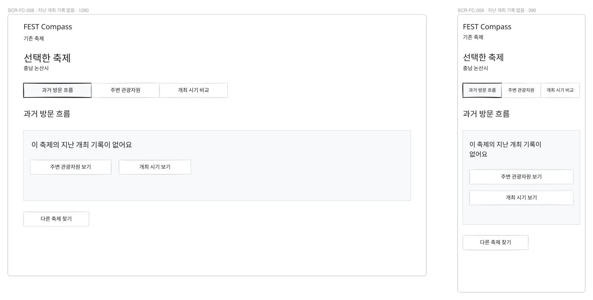
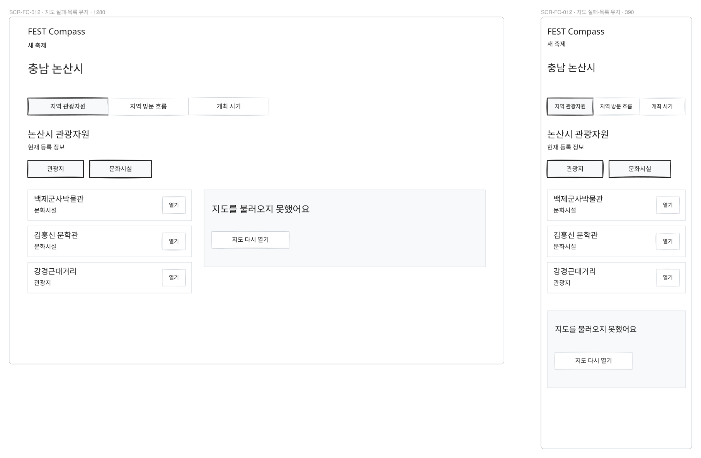
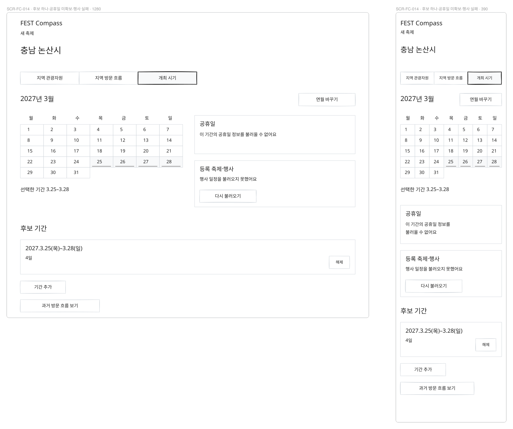
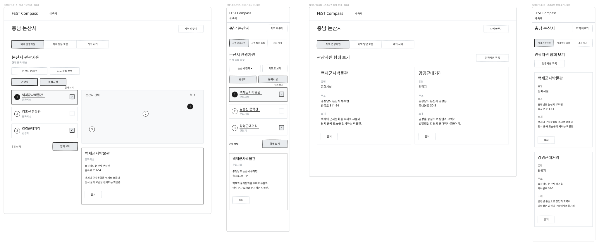
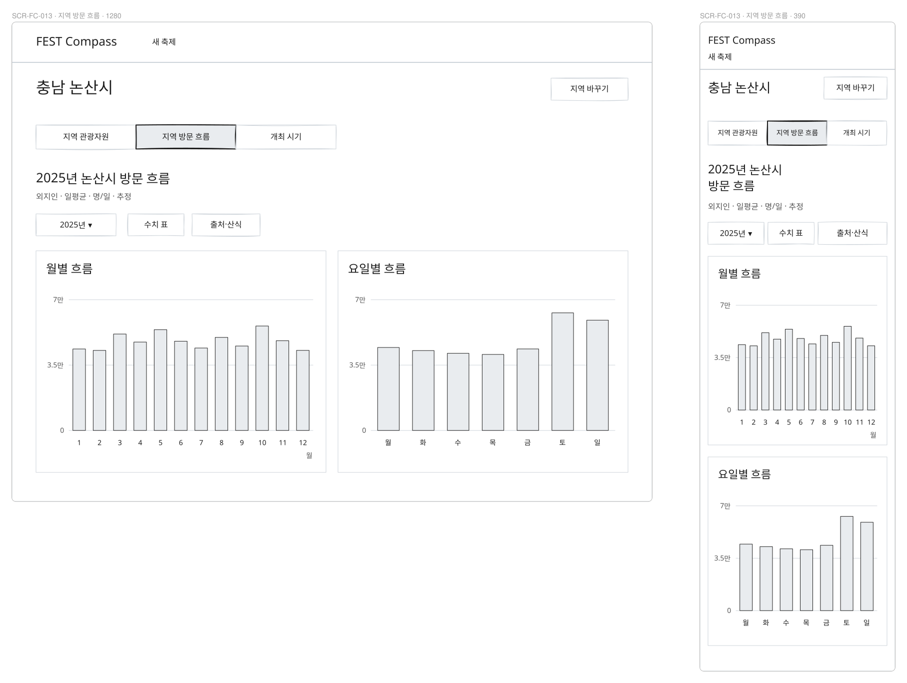
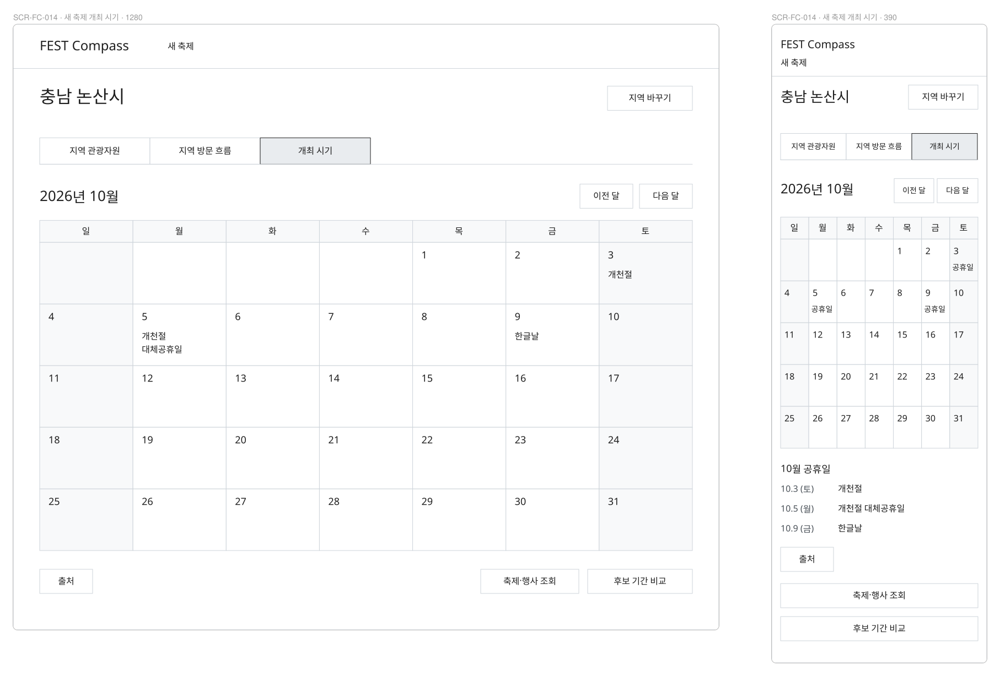
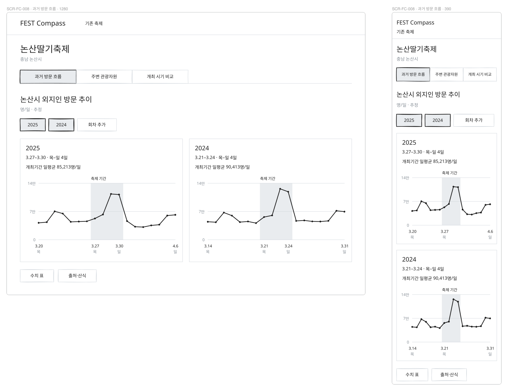
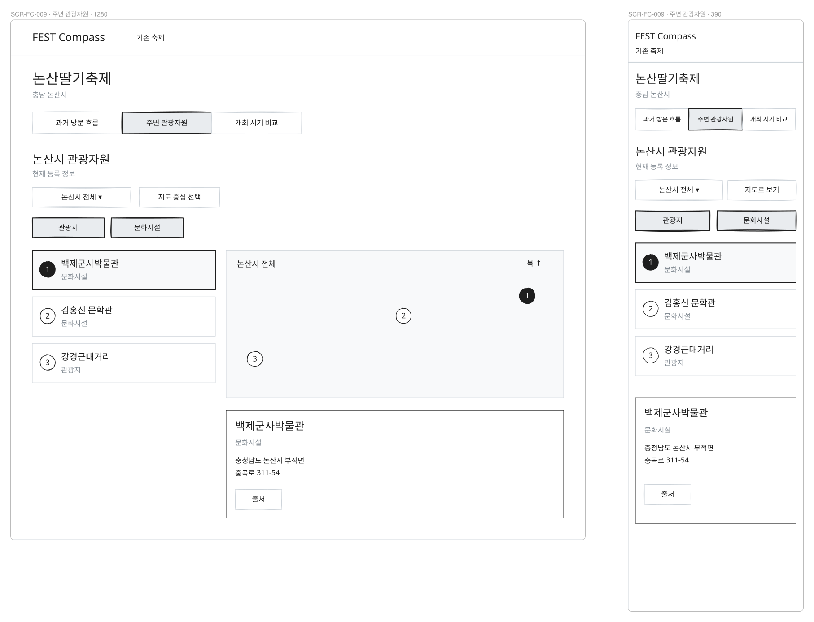
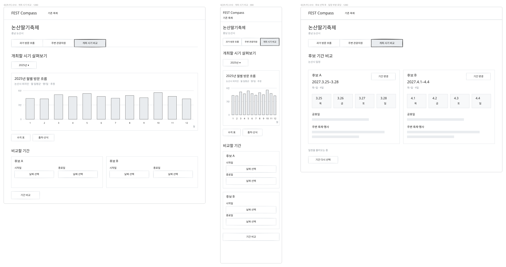
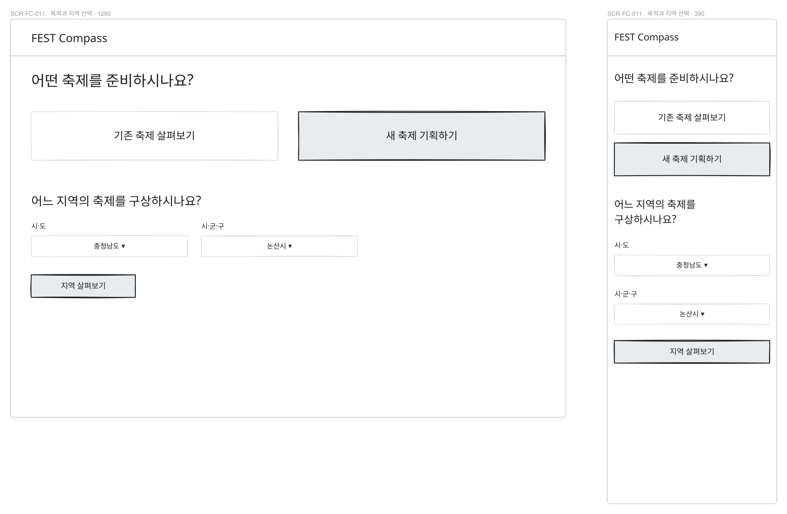

# 화면설계서

## 임실 방문 자료 보강

SCR-FC-008의 시군구 일별 차트 아래에는 확인된 회차의 개최 행정동 방문 구성을 별도 그룹으로 둔다.
SCR-FC-013의 월·요일별 차트 아래에는 임실군 2018~2025 연간 추세와 확인 연도로 이동하는 버튼을 둔다.
제목·단위·간격으로 서로 다른 대상을 구분하며 미확인 성·연령·거주지·목적지 순위의 빈 카드는 만들지 않는다.
[기능 상세 §9의 기본 와이어프레임](functional-spec.md#9-방문-구성과-지역-연간-추세)을 따른다.
실제 화면·검증은 [기록37](../../validation/37-visitor-context.md)에 남기며 최종 시각 디자인은 후속이다.

## 관련 자료 검색 · 2026-09-24 추가 설계

기존 축제·새 축제의 세 핵심 메뉴 안에 보조 버튼 `관련 자료 검색`을 추가한다. 별도의 주 메뉴는 만들지 않는다.
기존 축제 머리, 새 축제 지역 머리, 사용자가 연 자원 상세의 버튼 줄에 배치한다.
기존 `InfoDialog`의 작은 창에서 주제·확인된 회차 연도·검색어를 확인하거나 고친 뒤 외부 검색을 새 탭으로 연다.
새 축제의 지역·자원 검색에는 회차 연도를 표시하지 않는다. 창을 닫으면 누른 버튼으로 돌아온다.

화면 목표는 수치에서 생긴 질문을 프로그램·보도자료·지역 사업 사례의 원문 확인으로 연결하는 것이다.
공공데이터 차트·목록을 우선하고, 기사 결과·수치·요약은 이 화면에 배치하지 않는다. 내부 절차 안내는 추가하지 않는다.
기본 배치·전체 문구·상태·연도 규칙은 [기능 상세 §8](functional-spec.md#8-관련-자료-검색원문-연결),
실제 구현·검수 상태는 [기록36](../../validation/36-related-material-search.md)을 따른다.
아래 v5·v6·v7 정적 그림에는 이 후속 기능이 포함되어 있지 않다.

## v7 화면 목표와 디자인 전달 범위

2026-09-23 사용자 요청으로 **기능·기획 개선, 화면 목표·와이어프레임·기본 배치**에 집중한다.
상세 조작·완료 경험·조건 유지·복구는 [기능 상세](functional-spec.md)가 정한다. 색·폰트·크기·간격·컴포넌트 외형은
이전 그림의 고정값으로 취급하지 않고 사용자의 디자인 작업에서 조정한다. 목표와 정보의 의미·순서·행동은 유지한다.
기존 축제의 실제 구현과 검증은 [기록34](../../validation/34-existing-festival-journey.md)를 따른다. 새 축제 전용 흐름은 사용 가능하며 결과는 [기록35](../../validation/35-pickdday-new-festival.md)를 따른다. 아래 v7 그림은 부족한 자료·오류 상태를 설명하는 개발 전 기본 배치다.

| 화면 | 사용자가 이루려는 일 | 기본 배치·읽기 순서 | 다음 행동·완료 경험 |
|---|---|---|---|
| SCR-FC-011 | 자신의 준비 상황과 탐색 대상을 정함 | 두 목적 → 기존은 축제명/지역 검색·결과, 새 축제는 시도/시군구 | 축제 또는 지역 선택만으로 탐색 시작 |
| SCR-FC-008 | 지난 개최 시기의 지역 방문 차이를 읽음 | 축제·지역/메뉴 → 회차·기간 → 동일 Y축 회차 차트 → 수치 표·출처 | 다른 회차/자원/시기. 기록 없이 과거 흐름 확인 |
| SCR-FC-009 | 기존 축제 주변의 현재 관광자원을 검토 | 축제·지역/메뉴 → 유형·위치 조건 → 목록과 지도 → 선택 상세 | 자원 열기·중심 적용/해제. 지역 방문을 시설 방문으로 해석하지 않음 |
| SCR-FC-010 | 과거 계절 특성과 다음 날짜 여건을 함께 읽음 | 축제·지역/메뉴 → 관측연도·월별 방문 → 실제 연월 달력 → 선택적 후보 0~2개 | 후보 없이도 달력 탐색. 관측과 후보 날짜를 별도로 유지 |
| SCR-FC-012 | 새 축제에 활용을 검토할 자원 차이를 읽음 | 지역/메뉴 → 유형·위치 조건 → 목록과 지도 → 상세·함께 보기 | 최대 두 자원의 실제 필드 비교. 장소 확정·기록 불필요 |
| SCR-FC-013 | 지역의 월·요일 방문 특성을 읽음 | 지역/메뉴 → 관측연도 → 월별·요일별 → 일별 수치 표·출처 | 월 선택·그 실제 연월 일정, 자원·시기로 이동 |
| SCR-FC-014 | 개최일을 정하기 전 일정 여건을 살펴봄 | 지역/메뉴 → 연월 달력 → 날짜별 휴일/행사 → 선택적 후보 0~2개 | 한 기간도 확인 가능. 저장·선택 이유 없이 종료 |

넓은 화면은 비교 정보를 나란히 두고, 390px에서는 위 표 순서로 쌓는다. 자원은 좁은 화면에서 목록 우선,
차트는 수치 표, 달력은 날짜 입력으로 같은 정보를 다룬다. 일반 메뉴 이동은 각 화면 조건을 유지한다.
자료가 없으면 관련 차트/목록 자리만 바꾸며 다른 메뉴와 정상 결과는 계속 제공한다.

### v7 부족한 자료와 조회 실패의 기본 배치

정상 상태의 기존 v5·v6 그림과 **함께** 읽는다. 아래 그림은 상태 검토를 위한 예시이며 특정 축제의 실제
자료가 사라졌거나 실제 서비스가 실패했다는 증거가 아니다. 원천에 없는 방문 수·행사 수·소개를 예시값으로 채우지 않았다.
프레임의 상태 이름은 검토용 메타데이터다. 제품 화면 내부에는 작업/검수 설명을 넣지 않는다.

- SCR-FC-008: 축제·지역과 세 메뉴를 유지하고 방문 영역 한 곳에서 자원/시기·다른 축제 찾기를 제공한다.
- SCR-FC-012: 지도 실패에도 이름·유형 목록과 상세 열기를 유지한다. 지도만 다시 불러온다.
- SCR-FC-014: 후보가 하나인 상태에서 실제 날짜·요일·일수는 유지하고, 공휴일 미확보와 행사 조회 실패를 각각 처리한다.

## 기준과 범위

2026-09-22 [현행 점검](../../review/2026-09-current-state.md)이 실제 경로·기록 조건·작업공간 연결을 묶어 설명한다.
[데이터 현황](../../research/2026-09-data-inventory.md)은 보관과 화면 연결을 구분한다.
두 목적별 진입과 기록 없는 기본 여정을 [확정 기획 기준](../../product/planning-principles.md)에 맞춰 설계한다.
기존 축제 SCR-FC-008~010의 v5를 유지하고, v6에서 SCR-FC-011의 지역 선택과 새 축제 SCR-FC-012~014를 추가한다.
SCR-FC-008~010과 SCR-FC-011의 목적 선택·기존 축제 검색을 구현했다. SCR-FC-012~014와 새 축제 전용 지역 선택은 **사용 가능**이다. 새 축제의 대상 관광객·아이템 결정과 기획안 작성은 탐색의 선행 조건이 아니다.
기존 SCR-FC-001~007의 아래 그림은 v3 역사적 시안이며 새 방향의 확정 배치나 최신 앱 캡처로 사용하지 않는다.

**기존 그림 7개는 v3 시안이다. SCR-FC-001과 SCR-FC-003의 첫 기능 구현은 [실제 화면 검수](region-explorer-implementation.md)에서 별도로 확인한다.**
SCR-FC-002의 현재 화면과 제한은 [축제 비교 구현](festival-comparison-implementation.md)에서 확인한다.
SCR-FC-001의 도로 배경·자료 묶음·명시적 영역 적용과 대체 지도는 [전국·지역 지도 개선](region-map-improvement.md)을 따른다.
사용자 요구는 [제품 기획](../0-planning/product-plan.md)과 [SRS](../1-analysis/srs.md)에서,
현재 기능은 apps/web/app과 [개인 작업 명세](../../design/06-mvp-workspace.md)에서 확인했다.
화면 배치·신규 경로·예시 수치·비교 개수는 검수용 제안이다. 지도 윤곽은 개념도다. v3의 논산 방문 그래프와 원주 지원사업 결과는 출처가 있는 실제 표본이며, 올해 후보·견적 입력 예시는 가상이다. [자료별 구분](data-visualization.md)을 따른다.

이 파일은 신규 지역 기획 화면의 번호 정본이다. 기존 SCR-00~06은 [이전 설계](../../design/03_화면설계서.md)에
당시 버전으로 보존하며 재번호하지 않는다. 기존 서버 원장과 새로운 개인 기획안을 같은 화면으로 간주하지 않는다.
현재 /workspace·/forecast 경로는 사용 가능하지만 새 v5·v6 화면의 구현 증거는 아니다.

| v6 설계 항목 | 근거 | 성격 |
|---|---|---|
| 목적 선택·기존 축제 세 핵심·기록 선택 | [기획 기준](../../product/planning-principles.md), [UC-FC-009](../1-analysis/usecases/UC-FC-009.md) | 확정 요구를 구체화한 계획 |
| 지역부터 새 축제를 구상하는 탐색 | [UC-FC-010](../1-analysis/usecases/UC-FC-010.md), FR-NEW-1~4 | v6 신규 설계 |
| 현재 경로·입력·저장 | [현행 점검](../../review/2026-09-current-state.md)과 `apps/web/app` | 코드로 확인한 현행 |
| 방문 흐름·자원·시기의 실제 자료 범위 | [데이터 현황](../../research/2026-09-data-inventory.md), [시각화 설계](data-visualization.md) | 자료 근거와 가공 계약 |
| 위계·고객 문구·상태·접근성·작업 입력 | `~/dev/devkit/dev-standard/policy/product-experience.md` §6, `roles/ui-designer.md` | 표준 `6e6ce25215249dded13a233e7407a6440e060e66`. 사용자·과업·참조·실제 문구·사실과 가정은 [디자인 시스템](design-system.md)의 작업 입력을 따름 |

기존 v3의 확보 현황 행렬·비교 보류 사유 배너·데이터 등급을 앞세우는 구성이 v5·v6보다 우선하지 않는다.
새 화면은 제공 가능한 정보를 먼저 읽게 하고 대상·단위·기간을 제목·축·열 이름으로 전달한다.
내부 수집·검증·운영 규약과 설계 상태는 이 문서에 남기며 고객 화면의 안내문·배지로 옮기지 않는다.

## 화면 레지스터

| 화면 번호 | 화면 이름 | 현재 또는 제안 경로 | 상태 | 설명 |
|---|---|---|---|---|
| SCR-FC-001 | 전국 관광지도 | `/regions` | 첫 기능 구현·검증 | 지역·자료 종류·기간·지도/목록·차트·상세 |
| SCR-FC-002 | 주변·과거 축제 비교 | `/compare` | 첫 기능 구현·검증 | 지역·기간·회차 선택·확보 현황·그래프·수치 표·출처 |
| SCR-FC-003 | 기획 근거 보관 | `/evidence` | 개인 보관·M3 후보 연결 구현 | 선택 자료 목록·출처·당시 값·관련 후보·메모 |
| SCR-FC-004 | 올해 기획 후보 | `/planning/options` | 첫 기능 구현·검증 | 주제·아이템·대상·장소·기간·근거·제약·후보 A/B |
| SCR-FC-005 | 예산·준비 비교 | `/planning/budget` | 재원·지출·후보 비교 첫 구현 | 항목·수량·단위·단가·세금 기준·출처·합계·한도 |
| SCR-FC-006 | 근거가 연결된 기획안 | `/planning/proposal` | 불변 보관·사업설명/준비 목록 첫 구현 | 선택안·대안·이유·공공 근거·비용·제약·버전·인쇄 |
| SCR-FC-007 | 결과·다음 회차 | `/planning/outcomes` | [첫 구현·검증](outcome-implementation.md) | 기준 기획안·현장 조치·실측·실제 비용·교훈·복사 |
| SCR-FC-008 | 기존 축제 과거 방문 흐름 | `/existing/{id}/visits` | 구현 · 검증 기록34 참조 | 지역 일별 방문 추이·회차별 같은 Y축·실제 날짜/요일·행사 음영·수치 표 |
| SCR-FC-009 | 기존 축제 주변 관광자원 | `/existing/{id}/resources` | 구현 · 검증 기록34 참조 | 지역 전체 지도·목록·관광자원 상세·명시적 지도 기준점 조회 |
| SCR-FC-010 | 기존 축제 개최 시기 비교 | `/existing/{id}/timing` | 구현 · 검증 기록34 참조 | 지역 월별 방문 흐름·후보 기간 달력·연결된 공휴일/행사 |
| SCR-FC-011 | 목적 선택·축제 검색·새 축제 지역 선택 | `/`, `/existing/search`, `/new` | 목적 선택·기존 축제 검색은 구현 · 검증 기록34. `/new` 지역 선택은 사용 가능(공개 서비스 `/new` 연결) | 목적 선택·기존 축제 검색 또는 새 축제의 시도/시군구 선택 |
| SCR-FC-012 | 지역 관광자원 | `/new/{지역코드}/resources` | 사용 가능 | 새 축제의 첫 탐색·지역 전체 지도/목록·자원 상세·최대 2개 함께 보기 |
| SCR-FC-013 | 지역 방문 흐름 | `/new/{지역코드}/visits` | 사용 가능 | 지역 전체 월별·요일별 일평균·관측 기간·수치 표 |
| SCR-FC-014 | 개최 시기 | `/new/{지역코드}/timing` | 사용 가능 | 연월 달력 우선·연결된 공휴일/행사·선택적 최대 2기간 비교 |

`/new` 경로는 통합 검증·공개 운영 확인을 마쳤다. 지역코드는 5자리 행정 코드이며 세종 `/new/36110`은
지역 목록의 `36110/36110` 행에 연결한다. 아래 각 화면 절 제목의 `(planned)`는 v5·v6 설계 절이라는 뜻이며 구현 상태는 이 레지스터를 따른다.
기존 001~007의 ID·설명·v3 자산은
유지하며 새 화면에 재사용하지 않는다. 008~010의 자산은 v5를 유지하고 011은 같은 진입 화면의 상태를
확장해 v6를 사용한다. 011의 v5 목적 선택·기존 축제 검색 시안도 이력으로 보존한다. 012~014는 v6다.
이전 v5는 각 화면의 1280px/390px 두 배치와 010의 후보 선택 후 일부 일정 조회 중 상태를 포함해 총 9프레임이다.
009의 관광자원 3곳은 Foundry 실제 표본이며 현재 앱 연결 결과가 아니다. 010의 미래 날짜는 사용자 입력 예시다.
자료·배치의 구분은 [시각화 계약](data-visualization.md), 최종 검수 결과는 [디자인 기준](design-system.md)에 남겼다.

## v6 새 축제의 공통 탐색·상태

**사용자와 완료 경험:** 지역 공무원이 아직 축제명·아이템·대상 관광객을 정하지 않은 상태에서 지역의
자원·방문 특성·일정 조건을 살펴본다. 정보를 읽고 판단에 필요한 차이를 이해하면 탐색 목적을 달성한 것이다.
축제명·방문 이유·대상·메모·기획안 작성·로그인·위치 권한은 필수 조건이 아니다.

**최소 입력과 순서:** SCR-FC-011에서 시도·시군구만 고르면 SCR-FC-012를 먼저 연다.
상단에는 선택 지역과 `지역 관광자원 / 지역 방문 흐름 / 개최 시기`를 둔다. 세 메뉴 사이 이동은 자유롭고
완료 순서·체크리스트를 만들지 않는다. 지역 관광자원을 첫 화면으로 삼아 방문 자료가 없는 지역도 탐색을 시작한다.
지역은 공유하되 자원 유형·함께 볼 자원, 방문 연도, 달력 연월·기간은 각 화면의 조건으로 기억한다.
지역 변경에는 이전 자원 선택·위치 기준점을 해제하고 방문 연도·달력 연월·기간은 유지해 새 지역으로 조회한다.
해당 연도 자료가 없으면 상태와 연도 변경을 제공하고 다른 연도로 조용히 대체하거나 이전 지역 결과로 채우지 않는다.

**정보와 상태:** 주요 본문에는 자원·차트·달력을 먼저 두고 자료 확보 행렬·등급·내부 연결 현황 배너를 앞세우지 않는다.
자료의 단위·지역·관측 기간은 제목과 축·열에서 밝히며 상세 출처·계산은 펼쳐 확인한다.
로딩·결과 없음·일부 값 누락·조회 실패는 해당 조회 자리에서 조건 변경·재시도·다른 메뉴 이동으로 회복한다.
확인된 0과 미조회·누락을 구분한다. AI 테마 추천·점수·앱 내부 뉴스 결과나 요약은 추가하지 않는다.
관련 자료는 위의 후속 설계에 따라 외부 검색·원문 확인으로 이어진다.

**기록과 접근성:** 자원 최대 2개와 날짜 최대 2기간은 탐색 중의 비교 선택이다. 정식 장소·프로그램 대안이나
기획안으로 생성하지 않으며 저장을 요구하지 않는다. 390px에서는 지역→세 탐색 메뉴→조건→본문→상세 순서다.
지도/목록 전환, 차트/수치 표, 달력/날짜 입력으로 같은 정보를 확인하고 선택·복귀 초점을 유지한다.
타이포·입력·상태는 [디자인 시스템](design-system.md), 실제 자료·산식은 [시각화 계약](data-visualization.md)을 따른다.

## SCR-FC-012 · 지역 관광자원 (planned)

관련 요구: FR-NEW-1, FR-NEW-2. 관련 유스케이스: [UC-FC-010](../1-analysis/usecases/UC-FC-010.md).

**목적과 결과:** 지역에서 축제 구상에 활용을 검토할 관광자원의 위치와 특징을 읽는다.
축제·행사장·테마를 미리 가정하지 않고 선택 시군구 전체에서 시작한다. 함께 보기는 관광자원 정보를
나란히 읽는 행동이며 행사장 적합도·대관 가능성·추천 프로그램을 판정한 결과가 아니다.

**구성:** 선택 지역·탐색 메뉴 → 자원 유형과 목록/지도 → 자원 상세 → 선택한 자원 함께 보기다.
목록은 자원명·유형을 우선하고 주소는 상세에서 확인한다. 상세와 비교에는 실제 제공된 주소·설명·위치·출처 등 같은 항목을 둔다.
조회 조건을 적용하기 전에도 지역 전체 목록을 제공한다. 좌표가 없는 자원은 목록에 남기고 가짜 핀·거리를 만들지 않는다.

**주요 행동:** 자원을 열어 위치·특징을 확인한다. 원하는 경우 `함께 보기`로 최대 2개를 골라 같은 항목을
나란히 읽고 선택을 해제·교체한다. 자원 한 곳만 읽어도 탐색이 가능하며 두 곳을 채우거나 선택 이유를 쓰게 하지 않는다.
유형 필터를 해제하면 지역 전체 탐색으로 돌아간다. 지도 이동이 조회 조건을 조용히 바꾸지 않게 한다.
거리 탐색은 별도 `지도 중심 선택`에서 명시해 적용한 위치 기준점에만 적용한다. 자원 상세·함께 보기
선택이 중심점을 바꾸지 않는다. 기준점은 해제할 수 있고 직선거리·시군구 조회 경계는 [시각화 계약](data-visualization.md)을 따른다.

**상태와 회복:** 조건에 맞는 자원이 없으면 유형 해제·지역 전체 보기·지역 변경을 제공한다.
지도 실패에는 같은 목록을 유지하고 다시 열기를 제공한다. 조회 실패에는 현재 조건을 유지해 재시도한다.
값이 없는 비교 항목은 가짜 수치·등급으로 채우지 않고 실제 제공 여부를 해당 항목에서 구분한다.

**접근성·모바일:** 390px에서는 목록을 우선 읽고 `지도로 보기`로 지도 표시를 열어도 선택을 유지한다.
이 버튼은 표시 전환이며 위치 기준점이나 조회 조건을 바꾸지 않는다. 지도 안의 `지도 중심 선택`으로
별도 위치 기준점을 지정한다. 자원 상세·함께 보기는
동일 항목 순서를 유지해 한 열에서 읽을 수 있게 한다. 자원명과 선택 상태를 버튼 이름에 연결하고
세 번째 선택 시 기존 자원을 해제·교체할 위치로 접근할 수 있게 한다. 지도 조작 없이 모든 자원 선택이 가능하다.

**현재 구현:** 목록 행마다 자원명 버튼(상세 열기)과 `함께 보기에 추가`가 따로 있고, 함께 보기는 두 자원을 같은 항목 순서의 카드로 나란히 둔다.
기준점은 상세의 `이 자원을 기준점으로` 또는 지도의 `지도 중심을 기준점으로`로만 정한다. 좁은 화면은 `목록`/`지도` 전환이다.

## SCR-FC-013 · 지역 방문 흐름 (planned)

관련 요구: FR-NEW-1, FR-NEW-3. 관련 유스케이스: [UC-FC-010](../1-analysis/usecases/UC-FC-010.md).

**목적과 결과:** 지역 전체의 방문이 어떤 달·요일에 분포하는지 과거 관측 특성을 읽는다.
새 축제의 입장객·관객 수요나 행사 효과를 예측하지 않는다. 축제 회차·행사 시작일·행사 음영은 만들지 않는다.

**구성:** 선택 지역·탐색 메뉴 → 조회 연도 → 월별 일평균 방문 흐름 → 요일별 일평균 → 수치 표다.
논산 표본은 지역 외지인 방문이라는 대상과 `명/일 · 추정`을 표시하고 실제 관측 연도를 명시한다.
최근 완전한 연도를 기본으로 화면을 열며 연도 선택을 새 축제 등록의 필수 입력으로 취급하지 않는다.
평균 분모·포함 날짜 수·제공 연도의 세부 계약은 [시각화 설계](data-visualization.md)를 따른다.

**주요 행동:** 조회 연도를 바꿔 두 그래프와 수치 표를 갱신한다. 날짜·요일 선택으로 원 값을 확인한다.
v6의 입력은 연도 선택이며 임의 관찰기간 선택은 후속 범위다. 실제 관측 기간은 차트·표에 표시한다.
방문 규모의 차이를 중립적인 숫자로 읽고 상승을 성공, 하락을 실패로 표시하지 않는다.
개최 시기 메뉴로 바로 이동할 수 있지만 이 차트를 먼저 읽어야 다음 메뉴가 열리는 순서는 없다.

**상태와 회복:** 지역의 방문 자료가 없으면 조회 연도 변경과 `지역 관광자원 보기`, `개최 시기 보기`를 제공한다.
불완전한 연도를 직접 고르면 유효한 월·일별 자료를 유지한다. 연도 기준 요일 평균은 생성하지 않고
해당 영역에서 `이 연도의 요일별 흐름을 불러올 수 없어요`와 `연도 바꾸기`를 제공한다. 누락을 0으로 넣지 않는다.
조회 실패는 같은 조건 재시도를 제공하며 이전 성공 결과를 새 조회의 값처럼 표시하지 않는다.

**접근성·모바일:** 390px에서 월별·요일별 그래프를 한 열로 두고 제목·단위·관측 기간을 함께 읽는다.
색·hover 없이도 날짜 선택과 수치 표에서 같은 값을 확인한다. 큰 방문 합계 카드나 평가 배지가 그래프에 앞서지 않는다.

**현재 구현:** `관측연도` 선택과 `연도 보기`, 월별 막대와 `N월` 버튼, 선택 월의 일별 선그래프·수치 표와 그 실제 연월 `일정 보기`,
요일별 막대와 수치 표를 둔다. 선택 연도의 모든 날짜 값이 있을 때만 요일 평균을 만든다.

## SCR-FC-014 · 개최 시기 (planned)

관련 요구: FR-NEW-1, FR-NEW-4. 관련 유스케이스: [UC-FC-010](../1-analysis/usecases/UC-FC-010.md).

**목적과 결과:** 아직 개최일을 정하지 않은 사용자가 연월 달력에서 요일·휴일·주변 행사 조건을 살펴본다.
필요하면 두 기간을 나란히 비교해 시기를 판단한다. 최적 날짜·흥행 가능성·일정 충돌의 영향을 점수로 정하지 않는다.

**구성:** 선택 지역·탐색 메뉴 → 연월 선택과 날짜 달력 → 선택 날짜의 연결 일정 → 선택적 기간 비교다.
특정 시작·종료일 입력보다 연월 달력을 먼저 제공한다. 기본 조회는 현재 연월이며 시안의 2026년 10월은
월 이동 후 예시다. 휴일·행사는 실제 출처로 확인한 날짜만 표시하고 과거 일정은 그 연도를 밝힌다.
과거 방문 흐름은 SCR-FC-013으로 이동해 확인하며 관측 연도와 달력 연월은 별개로 유지한다.
월별 과거 방문 수치를 미래 예상치처럼 달력 안에 넣지 않는다. 세부 지표·휴일 근거는 [시각화 계약](data-visualization.md)을 따른다.

**주요 행동:** 연월을 바꾸고 날짜를 열어 해당 시점의 조회된 일정을 읽는다. 보조 버튼 `후보 기간 비교`를
누르면 시작·종료 날짜 입력 패널이 열린다. 첫 기간을 골라 해당 일정을 읽고, 필요할 때만 두 번째 기간을
추가해 요일 구성·실제 휴일·주변 행사를 같은 항목으로 비교한다. 기간을 고르지 않아도 달력 탐색은
완전하게 작동하고 한 기간만 선택해도 확인할 수 있다. 기간 선택은 조회 조건이며 행사일 확정이나 기획안 저장이 아니다.

**상태와 회복:** 월별 방문 자료가 없어도 달력과 실제로 조회 가능한 일정은 읽을 수 있다.
일정 조회가 아직 끝나지 않았으면 해당 영역의 상태를 표시하고, 실패하면 같은 연월 다시 조회·연월 변경을 제공한다.
조회가 끝난 뒤 결과가 없을 때만 해당 지역·기간에 조회된 일정이 없다고 전달한다. 미조회·미연결·실패를
공휴일이나 행사가 없는 사실로 바꾸지 않는다. 실제 연결 상태는 내부 설계 기록이며 고객용 준비 현황 배너를 만들지 않는다.
시작일이 종료일보다 늦으면 해당 날짜 입력에서 수정하게 하고 다른 정상 기간·달력은 유지한다.
같은 날 시작·종료하는 기간도 허용하며 날짜를 임의로 교정하지 않는다.

**접근성·모바일:** 390px에서도 연월 선택과 달력을 먼저 두고 날짜별 일정·기간 비교를 아래로 읽는다.
선택 기간은 색 외에 시작·종료 날짜와 텍스트로 표시한다. 키보드 날짜 이동과 날짜 입력으로 같은 선택이 가능하며
선택 해제 뒤 이전 날짜로 초점을 돌린다. 표의 가로 이동은 표 내부로 제한한다.

**현재 구현:** 기존 축제에서 쓰는 달력(`이전 달`/`다음 달`, 연월 이동)과 후보 기간(`후보 기간 살펴보기`, 최대 2개)을 재사용한다.

## v5 공통 탐색·상태

선택 축제·지역과 `과거 방문 흐름 / 주변 관광자원 / 개최 시기 비교` 메뉴를 공유한다.
SCR-FC-011에서 기존 축제를 고르면 SCR-FC-008을 먼저 열지만, 세 기능은 기록 없이 자유롭게 이동한다.
지역·회차·기간·지도 기준점 외에 목적·선택 이유·메모·기획안 작성은 요구하지 않는다.
보관은 사용자가 원할 때 선택하는 보조 행동이며 큰 저장 버튼을 탐색의 완료 지점으로 고정하지 않는다.

화면의 성공 상태는 필요한 비교·관광자원·일정을 읽을 수 있는 상태다. 데이터가 없는 항목의 빈 카드나
경고 행렬로 본문을 채우지 않는다. 지정한 조회에 자료가 없으면 그 자리에서 기간·조건 변경이나
지역·자원 탐색을 제공하고, 조회 오류에는 재시도를 제공한다. 이전 결과·부분 자료·확인된 0은 섞지 않는다.

390px에서도 제목·지역·단위·기간과 주된 행동을 읽을 수 있게 한다. 지도는 목록, 차트는 수치 표와 날짜
선택으로 조작을 대체한다. 선택한 항목과 복귀 초점을 유지하며 색·hover·위치만으로 의미를 전달하지 않는다.
타이포·간격·색·공통 컴포넌트는 [디자인 시스템](design-system.md), 지표·산식·축은
[시각화 설계](data-visualization.md)의 계약을 따른다.

## SCR-FC-008 · 기존 축제 과거 방문 흐름 (planned)

관련 요구: FR-EXF-1, FR-EXF-2. 관련 유스케이스: [UC-FC-009](../1-analysis/usecases/UC-FC-009.md).

**목적과 결과:** 같은 지역에서 축제 개최 전후의 방문 흐름과 이전 회차의 차이를 읽는다.
선택 축제는 맥락으로 표시하고 주 지표 제목은 지역과 방문 유형을 말한다. 논산 표본은
`논산시 외지인 방문 추이`, 단위는 `명/일 · 추정`으로 표시한다. 축제 입장객 수 제목으로 바꾸지 않는다.

**구성:** 축제·지역과 탐색 메뉴 → 비교 회차·기간 조건 → 회차별 작은 선그래프 → 기간별 수치 표 순서다.
회차별 그래프는 같은 Y축을 사용하며 각자의 실제 날짜·요일과 행사 기간 음영을 표시한다.
데스크톱은 회차 그래프를 나란히, 390px은 한 열로 둔다. 차트 앞에 확보 등급 카드나 큰 방문 합계 카드를 두지 않는다.
출처·계산 상세는 해당 차트·표에서 펼쳐 확인한다.

**주요 행동:** 비교 회차·기간을 적용해 그래프와 표를 함께 갱신한다. 기간 기본값은 행사 시작 전 7일부터
종료 후 7일까지다. 기존 `relativePoints`의 D-7~D+7은 시작일 기준 15개 점으로 이 구간과 다르므로
그대로 재사용하지 않는다. 기존 축제 구현은 동일 날짜 원자료로 새 구간을 구성하며 이전 예측용 구간을 그대로 쓰지 않는다.
첫 진입에는 최신 비교 가능한 두 회차를 선택한다. 논산 보관 자료에서는 2025·2024를 사용하고
비교 회차를 직접 바꿀 수 있다. 없는 회차를 만들어 기본 개수를 맞추지 않는다.

**상태와 회복:** 일부 날짜가 빠지면 선을 연결하거나 0으로 채우지 않고 확인된 날짜를 그린다.
방문 자료가 없는 지역에서는 그래프·비교값을 만들어 보이지 않고 선택 축제·지역을 유지한 채
`주변 관광자원 보기` 또는 `지역 관광정보 보기`로 이어진다. 조회 실패에는 같은 조건 다시 조회를 제공한다.
회차가 하나여도 해당 흐름을 읽을 수 있으며 두 번째 회차 입력·기획안 저장을 요구하지 않는다.

**접근성:** 회차명·날짜·단위를 그래프 밖에서도 읽을 수 있게 한다. 색 외에 선·라벨로 회차를 구분하고
날짜 선택·수치 표에서 같은 값을 확인한다. 상승·하락을 성공·실패 색상이나 효과 점수로 바꾸지 않는다.

## SCR-FC-009 · 기존 축제 주변 관광자원 (planned)

관련 요구: FR-EXF-1, FR-EXF-3. 관련 유스케이스: [UC-FC-009](../1-analysis/usecases/UC-FC-009.md).

**목적과 결과:** 축제와 함께 소개할 관광지·문화시설 등 지역 자원을 탐색하고 위치·특징을 확인한다.
표시한 자원은 연계 후보이며 실제 관광 동선이나 방문 효과를 계산한 결과가 아니다.

**구성:** 선택 축제·지역 → 자원 유형·조회 범위 → 동기화된 지도/목록 → 선택 자원 상세다.
논산 과거 회차 표본은 확인된 행사장 좌표가 없으므로 `논산시 전체`로 시작한다.
목록은 자원명·유형·주소를 중심으로 읽고, 상세에는 실제 제공된 위치·설명·출처를 연결한다.
좌표 없는 자원도 목록에서 남기며 존재하지 않는 핀을 만들지 않는다.

**주요 행동:** 자원을 선택해 위치·특징을 확인하거나 사용자가 지도 중심을 명시적으로 기준점으로 골라
거리·범위를 조회한다. `이 지점을 기준으로 보기`는 검색 조건 변경이며 행사장·기획안 저장이 아니다.
과거 행사장 위치를 미래 등록 행사와 이름만으로 자동 매칭하지 않는다. 지도 이동만으로 기준점이나
검색 결과가 조용히 바뀌지 않게 적용 행동과 현재 기준을 구분한다.

**상태와 회복:** 조건에 맞는 자원이 없으면 유형·범위 변경을 제공한다. 지도 실패 시 같은 목록으로
탐색을 이어가며 조회 실패는 재시도한다. 좌표가 없는 경우 직선거리와 거리순 정렬에 가짜 값을 넣지 않는다.
관광자원 존재·직선거리를 운영시간·이동시간·대관 가능성으로 바꾸지 않는다.

**접근성·모바일:** 390px에서는 지도/목록을 전환하고 선택 자원 상세를 그 아래에서 읽는다.
두 표시 사이에 자원 선택·필터를 유지한다. 목록 선택만으로 지도와 같은 자원 상세를 열 수 있고
기준점 적용·범위 선택에 이름과 초점 위치를 제공한다.

## SCR-FC-010 · 기존 축제 개최 시기 비교 (planned)

관련 요구: FR-EXF-1, FR-EXF-4. 관련 유스케이스: [UC-FC-009](../1-analysis/usecases/UC-FC-009.md).

**목적과 결과:** 지역의 계절별 방문 흐름과 후보 기간의 달력·주변 행사를 함께 읽고 다음 개최 시기를
검토한다. 최적일·흥행 점수·관객 감소 효과를 시스템이 확정하지 않는다.

**구성:** 선택 축제·지역 → 월별 방문 흐름 → 실제 연월 달력 → 선택적 후보 기간과 비교표다.
월별 일평균은 원자료·단위·분모를 [시각화 계약](data-visualization.md)대로 계산하며 월 고유 방문객으로
표시하지 않는다. 후보 달력은 실제 날짜·요일을 사용한다. 공휴일·주변 행사는 실제 조회한 항목만
각 날짜에 연결하며 상대 날짜 차트로 일정 겹침을 판정하지 않는다.

**주요 행동:** 후보 기간을 지정해 나란히 비교하고 일정을 선택해 등록 기간·행사 내용을 확인한다.
후보는 날짜 조건이며 선택 이유·기획안 저장·최종일 확정을 요구하지 않는다.
한 기간만 선택해도 해당 달력을 볼 수 있다. 보조 출처와 계산 상세는 펼쳐 확인한다.

**상태와 회복:** 월별 방문 자료가 없는 경우 달력·연결 가능한 일정 탐색을 이어간다.
사용자가 조회한 일정에 결과가 없으면 해당 검색 범위의 결과임을 표시하고 기간 변경 또는 별도 지역 탐색을 제공한다.
다른 지역은 SCR-FC-001에서 살펴보고 원래 축제의 지역·회차·조건으로 돌아온다.
조회 실패에는 재시도를 제공하며 미조회·오류를 일정이 없는 상태로 보여주지 않는다.
확인되지 않은 미래 공휴일·행사를 시안의 사실처럼 채우지 않는다.

**내부 구현 확인:** 미래 공휴일·행사 자료의 실제 연결은 아직 확인·구현할 항목이다.
이 상태나 수집 규약을 고객용 제약 배너로 옮기지 않는다. 제공되는 조회 상태별 복구 행동을 구현하고
미연결 자료를 정상 결과로 대체하지 않는다. 과거 자료로 그린 달력은 해당 연도를 명시한다.

**접근성·모바일:** 390px에서는 월별 흐름→후보 조건→달력→비교표 순서다. 날짜 선택은 키보드와
날짜 입력 모두 가능하며 행사·휴일 표시는 텍스트로도 식별한다. 긴 표의 가로 이동은 표 내부에 한정한다.

## SCR-FC-011 · 목적 선택·축제 검색·새 축제 지역 선택 (planned)

관련 요구: FR-EXF-1, FR-NEW-1. 관련 유스케이스: [UC-FC-009](../1-analysis/usecases/UC-FC-009.md),
[UC-FC-010](../1-analysis/usecases/UC-FC-010.md).

**목적과 결과:** 첫 방문에서 기존 축제 개선과 새 축제 기획을 구분한다. 기존 축제는 탐색할 축제를,
새 축제는 살펴볼 지역을 고른다. 새 축제를 등록하거나 기획 정보를 먼저 작성하는 화면이 아니다.

**목적 선택 상태:** `어떤 축제를 준비하시나요?` 아래에 `기존 축제 살펴보기`와 `새 축제 기획하기`를
둔다. 이름으로 선택 대상을 구분하고 설명·배지·지표 카드를 반복해 선택을 가리지 않는다.
새 축제 선택은 같은 화면의 지역 선택 상태로 이어진다. 기존 축제 검색 상태와 구분하고, 뒤로 돌아가
목적을 바꿀 수 있다. 기존 축제는 검증 기록34의 구현 범위를 따른다. 이 절은 새 축제 지역 선택의 v6 설계다.
현재 구현에서는 첫 화면의 `지역부터 살펴보기`가 별도 주소 `/new`의 지역 선택으로 이동한다(사용 가능).

**기존 축제 검색 상태:** 검색어·지역 → 결과 목록 → 축제 선택 순서다. 목록은 축제명·지역·확인된
회차 또는 등록 기간으로 동명 축제를 구분한다. 선택 시 SCR-FC-008을 먼저 열고 SCR-FC-009·010도
동일 축제 맥락에서 바로 이용한다. 지역과 다른 연도의 같은 이름 행사를 자동으로 하나의 회차 이력으로 묶지 않는다.

**새 축제 지역 선택 상태:** `어느 지역의 축제를 구상하시나요?` 아래 시도·시군구를 고르고
`지역 살펴보기`로 SCR-FC-012에 진입한다. 시도 선택에 맞는 시군구 목록을 제공하고 시도를 바꾸면
이전 시군구를 해제한다. 필요한 지역 선택은 입력 가까이에서 알린다. 축제명·테마·아이템·대상 관광객·
개최일·목적 서술을 추가로 요구하지 않는다. 진입 후 SCR-FC-013·014를 순서 제한 없이 연다.

**상태와 회복:** 검색 결과가 없으면 검색어·지역 변경과 지역 관광정보 탐색을 제공한다.
검색 실패에는 입력을 유지하고 재시도한다. 지역 목록 조회 실패에는 선택 가능한 상위 지역을 유지하고 다시 조회한다.
과거 방문 자료가 없다는 이유로 축제·지역 선택 자체를 막지 않는다.
로그인·위치 권한·기획안·메모는 시작 조건이 아니다.

**접근성·모바일:** 390px에서 목적 선택을 한 열로, 기존 축제는 검색 입력 다음에 결과 목록을 둔다.
새 축제는 질문→시도→시군구→지역 살펴보기 순서다. 각 선택창에 고유 레이블을 연결하고 시군구 갱신을 알린다.
목적 전환·검색 결과 갱신을 보조기술로 알리고 선택 이후 본문 제목으로 초점을 옮긴다.
뒤로 돌아갈 때 각 목적의 검색어·지역·선택 항목을 유지한다.

이전 [목적 선택·기존 축제 검색 v5 시안](../../assets/SCR-FC-011/wireframe-v5.svg)은 당시 범위의 이력으로 보존한다.
v5에서 새 축제 상세를 제외했던 범위는 v6의 지역 선택과 SCR-FC-012~014로 확장했다.

## v5·v6 자산과 검수 범위

008~010은 같은 화면 폴더의 `wireframe-v5.excalidraw`와 `wireframe-v5.svg`를 소스·표시본으로 사용한다.
011은 기존 v5 자산을 보존하고 개편 소스·표시본을 `wireframe-v6.excalidraw`와 `wireframe-v6.svg`로 둔다.
012~014도 각 화면 폴더의 v6 소스·표시본을 사용한다. 각 시안의 검수 대상은 데스크톱과 390px 구성이다.
신규 v6의 구조 검사·렌더·정성 검수 결과는 실제 산출물 확인 후 [디자인 시스템](design-system.md)에 기록한다.
이 문서의 자산 링크·화면 등록 자체는 생성 완료나 시각 품질·접근성·실행 흐름의 통과 증거가 아니다.

## 기존 SCR-FC-001~007 · v3 시안과 구현 이력

이하 공통 동작·배치·행동은 기존 시안의 이력이다. 새 v5·v6의 두 목적별 탐색에 선행 입력이나 저장 조건을
추가하지 않으며 001~007의 상세·ID·v3 그림을 당시 설명과 함께 보존한다.

### 기존 공통 동작

담당 지역·탐색 지역·기획 연도·저장 상태를 구분한다. 자료 상세에는 출처·기준 기간·수집일·단위·해석 제한을 표시한다.
외부 링크만으로 근거를 대신하지 않는다. 사용자가 담은 당시 값과 조회 조건을 보관한다.
자동 저장 실패를 성공으로 표시하지 않으며 파일 보관·가져오기는 UC-FC-008의 계약을 따른다.
대화상자에는 초점 이동·닫기·취소 후 원래 위치 복귀를 제공한다. 키보드와 목록으로 지도 기능을 대체할 수 있어야 한다.
도구의 화면 등록 상태는 구현 완료 지표가 아니다. 시안 검수와 실제 개발·사용성 검증은 분리한다.

## SCR-FC-001 · 전국 관광지도

관련 요구: FR-REG-1~5, 공통 저장은 FR-SAVE-1~2.

**구성:** 전국지도에서 시작한다. 상단에 전국>시도>시군구 경로, 기간·자료 종류와 우리 지역 바로가기를 둔다. 시도/시군구 목록과 지도 선택은 동일하다. 지역을 좁히면 자원·축제 상세와 방문 추세를 표시한다. 첫 화면은 위치 권한·담당 지역 입력을 요구하지 않는다.

**행동:** 지역·기간 변경은 지도/목록/차트에 함께 반영한다. 마커·목록 행·차트 구간 선택으로 상세를 열고 '기획 근거에 담기'를 누른다. 지도 이동은 조건 변경이 아니며 '이 영역 조회' 후에만 공간 필터를 표시한다.

**예외 상태:** 불러오는 중 / 정상 / 결과 없음 / 미수집 / 일부 오류 / 오래된 자료를 분리한다. 좌표 누락 항목은 목록에 남긴다. 지도 실패 시 목록을 기본으로 전환한다.

**작은 화면·접근성:** 390px에서는 지역·필터 요약→지도/목록 전환→상세→차트 순서다. 지도 조작 없이 목록 선택만으로 같은 자료를 담을 수 있다.

**v2 장소 확인:** 자원 상세에 사용 가능 상태와 확인 기간·담당 조직/역할·참조를 둔다. 전력·화장실·접근·교통 조건은 선택 상세에서 펼친다. 공공 관광정보의 시설 보유와 특정 기간의 이용 가능을 구분한다. 사업 정보나 예산 미입력 상태에서도 목록·지도 탐색과 근거 담기를 제공한다.

## SCR-FC-002 · 주변·과거 축제 비교

관련 요구: FR-CMP-1~4, 공통 저장은 FR-SAVE-1~2.

**구성:** 검색 조건·회차 선택 아래 자료 확보 현황과 선·막대·일정 그래프를 중심에 둔다. 2~3개 회차의 실제 연도·기간·확인일을 표시하고 수치 표·출처를 펼친다. 같은 기준이 아닌 비용은 원문 카드와 비교 보류 사유를 표시한다.

**행동:** '비교에 추가/제외'로 선택 개수를 바꾸고 그래프 또는 수치 표에서 선택한 항목·기간을 '비교 근거에 담기'로 당시 값·조건·출처와 함께 보관한다. 날짜 미확인은 별도 목록에서 선택 가능하다. 유효 좌표에 한해 거리 조건을 제공한다.

**예외 상태:** 선택 0/1건에는 비교 조건 안내, 최대 3건 이후에는 기존 선택 교체 안내. 정의 차이는 '비교 불가: 이유', 값 없음은 '자료 미확인'. 취소·변경 회차를 정상 개최로 표시하지 않는다.

**작은 화면·접근성:** 후보별 카드와 고정 행 제목이 있는 표를 전환한다. 표 내부 가로 스크롤을 표시하고 제거 버튼에 축제·회차명을 붙인다.

**v2 비용 비교 상세:** 예산 행에서 비교 기준을 펼치면 회계연도·문서 단계·전체/부분 업무·포함 부서·재원·원문 단위/VAT·출처가 같은 행 순서로 나온다. 기준 누락과 차이를 문구로 보여주며 금액 자체는 숨기지 않는다. 서로 다른 범위는 증감·순위·합계를 보류한다.

## SCR-FC-003 · 기획 근거 보관

관련 요구: FR-EVD-5~6, 공통 저장은 FR-SAVE-1~2.

**구성:** 왼쪽 목록에 지역/관광자원/비교/개인기록을 분류하고 오른쪽에서 선택 당시 자료와 적용할 후보·판단 항목을 확인한다.

**행동:** 후보와 아이템·장소·시기·예산 판단을 연결한다. '최신 자료 확인'은 원천을 재조회하고 새 버전으로 담을지 보여준다. 초안 제외는 보관 기획안 사본에 영향을 주지 않는다.

**예외 상태:** 중복은 기존 항목으로 안내한다. 원문 접근 실패에도 보관값은 읽을 수 있다. 연결한 후보 없음, 재확인 필요, 저장 실패를 구분한다.

**작은 화면·접근성:** 목록→상세 한 열로 전환하고 뒤로 가도 필터·선택이 유지된다. 출처·기간·단위를 상세에서 생략하지 않는다.

**v2 문서 근거:** 하단 상세에 문서명·기관·회차·단계·전체/부분 범위·원문 값/단위·페이지·선택일·확인 수준을 둔다. 출처 원문과 담당자 해석을 나눈다. 원문 접근 실패 시 당시 확인 수준과 새 접근 실패를 함께 보이며 예산 확정으로 바꾸지 않는다.

## SCR-FC-004 · 올해 기획 후보

첫 구현은 [기획 후보 검수 안내](planning-options-implementation.md)에서 확인한다. 아래 v3 시안은 설계 당시 배치이며 예산 이동은 M4에 연결했고 기획안 보관·출력은 M5에 연결했다.

관련 요구: FR-PLN-1~3, 공통 저장은 FR-SAVE-1~2.

**구성:** 상단에 기획 담당 지역·연도와 저장 상태, 중앙에는 후보 A/B를 같은 필드로 나란히 둔다. 각 판단 항목 옆에 연결한 근거와 담당자 메모를 둔다.

**행동:** '후보 추가/복사'로 두 안을 만들고 '근거 연결'에서 보관 자료를 고른다. 담당 지역 변경은 탐색 지역 변경과 별개다. '예산·준비 비교'로 이동한다.

**예외 상태:** 후보 1개는 초안 저장 가능하지만 비교 완료 아님. 필수 필드·선택 이유 미입력과 장소 사용 미확인을 표시한다. 사용자 가정은 관측 자료로 승격하지 않는다.

**작은 화면·접근성:** 한 후보씩 편집하고 상단 전환 탭과 요약 비교를 제공한다. 미저장/저장 실패 상태에서 전환 시 입력 보관을 안내한다.

**v2 입력 순서:** 담당 지역·연도 아래 접을 수 있는 사업 정보(부서, 목적, 신규/계속, 수행기관별 관계·업무 범위)를 둔다. 후보 A/B 아래 장소의 설치/행사/철거 기간과 사용·시설 조건, 담당 역할·기한·선행 과제·필요 자료·외부 확인 상태를 편집한다. 미정은 초안 저장 가능하며 확인 필요로 남긴다. 수행 관계는 복수 추가 가능하고 재단을 보조사업으로 자동 분류하지 않는다.

**v2 준비 과제:** 선택 장소와 기간을 바꾸면 관련 확인·견적·임차·안전·청소 과제를 재확인 목록으로 표시한다. 외부 확인 원본은 해당 기간의 기록으로 유지한다. 적용 여부 미확인/대상/해당 없음(사유 필요), 과제 진행과 외부 검토를 분리한다. 참조만 있는 상태는 완료가 아니다.

## SCR-FC-005 · 예산·준비 비교

[예산 실제 기능·화면·검수 과제](budget-implementation.md)와 [자동 검증](../../validation/23-planning-budget.md)을 추가했다. 아래 v3는 개발 전 시안으로 보존한다.

관련 요구: FR-BGT-1~3, 공통 저장은 FR-SAVE-1~2.

**구성:** 후보 선택·예산 한도 아래에 재원 구성과 비교 가능한 금액 막대를 먼저 표시한다. 이어 재원·지출 항목 표, 확인 소계·미산정·한도 초과, 변경 이유와 준비 과제를 확인한다. 지출 미산정이면 지출 파이는 보류한다.

**행동:** 항목 추가·편집으로 계산한다. 원금액을 확인할 수 있으며 수량×단가의 항목별 원 반올림 후 합산한다. '기획안 검토'로 선택 이유 작성 화면에 이동한다.

**예외 상태:** 미입력은 빈칸·미산정으로 유지한다. 0원은 명시적 값이다. 음수·잘못된 숫자는 인라인 오류와 입력 유지. 세금 기준 불일치·한도 초과를 문구로 표시한다.

**작은 화면·접근성:** 항목 카드를 펼쳐 수량·단가·출처를 편집하고 요약 합계는 고정한다. 많은 열을 페이지 전체 가로 넘침으로 만들지 않는다.

**v3 화면 순서:** 기준(연도·후보·단계·전체/부분 범위·기준일) → 구성·금액 차트 → 재원표(확정/예정/미확인) → 지출 산출 → 비교 기준과 증감 이유 → 관련 준비 과제 순서다. 처음에는 요약을 보이고 재원·산출 상세를 각각 펼친다. 재원과 지출을 더하지 않고 같은 범위에서만 부족 여부를 대조한다.

**v2 산출 상세:** 규격·수량·기간 포함 여부·산출 방식·단가·세금·견적/가정과 적용 회계연도·지침·분류 확인 상태를 항목 카드에서 편집한다. 요구/편성/입찰/계약/지급/정산 검토 자료는 단계별 별도 기록 패널이며 중복 합산하지 않는다. 이전 기준 버전과 비교하여 수량/단가/기간/범위 변경 사유를 남긴다. 부서별 포함 범위가 미확인이면 차액도 보류한다.

## SCR-FC-006 · 근거가 연결된 기획안

[실제 기획안 화면과 출력 계약](proposal-implementation.md), [검증 결과](../../validation/24-planning-proposal.md)를 연결했다. 아래 와이어프레임은 개발 전 제안으로 유지한다.

관련 요구: FR-RPT-2~3, 공통 저장은 FR-SAVE-1~2.

**구성:** 문서 상단에 담당 지역·연도·초안/보관 버전·개인 기록 표시를 둔다. 목적→후보 비교→선택 이유→근거→준비·예산→미확인 사항→출처 순서로 읽는다.

**행동:** '이 버전 보관'은 선택 당시 자료를 복사한다. 보관본에서 '새 버전으로 수정'을 누르고 인쇄/PDF로 출력할 수 있다.

**예외 상태:** 후보 부족·선택 이유 누락은 보관 조건 안내를 제공한다. 미산정이 있으면 '예산 미확정'을 제목 근처와 비용 섹션에 표시한다. 공식 승인 완료 표시는 없다.

**작은 화면·접근성:** 문서 한 열로 읽고 인쇄 시 접힌 근거·제약·대안을 펼친다. 화면 제어 버튼은 인쇄에서 숨기고 버전·생성일은 남긴다.

**v2 출력 선택:** 상단에 사업설명 자료 / 준비 목록을 선택하고 같은 기획 보관 버전으로 출력한다. 사업설명은 사업연도·부서·목적·수행 관계·장소/기간·두 후보·재원/지출·증감·측정 계획을 담는다. 준비 목록은 과제·담당·기한·선행 조건·필요 자료·적용/외부 확인 상태를 담는다. 둘 다 기준일·단계·미확인·출처를 유지한다.

**v2 결과 연결:** 결과·개선 자료는 SCR-FC-007의 결과 버전과 기준 기획안을 선택한 뒤 출력한다. 결과가 없으면 작성 경로를 안내한다. 실제 결과를 예전 기획안에 덮어쓰지 않는다. 기관 서식에 옮겨 쓸 검토 자료이며 전자결재·공식 예산 확정 버튼은 없다.

## SCR-FC-007 · 결과·다음 회차

관련 요구: FR-LGR-5~6, 공통 저장은 FR-SAVE-1~2.

**구성:** 개인 결과 입력은 기준 기획안 버전을 먼저 선택한다. 계획 대비 실측·비용 막대와 재원 구성, 같은 수치 표·출처, 현장 조치·교훈·다음 회차 준비를 순서대로 둔다. v3에는 별도의 '공개 사례 보기' 상태로 원주 지원사업의 실제 값을 보여주며 개인 입력과 자동으로 합치지 않는다.

**행동:** 측정 정의·단위·출처를 확인한 결과만 차이를 계산한다. '다음 회차 초안'은 원본을 보존하고 일정·결정·실측을 비워 만든다.

**예외 상태:** 정의 차이·실측 없음·계획 0은 각각 비교/비율 보류로 표시한다. 복사 근거와 견적은 재확인 상태다. 타인의 개인 기록은 노출하지 않는다.

**작은 화면·접근성:** 결과 항목별 카드로 읽으며 계획·실측의 단위는 카드 안에 나란히 둔다. 모바일에서도 원본 회차로 돌아갈 수 있다.

**v2 재원별 결과:** 성과 아래 보조금·자부담 등 재원별 계획/실제 사용액·단계와 잔액/반납/이자를 구분한 표를 둔다. 원문 ‘—’는 미확인이다. 증빙 종류·참조·대상 범위·확인 상태는 펼침 목록에서 관리하며 자료 있음과 내용 확인을 구분한다.

**v2 개선과 출력:** 문제→조치→다음 회차 예산/준비 과제를 연결한다. 결과·개선 자료 출력 시 기획 버전과 결과 버전을 함께 고정한다. 다음 회차 복사는 원본과 개선 근거를 남기고 날짜·실측·결정·금액 실적·외부 확인 완료를 비운다. 복사한 견적·분류·기한은 재확인 대상으로 표시한다.

## 시안의 편집과 검수

기존 SCR-FC-001~007의 편집 소스와 표시본은 같은 화면 ID 폴더의 wireframe-v3.excalidraw·wireframe-v3.svg다.
편집은 원본에서 하고 SVG는 traceboard의 렌더 도구로 재생성한다. 표시본을 손으로 수정하지 않는다.
[검수 안내](../../review/2026-09-planning-review.md)의 질문과 연결해 의견을 남긴다.

v1 소스·표시본은 이전 시안으로 보존했다. v2는 기존 화면 요소를 이어 편집한 검수본이며, 새로 늘어난 업무 정보는 별도 펼침 영역으로 구성한다. 데스크톱은 세로 스크롤을 허용하고 모바일은 동일 항목의 카드/상세 전환을 사용한다.

## v3 변경과 검수 포인트

| 화면 | v3에서 확인할 것 |
|---|---|
| SCR-FC-001 | 전국·제주/도서 개념도→시도→시군구, 상위 복귀·우리 지역 바로가기, 자료 미확보와 0 구분, 390px 목록 대체 |
| SCR-FC-002 | 논산 실제 45개 일별 값의 공통 축 선그래프, D0/실제 날짜·개최 일수, 확보 현황·예산 보류·수치 표·근거 담기 |
| SCR-FC-003 | 선택한 실제 값·구간과 회차·출처·집계 방식 보관, 원문과 사용자 해석 분리 |
| SCR-FC-004 | 전국 탐색 지역과 기획 담당 지역 분리, 기존 사업·장소·준비 과제 유지 |
| SCR-FC-005 | 후보별 금액 막대와 재원 파이, 미산정 지출의 파이 보류, 항목·단가·기간·세금·변경 이유 유지 |
| SCR-FC-006 | 같은 버전의 그래프·수치 표·출처·누락을 사업설명 자료와 함께 출력 |
| SCR-FC-007 | 원주 2022 지원사업 계획/집행 막대·재원 도넛, 미확인 잔액/이자, 개인 결과와 공개 사례 구분 |

v3 그림은 당시 시안이다. 현재 전국 탐색·조회·담기 버튼은 별도 구현했고 정식 행정경계·일반 과거 비교는 개발 필요다. 숫자의 실제 출처와 지도·배치의 제안 범위를 혼동하지 않는다.
[시각화 상세](data-visualization.md)가 차트 선택·비교 제한·키보드·모바일·출력 기준을 정의한다.
기존 화면 번호 7개와 해당 업무 이력을 유지하고 v1·v2 소스/SVG도 보존한다. 새 v5 화면은 위 008~011에 별도로 등록한다.

## SCR-FC-007 첫 구현

[실제 구현 화면과 검수 순서](outcome-implementation.md)를 사용한다. 기본 진입은 공개 비용 사례이고 개인 결과는 기준 기획안 선택 뒤 작성한다. 이름·지역·연도 검색을 두 출처에 나누어 적용한다.
계획/실측과 재원별 막대·도넛·수치 표·출처·미확인, 결과 P/R 출력, 다음 회차 초기화와 개선 과제 연결을 제공한다. 위 v3 와이어프레임은 개발 전 제안으로 유지한다.

## SCR-FC-008·009 방문자 특성 연결

[기능 상세 §10](functional-spec.md#10-방문자-특성과-관광자원-연결)에 임실 2025년의 화면 목표·기본 배치를 정의한다.
008의 기존 방문 구성 아래에 성·연령 비율·목적지 검색순위를 넣고 확인된 목적지를 누르면 009의 해당 관광자원 상세로 간다.
적용 회차·지역·관측기간을 분리하고 실패·누락·다른 회차에는 이전 수치나 장소를 대신 표시하지 않는다.
공식 거주지 자료는 이번 범위에서 확보되지 않았다. 실제 실행·공개 화면은 [검증 기록38](../../validation/38-visitor-profile.md)을 따른다.
