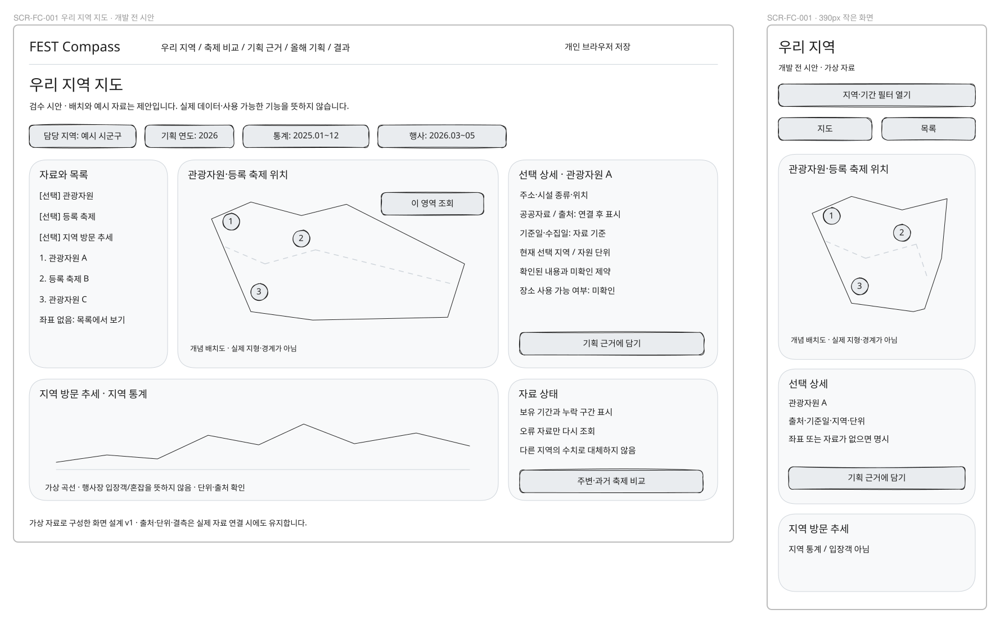
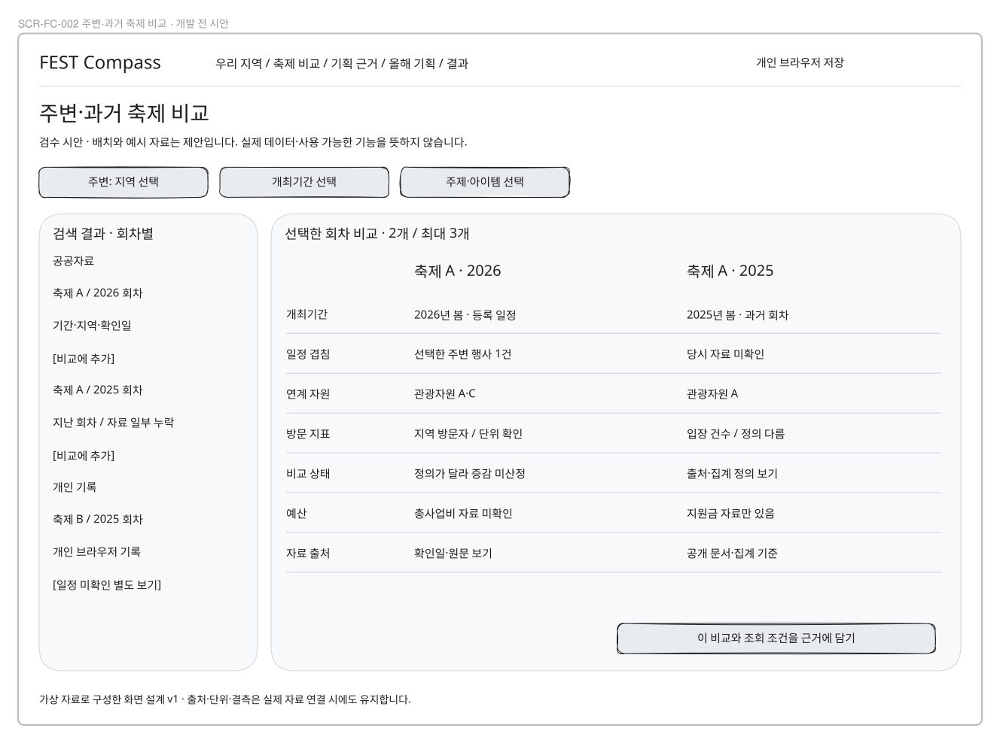
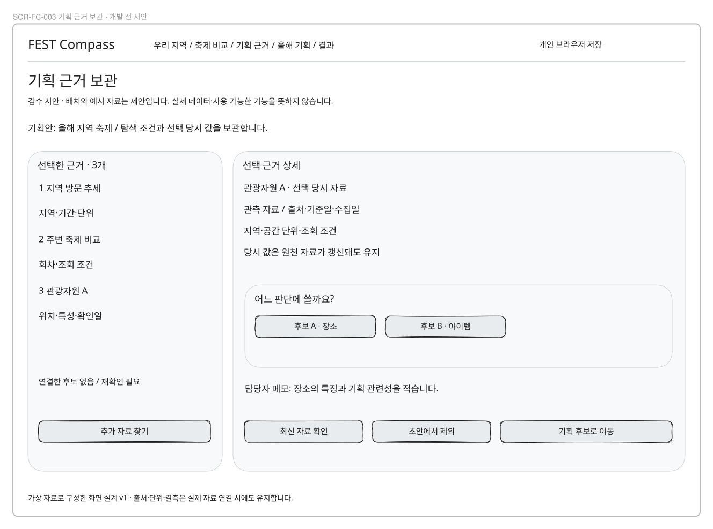
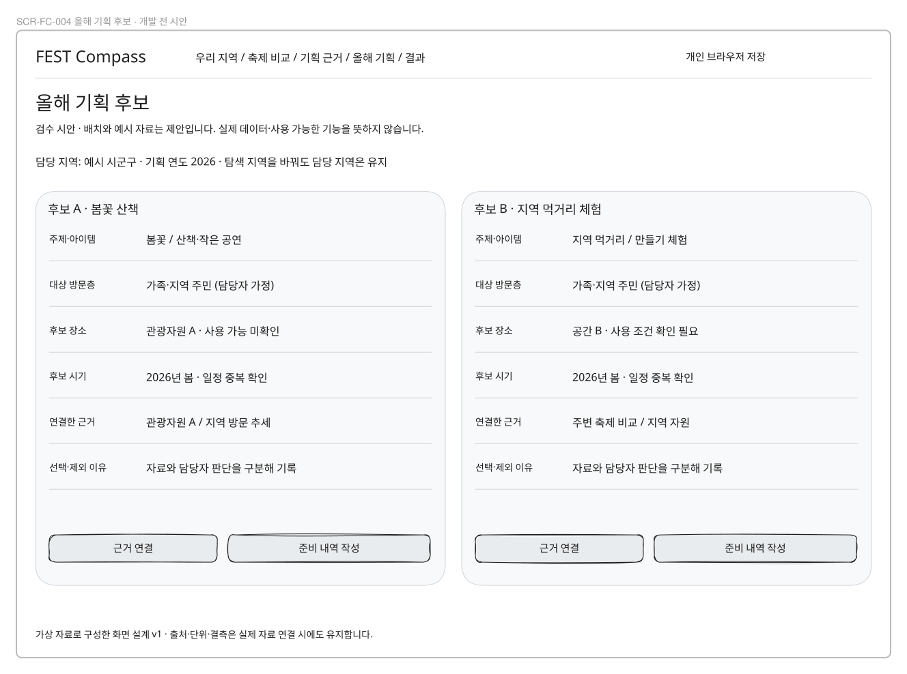
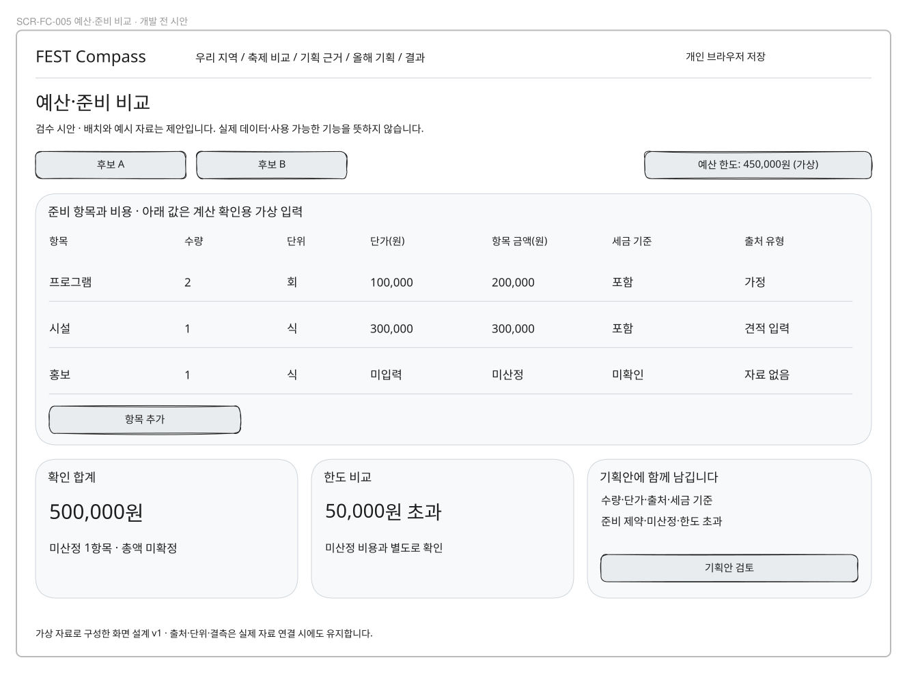
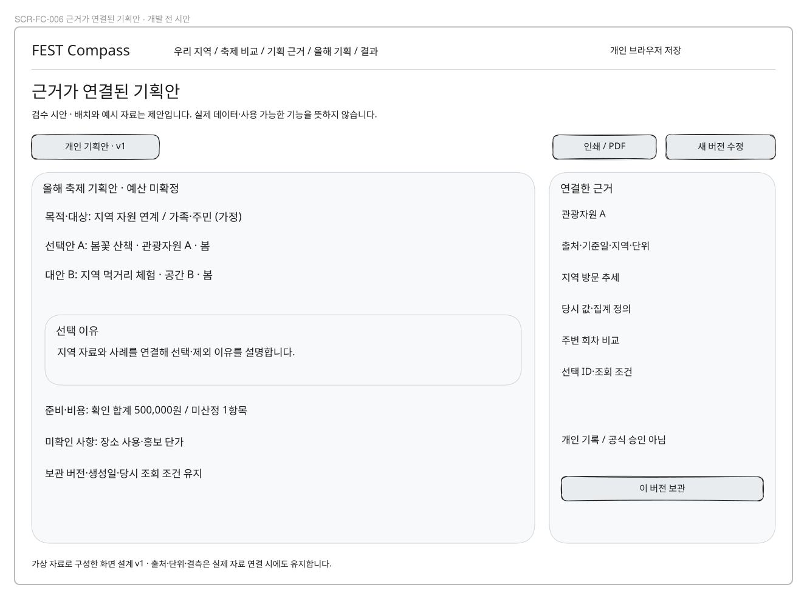
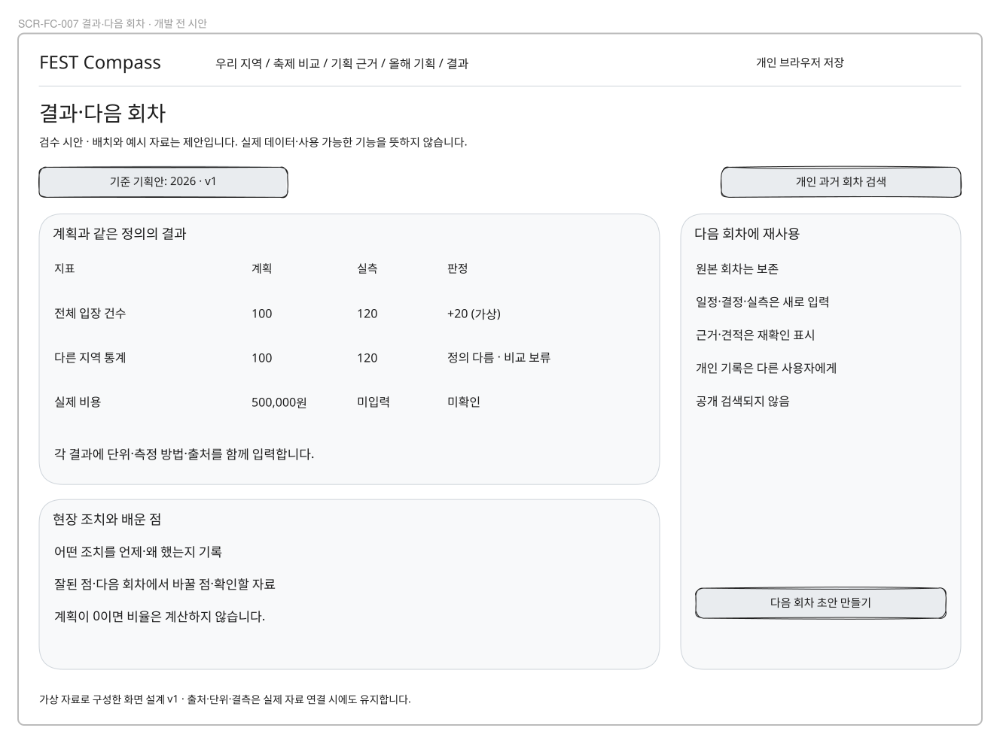

# 화면설계서

## 기준과 범위

**아래 7개 화면은 구현 전 시안이며 실제 서비스 경로가 아니다.**
사용자 요구는 [제품 기획](../0-planning/product-plan.md)과 [SRS](../1-analysis/srs.md)에서,
현재 기능은 apps/web/app과 [개인 작업 명세](../../design/06-mvp-workspace.md)에서 확인했다.
화면 배치·신규 경로·예시 수치·비교 개수는 검수용 제안이다. 와이어프레임의 지도 윤곽·차트·가격은 가상이다.

이 파일은 신규 지역 기획 화면의 번호 정본이다. 기존 SCR-00~06은 [이전 설계](../../design/03_화면설계서.md)에
당시 버전으로 보존하며 재번호하지 않는다. 기존 서버 원장과 새로운 개인 기획안을 같은 화면으로 간주하지 않는다.
현재 /workspace·/forecast 경로는 사용 가능하지만 이번 7개 시안의 구현 증거는 아니다.

## 화면 레지스터

| 화면 번호 | 화면 이름 | 제안 경로 | 상태 | 설명 |
|---|---|---|---|---|
| SCR-FC-001 | 우리 지역 지도 | `/region` | 개발 필요 | 지역·자료 종류·기간·지도/목록·차트·상세 |
| SCR-FC-002 | 주변·과거 축제 비교 | `/compare` | 개발 필요 | 지역·기간·주제 필터·회차 목록·비교 선택·비교표 |
| SCR-FC-003 | 기획 근거 보관 | `/planning/evidence` | 개발 필요 | 선택 자료 목록·출처·당시 값·관련 후보·메모 |
| SCR-FC-004 | 올해 기획 후보 | `/planning/options` | 개발 필요 | 주제·아이템·대상·장소·기간·근거·제약·후보 A/B |
| SCR-FC-005 | 예산·준비 비교 | `/planning/budget` | 개발 필요 | 항목·수량·단위·단가·세금 기준·출처·합계·한도 |
| SCR-FC-006 | 근거가 연결된 기획안 | `/planning/proposal` | 개발 필요 | 선택안·대안·이유·공공 근거·비용·제약·버전·인쇄 |
| SCR-FC-007 | 결과·다음 회차 | `/planning/outcomes` | 개발 필요 | 기준 기획안·현장 조치·실측·실제 비용·교훈·복사 |

## 공통 동작

담당 지역·탐색 지역·기획 연도·저장 상태를 구분한다. 자료 상세에는 출처·기준 기간·수집일·단위·해석 제한을 표시한다.
외부 링크만으로 근거를 대신하지 않는다. 사용자가 담은 당시 값과 조회 조건을 보관한다.
자동 저장 실패를 성공으로 표시하지 않으며 파일 보관·가져오기는 UC-FC-008의 계약을 따른다.
대화상자에는 초점 이동·닫기·취소 후 원래 위치 복귀를 제공한다. 키보드와 목록으로 지도 기능을 대체할 수 있어야 한다.
도구의 화면 등록 상태는 구현 완료 지표가 아니다. 시안 검수와 실제 개발·사용성 검증은 분리한다.

## SCR-FC-001 · 우리 지역 지도

관련 요구: FR-REG-1~5, 공통 저장은 FR-SAVE-1~2.

**구성:** 지역 선택, 기획 연도, 통계/행사 기간, 관광자원/축제 레이어를 상단에 둔다. 중앙은 지도, 왼쪽은 조회 결과, 오른쪽은 선택 상세다. 하단에는 지역 방문 추세와 실제 가용 기간을 표시한다.

**행동:** 지역·기간 변경은 지도/목록/차트에 함께 반영한다. 마커·목록 행·차트 구간 선택으로 상세를 열고 '기획 근거에 담기'를 누른다. 지도 이동은 조건 변경이 아니며 '이 영역 조회' 후에만 공간 필터를 표시한다.

**예외 상태:** 불러오는 중 / 정상 / 결과 없음 / 미수집 / 일부 오류 / 오래된 자료를 분리한다. 좌표 누락 항목은 목록에 남긴다. 지도 실패 시 목록을 기본으로 전환한다.

**작은 화면·접근성:** 390px에서는 지역·필터 요약→지도/목록 전환→상세→차트 순서다. 지도 조작 없이 목록 선택만으로 같은 자료를 담을 수 있다.

## SCR-FC-002 · 주변·과거 축제 비교

관련 요구: FR-CMP-1~4, 공통 저장은 FR-SAVE-1~2.

**구성:** 왼쪽에 검색 조건·회차 결과, 오른쪽에 선택한 2~3개 회차 비교표를 둔다. 축제명 아래 회차·기간·확인일과 공공/개인 출처를 표시한다.

**행동:** '비교에 추가/제외'로 선택 개수를 바꾸고 '비교 근거에 담기'로 당시 조회 조건을 보관한다. 날짜 미확인은 별도 목록에서 선택 가능하다. 유효 좌표에 한해 거리 조건을 제공한다.

**예외 상태:** 선택 0/1건에는 비교 조건 안내, 최대 3건 이후에는 기존 선택 교체 안내. 정의 차이는 '비교 불가: 이유', 값 없음은 '자료 미확인'. 취소·변경 회차를 정상 개최로 표시하지 않는다.

**작은 화면·접근성:** 후보별 카드와 고정 행 제목이 있는 표를 전환한다. 표 내부 가로 스크롤을 표시하고 제거 버튼에 축제·회차명을 붙인다.

## SCR-FC-003 · 기획 근거 보관

관련 요구: FR-EVD-5~6, 공통 저장은 FR-SAVE-1~2.

**구성:** 왼쪽 목록에 지역/관광자원/비교/개인기록을 분류하고 오른쪽에서 선택 당시 자료와 적용할 후보·판단 항목을 확인한다.

**행동:** 후보와 아이템·장소·시기·예산 판단을 연결한다. '최신 자료 확인'은 원천을 재조회하고 새 버전으로 담을지 보여준다. 초안 제외는 보관 기획안 사본에 영향을 주지 않는다.

**예외 상태:** 중복은 기존 항목으로 안내한다. 원문 접근 실패에도 보관값은 읽을 수 있다. 연결한 후보 없음, 재확인 필요, 저장 실패를 구분한다.

**작은 화면·접근성:** 목록→상세 한 열로 전환하고 뒤로 가도 필터·선택이 유지된다. 출처·기간·단위를 상세에서 생략하지 않는다.

## SCR-FC-004 · 올해 기획 후보

관련 요구: FR-PLN-1~3, 공통 저장은 FR-SAVE-1~2.

**구성:** 상단에 기획 담당 지역·연도와 저장 상태, 중앙에는 후보 A/B를 같은 필드로 나란히 둔다. 각 판단 항목 옆에 연결한 근거와 담당자 메모를 둔다.

**행동:** '후보 추가/복사'로 두 안을 만들고 '근거 연결'에서 보관 자료를 고른다. 담당 지역 변경은 탐색 지역 변경과 별개다. '예산·준비 비교'로 이동한다.

**예외 상태:** 후보 1개는 초안 저장 가능하지만 비교 완료 아님. 필수 필드·선택 이유 미입력과 장소 사용 미확인을 표시한다. 사용자 가정은 관측 자료로 승격하지 않는다.

**작은 화면·접근성:** 한 후보씩 편집하고 상단 전환 탭과 요약 비교를 제공한다. 미저장/저장 실패 상태에서 전환 시 입력 보관을 안내한다.

## SCR-FC-005 · 예산·준비 비교

관련 요구: FR-BGT-1~3, 공통 저장은 FR-SAVE-1~2.

**구성:** 후보별 준비 항목 표와 공통 예산 한도를 표시한다. 아래에는 확인 합계·미산정 수·한도 초과액과 다른 항목을 비교한다.

**행동:** 항목 추가·편집으로 계산한다. 원금액을 확인할 수 있으며 수량×단가의 항목별 원 반올림 후 합산한다. '기획안 검토'로 선택 이유 작성 화면에 이동한다.

**예외 상태:** 미입력은 빈칸·미산정으로 유지한다. 0원은 명시적 값이다. 음수·잘못된 숫자는 인라인 오류와 입력 유지. 세금 기준 불일치·한도 초과를 문구로 표시한다.

**작은 화면·접근성:** 항목 카드를 펼쳐 수량·단가·출처를 편집하고 요약 합계는 고정한다. 많은 열을 페이지 전체 가로 넘침으로 만들지 않는다.

## SCR-FC-006 · 근거가 연결된 기획안

관련 요구: FR-RPT-2~3, 공통 저장은 FR-SAVE-1~2.

**구성:** 문서 상단에 담당 지역·연도·초안/보관 버전·개인 기록 표시를 둔다. 목적→후보 비교→선택 이유→근거→준비·예산→미확인 사항→출처 순서로 읽는다.

**행동:** '이 버전 보관'은 선택 당시 자료를 복사한다. 보관본에서 '새 버전으로 수정'을 누르고 인쇄/PDF로 출력할 수 있다.

**예외 상태:** 후보 부족·선택 이유 누락은 보관 조건 안내를 제공한다. 미산정이 있으면 '예산 미확정'을 제목 근처와 비용 섹션에 표시한다. 공식 승인 완료 표시는 없다.

**작은 화면·접근성:** 문서 한 열로 읽고 인쇄 시 접힌 근거·제약·대안을 펼친다. 화면 제어 버튼은 인쇄에서 숨기고 버전·생성일은 남긴다.

## SCR-FC-007 · 결과·다음 회차

관련 요구: FR-LGR-5~6, 공통 저장은 FR-SAVE-1~2.

**구성:** 기준 기획안 버전을 먼저 선택하고 계획 대비 실측·비용, 현장 조치, 교훈을 입력한다. 하단에 개인 과거 사례 검색과 다음 회차 준비를 둔다.

**행동:** 측정 정의·단위·출처를 확인한 결과만 차이를 계산한다. '다음 회차 초안'은 원본을 보존하고 일정·결정·실측을 비워 만든다.

**예외 상태:** 정의 차이·실측 없음·계획 0은 각각 비교/비율 보류로 표시한다. 복사 근거와 견적은 재확인 상태다. 타인의 개인 기록은 노출하지 않는다.

**작은 화면·접근성:** 결과 항목별 카드로 읽으며 계획·실측의 단위는 카드 안에 나란히 둔다. 모바일에서도 원본 회차로 돌아갈 수 있다.

## 시안의 편집과 검수

각 화면의 편집 소스와 표시본은 같은 화면 ID 폴더의 wireframe-v1.excalidraw·wireframe-v1.svg다.
편집은 원본에서 하고 SVG는 traceboard의 렌더 도구로 재생성한다. 표시본을 손으로 수정하지 않는다.
[검수 안내](../../review/2026-09-planning-review.md)의 질문과 연결해 의견을 남긴다.
