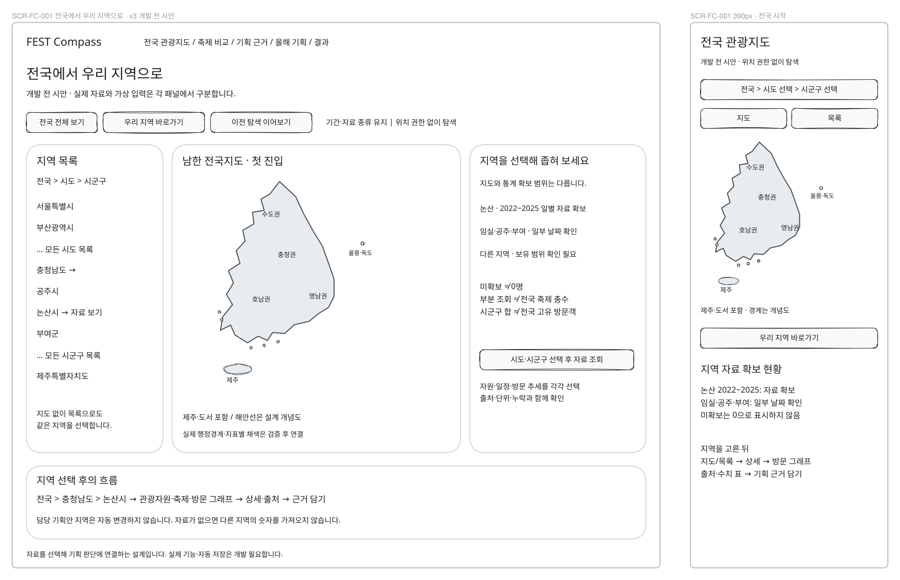
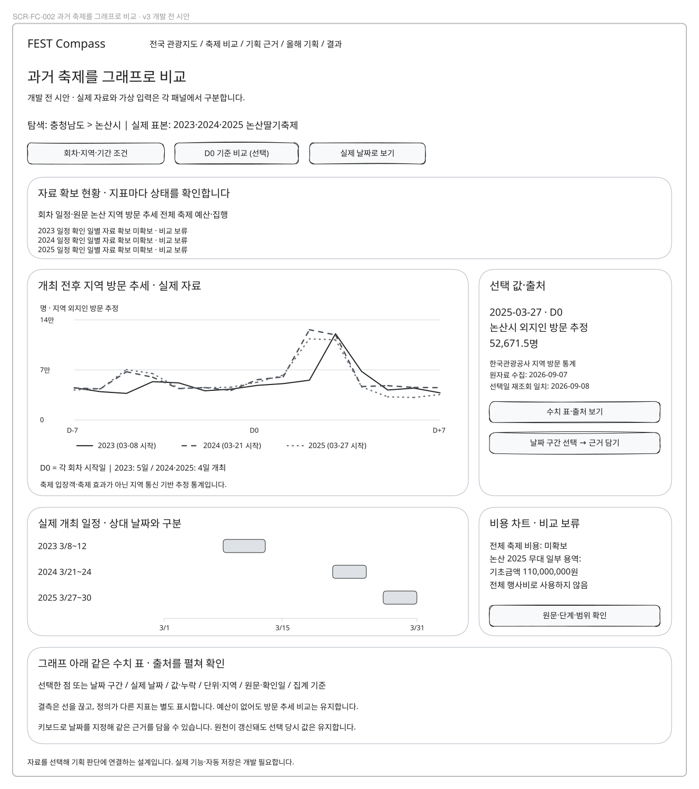
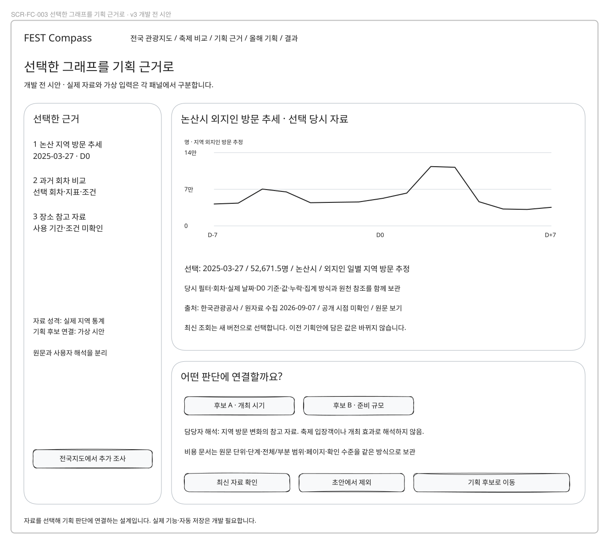
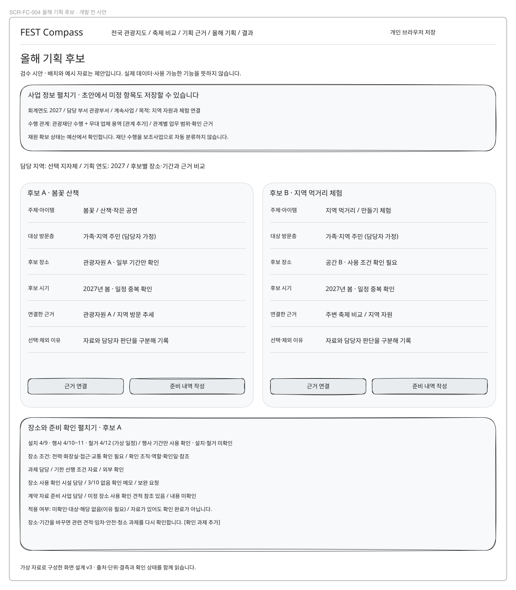
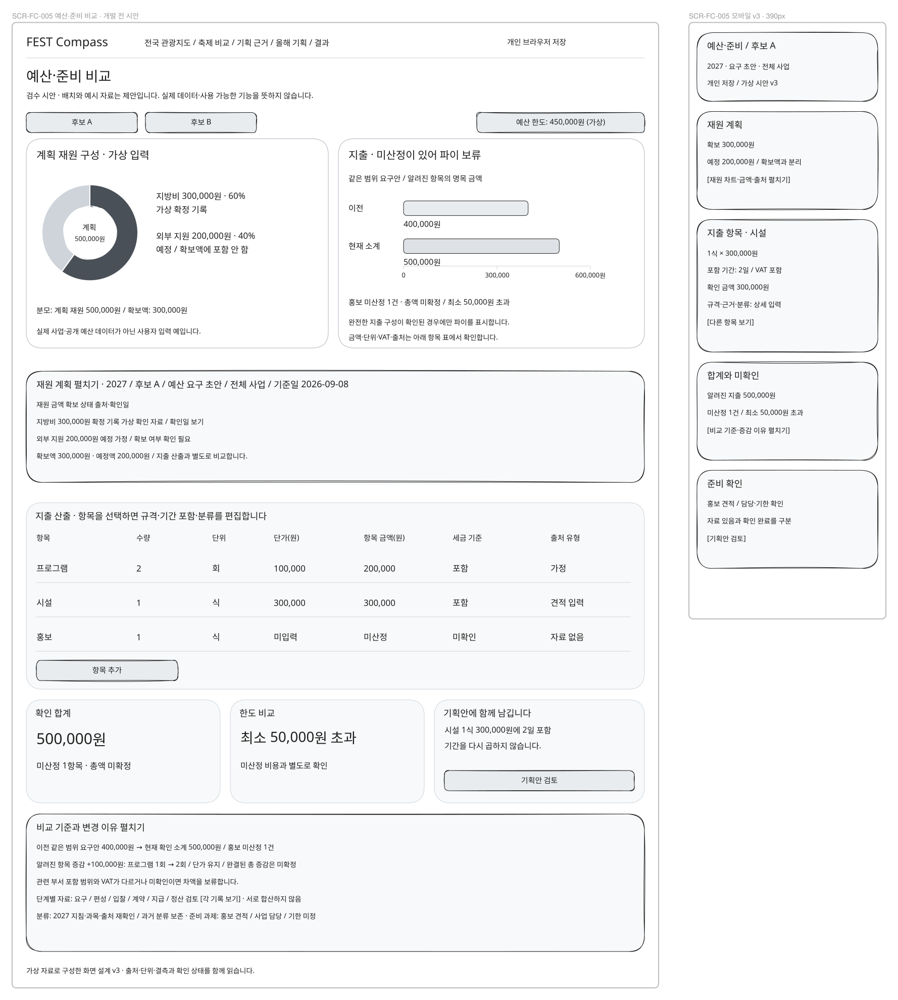
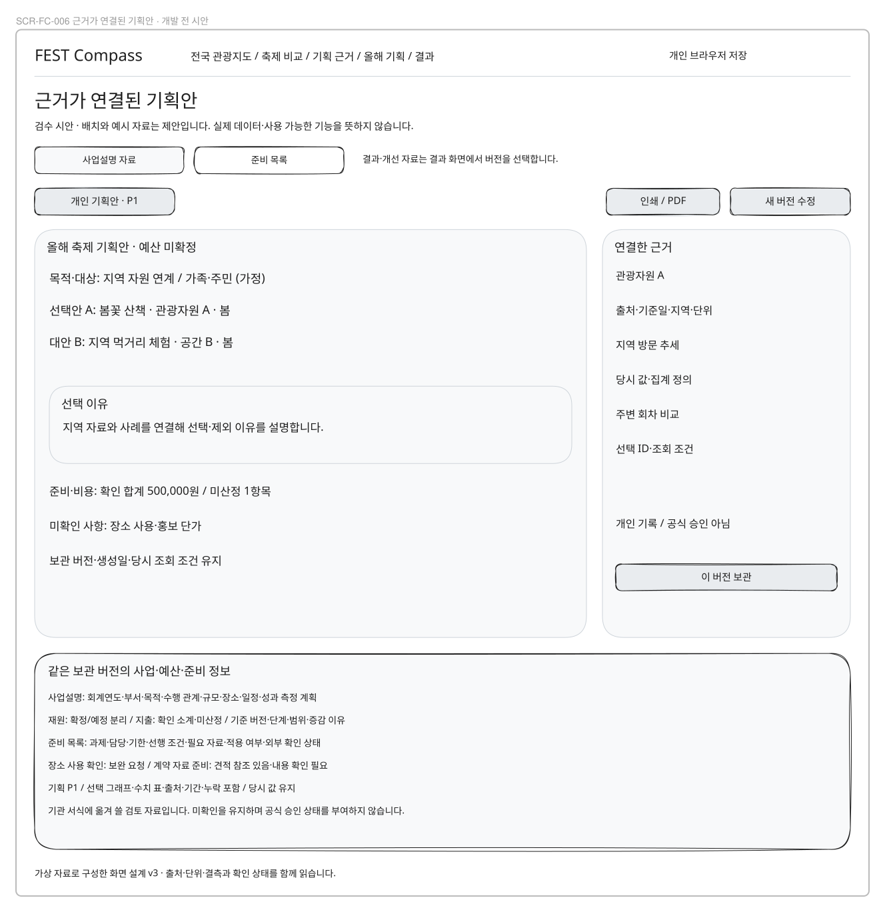
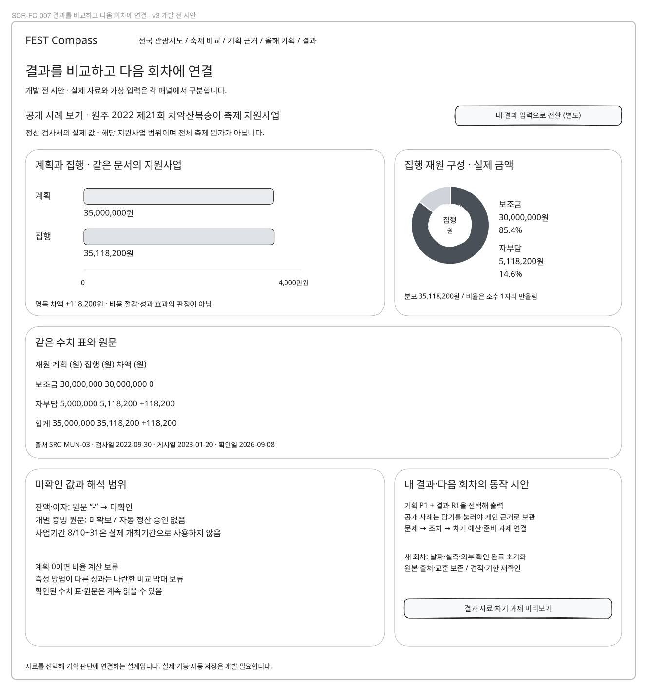

# 화면설계서

## 기준과 범위

**아래 그림 7개는 v3 시안이다. SCR-FC-001과 SCR-FC-003의 첫 기능 구현은 [실제 화면 검수](region-explorer-implementation.md)에서 별도로 확인한다.**
SCR-FC-002의 현재 화면과 제한은 [축제 비교 구현](festival-comparison-implementation.md)에서 확인한다.
SCR-FC-001의 도로 배경·자료 묶음·명시적 영역 적용과 대체 지도는 [전국·지역 지도 개선](region-map-improvement.md)을 따른다.
사용자 요구는 [제품 기획](../0-planning/product-plan.md)과 [SRS](../1-analysis/srs.md)에서,
현재 기능은 apps/web/app과 [개인 작업 명세](../../design/06-mvp-workspace.md)에서 확인했다.
화면 배치·신규 경로·예시 수치·비교 개수는 검수용 제안이다. 지도 윤곽은 개념도다. v3의 논산 방문 그래프와 원주 지원사업 결과는 출처가 있는 실제 표본이며, 올해 후보·견적 입력 예시는 가상이다. [자료별 구분](data-visualization.md)을 따른다.

이 파일은 신규 지역 기획 화면의 번호 정본이다. 기존 SCR-00~06은 [이전 설계](../../design/03_화면설계서.md)에
당시 버전으로 보존하며 재번호하지 않는다. 기존 서버 원장과 새로운 개인 기획안을 같은 화면으로 간주하지 않는다.
현재 /workspace·/forecast 경로는 사용 가능하지만 이번 7개 시안의 구현 증거는 아니다.

## 화면 레지스터

| 화면 번호 | 화면 이름 | 현재 또는 제안 경로 | 상태 | 설명 |
|---|---|---|---|---|
| SCR-FC-001 | 전국 관광지도 | `/regions` | 첫 기능 구현·검증 | 지역·자료 종류·기간·지도/목록·차트·상세 |
| SCR-FC-002 | 주변·과거 축제 비교 | `/compare` | 첫 기능 구현·검증 | 지역·기간·회차 선택·확보 현황·그래프·수치 표·출처 |
| SCR-FC-003 | 기획 근거 보관 | `/evidence` | 개인 보관·M3 후보 연결 구현 | 선택 자료 목록·출처·당시 값·관련 후보·메모 |
| SCR-FC-004 | 올해 기획 후보 | `/planning/options` | 첫 기능 구현·검증 | 주제·아이템·대상·장소·기간·근거·제약·후보 A/B |
| SCR-FC-005 | 예산·준비 비교 | `/planning/budget` | 재원·지출·후보 비교 첫 구현 | 항목·수량·단위·단가·세금 기준·출처·합계·한도 |
| SCR-FC-006 | 근거가 연결된 기획안 | `/planning/proposal` | 불변 보관·사업설명/준비 목록 첫 구현 | 선택안·대안·이유·공공 근거·비용·제약·버전·인쇄 |
| SCR-FC-007 | 결과·다음 회차 | `/planning/outcomes` | [첫 구현·검증](outcome-implementation.md) | 기준 기획안·현장 조치·실측·실제 비용·교훈·복사 |

## 공통 동작

담당 지역·탐색 지역·기획 연도·저장 상태를 구분한다. 자료 상세에는 출처·기준 기간·수집일·단위·해석 제한을 표시한다.
외부 링크만으로 근거를 대신하지 않는다. 사용자가 담은 당시 값과 조회 조건을 보관한다.
자동 저장 실패를 성공으로 표시하지 않으며 파일 보관·가져오기는 UC-FC-008의 계약을 따른다.
대화상자에는 초점 이동·닫기·취소 후 원래 위치 복귀를 제공한다. 키보드와 목록으로 지도 기능을 대체할 수 있어야 한다.
도구의 화면 등록 상태는 구현 완료 지표가 아니다. 시안 검수와 실제 개발·사용성 검증은 분리한다.

## SCR-FC-001 · 전국 관광지도

관련 요구: FR-REG-1~5, 공통 저장은 FR-SAVE-1~2.

**구성:** 전국지도에서 시작한다. 상단에 전국>시도>시군구 경로, 기간·자료 종류와 우리 지역 바로가기를 둔다. 시도/시군구 목록과 지도 선택은 동일하다. 지역을 좁히면 자원·축제 상세와 방문 추세를 표시한다. 첫 화면은 위치 권한·담당 지역 입력을 요구하지 않는다.

**행동:** 지역·기간 변경은 지도/목록/차트에 함께 반영한다. 마커·목록 행·차트 구간 선택으로 상세를 열고 '기획 근거에 담기'를 누른다. 지도 이동은 조건 변경이 아니며 '이 영역 조회' 후에만 공간 필터를 표시한다.

**예외 상태:** 불러오는 중 / 정상 / 결과 없음 / 미수집 / 일부 오류 / 오래된 자료를 분리한다. 좌표 누락 항목은 목록에 남긴다. 지도 실패 시 목록을 기본으로 전환한다.

**작은 화면·접근성:** 390px에서는 지역·필터 요약→지도/목록 전환→상세→차트 순서다. 지도 조작 없이 목록 선택만으로 같은 자료를 담을 수 있다.

**v2 장소 확인:** 자원 상세에 사용 가능 상태와 확인 기간·담당 조직/역할·참조를 둔다. 전력·화장실·접근·교통 조건은 선택 상세에서 펼친다. 공공 관광정보의 시설 보유와 특정 기간의 이용 가능을 구분한다. 사업 정보나 예산 미입력 상태에서도 목록·지도 탐색과 근거 담기를 제공한다.

## SCR-FC-002 · 주변·과거 축제 비교

관련 요구: FR-CMP-1~4, 공통 저장은 FR-SAVE-1~2.

**구성:** 검색 조건·회차 선택 아래 자료 확보 현황과 선·막대·일정 그래프를 중심에 둔다. 2~3개 회차의 실제 연도·기간·확인일을 표시하고 수치 표·출처를 펼친다. 같은 기준이 아닌 비용은 원문 카드와 비교 보류 사유를 표시한다.

**행동:** '비교에 추가/제외'로 선택 개수를 바꾸고 그래프 또는 수치 표에서 선택한 항목·기간을 '비교 근거에 담기'로 당시 값·조건·출처와 함께 보관한다. 날짜 미확인은 별도 목록에서 선택 가능하다. 유효 좌표에 한해 거리 조건을 제공한다.

**예외 상태:** 선택 0/1건에는 비교 조건 안내, 최대 3건 이후에는 기존 선택 교체 안내. 정의 차이는 '비교 불가: 이유', 값 없음은 '자료 미확인'. 취소·변경 회차를 정상 개최로 표시하지 않는다.

**작은 화면·접근성:** 후보별 카드와 고정 행 제목이 있는 표를 전환한다. 표 내부 가로 스크롤을 표시하고 제거 버튼에 축제·회차명을 붙인다.

**v2 비용 비교 상세:** 예산 행에서 비교 기준을 펼치면 회계연도·문서 단계·전체/부분 업무·포함 부서·재원·원문 단위/VAT·출처가 같은 행 순서로 나온다. 기준 누락과 차이를 문구로 보여주며 금액 자체는 숨기지 않는다. 서로 다른 범위는 증감·순위·합계를 보류한다.

## SCR-FC-003 · 기획 근거 보관

관련 요구: FR-EVD-5~6, 공통 저장은 FR-SAVE-1~2.

**구성:** 왼쪽 목록에 지역/관광자원/비교/개인기록을 분류하고 오른쪽에서 선택 당시 자료와 적용할 후보·판단 항목을 확인한다.

**행동:** 후보와 아이템·장소·시기·예산 판단을 연결한다. '최신 자료 확인'은 원천을 재조회하고 새 버전으로 담을지 보여준다. 초안 제외는 보관 기획안 사본에 영향을 주지 않는다.

**예외 상태:** 중복은 기존 항목으로 안내한다. 원문 접근 실패에도 보관값은 읽을 수 있다. 연결한 후보 없음, 재확인 필요, 저장 실패를 구분한다.

**작은 화면·접근성:** 목록→상세 한 열로 전환하고 뒤로 가도 필터·선택이 유지된다. 출처·기간·단위를 상세에서 생략하지 않는다.

**v2 문서 근거:** 하단 상세에 문서명·기관·회차·단계·전체/부분 범위·원문 값/단위·페이지·선택일·확인 수준을 둔다. 출처 원문과 담당자 해석을 나눈다. 원문 접근 실패 시 당시 확인 수준과 새 접근 실패를 함께 보이며 예산 확정으로 바꾸지 않는다.

## SCR-FC-004 · 올해 기획 후보

첫 구현은 [기획 후보 검수 안내](planning-options-implementation.md)에서 확인한다. 아래 v3 시안은 설계 당시 배치이며 예산 이동은 M4에 연결했고 기획안 보관·출력은 M5에 연결했다.

관련 요구: FR-PLN-1~3, 공통 저장은 FR-SAVE-1~2.

**구성:** 상단에 기획 담당 지역·연도와 저장 상태, 중앙에는 후보 A/B를 같은 필드로 나란히 둔다. 각 판단 항목 옆에 연결한 근거와 담당자 메모를 둔다.

**행동:** '후보 추가/복사'로 두 안을 만들고 '근거 연결'에서 보관 자료를 고른다. 담당 지역 변경은 탐색 지역 변경과 별개다. '예산·준비 비교'로 이동한다.

**예외 상태:** 후보 1개는 초안 저장 가능하지만 비교 완료 아님. 필수 필드·선택 이유 미입력과 장소 사용 미확인을 표시한다. 사용자 가정은 관측 자료로 승격하지 않는다.

**작은 화면·접근성:** 한 후보씩 편집하고 상단 전환 탭과 요약 비교를 제공한다. 미저장/저장 실패 상태에서 전환 시 입력 보관을 안내한다.

**v2 입력 순서:** 담당 지역·연도 아래 접을 수 있는 사업 정보(부서, 목적, 신규/계속, 수행기관별 관계·업무 범위)를 둔다. 후보 A/B 아래 장소의 설치/행사/철거 기간과 사용·시설 조건, 담당 역할·기한·선행 과제·필요 자료·외부 확인 상태를 편집한다. 미정은 초안 저장 가능하며 확인 필요로 남긴다. 수행 관계는 복수 추가 가능하고 재단을 보조사업으로 자동 분류하지 않는다.

**v2 준비 과제:** 선택 장소와 기간을 바꾸면 관련 확인·견적·임차·안전·청소 과제를 재확인 목록으로 표시한다. 외부 확인 원본은 해당 기간의 기록으로 유지한다. 적용 여부 미확인/대상/해당 없음(사유 필요), 과제 진행과 외부 검토를 분리한다. 참조만 있는 상태는 완료가 아니다.

## SCR-FC-005 · 예산·준비 비교

[예산 실제 기능·화면·검수 과제](budget-implementation.md)와 [자동 검증](../../validation/23-planning-budget.md)을 추가했다. 아래 v3는 개발 전 시안으로 보존한다.

관련 요구: FR-BGT-1~3, 공통 저장은 FR-SAVE-1~2.

**구성:** 후보 선택·예산 한도 아래에 재원 구성과 비교 가능한 금액 막대를 먼저 표시한다. 이어 재원·지출 항목 표, 확인 소계·미산정·한도 초과, 변경 이유와 준비 과제를 확인한다. 지출 미산정이면 지출 파이는 보류한다.

**행동:** 항목 추가·편집으로 계산한다. 원금액을 확인할 수 있으며 수량×단가의 항목별 원 반올림 후 합산한다. '기획안 검토'로 선택 이유 작성 화면에 이동한다.

**예외 상태:** 미입력은 빈칸·미산정으로 유지한다. 0원은 명시적 값이다. 음수·잘못된 숫자는 인라인 오류와 입력 유지. 세금 기준 불일치·한도 초과를 문구로 표시한다.

**작은 화면·접근성:** 항목 카드를 펼쳐 수량·단가·출처를 편집하고 요약 합계는 고정한다. 많은 열을 페이지 전체 가로 넘침으로 만들지 않는다.

**v3 화면 순서:** 기준(연도·후보·단계·전체/부분 범위·기준일) → 구성·금액 차트 → 재원표(확정/예정/미확인) → 지출 산출 → 비교 기준과 증감 이유 → 관련 준비 과제 순서다. 처음에는 요약을 보이고 재원·산출 상세를 각각 펼친다. 재원과 지출을 더하지 않고 같은 범위에서만 부족 여부를 대조한다.

**v2 산출 상세:** 규격·수량·기간 포함 여부·산출 방식·단가·세금·견적/가정과 적용 회계연도·지침·분류 확인 상태를 항목 카드에서 편집한다. 요구/편성/입찰/계약/지급/정산 검토 자료는 단계별 별도 기록 패널이며 중복 합산하지 않는다. 이전 기준 버전과 비교하여 수량/단가/기간/범위 변경 사유를 남긴다. 부서별 포함 범위가 미확인이면 차액도 보류한다.

## SCR-FC-006 · 근거가 연결된 기획안

[실제 기획안 화면과 출력 계약](proposal-implementation.md), [검증 결과](../../validation/24-planning-proposal.md)를 연결했다. 아래 와이어프레임은 개발 전 제안으로 유지한다.

관련 요구: FR-RPT-2~3, 공통 저장은 FR-SAVE-1~2.

**구성:** 문서 상단에 담당 지역·연도·초안/보관 버전·개인 기록 표시를 둔다. 목적→후보 비교→선택 이유→근거→준비·예산→미확인 사항→출처 순서로 읽는다.

**행동:** '이 버전 보관'은 선택 당시 자료를 복사한다. 보관본에서 '새 버전으로 수정'을 누르고 인쇄/PDF로 출력할 수 있다.

**예외 상태:** 후보 부족·선택 이유 누락은 보관 조건 안내를 제공한다. 미산정이 있으면 '예산 미확정'을 제목 근처와 비용 섹션에 표시한다. 공식 승인 완료 표시는 없다.

**작은 화면·접근성:** 문서 한 열로 읽고 인쇄 시 접힌 근거·제약·대안을 펼친다. 화면 제어 버튼은 인쇄에서 숨기고 버전·생성일은 남긴다.

**v2 출력 선택:** 상단에 사업설명 자료 / 준비 목록을 선택하고 같은 기획 보관 버전으로 출력한다. 사업설명은 사업연도·부서·목적·수행 관계·장소/기간·두 후보·재원/지출·증감·측정 계획을 담는다. 준비 목록은 과제·담당·기한·선행 조건·필요 자료·적용/외부 확인 상태를 담는다. 둘 다 기준일·단계·미확인·출처를 유지한다.

**v2 결과 연결:** 결과·개선 자료는 SCR-FC-007의 결과 버전과 기준 기획안을 선택한 뒤 출력한다. 결과가 없으면 작성 경로를 안내한다. 실제 결과를 예전 기획안에 덮어쓰지 않는다. 기관 서식에 옮겨 쓸 검토 자료이며 전자결재·공식 예산 확정 버튼은 없다.

## SCR-FC-007 · 결과·다음 회차

관련 요구: FR-LGR-5~6, 공통 저장은 FR-SAVE-1~2.

**구성:** 개인 결과 입력은 기준 기획안 버전을 먼저 선택한다. 계획 대비 실측·비용 막대와 재원 구성, 같은 수치 표·출처, 현장 조치·교훈·다음 회차 준비를 순서대로 둔다. v3에는 별도의 '공개 사례 보기' 상태로 원주 지원사업의 실제 값을 보여주며 개인 입력과 자동으로 합치지 않는다.

**행동:** 측정 정의·단위·출처를 확인한 결과만 차이를 계산한다. '다음 회차 초안'은 원본을 보존하고 일정·결정·실측을 비워 만든다.

**예외 상태:** 정의 차이·실측 없음·계획 0은 각각 비교/비율 보류로 표시한다. 복사 근거와 견적은 재확인 상태다. 타인의 개인 기록은 노출하지 않는다.

**작은 화면·접근성:** 결과 항목별 카드로 읽으며 계획·실측의 단위는 카드 안에 나란히 둔다. 모바일에서도 원본 회차로 돌아갈 수 있다.

**v2 재원별 결과:** 성과 아래 보조금·자부담 등 재원별 계획/실제 사용액·단계와 잔액/반납/이자를 구분한 표를 둔다. 원문 ‘—’는 미확인이다. 증빙 종류·참조·대상 범위·확인 상태는 펼침 목록에서 관리하며 자료 있음과 내용 확인을 구분한다.

**v2 개선과 출력:** 문제→조치→다음 회차 예산/준비 과제를 연결한다. 결과·개선 자료 출력 시 기획 버전과 결과 버전을 함께 고정한다. 다음 회차 복사는 원본과 개선 근거를 남기고 날짜·실측·결정·금액 실적·외부 확인 완료를 비운다. 복사한 견적·분류·기한은 재확인 대상으로 표시한다.

## 시안의 편집과 검수

각 화면의 편집 소스와 표시본은 같은 화면 ID 폴더의 wireframe-v3.excalidraw·wireframe-v3.svg다.
편집은 원본에서 하고 SVG는 traceboard의 렌더 도구로 재생성한다. 표시본을 손으로 수정하지 않는다.
[검수 안내](../../review/2026-09-planning-review.md)의 질문과 연결해 의견을 남긴다.

v1 소스·표시본은 이전 시안으로 보존했다. v2는 기존 화면 요소를 이어 편집한 검수본이며, 새로 늘어난 업무 정보는 별도 펼침 영역으로 구성한다. 데스크톱은 세로 스크롤을 허용하고 모바일은 동일 항목의 카드/상세 전환을 사용한다.

## v3 변경과 검수 포인트

| 화면 | v3에서 확인할 것 |
|---|---|
| SCR-FC-001 | 전국·제주/도서 개념도→시도→시군구, 상위 복귀·우리 지역 바로가기, 자료 미확보와 0 구분, 390px 목록 대체 |
| SCR-FC-002 | 논산 실제 45개 일별 값의 공통 축 선그래프, D0/실제 날짜·개최 일수, 확보 현황·예산 보류·수치 표·근거 담기 |
| SCR-FC-003 | 선택한 실제 값·구간과 회차·출처·집계 방식 보관, 원문과 사용자 해석 분리 |
| SCR-FC-004 | 전국 탐색 지역과 기획 담당 지역 분리, 기존 사업·장소·준비 과제 유지 |
| SCR-FC-005 | 후보별 금액 막대와 재원 파이, 미산정 지출의 파이 보류, 항목·단가·기간·세금·변경 이유 유지 |
| SCR-FC-006 | 같은 버전의 그래프·수치 표·출처·누락을 사업설명 자료와 함께 출력 |
| SCR-FC-007 | 원주 2022 지원사업 계획/집행 막대·재원 도넛, 미확인 잔액/이자, 개인 결과와 공개 사례 구분 |

v3 그림은 당시 시안이다. 현재 전국 탐색·조회·담기 버튼은 별도 구현했고 정식 행정경계·일반 과거 비교는 개발 필요다. 숫자의 실제 출처와 지도·배치의 제안 범위를 혼동하지 않는다.
[시각화 상세](data-visualization.md)가 차트 선택·비교 제한·키보드·모바일·출력 기준을 정의한다.
화면 번호 7개와 기존 업무 범위는 유지하고 v1·v2 소스/SVG도 보존한다.

## SCR-FC-007 첫 구현

[실제 구현 화면과 검수 순서](outcome-implementation.md)를 사용한다. 기본 진입은 공개 비용 사례이고 개인 결과는 기준 기획안 선택 뒤 작성한다. 이름·지역·연도 검색을 두 출처에 나누어 적용한다.
계획/실측과 재원별 막대·도넛·수치 표·출처·미확인, 결과 P/R 출력, 다음 회차 초기화와 개선 과제 연결을 제공한다. 위 v3 와이어프레임은 개발 전 제안으로 유지한다.
