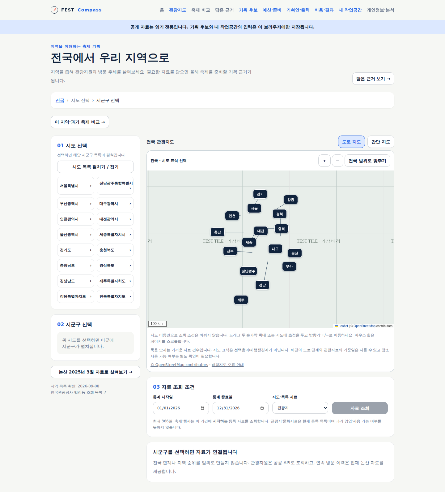
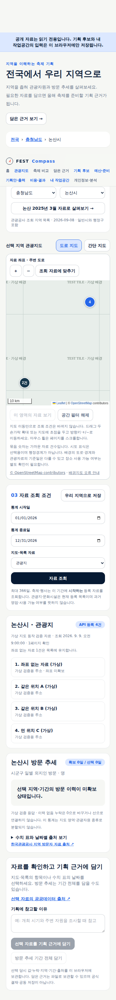

# 전국·지역 지도 개선 검증

## 대상과 사용자 변화

M1~M6 첫 흐름 이후 `/regions` 지도를 개선했다. 전국→시도→시군구로 좁혀 도로 배경에서 자료 위치를 보고, 가까운 자료를 펼쳐 상세·기획 근거로 연결한다. 명시적 영역 적용은 이미 받은 목록을 좁히고 저장하는 근거에 범위를 남긴다. 배경 오류 때는 간단 지도·목록을 계속 사용할 수 있다.

[요구·화면·제공자 경계](../sdlc/2-design/region-map-improvement.md), UC-FC-001@v4 AC8과 TS-FC-001@v4를 따른다. 기존 관광공사 조회 코드 269개와 16개 시도 단위를 그대로 유지했다. 시도 표식은 선택용 위치이며 공식 경계가 아니다.

## 검증

- 단위 시험 186개, 빌드·타입, 배포 선언 17개 리소스·40개 시험을 통과했다. 운영 의존성 보안 감사는 취약점 0개다.
- 최종 `npm run test:e2e`는 편집/공개 작업공간 흐름과 지역 14·지도 12·비교 21·후보 27·예산 23·기획안 14·결과 14개(명명된 125개)를 통과했다. 새 지도 화면의 브라우저 예외와 공개 앱 쓰기 요청은 0개다.
- 지도 전용 headless: 전국 진입·지역명 겹침·자료 묶음/번호·상세 선택·키보드/드래그·명시적 영역·근거 범위·휠 스크롤·배경 실패·390px·요청 경계를 검사한다.
- 자동화는 모든 OSM 타일 요청을 차단하고 `TEST TILE · 가상 배경` 이미지로 응답한다. 실제 도로 영상이나 제공자 가용성 증거가 아니다. 공개 앱 검증에도 같은 경계를 적용한다.
- 최초 전체 실행에서 팝업 전환 중 닫기 버튼이 중복되고, 추가 검사에서 묶음 클릭 이벤트가 팝업을 다시 닫는 문제를 발견했다. 페이드와 클릭 전파를 수정했다. 배경 실패 시험은 브라우저의 이미 해독된 이미지 재사용을 피하도록 새 문서에서 실패를 주입한다.
- 실제 논산 관광자료 61건을 조회해 첫 공개 확인을 하던 중 인접 격자에 속한 묶음끼리 겹치는 문제를 발견했다. 묶음 중심까지 재결합하도록 수정하고 격자 경계 회귀 시험을 추가했다. 같은 61건의 공개 응답으로 로컬에서 표식 겹침 없음·선택 원문·출처/수집일/조회 조건 보존을 확인하고 전체 회귀를 다시 통과했다.

## 자동 시험 화면 · 배경과 자료는 가상

다음 그림은 실제 앱의 배치·표식·목록 동작을 검증한 화면이다. 격자와 `TEST TILE` 문구는 자동 시험용 배경이며 실제 도로 지도가 아니다. 모바일 자료도 의도적으로 만든 좌표 누락·같은 위치 표본이다.

## 남은 범위

공식 행정경계 연도·코드 대조, 거리순 검색, 전국 과거 방문·비용 확장, 실제 지자체 담당자 과제 관찰은 후속이다. 자동 시험을 정형 Spec/Run 연결이나 전체 MVP 인수로 환산하지 않는다.

## 게시 상태

**공개 사용 가능**: [관광지도](https://kto.damecasol.com/regions). 코드 `89e40a0ac7bf91f2c4dda0fd4e294824ba31c814`의 [CI 34314707431](https://github.com/gitvssh/fest-compass/actions/runs/34314707431)이 전용 ARC에서 통과했고 원격 이미지와 보존 표식을 검증했다.

- 배포 선언 `8a5fa6f7effeab4ff997ddfe4d979f95f48a2fd5`, 이미지 `sha256:b83bba2bc9c0604d919109148cf2542b5c60935e57486d5d7d492810446106e5`. 앱·수집기 동일 이미지, 세대 18/관측 18·가용 1, Argo Synced/Healthy/Succeeded 확인.
- 공개 headless 지도 12개를 통과했다. 별도로 실제 관광자료 61건·좌표 61건·논산 2025년 3월 방문 이력 31일을 조회해 표식 겹침 없음과 선택 자료 `2650372`의 원문·출처·수집일·조건 보존을 확인했다. 배경만 가상 응답이며 실제 API 응답은 대체하지 않았다.
- 공개 두 검사에서 브라우저 예외·앱 쓰기 요청 0개. 지도 요청은 좌표 타일 URL과 사이트 origin Referer만 사용했다. 처음 공개 시험은 한국어 동의창을 영어로 찾던 시험 코드를 수정한 뒤 재실행했다.
- 배포 전후 예측 2건·관측 내용·겨울 시험·자동 수집 상태가 동일하다. 추가 이미지 삭제나 정책 변경은 하지 않았다.

내부 Traceboard는 이 설계·요구사항·검증 기록을 검수본으로 게시한다. 게시본의 대상 커밋과 실제 파일 대조 결과는 [최종 게시 증거](evidence/2026-09-09-region-map-production.json)를 따른다. 정형 API/Spec/Run/티켓 원천 미선언은 계속 미평가로 표시한다.
