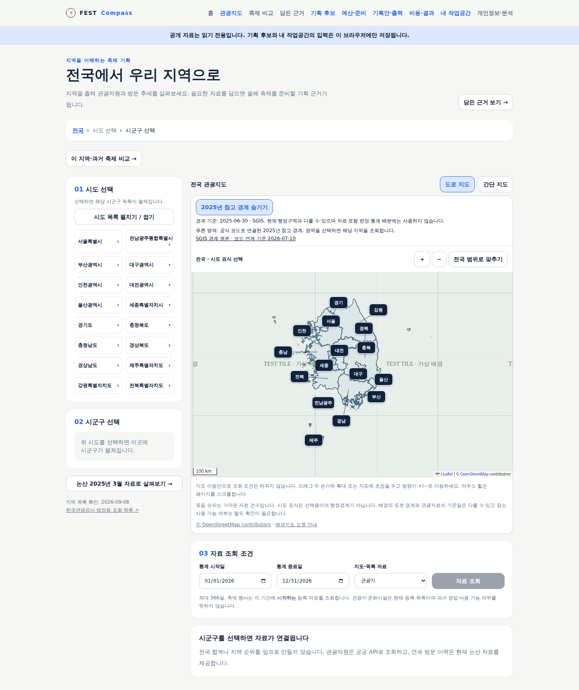
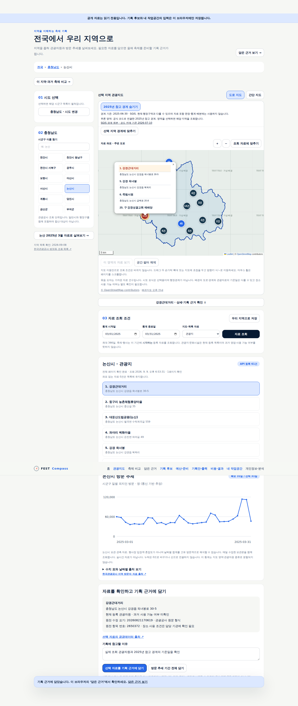

# 기준일이 있는 경계 지도 검증

**공개 사용 가능**하다. [경계 지도 설계](../sdlc/2-design/region-boundary-layer.md)의 범위로 검증했다.
경계는 실제 SGIS 원본이다. 자동 기능 시험은 가상 관광자원을 사용하고, 별도 공개 표본 시험은 실제 논산 API 응답을 사용했다. 두 시험 모두 배경 타일만 시험 이미지로 대체했다.

## 공식 자료 대조와 도형 검증

| 항목 | 결과 |
|---|---|
| 공식 코드 연계 | 2025-04-01·2026-07-10 한국행정구역분류의 법정동 연계표 확보, 현재 관광조회 269개 항목과 대조 |
| 표시 대상 | 시도 15개, 시군구 조회 단위 234개(직접 222·일반시 합성 12) |
| 표시 제외 | 개편 35개. 이전 구역을 새 구역으로 추정해 채우지 않음 |
| 경계 기준 | 2025-06-30, SGIS. 현재 법정 경계 인증·통계의 공간 배분에 사용하지 않음 |
| 원본 도형 | 시도 17개·시군구 252개 모두 유효, 공유 경계 유효 |
| 경량화 | 전체 공유 경계를 함께 50m 기준으로 단순화. 섬과 구멍 수 보존, 변환 후에도 공유 경계·도형 유효 |
| 최대 면적 차이 | 시도 0.0671% 미만, 시군구 0.4446% 미만. 원본 투영 좌표계에서 계산 |
| 좌표 변환 | EPSG:5179→4326, 경도·위도 순서 고정. 변환 왕복 오차 1cm 미만 검사, 소수점 8자리 출력 후 형상·섬/구멍·공유 경계 재검사 |
| 배포 파일 | 전국 및 시도별 16파일, 전체 7,975,285바이트. 전국 2,776,053바이트(로컬 gzip 899,977), 충남 635,994바이트(gzip 194,625) |

크기 표의 gzip은 로컬 압축 비교이며 실제 전송 압축 여부의 증거가 아니다.
원본 해시·소프트웨어 버전·모든 배포 파일 해시는 `docs/validation/evidence/2026-09-09-boundary-build.json`을 따른다.

## 자동 시험

- 앱 단위 시험 190개 통과. 모든 경계 배포 파일의 해시·크기·234개 조회 단위 대응 검사를 포함한다. 경계 원본·연계 방어 시험 9개 통과.
- 기존 전체 headless 흐름과 새 경계 11개 통과. 명명된 지역 14·지도 12·경계 11·비교 21·기획 27·예산 23·기획안 14·결과 14개, 총 136개와 편집/공개 작업공간 흐름.
- 새 시험: 전국 15개 경계·키보드 시도/시군구 선택·보이는 경계만 근거 보관·경계 숨김·일반시 합성·개편 시군구·통합 시도·파일 실패·늦은 응답·간단 지도·390px.
- 타입 검사·빌드·운영 의존성 취약점 0·배포 계약 40개/17리소스 검사 통과.
- 첫 시험에서 지역 변경 직후 이전 완료 안내가 남는 문제를 발견했다. 상태를 지역 식별자에 결속한 뒤 신규 시험과 전체 회귀를 다시 통과했다.
- 브라우저 예외·앱 쓰기 요청 0. 배경 요청은 모두 가상 타일 응답으로 대체했다.
- 배포 이미지에 새 public 자료를 명시적으로 복사했다. 공개 경계 파일 16개 모두 HTTP 200·크기·SHA-256 일치를 확인했다.

## 공개 게시와 실제 자료 확인

- 구현 커밋 `8d92c88e635d85dd395428cc2f1c5ee5bf55843e`, [전용 CI 34336660754](https://github.com/gitvssh/fest-compass/actions/runs/34336660754) 성공. 등록된 `homelab-fest-compass` 실행기에서 검증·이미지 게시를 완료했다.
- 배포 커밋 `4b0443539c8e35c433ff973ea8712fd6022ae179`, 이미지 `sha256:8a20e5c577457a7f5fefbfdd79fecc8fc72b2d2de44efba5f0e8725b25162756`. 앱·수집 작업자 모두 같은 이미지, 배포 세대 19·가용 1개·Argo Synced/Healthy/Succeeded를 확인했다.
- 공개 주소에서도 신규 경계 11개 시험 통과. 시험 관광자원과 배경은 가상 응답이며, 경계 파일은 실제 배포본이다.
- 2026-09-09 09:53 UTC 실제 공개 논산 조회: 관광자원 61건·2025년 3월 방문 이력 31일. 항목 `2650372`를 담고 조회 조건·원문 자원·출처·수집 시각을 그대로 보존했다. SGIS 코드 `34060`·기준일 `2025-06-30`·연계표 기준일 `2026-07-10`이 근거 보관 화면에도 남았다.
- 실제 표본 시험의 브라우저 예외·앱 쓰기 요청 0, 390px 가로 넘침 0. 실제 API 응답을 사용했지만 제공자의 원천 정확성을 별도로 인증한 것은 아니다.
- 배포 전후 기존 예측 자료·기록 2개·겨울 시험의 의미 값 해시와 일일 자동 수집 상태가 일치한다. 확인 시각처럼 갱신 가능한 메타데이터는 구분했다.
- 검수 문서의 선언 산출물 38개·FR 29개·UC 8개·AC 56개·TS 8개, 추적 누락 오류 0. 미선언 API/정형 실행 보고서/티켓 항목은 미평가다. 최종 내부 게시 증거는 `docs/validation/evidence/2026-09-09-boundary-layer-publication.json`에 별도로 보관한다.

## 공개 화면

아래는 headless 캡처다. **지도 배경은 시험 타일이며 실제 도로 배경 가용성의 증거가 아니다.** 전국 화면은 실제 경계, 논산 화면은 실제 경계·실제 관광 조회·보관 방문 이력이다. 근거의 참고 이유는 시험 입력이다.






## 직접 확인할 행동

1. [관광지도](https://kto.damecasol.com/regions)에서 `2025년 참고 경계`의 기준일과 현재 구역과의 차이 안내를 읽는다.
2. 서울 경계→종로구 또는 충남→논산을 선택한다. `선택 지역 경계에 맞추기`로 전체 영역을 본다.
3. 수원시를 고르면 하위 4개 행정구를 합친 시 경계가 표시되는지 확인한다.
4. 인천 제물포구·전남광주 통합 지역을 고르면 경계 확인 중 안내와 목록 조회가 유지되는지 확인한다.
5. 논산 자원을 담고 `/evidence`에서 경계 기준일·코드·자료 버전이 남는지 확인한다. 경계를 숨기거나 간단 지도에서 담으면 경계 정보가 추가되지 않는다.

## 재현

```bash
# pyshp 2.3.1, pyproj 3.7.2, shapely 2.1.2, openpyxl 3.1.5
python -m tools.build_region_boundaries --sources /path/to/pinned-downloads
python -m unittest tools.test_build_region_boundaries tools.test_audit_region_boundaries
# apps/web에서
npm test
npm run typecheck
npm run build
npm run test:e2e
```

전국 최신 경계 확보·토지 사용 가능 판정·거리 검색·전국 과거 통계 확대·실무 담당자 인수는 후속이다.
