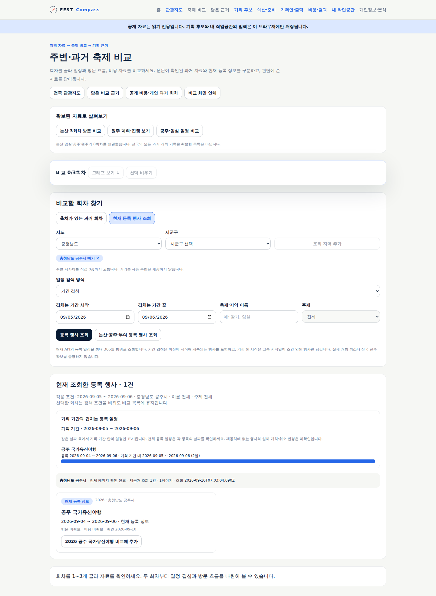
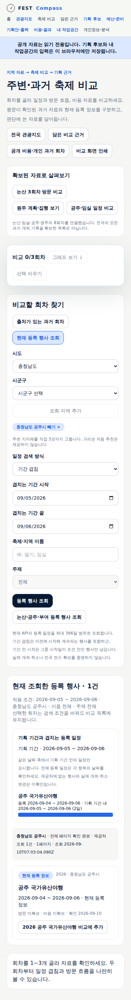

# 현재 행사 기간 겹침 조회 검증

**공개 사용 가능**하다. [설계와 인수 범위](../sdlc/2-design/current-festival-overlap.md)를 따른다.

## 로컬 검증

- 단위·격리 DB 마이그레이션 193건, 타입 검사, 운영 빌드 통과.
- 전체 headless 화면 검사 146건과 편집·공개 읽기 전용 흐름 통과. 이 중 기간 겹침 전용 10건은 경계 날짜, 검색 방식 전환, 원래 검색 조건 보존, 기획 연결, 실패·늦은 응답, 390px 화면을 검사한다.
- 운영 의존성 취약점 0건. 배포 선언 검사 40건과 준비 단계 계약 검사 17개 리소스 통과.
- 자동 회귀 시험의 행사 응답과 지도 타일은 시험용이다. 실제 제공처 확인은 아래 별도 기록이다.

## 공개 반영·실제 화면

구현 `f0671e2`의 [내부 ARC 배포 검사](https://github.com/gitvssh/fest-compass/actions/runs/34447362560)가 성공했다. 배포 선언 `0e281c3`, 검증된 이미지 `sha256:7e0791ff1d90dc114e2429ee47906c3e8845b30de626a3e69d56468d444088f7`를 반영했다. 웹·예측 작업 컨테이너 모두 같은 이미지이며 Argo 정상 동기화와 가용 1개를 확인했다.

실제 공개 API를 사용한 headless 검사 7개를 통과했다. 공주 9월 5~6일에 국가유산야행 1건(등록 일정 9월 4~6일)을 조회하고 기획 기간 내 2일 그림을 확인했다. `기간 안 시작`으로 바꾸면 제공처 1건·검색 결과 0건으로 구분된다. 선택 당시 겹침 조건과 전체 일정이 근거 보관·기획 후보 상세에 유지되며 지역 지도 목록에서도 같은 행사를 조회한다. 모바일 390px 가로 넘침·브라우저 오류·앱 서버 쓰기는 0건이다. 지도 배경만 시험 타일이며 실제 타일 제공 상태를 검증한 것은 아니다.

배포 전후 예측 요약·기록 2개·겨울 시험·자동 수집 상태의 의미 값 5개를 비교해 모두 동일함을 확인했다. 모델 정확도 개선은 이번 범위가 아니다.

Traceboard는 이 문서와 설계·요구·인수 기준을 함께 게시한다. 최종 게시 검증은 `docs/validation/evidence/2026-09-10-overlap-publication.json`에 기록한다. 정형 API·Spec·Run·YouTrack 원천 4종은 미선언이므로 미평가다.

## 확인할 행동

1. [공주 2026년 9월 5~6일 조회](https://kto.damecasol.com/compare?province=44&district=150&mode=current&start=2026-09-05&end=2026-09-06)에서 9월 4일 시작한 공주 국가유산야행을 확인한다. 현재 등록 자료이므로 이후 제공처 수정은 가능하다.
2. `일정 검색 방식`을 `기간 안 시작`으로 바꾸고 조회하면 해당 행사가 검색 결과에서 제외되는지 확인한다.
3. 기간 겹침으로 다시 조회해 행사 전체 일정·기획 기간 내 2일 구간의 그림을 확인한다.
4. 회차를 선택한 뒤 다른 조건으로 검색하고 담는다. 담은 근거와 기획 후보 상세에서 선택 당시 검색 방식·기간·일정 그림이 유지되는지 확인한다.

현재 등록 일정이 실제 개최·취소를 증명하지 않는다. 지역 조회 실패는 행사 0건과 다르다. 거리순 검색과 전국 과거 자료 확대는 후속이다.

## 실제 제공처와 기존 오류 대조

`docs/validation/evidence/2026-09-10-festival-date-probe.json`에 공식 명세의 날짜 필드·원문 해시와 비밀값 없는 실제 응답 6개를 보관했다. 공주 9월 3일·4일·5일·6일·7일과 논산 3월 27~28일을 조회했다. 공주는 시작·중간·종료일에 포함되고 앞뒤 하루에는 없었다. 논산도 시작일 이전의 조건 검사를 통과하지 못하던 정상 응답이었다.

공식 명세의 짧은 매개변수 설명만으로 시작일 범위라고 단정한 기존 가정을 정정했다. 기존 공주 9월 5~6일 공개 응답은 `unavailable`·날짜 조건 불일치였다. 날짜가 실제 겹치는지 검사하도록 고쳤으며, 타지역·비겹침·역순·잘못된 날짜는 계속 거부한다.

## 필수 배포 의존성 검사

기존 `@prisma/config`의 `deepmerge-ts@7.1.5`에서 [GHSA-ggr8-5vv4-36mx](https://github.com/advisories/GHSA-ggr8-5vv4-36mx)가 탐지됐다. 해당 하위 의존성만 `8.0.2`로 고정했다. [8.0.0 변경 내역](https://github.com/RebeccaStevens/deepmerge-ts/releases/tag/v8.0.0)의 Map 병합 동작 변경을 확인했으며, 현재 앱은 별도 Prisma 설정 파일을 사용하지 않는다. Prisma 버전·DB 스키마를 바꾸지 않고 설치·클라이언트 생성·빌드·격리 DB 마이그레이션·전체 앱 흐름으로 호환성을 검사한다. 운영 의존성 재검사는 취약점 0건이다.
