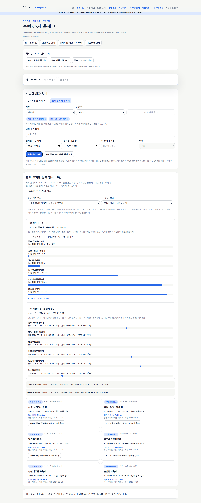
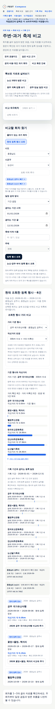

# 축제 거리 비교 검증

**공개 사용 가능**하다. [설계와 인수 범위](../sdlc/2-design/festival-distance-comparison.md)를 따른다.

## 로컬 검증

- 단위·마이그레이션 196건, headless 화면 검사 156건과 편집·공개 작업공간 흐름 통과.
- 거리 전용 10개 흐름: 좌표 기준 선택, 거리순·수치, 반경·미확인, 추가 호출 없음, 기준 변경 후 보존, 파일 보관/복원, 기획 연결, 재조회 기준 유지, 해제·과거 전환, 390px.
- 타입 검사·운영 빌드·취약점 0건·배포 선언 40건·준비 계약 17개 리소스 통과.
- Traceboard 산출물 42개·추적 누락 0건. API·Spec·Run·YouTrack 원천 4종은 미선언으로 미평가다.

거리 회귀 시험의 행사·좌표는 가상 자료다. 실제 등록 자료 검수는 아래와 별도 공개 배포 후 기록으로 구분한다. 모든 브라우저는 headless로 실행했다.

## 검수 행동

1. [공주 현재 행사 조회](https://kto.damecasol.com/compare?province=44&district=150&mode=current&start=2026-01-01&end=2026-12-31)에서 기준 행사를 선택한다. 필요하면 충남 논산시를 추가하고 조회한다.
2. 기준을 `공주 국가유산야행`으로 정해 거리순과 10·30km 반경의 차이를 확인한다. 일정은 서로 다른 달의 등록 자료이며 동시에 개최되는 행사 목록을 뜻하지 않는다.
3. 행사를 비교에 추가한 뒤 거리 기준을 바꾸고 근거로 담는다. 원래 기준·좌표·반경·출처가 파일 보관과 기획 후보 상세에 유지되는지 확인한다.

실제 개최·좌표 정확도·도로 이동시간·전국 반경 완전성은 미확인이다. 거리 계산은 기존 조회 지역과 등록 좌표에 한정한다. 거리 미확인 자료는 반경 안이라고 판정하지 않는다.

## 확인한 실제 등록 자료

2026-09-10 공개 지역 API의 공주 3건·논산 4건 모두 좌표가 있었다. 원 응답과 배포 후 검수는 최종 게시 증거에 보관한다. 공주 국가유산야행 좌표는 위도 36.4543392909·경도 127.1220001033이다. 등록 좌표만으로 행사장 실측 정확도를 보증하지 않는다.

계산은 Haversine 구면 근사이며 기존 지도 의존성 `leaflet@1.9.4`의 `src/geo/crs/CRS.Earth.js`와 같은 평균 반지름 6,371km를 사용한다. 자료 반경과 근사식 버전을 근거에 남긴다.

## 공개 검증·게시

구현 `8ad1083`의 [내부 ARC 배포 검사](https://github.com/gitvssh/fest-compass/actions/runs/34451230981)가 성공했다. 배포 선언 `504fd09`와 검증된 이미지 `sha256:fb147f9cdc5156ffb35431cc07ccc188f152092cd36e9201c92fac8f61dc133b`를 반영했다. 웹·예측 작업 컨테이너의 이미지 일치, 가용 1개·Argo 정상 동기화를 확인했다.

실제 공개 API를 사용하는 headless 검수 6개 흐름을 통과했다. 7건 모두 등록 좌표가 있었고, 별도의 구면 코사인 계산으로 화면 거리와 정렬을 대조했다. 공주 국가유산야행 기준의 결과는 다음과 같다.

| 등록 행사 | 직선거리 약 | 10km 반경 | 30km 반경 |
|---|---|---|---|
| 공주 국가유산야행 | 0.0km | 포함(기준) | 포함(기준) |
| 꽃멍+물멍, 책자리 | 0.2km | 포함 | 포함 |
| 웰컴투신관동 | 2.5km | 포함 | 포함 |
| 한국유교문화축전 | 18.6km | 제외 | 포함 |
| 연산대추문화축제 | 27.8km | 제외 | 포함 |
| 논산딸기축제 | 28.8km | 제외 | 포함 |
| 강경 국가유산야행 | 33.9km | 제외 | 제외 |

거리·반경 변경의 추가 API 호출은 0건이었다. 논산딸기축제를 선택한 뒤 기준을 바꿔도 저장 근거와 기획 후보 상세에서 원래 공주 기준·30km 조건·28.8km·좌표·출처가 유지됐다. 390px 가로 넘침·브라우저 오류·앱 서버 쓰기는 0건이다. 실제 표본의 좌표 미확인은 0건이며 결측 처리는 가상 회귀 반례로 별도 검증했다.

예측 요약·기록 2개·겨울 시험·자동 수집 상태의 의미 값 5개를 배포 전후 대조해 모두 동일함을 확인했다.

Traceboard에 설계·요구·AC11·검증 기록을 함께 게시한다. 최종 파일 대조·접근성·실제 응답·배포 증거는 `docs/validation/evidence/2026-09-10-distance-publication.json`에 남긴다. 실제 담당자 인수는 아직 미실시다.
