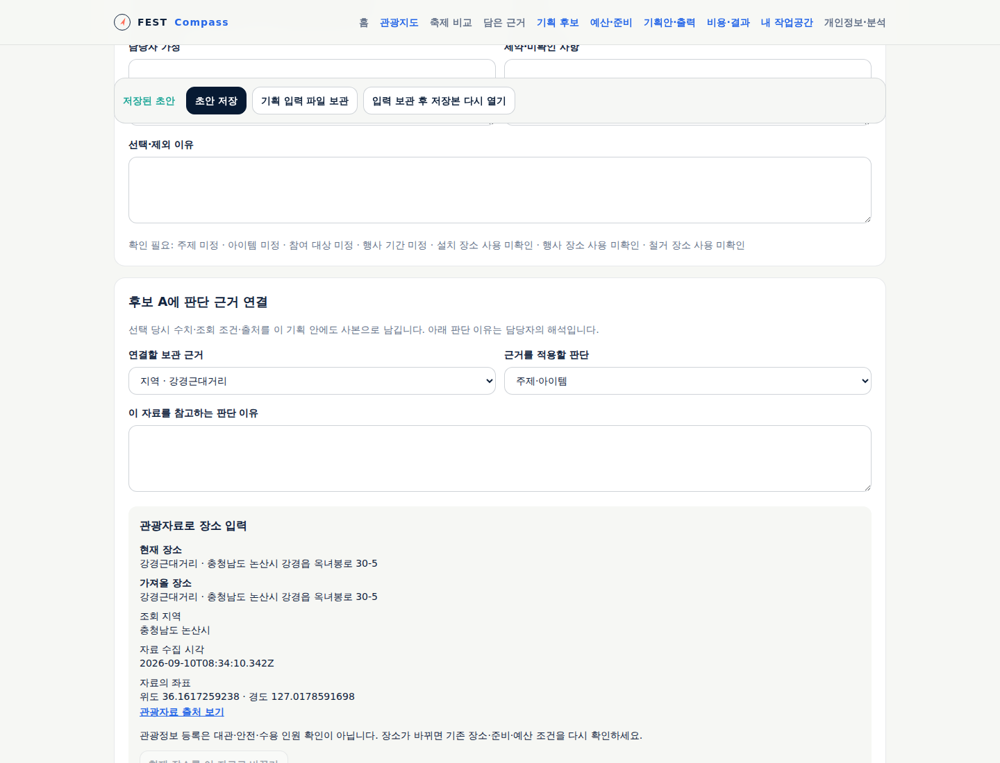
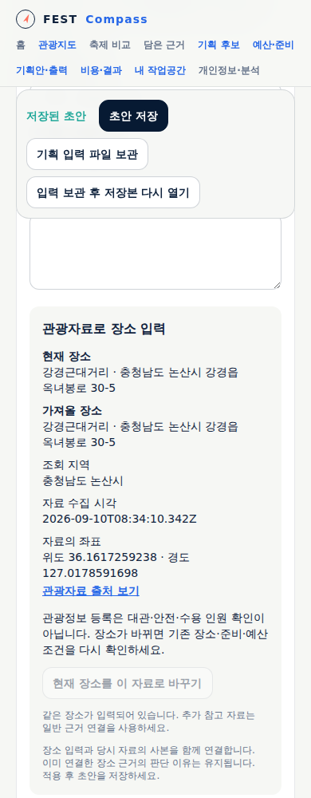

# 관광자료의 후보 장소 연결 검증

공개 앱에서 사용 가능하다. [화면·자료 설계](../sdlc/2-design/venue-evidence.md)에 따라 지도에서 담은 관광지·문화시설의 이름·주소를 명시적 동작으로 장소 입력에 옮기고 당시 출처 사본을 연결한다.

## 검증 계획

단위 검증은 기존 장소 확인 재검토, 사본·보관본 불변, 담당 지역 유지, 중복·내용 충돌, 주소 결측과 대상 자료 제한을 확인한다. headless 브라우저는 지도→근거→장소 입력, 저장·파일 재가져오기, 보관함 제거 후 사본, 모바일 화면을 확인한다. 가상 응답 시험과 실제 공개 자료 확인을 구분한다.

관광정보가 대관·안전·수용 인원 확인으로 바뀌지 않는다. 실제 행사장 경계·임차 가능 여부·실무자 인수는 미검증이다.

## 로컬 결과

Node 24.20.0, 전용 worktree에서 `npm test` 단위 198·격리 마이그레이션 1, `npm run typecheck`, `npm run build`, `npm run test:e2e` 통과. 전체 headless 165개 명명된 흐름과 기존 운영·개인 기록 여정 통과. 이 중 `scripts/venue-e2e.mjs`의 가상 관광자료 9개 흐름은 새 장소 입력·사본·파일·390px 화면을 확인한다. 서버 쓰기·브라우저 오류 0. 최초 시험 응답의 잘못된 이력 출처를 정본 값으로 수정한 뒤 전체를 다시 통과했다.

운영 의존성 audit 0, 배포 계약 40개·리소스 17개 통과. 문서 산출물 44·FR 29·UC 8·AC 59·TS 8, 누락 0. API/Spec/Run/YouTrack 원천 미선언은 미평가로 유지한다.

## 공개 자료와 실제 화면

2026-09-10 공개 API의 논산 관광자료 61건 중 **강경근대거리**(2650372)를 지도에서 선택했다. 주소는 `충청남도 논산시 강경읍 옥녀봉로 30-5`, 원문 좌표는 위도 36.1617259238·경도 127.0178591698이다. 좌표 자릿수는 원문 값이며 측량 정확도를 뜻하지 않는다. [공공데이터 출처](https://www.data.go.kr/data/15101578/openapi.do).

headless 실자료 검증 6개 흐름에서 조회→근거→후보 장소, 원문 이름·주소·좌표 일치, 담당 지역 공주시 유지, 대관 확인 미생성, 새로고침 후 사본 유지와 390px 화면을 확인했다. 브라우저 오류·앱 서버 쓰기 0. 가상 자료 회귀와 구분한다.

## 배포 확인

구현 `b2cceea`, 배포 선언 `e8bf993cf0b46dd6c05b6979c859441fb0a39185`. 내부 ARC CI [34455285244](https://github.com/gitvssh/fest-compass/actions/runs/34455285244) 성공 후 검증된 이미지 `sha256:9d4e04e39ffddd98dd6ac4aece7d2c65b41dabcfd35f38e6bd4e082e29b04d41`를 반영했다. 배포 세대 22, web·forecast-worker 두 컨테이너의 이미지 일치, Healthy·Synced·Succeeded를 확인했다. 발행 기록·모니터 데이터·겨울 시험·자동 수집의 의미 값 5개는 배포 전후 동일하다.

검수 문서 v8은 기존 내부 Traceboard에 게시한다. 최종 문서 원본·게시본 일치와 배포 증거는 `evidence/2026-09-10-venue-publication.json`에 남긴다. 공동 편집·공식 승인·실무자 인수와 지역별 과거 방문/공개 비용 자료 확대는 후속이다.
