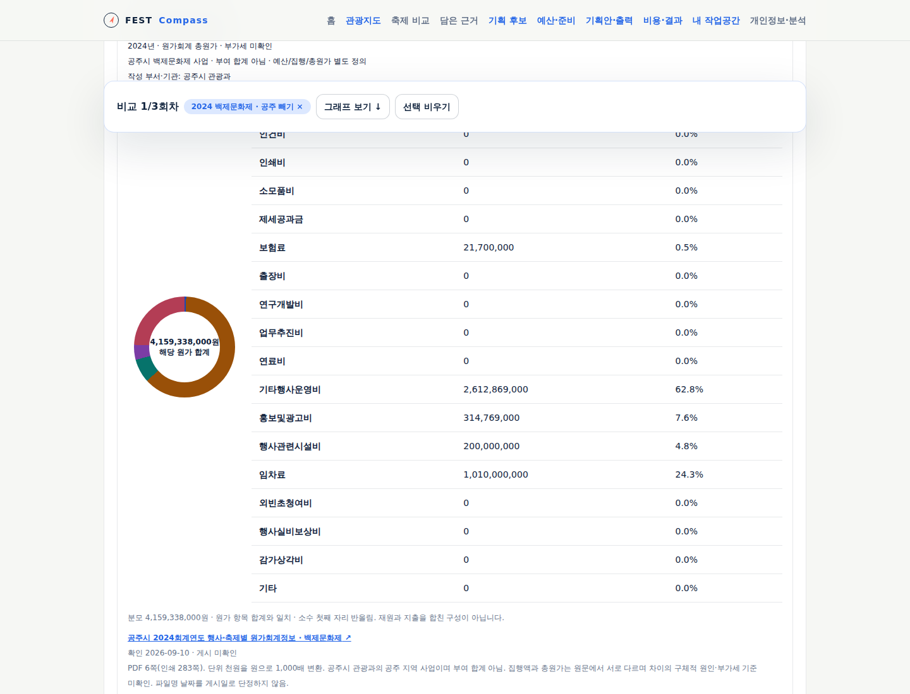
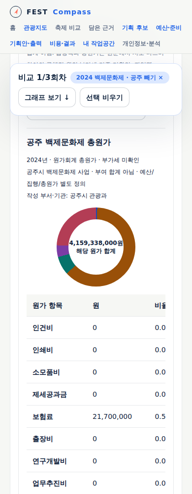

# 지역 방문 이력·공개 비용 확대 검증

공개 앱에서 사용 가능하다. 공주·임실 2023~2025년 방문 자료와 공주 2024 백제문화제 비용을 연결했다. [조사·원문 범위](../research/2026-09-regional-history-costs.md), [화면·자료 계약](../sdlc/2-design/regional-history-costs.md)을 따른다.

원문 수집 108회에서 두 지역 각 1,096일, 총 2,192일의 외지인 관측을 확보했다. 누락·유효성 오류 0. 추가 축제 4회차의 전후 60개 값을 연결해 기존 논산 45개와 함께 총 105개 방문 값을 보관한다.

공주 예산 4,637,800,000원·집행 4,614,321,000원·총원가 4,159,338,000원을 서로 다른 원문 정의로 표시한다. 원가 항목 17개(0 포함)는 합계가 총원가와 일치하며 소계 중복은 없다. 부가세와 집행/원가 차이의 구체적 원인은 미확인이다.

단위 시험은 원문 코드 별칭·동명 불일치·페이지 누락/중복·0과 결측·지역 격리·날짜별 실제 값·사본 및 구성 종류 보존을 확인한다. headless 시험은 지도→실제 값 보관, 임실 3회차 비교, 공주 비용 정의와 도넛, 파일·기획 근거·390px 화면을 확인한다.

실제 지자체 담당자 인수·전국 자료 완비·개정 이력 자동 갱신·새 지역의 예측 정확도는 검증하지 않았다.

로컬 검증: 단위 201건과 격리 마이그레이션 1건, typecheck, production build, headless 176개 명명 시나리오(12묶음)와 editor/public 작업공간 흐름을 통과했다. 신규 실제 자료 흐름은 11건이며 브라우저 오류와 앱 쓰기 요청은 0이다. 모바일 비용 표는 내부 가로 이동을 제공하고 화면 폭을 넘지 않는다. 의존성 production audit 취약점 0, 배포 계약 시험 40건과 17개 리소스 검증을 통과했다.

Traceboard 정적 추적 검증: 문서 47개, FR 29개, UC 8개, AC 60개, TS 8개, 추적 공백 0. 선언되지 않은 API/Spec/Run/YouTrack 연결은 미평가다.

## 공개 배포와 실제 자료 대조

구현 `514a4fcc1c164a20cc26f53d1f3ef84174294990`의 [내부 ARC CI](https://github.com/gitvssh/fest-compass/actions/runs/34461093537)가 통과했다. 검증된 이미지 `sha256:ee3e4e0d250ed66228a99f2e3ffbe7b727cf1bcb21c575e07607caac8e09b6ba`를 배포 선언 `0cec7122dc0789a36a01af08df5bf69f2dd3a4de`로 반영했다. Deployment generation 23/observed 23, web·forecast-worker 동일 이미지, available 1, Argo Healthy·Synced·Succeeded를 확인했다.

2026-09-10 09:37 UTC, [공개 앱](https://kto.damecasol.com/compare)의 실제 보관 자료로 headless 11개 흐름을 통과했다. 지도 일별 값·임실 3회차·공주 비용 정의·원가 도넛·파일 보관·기획 근거 연결·390px 화면을 확인했으며 브라우저 오류와 앱 쓰기 요청은 0이다. 지도 배경 요청은 시험 타일로 대체하고 실제 자료 응답은 대체하지 않았다. Cloudflare 동의 창은 거부 후 진행했으며 분석 전송은 앱 쓰기와 구분한다.

공개 지역 API를 지역·연도별 6회 조회해 2,192일 전체의 날짜·값·품질·원본 식별자가 보관본과 일치함을 확인했다. 첫 Python 기본 User-Agent 요청은 HTTP 403이었고, 브라우저 User-Agent로 다시 조회해 성공했다. 예측 기록·달력 시험·자동화와 시간 필드를 제외한 모니터 자료의 다섯 비교 값은 배포 전후 동일하다.

Traceboard는 이 문서와 이미지를 검수본으로 발행한다. 실제 게시 파일 대조·접근성·브라우저 확인의 최종 결과는 `docs/validation/evidence/2026-09-10-history-costs-publication.json`에 기록한다.
