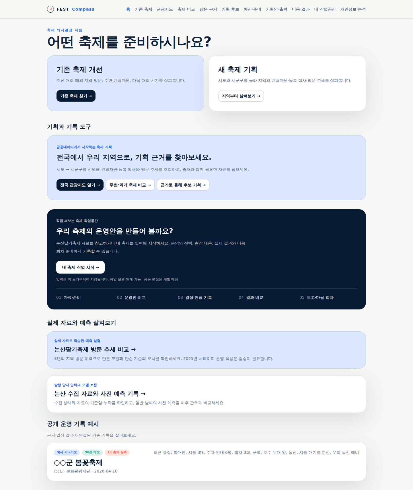
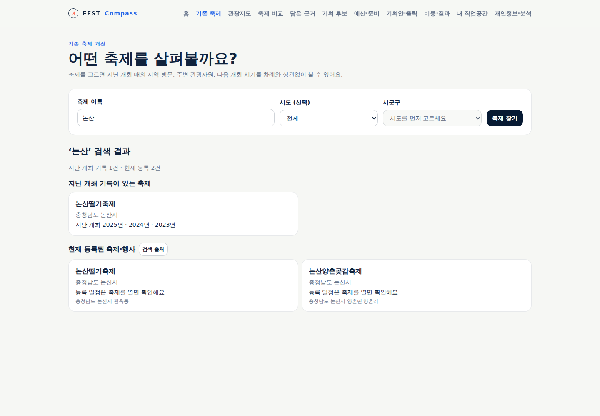
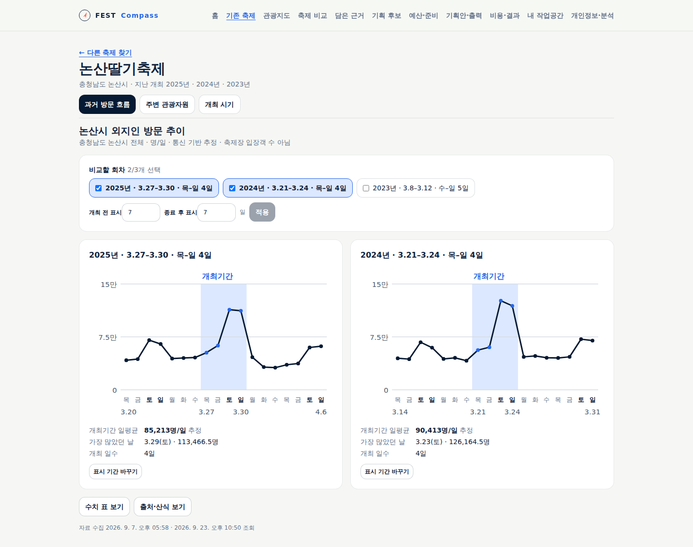
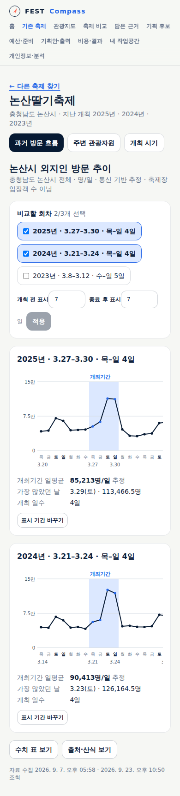
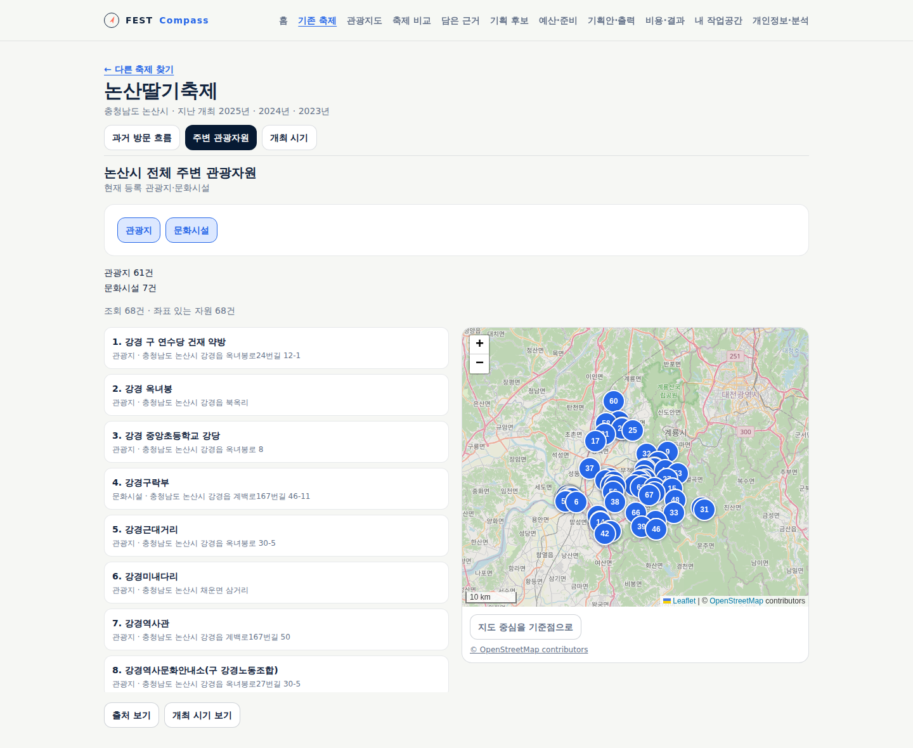
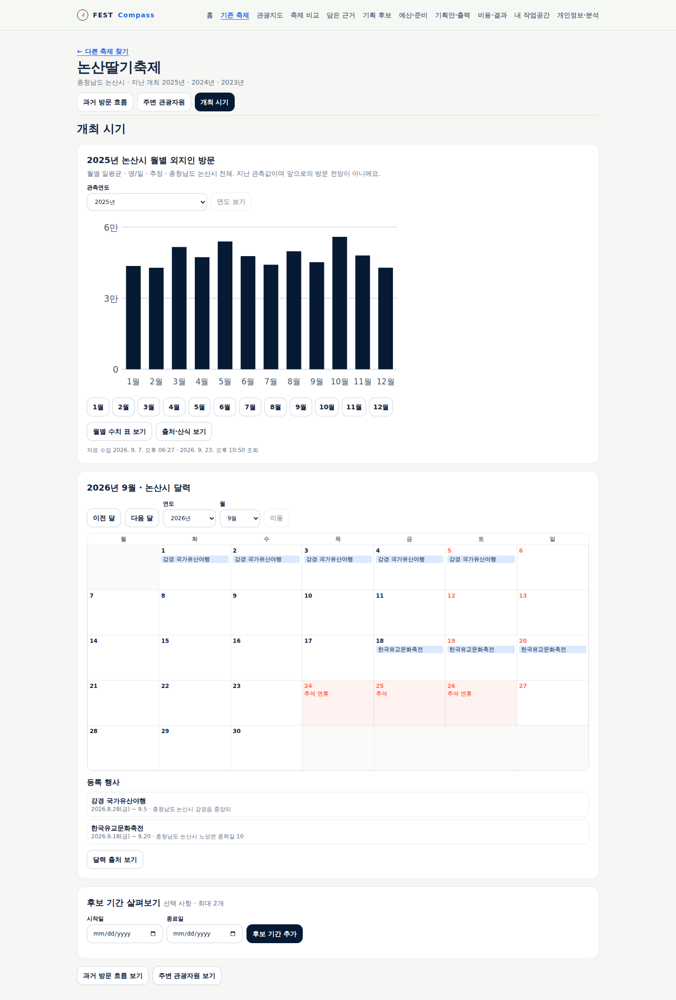

# 기존 축제 개선 흐름 검증

기존 축제 개선의 검색·과거 방문·주변 관광자원·개최 시기를 구현해 [공개 서비스](https://pickday.damecasol.com/existing/search)에 반영했다.
변경 전 기준 앱 커밋은 `28c06973ba31db8d132eaedbe6de5b4e09cb3723`이며,
[기능 상세](../sdlc/2-design/functional-spec.md)와 [인수 시나리오](../sdlc/3-testing/scenarios/TS-FC-009.md)를 따른다.
Claude Opus 5.5에 자료 처리·화면 구현·인수 시험 작성을 위임하고 통합 담당이 원자료·코드·실행 화면을 직접 검수했다.
최종 세 위임 실행 결과의 모델 식별자는 모두 `claude-opus-5-5`이며 성공 종료를 확인했다.

## 사용자에게 제공할 흐름

첫 화면에서 기존 축제를 고른 뒤 지난 개최 때의 지역 방문, 현재 주변 관광자원, 다음 개최 시기를 자유롭게 살펴본다.
목표·메모·기획안 작성이나 저장은 탐색 조건이 아니다. 새 축제 쪽은 현재 지역 탐색으로 연결하며 전용 흐름의 구현은 후속이다.
현재 등록 콘텐츠와 보관 회차는 확인한 식별 연결만 허용한다. 이름이 같아도 서로 다른 자료를 자동 병합하지 않는다.

## 실제 보관 자료 대조

`festival-editions.json`의 일정과 지역 보관본을 날짜별 최신 수집 순서로 합쳐 다시 계산했다.
아래는 시군구 일별 외지인 방문의 개최기간 평균이다. 행사장 입장객이나 개최 행정동의 연도별 추이가 아니다.

| 회차 | 개최일수 | 일평균 원값 | 최대 방문일·원값 | 전후 7일 차트의 전체 일수 |
|---|---:|---:|---|---:|
| 논산 2023 | 5 | 68,590.9 | 2023-03-11 · 120,599.5 | 19 |
| 논산 2024 | 4 | 90,412.875 | 2024-03-23 · 126,164.5 | 18 |
| 논산 2025 | 4 | 85,212.75 | 2025-03-29 · 113,466.5 | 18 |
| 임실 2023 | 4 | 51,570.75 | 2023-10-08 · 67,791.5 | 18 |
| 임실 2024 | 4 | 51,277.625 | 2024-10-05 · 64,372 | 18 |
| 임실 2025 | 5 | 65,880.5 | 2025-10-08 · 109,833.5 | 19 |
| 공주 2024 | 9 | 95,441.888… | 2024-09-28 · 130,382 | 23 |

2026-09-23 실제 `searchKeyword2`의 `논산` 검색은 HTTP 200·2건이었다.
논산딸기축제 `525292`, 논산양촌곶감축제 `1139979` 모두 법정동 코드 `44/230`을 제공하고 개최일 필드는 없었다.
검색의 날짜 없음과 상세 조회로 확인한 일정은 구분한다. 자격 증명은 기록하지 않았다.
같은 날 `detailCommon2`로 `525292`의 축제 유형·논산 지역을 확인했고,
`detailIntro2`의 현재 등록 일정은 2026-03-26~29였다. 이 일정은 2025·2024의 과거 비교 회차를 대체하지 않는다.

## 화면과 자료의 연결

| 화면 | 실제 연결과 경계 |
|---|---|
| `/existing/search` | 보관 축제와 현재 등록 검색을 별도 결과로 제공한다. 이름만으로 같은 축제로 합치지 않는다. |
| `/existing/{id}/visits` | 확인된 보관 회차의 시군구 일별 외지인 방문. 회차별 차트와 원래 개최기간의 평균·최대일을 보여 준다. |
| `/existing/{id}/resources` | 선택 축제 지역의 현재 등록 관광지·문화시설. 사용자가 기준점을 정한 뒤만 조회 목록의 직선거리를 계산한다. |
| `/existing/{id}/timing` | 과거 관측연도의 월별 일평균, 별도의 연월 달력, 선택한 0~2개 후보 기간을 제공한다. |

ID는 `archive:<festivalId>` 또는 `current:<regionCode>:<contentid>`다. 현재 등록 항목의 지역·이름은
서버에서 원천 상세로 확인하며, 주소에 들어 있는 지역 코드만으로 관광자원이나 방문 자료를 연결하지 않는다.
새 경로는 다섯 `/api/existing/*` GET 조회를 사용하고 개인 기록·DB 로그를 작성하지 않는다.
조회 조건은 주소와 같은 탭의 메모리로 구분하며 영구 기획 기록을 자동 생성하지 않는다.

직접 검수에서 회차 평균의 원 기간 유지, 긴 차트의 날짜 간격, 원천 실패와 조회 결과 0건의 구분,
검증 전 지역 연결 방지, 동일 조건의 이전 성공 자료와 갱신 실패 표시 보존을 주요 수정 항목으로 삼았다.
과거 자료의 값 수정과 지표 정의 변경을 구분한다. 최신 수집본의 명시적 결측은 과거 숫자로 되살리지 않는다.

## 검증·게시 결과

Node 24.20.0에서 전체 단위 시험 **268건**, 타입 검사·운영 빌드, headless 브라우저 **17개 스크립트**를 통과했다.
새 자료 처리 시험은 29건이며 브라우저 시험은 AC1~14에 대응하는 28개 확인 항목을 실행했다.
논산의 실제 일별·월별 보관값과 공휴일을 사용하고 현재 등록 축제·자원·행사, 0·누락·정의 차이·실패는 통제 응답으로 구분했다.
새 여정에서 API 조회 72회, 브라우저 오류 0, 같은 출처로 보내는 쓰기 요청 0, 시험용 응답 처리 실패 0이었다.
기획 기록의 영구 저장도 발생하지 않았다. 배포 계약 17개 리소스와 인프라 시험 40건을 통과했다.

| 검수 항목 | 판정·근거 |
|---|---|
| 목표·흐름 | 충족 — 목적 선택, 기본 2025·2024 회차, 세 화면 임의 이동·조건 복귀·기록 없는 종료 |
| 수치·자료 의미 | 충족 — 실제 분모·평균·최대일, 18·18·19일 구간, 월별 12개 평균, 원 기간과 표시 기간 분리 |
| 위계·문구 | 충족 — PC·390px 표시본 직접 검수, 차트 앞의 중복 설명 축약, 탐색 화면의 기록 저장 안내 제거 |
| 상태·복구 | 충족 — 0/결측/취소/정의 불일치, 독립 자료 실패, 이전 성공값·시각 보존, 재시도·늦은 요청 취소 |
| 키보드·390px | 충족 — 선택·메뉴·표·출처 닫기 초점, 실제 관측월 달력 뒤로가기, 페이지 전체 가로 넘침 없음 |
| 출처·고지 | 충족 — 지표·단위·지역·자료 시각과 원문, 지도 출처 표시. 내부 연결 규칙을 고객 문구에서 제외 |
| 보조기술 전체·320px·200% 확대·담당자 관찰 | 미평가 — 이번 자동 시험·직접 검수 범위를 확대해 주장하지 않음 |
| 최종 시각 디자인 | 미평가 — 사용자 후속 디자인 작업이며 기존 스타일의 기본 배치로 구현 |

경합 시험은 이전 요청을 보류한 뒤 최신 조건을 확인하고 이전 요청을 해제한다. 브라우저가 이전 요청을 취소하는 동작을 검증하며,
이미 취소된 응답을 실제로 소비했다고 주장하지 않는다. 출처창 열림과 모든 스크롤 위치의 완전 복원은 후속이다.
지표 정의가 다른 회차는 잘못된 단위로 원자료를 표시하지 않으며 취소 회차의 확인된 지역 일별 값은 표에서 확인할 수 있다.
원천 키워드 검색의 페이지 연속성·현재 상세 확인과 실행환경 자료의 마지막 정상본 보존은 별도 단위 시험으로 검증했다.

## 공개 서비스 확인 · 2026-09-23

구현 커밋 `66c3b740ac8360a7b324277fc8d7b6af37ad4b0e`의
[CI 실행 35868993176](https://github.com/gitvssh/fest-compass/actions/runs/35868993176)이 성공했다.
저장소 전용 ARC `homelab-fest-compass`에서 실행했고 GitHub Actions artifact 수는 0이다.
검증된 이미지 `sha256:63fa5e1f7a2eaac0571f8955d1ff1ec03131da86c7b9fd4aeb6bee7d95750683`를
배포 커밋 `81ce345029e008f6768a2a8cfcea6487ec00e17b`에 고정했다.
Argo CD는 해당 커밋에서 `Synced / Healthy`, 실행 결과는 `Succeeded`였다.
배포 전후 Deployment·PVC 식별자가 같고 업무 데이터 9개 모델의 행 수·내용 해시가 모두 같았다.

공개 서비스에서는 시험용 응답 없이 다음을 직접 조회했다.

- `논산` 검색: 보관 축제 1개와 현재 등록 2개. 현재 논산딸기축제의 상세 일정은 2026-03-26~29.
- 지난 방문: 논산 2025·2024·2023의 평균·최대일·18/18/19일 자료가 위 독립 대조값과 일치.
- 개최 시기: 2025년 12개월의 일평균이 대조값과 일치. 2026년 3월 등록 행사 1건, 주말 9일, 공휴일 2일 확인.
- 주변 관광자원: 관광지 61개·문화시설 7개 정상 응답. 실제 지도 배경·표식 표시와 표식 선택 확인.
- PC·390px 화면: 페이지 전체 가로 넘침 없음, 브라우저 오류 0, 같은 출처의 API 쓰기 요청 0.

자동 시험의 통제 응답과 위 실제 운영 조회를 구분한다. 전국 모든 축제의 자료 완비·현장 실측·담당자 사용성까지 검증한 것은 아니다.
기존 예측 모델·보관 원자료·운영 업무 데이터는 유지했다. [구조화 검증 근거](evidence/2026-09-23-existing-journey.json)에 실행 대상과 결과를 남겼다.

## 실제 공개 화면

아래는 2026-09-23 공개 서비스의 실제 자료 표시본이다. 개발 전 와이어프레임과 구분하며 최종 디자인 확정본은 아니다.

### 첫 화면과 축제 검색

### 지난 개최 때의 지역 방문

390px 모바일에서도 같은 회차·값을 확인했다.

### 주변 관광자원과 개최 시기

다음 개발 대상은 새 축제 전용 흐름이다. 현재 첫 화면의 새 축제 진입은 기존 지역 탐색으로 연결한다.
담당자 업무 관찰·최종 시각 디자인·보조기술 전반 검수는 후속이며, 뉴스 검색·원문 연결은 두 핵심 흐름 뒤에 진행한다.
