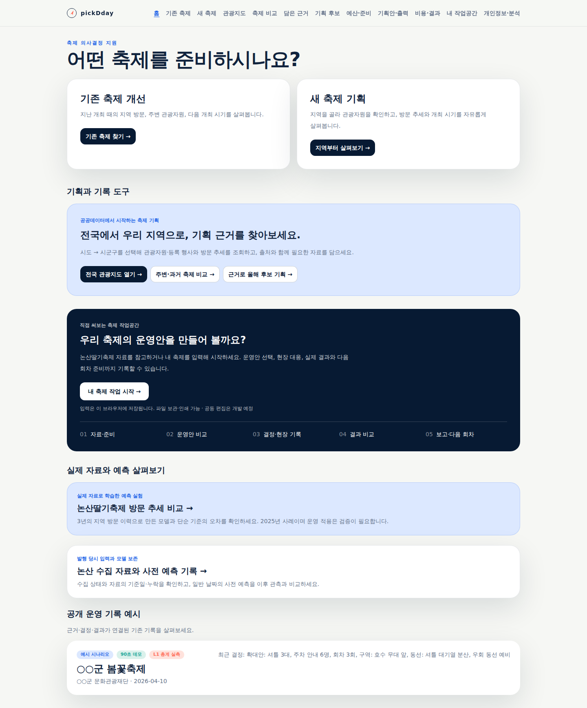
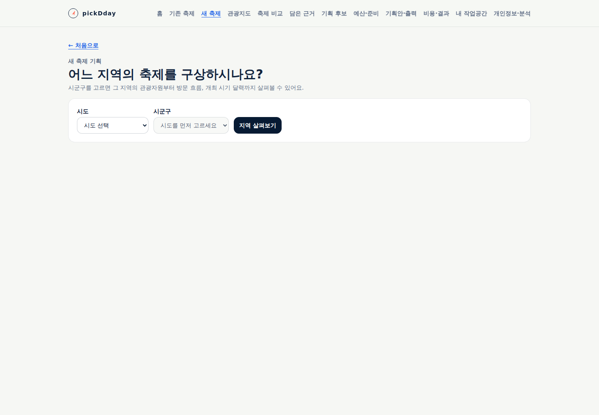
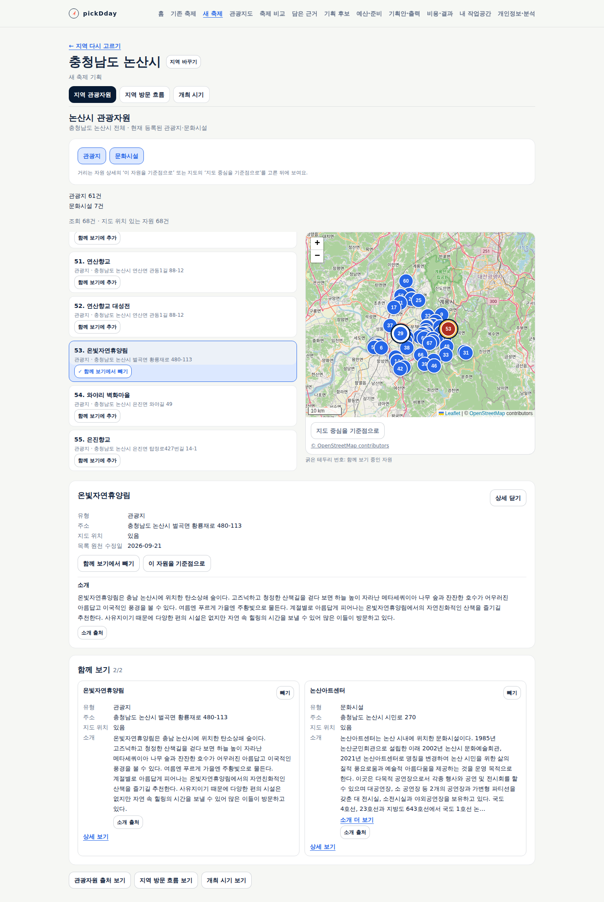
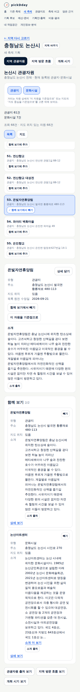
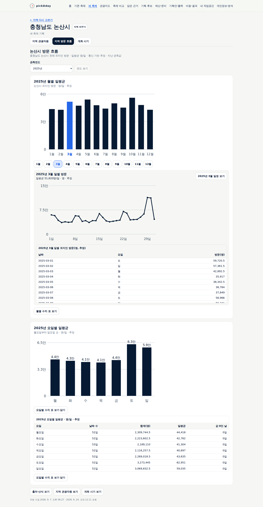
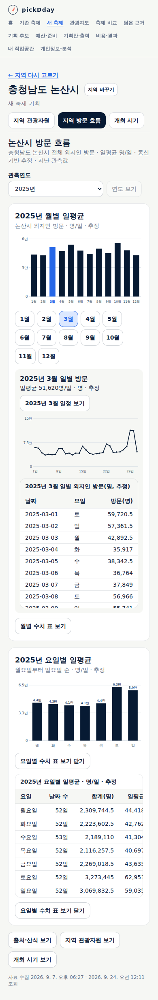
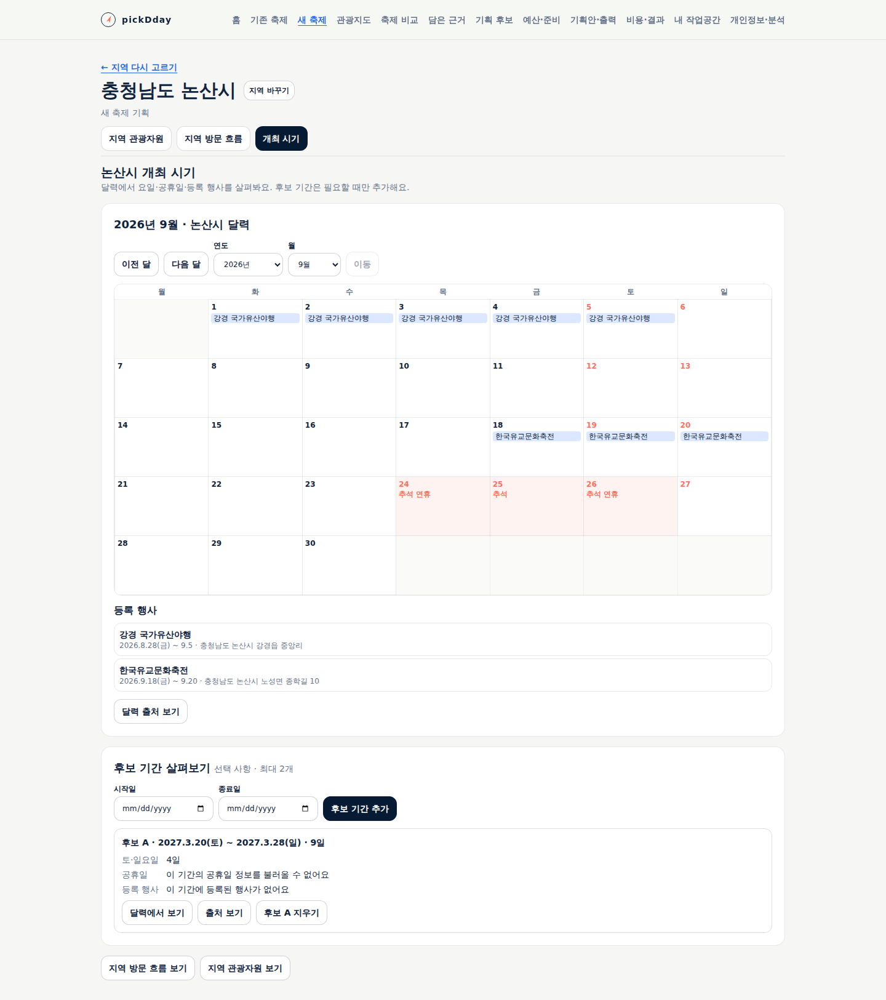
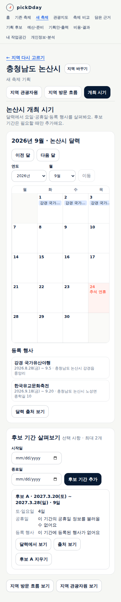

# pickDday 이름 변경과 새 축제 기획 흐름

2026-09-23 사용자의 이름 변경·다음 개발 요청에 따른 작업이다. 변경 전 기준 커밋은
`e63c4f87c016dd598a77bc990ca81c2ba651d514`다. 한국 시간 2026-09-24 공개 반영과 확인을 마쳤으며
[새 축제 기획](https://pickday.damecasol.com/new)에서 사용할 수 있다.

## 제품명과 제공할 경험

제품 표시명은 **pickDday**다. 지역 공무원이 공공데이터로 지역 관광자원과 방문 흐름을 살펴
관광 활성화를 위한 축제를 기획·개선하도록 돕는다. 대상 관광객·방문 이유·최종 개최안을 데이터가 대신 확정하지 않는다.
소개·메뉴·검색 공유 정보·다운로드 파일명·현재 문서와 검토 자료의 표시명을 같은 이름으로 정리한다.
과거 원자료·게시 증거와 개인 저장 데이터의 호환 식별자는 구분해 관리한다.

새 축제는 지역 선택으로 시작한다. 현재 관광지·문화시설을 지도와 목록에서 보고 최대 두 곳을 함께 살펴본다.
그 지역의 실제 월별·요일별 방문, 후보 없이 열리는 일정 달력, 선택한 0~2개 후보 기간 비교로 이어진다.
축제명·주제·관광객·이유·기획안 입력이나 저장은 탐색의 조건이 아니다.

## 원자료의 독립 계산

논산 2025년 일별 외지인 방문 365개를 날짜별 최신 수집 자료로 골라 다시 계산했다.
아래는 시군구 통신 기반 방문 추정의 일평균이며 시설 방문·축제 입장객이 아니다.

| 요일 | 실제 일수 | 일별 값의 합 | 반올림 표시값 · 명/일 |
|---|---:|---:|---:|
| 월 | 52 | 2,309,744.5 | 44,418 |
| 화 | 52 | 2,223,602.5 | 42,762 |
| 수 | 53 | 2,189,110 | 41,304 |
| 목 | 52 | 2,116,257.5 | 40,697 |
| 금 | 52 | 2,269,018.5 | 43,635 |
| 토 | 52 | 3,273,445 | 62,951 |
| 일 | 52 | 3,069,832.5 | 59,035 |

요일 평균은 선택 연도 전체가 완전할 때만 계산한다. 0은 유효한 관측이며 누락은 0으로 채우지 않는다.
불완전한 연도에서도 확인된 월별·일별 자료는 유지한다. 다른 지역이나 연도의 자료로 자동 대체하지 않는다.
자원 소개는 해당 ID·유형·지역을 원천 상세에서 확인한 뒤 제공하며 목록과 별도의 수집 시각을 사용한다.

## 검증 상태

자료 처리·화면·인수 시나리오는 Claude Opus 5.5에 위임하고 통합 담당이 원문·코드·수치·실제 화면을 직접 검수한다.
실제 native 호출 모델은 `claude-opus-5-5`였으며 성공 종료·권한 거부 없음까지 확인했다. 모델 자체의 완료 진술은
검증 통과 근거로 사용하지 않았다.

- 전체 단위 시험 280건(자료·화면 보조 로직 269건, Node 시험 11건), 타입 검사, 제품 빌드 통과.
- 배포 계약 시험 40건과 17개 운영 선언 검사 통과. 기존 예측 시험의 고정 코드 14개와 계획 해시도 일치한다.
- 첫 타입 검사에서 테스트 헬퍼의 관광지 한 종류로 좁혀진 타입을 수정했다. 기능 로직 변경은 아니다.
- 최초 빌드에서 이미 고정된 예측 수집 파일의 내부 요청 이름 변경을 감지했다. 해당 내부 이름만 원래대로 유지해
  시험 계획·입력의 일관성을 보존했다. 화면 이름·공유 정보·현재 안내문은 `pickDday`다.
- 관광공사 실제 `detailCommon2` 조회에서 온빛자연휴양림(2752308, 관광지)의 소개 241자,
  논산아트센터(1755094, 문화시설)의 소개 409자와 논산 지역 일치를 확인했다. 원천 수정일은 각각
  2026-09-21·09-10이며 소개 수집 시각과 구분한다.

- 새 축제 headless 인수 시험은 AC1~14에 해당하는 37개 항목을 통과했다. 방문·공휴일은 실제 보관본을 쓰고,
  자원·소개·행사·지도 및 0/결측·실패·늦은 응답은 표시된 검증용 자료로 통제했다. 브라우저 오류·쓰기 요청 0건이다.
- 화면의 `목록 원천 수정일`과 시험 선택자의 명칭을 맞췄다. 전체 회귀 중 기존 축제 시험이 응답 전에 빈 표를
  읽는 경우도 확인해 해당 연도의 실제 행이 나타난 뒤 대조하도록 수정했다. 기다리는 시간을 임의로 늘리거나
  수치 확인을 제거하지 않았다.
- 논산 실제 보관본의 방문 화면을 1440px·390px에서 별도로 열어 차트·지표명·연도 선택·수치 표 진입과
  페이지 가로 넘침 없음을 직접 검수했다.

- 최종 `npm run test:e2e` 전체 18개 headless 스크립트 통과. 기존 축제 28개 항목과 새 축제 37개 항목,
  기존 개인 계획·예산·출력·결과 자료 호환까지 포함한다. 대상은 이 작업 브랜치의 아래 구현이며
  Node 24.20.0·격리 SQLite·Next production 서버에서 확인했다. 공개 반영 검증은 이어 수행한다.

## 공개 운영 확인

구현 커밋은 `c8f7c6c2ba932d53a5778118b2f6e9a8e0c6a042`, 배포 선언은 `7bcb6ccd90078ec11700f9cbe8eeacaa6430fe7f`다.
[ARC CI 35878391672](https://github.com/gitvssh/fest-compass/actions/runs/35878391672)가 성공했다.
정확한 `homelab-fest-compass` 실행 라벨을 사용했고 Actions artifact는 0개다. 초기 예약 메모리 부족은
진행 중이던 작업 종료 뒤 해소됐으며 다른 실행 환경으로 우회하지 않았다.
검증한 이미지는 `sha256:4e1f2992616bd3963021838ac0c42677c98eb1d92451491d4c8140a131085351`이다.
Argo `Synced/Healthy`, 준비된 앱 1개, web·수집 프로세스의 이미지 일치, 기존 Deployment·PVC 식별자와
업무 9개 모델의 행수·내용 해시 보존을 확인했다. 첫 sync 요청의 잘못된 revision 문자열은 즉시 게시된 전체 SHA로
수정했으며 최종 성공 대상은 위 배포 선언이다.

실제 공개 서비스에서 가상 응답 없이 확인했다([검증 근거](evidence/2026-09-24-pickdday-new-festival.json)).

- 첫 화면·메뉴·브라우저 제목·검색 설명의 `pickDday` 이름, 지역 미선택 시작, 시도→시군구 진입.
- 논산 관광지 61곳·문화시설 7곳과 지도. 온빛자연휴양림·논산아트센터의 실제 소개·수집 시각, 두 곳 함께 보기.
- 논산·공주·임실 2025 요일별 평균을 보관 원문으로 독립 계산해 전체 일곱 요일의 합·분모·원평균·표시값과 대조.
- 논산 2026은 확인된 7개월 평균을 유지하고 불완전 연도의 요일 평균을 만들지 않음.
- 실제 2025년 3월 일별 표→같은 연월 달력→뒤로가기의 월 선택·초점 복원.
- 후보 하나의 9일 전체 기간과 공휴일 미확인·등록 행사 조회 결과의 구분. 지역 변경 뒤 후보·관측연도 유지,
  이전 자원 함께 보기 해제. 잘못된 지역 주소에서 지역 선택 복구.
- 390px 페이지 넘침 없음, 브라우저 오류·같은 서비스 API 쓰기 요청 0건.

## 실제 화면과 제품 검수

아래는 공개 서비스의 실제 자료 화면이다. 통합 담당이 모두 직접 검수했다. 기능과 기본 배치의 구현이며
최종 시각 디자인의 확정을 뜻하지 않는다.

| 관점 | 판정·근거 |
|---|---|
| 목표·흐름 | 충족 — 첫 화면 두 목적, 지역 선택→세 과업, 필수 기록 없음. 37개 자동 항목·공개 탐색 대조 |
| 정보 위계·문구 | 충족 · 기본 배치 — 지역·연도·단위, 자원 목록/상세/비교, 월/요일 그래프와 표. 내부 절차·검수 문구 없음 |
| 상태·복구 | 충족 — 독립 실패·재시도, 이전 지역 응답 무시, 0/누락 구분은 통제 시험. 실제 무자료 지역·연도는 로컬 보관본으로, 잘못된 주소 복구는 공개 서비스에서도 확인 |
| 반응형·접근성 | 충족 · 시험 범위 — 390px·키보드·출처 닫기와 월 복귀 초점. 달력/수치 표는 자체 가로 스크롤. 전체 보조기술·확대 조합은 미평가 |
| 필요한 고지·출처 | 충족 — 지도 귀속 유지, 방문 지표의 지역·분모·통신 기반 추정, 소개의 원천/수집 시각 구분 |
| 실제 담당자 사용성·최종 시각 디자인 | 미평가 — 사용자 후속 작업 |

## 배포·저장 호환 범위

GitHub 저장소 소개도 관광자원·방문 흐름을 활용한 축제 기획·개선이라는 설명과 `pickDday` 이름으로 바꿨다.
저장소 주소 `gitvssh/fest-compass`, 공개 주소 `pickday.damecasol.com`, CI·배포 리소스·DB·개인 저장 키·저장 파일의
형식 식별자는 유지한다. 새로 내려받는 파일의 표시 이름만 바꾸므로 이전 개인 자료를 그대로 읽을 수 있다.
검토용 사본은 새 `D:\download\project\pickDday\` 폴더에 만들며 이전 검토 폴더는 보존한다.

현재 최종 시각 디자인·실제 담당자 업무 관찰은 이번 구현 완료와 구분되는 후속 작업이다.
뉴스 검색·원문 연결은 공공데이터 핵심 흐름을 연결한 뒤 진행하며 AI 요약은 나중에 검토한다.
