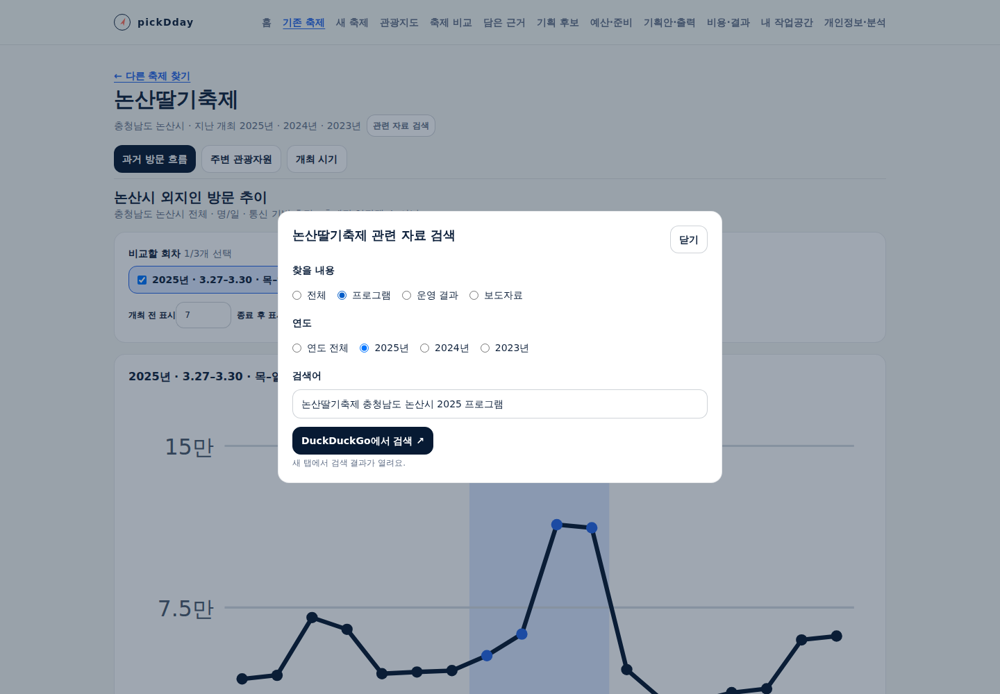
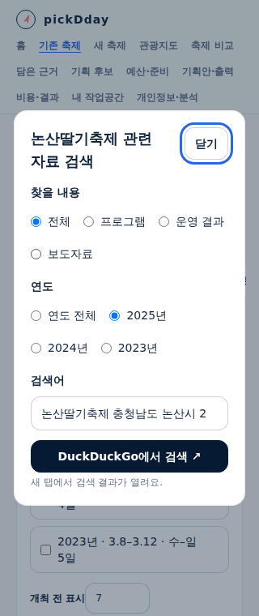
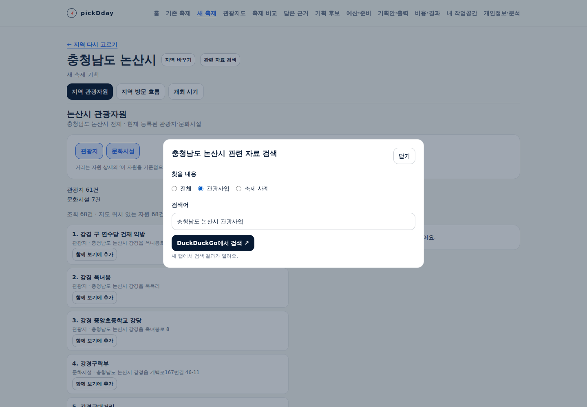
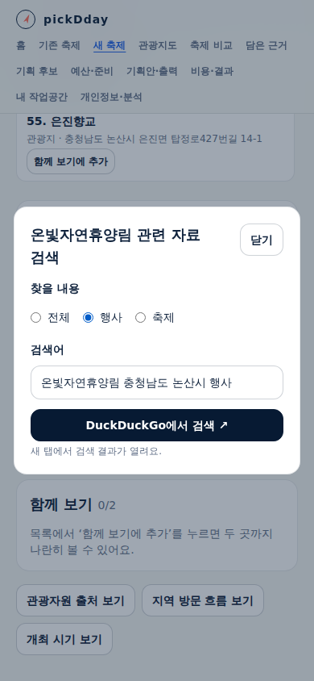

# 관련 자료 검색·원문 연결

## 사용자 목표와 작업 범위

지역 축제 담당자가 공공데이터를 살펴보다 당시 프로그램·운영 자료 또는 지역 관광사업·자원 활용 사례를 찾아본다.
2026-09-24 사용자가 다음 안의 개발과 Claude Opus 5.5 설계·구현 위임 및 주 담당자의 직접 검수를 요청했다.
기존 축제 개선과 새 축제 기획의 세 핵심 메뉴는 유지하며 검색은 보조 행동으로 연결한다.

첫 범위는 검색어를 외부 검색에 전달하고 그 검색 결과에서 원문을 여는 동선이다. 앱 내부의 기사 목록·수집·요약·
수치 추출은 포함하지 않는다. 공공데이터의 출처 링크는 그대로 유지한다. 기록·저장·사용자 전략 입력을 요구하지 않는다.
구현·전체 로컬 검증과 공개 배포를 마쳤다. 최종 운영 상태는 아래 운영 확인을 따른다.

## 제공자 확인

- 2026-09-24 [DuckDuckGo 공식 검색 URL 안내](https://duckduckgo.com/duckduckgo-help-pages/get-duckduckgo/deploy-duckduckgo)의 `https://duckduckgo.com/?q={searchTerms}` 형식을 확인했다.
- [URL 매개변수 안내](https://duckduckgo.com/duckduckgo-help-pages/settings/params)를 함께 확인했다. 검색어 `q`만 전달하고 브랜드·광고를 제거하는 매개변수나 제휴 추적값을 넣지 않는다. 이 확인을 검색 API·크롤링 이용 허가로 확대하지 않는다.
- 실제 headless Chromium에서 `논산딸기축제 2025 프로그램` 검색어와 DuckDuckGo 검색 화면 제목이 전달됐으나 HTTP 202와 사람 확인 화면이 나타났다. 도전 과제를 우회하지 않았다. 자동 검증에서 검색 결과·기사 원문까지 확인한 것으로 기록하지 않는다.
- 최종 공개 앱에서 지역명을 포함한 `논산딸기축제 충청남도 논산시 2025 프로그램`을 열었을 때는 HTTP 200·검색어가 포함된 화면 제목·참조 주소 없음·opener 없음을 확인했고 사람 확인 화면은 감지되지 않았다. 결과의 적합성·기사 원문 내용은 검증하지 않았다. 앞선 사람 확인 사례와 구분한다.
- 외부 검색 결과·순위·원문 제공 여부는 제공처 상태에 따르며 앱은 결과 건수·공식성·정확성을 생성해 표시하지 않는다. 앱 내부의 기존 탐색은 외부 검색이 열리지 않아도 계속 사용할 수 있다.

## 위임과 직접 검수

실제 `claude-opus-5-5` 모델로 설계·구현·인수 시험 작성 세 작업을 나눠 수행했다(firstParty 응답 metadata 확인).
주 담당자가 설계의 지역명·잘못된 회차 처리·갱신 실패 시 이전 정보 유지 기준을 보완한 뒤 구현에 전달했다.
설계 단계의 복합 셸 조회 한 번은 도구 허용 범위에서 거부됐고 읽기 도구로 계속 진행했다. 구현·인수 시험 작성은 권한 거부 없이 성공 종료했다.
주 담당자가 코드를 직접 검토하고 실제 브라우저 실행·수정·재검증을 맡았다. 최종 시각 디자인과 실제 담당자 업무 관찰은 구분한다.

## 제공하는 동작

- 기존 축제 머리: 확인된 축제명·시도·시군구로 검색한다. 방문 화면에서 적용 회차가 하나면 그 연도, 비교 중이면 연도 전체다.
- 새 축제 지역 머리: 시도·시군구로 관광사업·축제 사례를 찾는다. 자원 상세에서는 자원명과 지역으로 행사·축제를 찾는다.
- 검색창: 주제·확인된 연도를 고르거나 검색어를 수정한다. 빈 검색어는 복구 안내를 표시하며, 닫았다 다시 열면 현재 대상의 기본값으로 돌아온다.
- 명시적인 검색 동작만 DuckDuckGo 새 탭을 연다. 기존 조회 조건·회차·자원 선택과 공공데이터 출처를 유지한다.

기본 배치와 문구는 [기능 상세 §8](../sdlc/2-design/functional-spec.md#8-관련-자료-검색원문-연결)에 있다.

## 직접 발견해 고친 부분

- 검색 입력칸이 Esc를 먼저 처리해 창이 닫히지 않는 문제를 브라우저 시험에서 재현했다. 한글 조합 중 동작은 보존하고 일반 Esc는 창을 닫아 실행 버튼으로 초점을 돌리도록 수정했다.
- 긴 대상 이름이 좁은 창 밖으로 나오지 않도록 제목의 줄바꿈을 보완했다.
- 인수 시험이 한 줄 입력칸의 정상적인 문자열 좌우 이동을 창 가로 넘침으로 오판했다. 입력칸의 바깥 경계·창·문서 넘침 검사는 유지하고 내부 커서 이동만 구분했다.
- 기존 새 축제 인수 시험은 상세 닫기의 다음 프레임 초점 복귀 전에 비교 추가 키를 눌러 간헐적으로 실패했다. 실제 초점 복귀와 각 추가 완료를 확인한 뒤 다음 행동으로 진행하도록 시험을 보완했다. 자원 비교의 제품 동작은 변경하지 않았다.

## 실행 검증

Node 24.20.0에서 단위 289건(278 TSX + 11 Node), 타입 검사, 전체 앱 빌드, 인프라 시험 40건·17개 리소스 검사를 통과했다.
관련 검색 headless 검사 25항목은 통과했고 시험 도착지로 새 탭 3번·참조 주소 없음·opener 없음·브라우저 오류 0·앱 쓰기 0을 확인했다.
관련 검사는 실제 회차·지역 보관본과 명시적인 검증용 현재 등록·자원·검색 도착지를 구분한다. 실제 검색 결과 확인으로 확대하지 않는다.
`npm run test:e2e`의 전체 19개 headless 시나리오 스크립트가 통과했다. 기존 축제 28항목·새 축제 37항목·관련 검색 25항목을 포함한다.
문서 추적 52개 산출물의 누락 0·린트 오류/경고 0, `git diff --check`도 통과했다.
정형 API/Spec/Run·티켓 연계는 미선언이며 이를 통과로 표시하지 않는다.

최종 증거는 [구조화된 검증 기록](evidence/2026-09-24-related-material-search.json)에 남긴다.

## 공개 운영 확인

구현 커밋은 `cd8e25393269b38c4d1a77ce3b4aea56297e4089`, 배포 선언은 `ee42b4485faeb6863231225eb4ebdfafefefc3a7`이다.
[ARC CI 35947438978](https://github.com/gitvssh/fest-compass/actions/runs/35947438978)가 성공했다.
정확한 `homelab-fest-compass` 실행 라벨을 사용했고 Actions artifact는 0개다. 초기 메모리 배정 대기는
다른 작업 종료 뒤 해소됐으며 실행 환경을 우회하지 않았다.
검증된 이미지는 `sha256:5c2072c74cfc5d9f605d5de8460ca5f4e8a355545d87e636ba817dc7f20f8810`이다.
Argo `Synced/Healthy`, 정확한 배포 선언의 sync 성공, 앱 준비 1개, web·수집 프로세스 이미지 일치를 확인했다.
기존 Deployment·PVC 식별자와 업무 9개 모델의 행수·내용 해시도 배포 전후 일치한다.

실제 공개 응답을 바꾸거나 가로채지 않고 다음을 확인했다.

- 논산딸기축제 2025 단일 회차·프로그램의 기본 검색어, 실제 DuckDuckGo 새 탭 이동 뒤 원래 주소 유지.
- 검색 입력 중 Esc로 닫기·실행 버튼으로 초점 복귀, 320px 검색창의 표시와 페이지 넘침 없음.
- 논산시 지역 검색의 관광사업 기본어·연도 선택 없음, 실제 TourAPI 온빛자연휴양림의 행사 검색과 상세 선택 유지.
- 1440/320/390px 실제 화면 4개 직접 검수, 브라우저 오류·앱 쓰기 요청 0건.

초기 운영 확인 스크립트는 새 브라우저의 분석 동의 창 처리가 빠져 클릭을 막았다. 보이는 `Reject All` 버튼으로 거부한 뒤
진행했으며 Cloudflare 동의 전송은 앱 쓰기와 구분했다. 새 지역 문서의 첫 클릭은 실제 자원 목록이 준비되기 전에 시도해
검색창 열기를 확인하지 못했다. 지역 화면과 대상 자원이 표시된 뒤 사용자 행동을 시작하도록 확인 스크립트를 보완해 재검증했다.
DOM 제거·강제 클릭·가상 운영 자료 주입은 사용하지 않았다.

## UI/UX 직접 검수

| 관점 | 판정 | 직접 확인한 근거 |
|---|---|---|
| 목표·흐름 | 충족 | 기존 축제·새 지역·자원 상세에서 기록 없이 검색창을 열고, 외부 탭 뒤 원래 조회·선택 유지 |
| 위계·구성 | 충족 | 실제 PC·320px 화면에서 핵심 차트와 세 메뉴를 유지하고 보조 버튼·작은 창으로 검색 제공 |
| 기능·문구 | 충족 | 주제·연도·검색어·외부 제공처·새 탭 동작이 실제 문구에 표시됨. 내부 규약·수집 로그·품질 보증 문구 없음 |
| 상태·복구 | 충족 | 대상 미확인에는 버튼 없음, 빈 검색어·기본 복구·닫고 재열기·대상 변경을 25개 브라우저 검사에서 확인 |
| 접근성·반응형 | 충족 | 320/390/1440px 입력칸·창 경계, Tab·방향키·Enter·Esc·초점 복귀 확인. 실제 한글 입력기와 보조기술 전반·200% 확대는 미평가 |
| 필요한 정보 | 충족 | 검색어·DuckDuckGo·새 탭을 선택 시 표시하고 개인정보 안내에 사용자 실행 시 전달되는 내용을 추가. 기존 출처·고지 유지 |
| 실제 외부 검색 결과 | 미평가 | 사전 확인은 사람 확인 화면, 최종 실제 새 탭은 HTTP 200·검색어/제목/전송 경계 확인. 결과 적합성·기사 원문 내용은 검증하지 않음 |
| 최종 시각 디자인·실무자 관찰 | 미평가 | 사용자의 후속 디자인과 실제 담당자 검증 범위 |

## 실제 화면과 확인 자료

아래는 공개 서비스의 실제 자료다. 최종 시각 디자인의 확정을 뜻하지 않는다.

사람 확인용 자료는 `D:\download\project\pickDday\index.html`에서 시작한다.
원본 설계·검증 문서와 실제 화면은 프로젝트에 유지하며 [전달 기록](../ops/review-delivery.md)에 사본 검증 결과를 남긴다.
