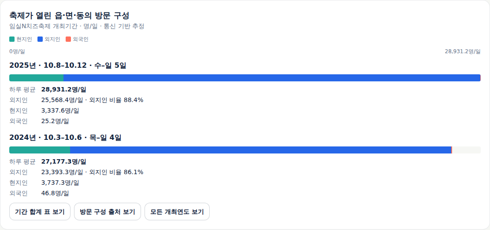
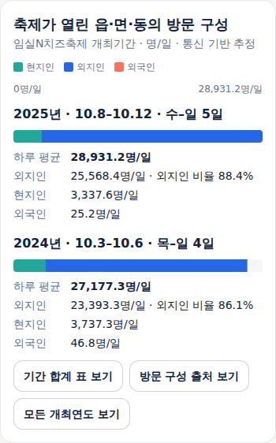
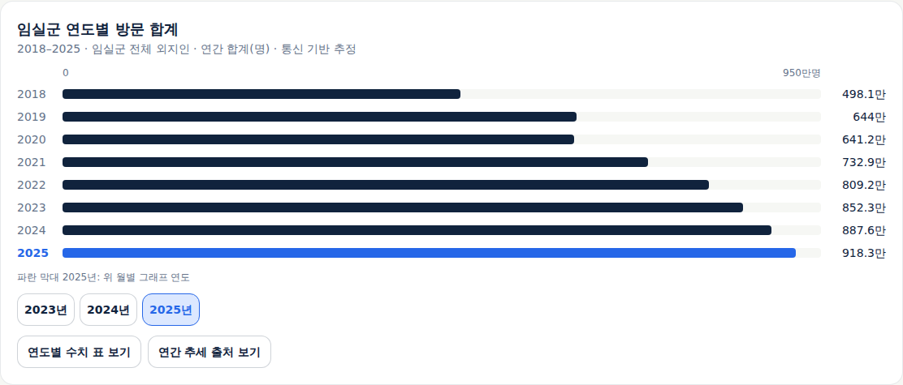
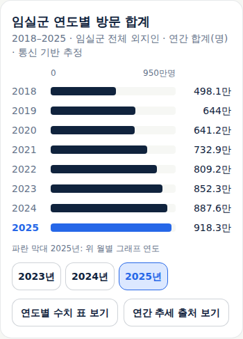

# 임실 방문 구성과 연간 추세

## 사용자 목표와 제공 범위

지역 담당자가 기존 축제의 방문 구성과 지역 전체의 장기 방문 흐름을 구분해서 읽고,
관광자원·개최 시기 검토를 이어간다. 사용자가 방문자 특성과 연계 관광정보 보강의 다음 작업을 승인했다.
자료 확인 결과에 따라 첫 표본을 임실N치즈축제와 임실군으로 한정한다.
새 메뉴·전략 질문·기록 의무를 추가하지 않는다. 최종 시각 디자인은 사용자 후속 작업이다.

공개 서비스에서 사용할 수 있다. 전체 로컬 실행·배포·실제 공개 화면과 기존 업무 자료 보존을 확인했다.

## 원자료 직접 확인

원본은 [가져온 자료 목록](../research/imported/hkjin-plan-03/README.md)에 따라 바이트 그대로 보존한다.
2026-09-24 주 담당자가 CSV를 직접 읽고 기존 일별 보관본과 대조했다.

| 자료 | 확인한 내용 | 이번 처리 |
|---|---|---|
| 임실N치즈축제 연도별 방문 추이 | 2018·2019·2022~2025년, 개최일수와 현지인·외지인·외국인·전체 값. 6개 연도 모두 구분별 합과 전체 일치 | 확인된 회차의 구성·일평균에 사용 |
| 임실군 방문자 수 추이 | 2018~2025년을 각 행에 명시. 현지인·외지인·전체 각 8행, 총 24행 | 지역 전체 연간 추세에 사용 |
| 성·연령별 내국인 방문자 | 비율 8행에 관측연도 없음 | 화면에 제공하지 않음 |
| 방문자 거주지 | 지역별 비율에 관측기간 없음 | 화면에 제공하지 않음 |
| 목적지 검색순위 | 순위·이름·주소·분류가 있으나 관측연도 없음 | 인기 순위·관광자원 대응을 제공하지 않음 |

공식 [축제 화면](https://datalab.visitkorea.or.kr/datalab/portal/fes/getFesDataForm.do)에서 성·연령과 거주지에는
각각 개최연도 선택이 있음을 확인했다. 다운로드 날짜나 폴더의 연도 범위로 당시 선택을 복원할 수 없다.
목적지 순위는 개최 행정동의 내비게이션 검색이며 음식점·숙박을 제외한다. 실제 방문 순위로 바꾸지 않는다.
이 미확인 사유는 내부 기록이며 고객 화면의 빈 카드·제약 안내문으로 추가하지 않는다.

축제 자료의 공간은 개최 행정동, 지역 자료의 공간은 임실군 전체다. 축제 효과·입장객·연간 고유 방문객으로 해석하지 않는다.
[데이터랩 설명](https://datalab.visitkorea.or.kr/datalab/portal/getMetaInfoList.do)은 기간 집계와 일별 반올림의 차이를 설명한다.
따라서 아래 대조는 출처 확인의 보조 근거이며, 공식 연간 값을 일별 합계로 덮어쓰지 않는다.

| 연도 | 기존 일별 외지인 보관본 | 일별 합계 | CSV 연간 값 | 차이 |
|---|---|---:|---:|---:|
| 2023 | 365일 전부 확인 | 8,522,745 | 8,522,745 | 0 |
| 2024 | 366일 전부 확인 | 8,875,772.5 | 8,875,772 | -0.5 |
| 2025 | 365일 전부 확인 | 9,183,132 | 9,183,132 | 0 |

지역 CSV의 2021·2024년 현지인+외지인과 제공 전체 사이에는 1 차이가 있다. 원문 전체를 유지한다.
축제 외국인 0은 원문 0으로 유지하며 실제 0인지 비공개 처리인지 추가로 단정하지 않는다.
2020·2021년 지역 자료가 존재해도 축제 개최 자료를 만들어 채우지 않는다.

Foundry의 `silver.tourapi_content_master`도 읽기 전용으로 확인했다. 임실N치즈축제(2031318),
임실치즈테마파크(2718832) 등 현재 등록 정보는 있으나 이 조회가 과거 목적지 순위의 연도를 입증하지는 않는다.
이름에 임실이 들어간 양평·경주 등 다른 지역 자료와 서로 다른 치즈마을 식별자를 임의로 합치지 않는다.
서비스의 기존 현재 관광자원 조회는 유지하고, 인기 순위와의 새 연결은 이번에 제공하지 않는다.

## 위임과 검수

실제 `claude-opus-5-5`에 자료 감사·설계·자료/서버 구현·화면/인수 시험 작성의 네 작업을 위임했다.
각 결과의 firstParty 모델 metadata와 권한 거부 없음을 확인했다. 주 담당자가 원본·공식 정의·일별 합계를 직접 검토하고
설계 보완·코드 검수·전체 실행 검증을 맡았다. 자료 담당의 선별 시험과 일부 파일만 본 타입 확인을 전체 검증으로 재사용하지 않았다.
성·연령 등 미확인 항목의 제외는 확인된 자료 범위에 따른 구현 판단이다. 데이터를 새로 수집할 때마다
사람 승인이 필요하다는 감사 의견은 채택하지 않았다. 기존 허용 범위에서 공식 다운로드로 기간을 명시한 원본을 확보하면 후속 연결할 수 있다.

## 화면 목표와 기본 배치

기본 배치는 [기능 상세 §9](../sdlc/2-design/functional-spec.md#9-방문-구성과-지역-연간-추세)에 정리했다.
기존 축제의 시군구 일별 차트 아래에는 개최 행정동 방문 구성을 독립 영역으로 둔다. 회차마다 일수가 다르므로
같은 절대 축의 구분별 일평균을 기본으로 하고 기간 합계는 표에서 읽는다. Opus 초안의 100% 막대에서 이 방식으로 보완했다.
새 축제의 월·요일 흐름 아래에는 지역 연간 외지인 추세를 둔다. 일별 자료가 완전한 2023~2025년만 월별 이동 버튼으로 제공한다.
연간 자료가 있는데 월별 자료가 없는 연도에는 월·요일의 부족만 설명한다. 다른 지역·회차의 수치를 대신 붙이지 않는다.

기존 가져오기 목록의 사용 분류를 그대로 두자는 설계 의견도 수정했다. 실제 사용하는 지역 CSV 한 개를 추가 소비로
반영하고 기존 축제 생성기는 축제 자료만 고르도록 좁힌다. 원본 파일을 고치지 않고 출처·파생 자료의 관계를 유지한다.

## 실행 검증과 공개 상태

Node 24에서 단위 시험 313건(295 TSX·18 Node), 인프라 시험 40건·17개 리소스 검사를 통과했다.
주 담당자는 생성 자료를 다른 지역 코드로 바꾸거나 일부 관측연도를 빠뜨린 경우도 서버에서 제외하도록
검사를 보완하고 변형 자료 시험을 추가했다. 기존 축제의 수치는 바뀌지 않고 가져오기 목록 해시만 갱신됐다.

전체 타입 검사·앱 빌드와 운영 의존성 검사(취약점 0)도 통과했다. 추가 headless 시험 12항목에서 회차 선택·표시 기간·
늦은 응답·실패 후 복구·2019년 연간 단독 표시·연도 적용 후 초점·다른 지역 제외·320/390/1440px를 확인했다.
실제 로컬 보관본을 사용했으며 지연·실패 한 건은 통제 시험이다. 가상 방문 수는 주입하지 않았다. 앱 쓰기·페이지 오류 0건이다.

첫 인수 실행에서 시험의 필드 정렬과 표의 행 선택이 잘못된 것을 고쳤다. 출처 창 닫기의 초점 복귀는 실제 완료를 기다리도록
보완했다. 주 담당자는 화면 코드의 중복 변수명을 수정하고, 모바일 글자를 작게 축소하는 세로 SVG 대신 고정 글자 크기의
가로 막대로 바꿨다. 같은 지역의 연도 변경 중 연간 자료를 유지하는 구현은 확인된 장기 자료와 조작 초점을 유지하므로 채택했다.
자료가 바뀐 지역에는 재사용하지 않는다. 고객 문구에서 방문 반복은 같은 날 재입장이 아닌 여러 날짜의 합산임을 명확히 했다.

전체 재실행 중 기존 새 축제 시험의 소개 갱신 확인이 완료 전에 실행되는 경우도 재현했다. `불러오는 중` 문구의 부재를
기다리던 조건을 실제 `소개 없음` 결과가 표시될 때까지 기다리도록 수정했다. 자원 소개의 제품 동작은 바꾸지 않았다.

`npm run test:e2e`의 최종 전체 20개 headless 시나리오 스크립트를 통과했다. 기존 축제 28항목·새 축제 37항목·
관련 검색 25항목·추가 방문 자료 12항목을 포함한다. 문서 추적 53개 산출물의 누락 0·린트 오류/경고 0이며
`git diff --check`도 통과했다. 정형 API/Spec/Run·티켓 연결은 미선언이므로 검증 완료로 세지 않는다.
구조화된 결과는 [실행 근거](evidence/2026-09-24-visitor-context.json)에 남긴다.

## 공개 운영 확인

구현 커밋 `8307da25b463d23f401bcbba4427e12f75b85277`의
[내부 ARC 실행](https://github.com/gitvssh/fest-compass/actions/runs/35969926185)이 성공했다.
등록 라벨은 `homelab-fest-compass`이고 Actions artifact 수는 0이다. 원격 확인한 이미지
`sha256:e343919b8b3976448142cddfee99922642d97b5e7337068c466c39220a86df72`를
`a87892138476bff674a70c7991eb3ac6e78c9097`에 고정하고 기존 앱만 동기화했다.
17개 배포 리소스 검사가 통과했으며 Argo CD Succeeded·Synced·Healthy, ready 1을 확인했다.
web·collector는 같은 새 이미지를 사용하고 기존 Deployment·PVC 식별자는 유지됐다.
업무 자료 9종의 건수·내용 SHA-256이 배포 전후 모두 일치한다.

공개 서비스의 실제 응답을 바꾸지 않은 headless Chromium에서 1440/390px를 확인했다.
2025·2024 회차 원문 수치와 2018~2025 연간 값, 합계 표·출처 창 닫기·2024년 월별 전환과 초점 이동,
2019년의 연간 자료만 제공하는 상태, 논산에 임실 연간 자료가 섞이지 않는 동작을 확인했다.
페이지 오류·전체 가로 넘침·앱 쓰기 요청은 0이다. 쿠키 선택의 Zaraz 전송은 앱 업무 쓰기와 구분했다.
실제 공개 화면 네 장을 주 담당자가 직접 검수했다. 최종 시각 디자인·실무자 관찰은 후속이다.

### 실제 화면

[기존 임실 축제 방문 흐름](https://pickday.damecasol.com/existing/archive%3Aimsil-cheese/visits)과
[새 축제 임실군 방문 흐름](https://pickday.damecasol.com/new/52750/visits?year=2025)에서 사용할 수 있다.
아래는 새로 연결한 영역의 실제 화면이다. 전체 화면은 기존 세 메뉴 구성을 유지한다.

### UI·UX 직접 검수

| 항목 | 판정 | 근거와 범위 |
|---|---|---|
| 목표·흐름 | 충족 | 기록 없이 회차 구성·지역 장기 흐름을 읽고 월별 조회로 이동. 기존 세 메뉴 유지 |
| 시각적 위계 | 충족 | 축제 개최 행정동과 군 전체의 제목·단위·기간 분리, 공통 절대 축, 표는 펼쳐 보기. 공개 PC·모바일 4장 직접 확인 |
| 문구 경계 | 충족 | 내부 경로·규약·미확인 지표 카드를 응답과 화면에서 제외. 이용 대상·단위·출처는 유지 |
| 상태·복구 | 충족 | 로컬에서 늦은 응답·실패 후 복구·지역 변경, 공개에서 월별 자료 없는 연도와 다른 지역 제외 확인 |
| 접근성·반응형 | 충족 | 변경 영역의 320/390/1440px 로컬 확인, 공개 390/1440px·키보드 닫기·연도 변경 후 초점. 색 외 연도·수치·선택 레이블 유지 |
| 전체 보조기술·확대·실무자 사용 | 미평가 | 이 변경의 자동 시험과 직접 화면 검수로 전체 접근성 인증·실무 인수를 주장하지 않음 |
| 필요한 고지·출처 | 충족 | 실제 출처·통신 기반 추정·기간/공간/단위와 출처 창 확인. 새 법적 조건은 도입하지 않음 |

검토본의 시작 위치는 `D:\download\project\pickDday\index.html`이다.
원본과 이전 묶음은 보존하며 전달 결과·해시는 [전달 기록](../ops/review-delivery.md)에 남긴다.
