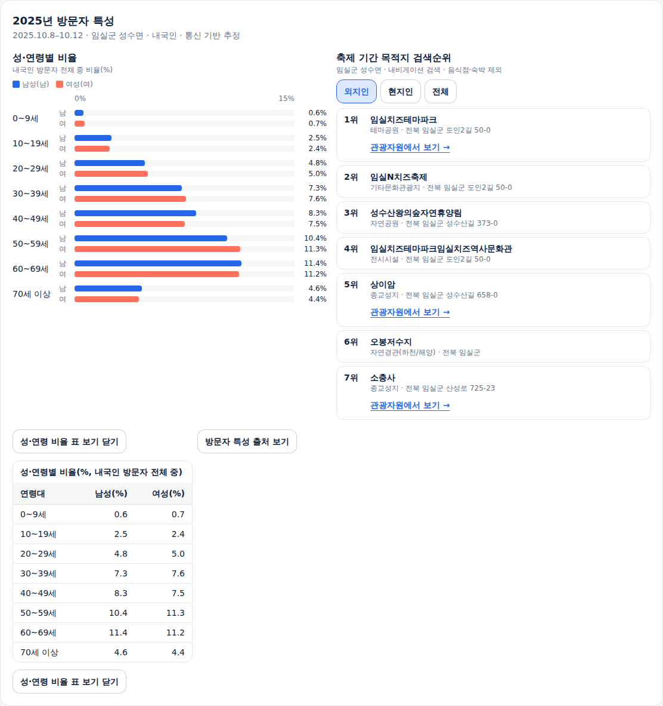
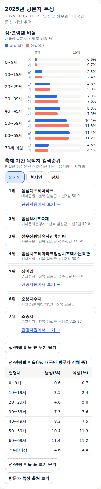
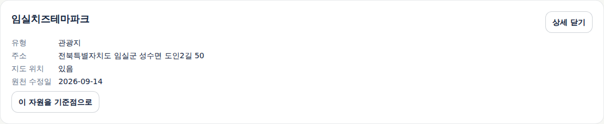
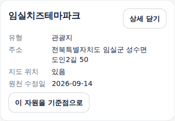

# 임실 2025년 방문자 특성과 관광자원 연결

## 사용자 목표와 범위

기존 축제 담당자가 개최기간에 해당 지역을 찾은 내국인의 성·연령 분포와 검색된 목적지를 보고,
프로그램·관광자원 연계의 검토 근거를 얻는다. 사용자가 다음 개선안을 승인했다.
임실N치즈축제 2025년을 첫 표본으로 한다. 관광객·방문 이유를 자동으로 정하거나 기록을 필수로 만들지 않는다.

공식 화면에서 확인한 성·연령과 목적지 자료를 연결한다. 축제별 거주지는 현재 공개 화면이 숨겨져 있어 확보하지 못했다.
시군구 전체 거주지를 축제 회차의 자료로 바꾸지 않는다. 새 축제 흐름의 지역 방문 자료도 이번 축제 자료로 대체하지 않는다.
공개 서비스에서 사용할 수 있다. 구현·전체 로컬 검증·공개 화면·기존 업무 자료 보존을 확인했다.

## 원자료와 설계 검수

[원자료와 재수집 방법](../research/imported/datalab-imsil-2025/README.md)에 공식 조회·보존 조건을 기록했다.
공식 ID KCTF0061, 2025년 10월 8~12일, 임실군 성수면 52750340을 직접 대조했다.
원본 다섯 응답은 공개 화면의 정상 조회가 반환한 것으로 기간 없는 이전 CSV를 재해석하지 않았다.
관광공사 현재 목록에서 관광지 54개·문화시설 2개를 조회했고 그 안의 세 장소만 이름·도로명·식별자로 연결했다.
Foundry 보관 콘텐츠 ID와도 일치한다. 이 수량은 조회 당시 임실 목록이며 전국 완전성이나 현장 운영을 뜻하지 않는다.

실제 Claude Opus 5.5에 자료 감사와 설계를 위임하고 주 담당자가 직접 검수했다. 감사 의견 중 `DISP_YN=N`을
결측으로 보는 해석은 공식 차트 코드의 비율 표시 분기와 실제 값에 따라 정정했다. 거주지 영역이 숨겨진 것을
확인한 뒤 설계의 거주지 블록도 이번 구현에서 제외했다. 비율과 내국인 합계의 반올림 차이는 값 보정 사유로 삼지 않는다.
설계에서 링크보다 이전 선택 기억을 우선하자는 부분은 새 링크의 명시적인 선택을 우선하도록 수정했다.
현재 허용된 자료 확보·구현에 새 사용자 결정을 요구하지 않는다.

## 화면 목표와 기본 배치

[기능 상세 §10](../sdlc/2-design/functional-spec.md#10-방문자-특성과-관광자원-연결)이 디자인 작업 입력이다.
기존 방문 구성 아래에 `2025년 방문자 특성`을 두고 성·연령별 비율, 목적지 검색순위, 수치 표·출처를 읽는다.
2025년 회차가 적용될 때만 나타나며 차트 앞뒤 표시 기간과 독립적이다. 다른 회차에는 빈 카드나 내부 제약 문구를 만들지 않는다.
연령대별 남성·여성 비율은 같은 축의 가로 막대와 값으로 표시한다. 전체 내국인 중 비율이라는 분모를 유지한다.
목적지는 외지인·현지인·전체를 바꿔 읽고, 확인된 세 장소만 기존 관광자원 화면으로 이동한다.
현재 목록 응답이 준비되면 해당 장소를 선택하고 상세로 초점을 옮긴다. 실패 후 재시도·현재 목록에서 사라진 장소를 구분한다.

## 실행과 공개 확인

Node 24.20.0에서 단위 시험 325건(303 TSX·22 Node), 타입 검사, 빌드, 운영 의존성 검사(취약점 0)를 통과했다.
원본 5개 해시·조회 연도·축제/지역/회차·비율/순위·장소 연결의 변형 자료를 거부하는 시험을 포함한다.
공식 화면에서 반복 수집한 다섯 원자료도 모두 일치했고, 기존 후보 폴더에 덮어쓰려는 실행은 실패했다.
인프라 시험 40건·배포 리소스 검사 17개, 문서 추적 산출물 54개 누락 0·린트 오류/경고 0을 확인했다.
정형 API/Spec/Run과 티켓 원천은 미선언이므로 통과로 세지 않는다.

전체 `npm run test:e2e`의 headless 스크립트 21개를 통과했다. 추가 방문자 특성 시험 19항목은
공식 원응답과 실제 로컬 API의 비율·순위를 대조하고 회차·표시 기간·늦은 응답·3개 순위 구분·관광자원 이동·
뒤로/앞으로 가기·초점·이전 반경·조회 실패/재시도·사라진 장소·잘못된 링크·다른 지역·320/390/1440px를 검증했다.
방문 수는 가공 주입하지 않았다. 로컬 관광자원 성공 목록은 검토된 세 장소로 만든 명시적인 통제 응답이며
현재 제공처의 전체 목록 검증과 구분한다. 앱 쓰기·페이지 오류는 0건이다.

주 담당자가 직접 검수하면서 최초 진입의 `types=14&resource=12:...` 주소가 관광지를 조회하지 않고
대기하는 제품 결함을 재현·수정했다. 링크 대상 유형을 첫 렌더부터 포함하고 재검증했다.
지연 응답 시험이 이미 조회한 조건의 임시 기억 때문에 요청을 보내지 않던 시험 결함은 미조회 회차 조합으로 고쳤다.
검색순위 설명의 “검색한 순서”도 “검색이 많았던 장소의 순위”로 고쳐 시간 순서로 읽히지 않게 했다.

브라우저 배포 파일에서도 원자료 표시 플래그·내부 경로·해시·거주지 제외 판단이 없음을 확인했다.
구조화된 결과는 [실행 근거](evidence/2026-09-24-visitor-profile.json)에 남긴다.

## 공개 운영 확인

구현 커밋 `6c938b51473b00909b323720cf22185450d33888`의
[내부 ARC 실행](https://github.com/gitvssh/fest-compass/actions/runs/35976682362)이 성공했다.
등록 라벨은 `homelab-fest-compass`, Actions artifact는 0개다. 검증된 이미지
`sha256:8ce8dfa419e431c87df39f4f269c4737c35fa9e3fec46749c303bd5143b3383c`를
`bbb984c2019c15157cb83175c375eecf9e4e5b2b`에 고정하고 등록된 기존 앱만 동기화했다.
Argo CD Succeeded·Synced·Healthy, ready 1과 web·collector의 같은 이미지 사용을 확인했다.
Deployment·PVC 식별자를 유지했고 업무 자료 9종의 건수·내용 SHA-256도 배포 전후 일치했다.

실제 공개 응답을 바꾸지 않은 headless Chromium에서 PC 1440px·모바일 390px의 비율·7개 순위·3개 링크를 확인했다.
현재 관광지 54건에 세 장소가 모두 있고, 임실치즈테마파크 링크가 해당 상세를 선택해 초점을 옮긴다.
이전 회차 조건과 순위 링크 초점으로 돌아가며 가로 넘침·페이지 오류·앱 쓰기는 0건이다.
공개 환경의 기존 쿠키 선택창은 보이는 `모두 거부` 버튼으로 닫았다. Cloudflare 측정/동의 전송은 앱 쓰기와
분리해 실행 근거에 기록했다. 동의창을 숨기거나 브라우저 동의 상태를 주입하지 않았다.

추가 19항목도 공개 서비스의 실제 방문 자료·현재 관광자원 목록으로 재실행해 통과했다.
실패 한 건과 장소가 빠진 응답 한 건만 명시적으로 통제한 시험이며, 위 실제 화면 확인과 구분한다.
이 공개 실행에서도 320/390/1440px 가로 넘침·페이지 오류·앱 쓰기는 0건이다.

## 실제 화면과 디자인 입력

아래는 공개 서비스의 실제 자료다. 고정된 상단 메뉴가 영역 캡처를 가리지 않도록 페이지 맨 위에서
문서 좌표를 지정해 캡처했으며 화면 요소·수치·스타일을 변경하지 않았다. 최종 시각 디자인은 후속 작업이다.

PC 방문자 특성:

모바일 방문자 특성:

연결된 관광자원 상세:

## 제품 경험 검수

| 항목 | 결과·근거 |
|---|---|
| 목표·흐름 | 충족 — 회차 자료에서 관광자원 상세로 이동하고 조회 조건·그룹·초점을 복원. 기록 입력 없음 |
| 위계·문구 | 충족 — 개최기간·성수면·내국인 기준, 비율과 검색순위 분리, 실제 방문량으로 바꾸지 않음. 최종 시각 디자인은 후속 |
| 상태·복구 | 충족 — 다른 회차 생략, 지연 응답 격리, 실패 후 재조회, 사라진 장소와 불완전 목록 구분 |
| 접근성·반응형 | 충족(검사 범위) — 숫자/남녀 레이블·대체 텍스트·수치 표·키보드 출처창·초점·320/390/1440px. 보조기술 전반과 200% 확대는 미평가 |
| 필요한 고지 | 해당 없음(새 법적 고지 변경) — 기존 출처·자료 의미 제공. 내부 수집·검수 규칙은 고객 화면/응답/배포 파일에 없음 |
