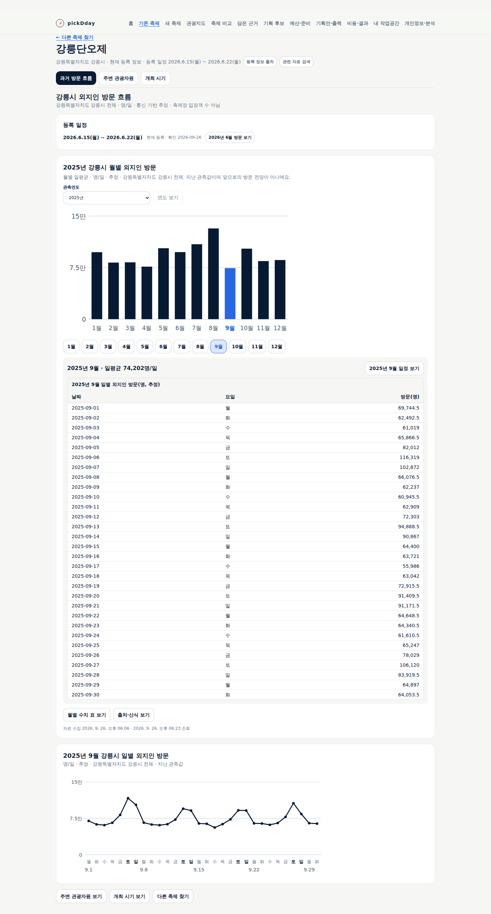
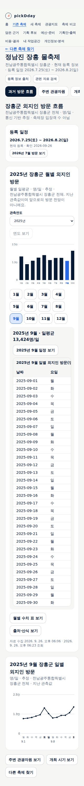
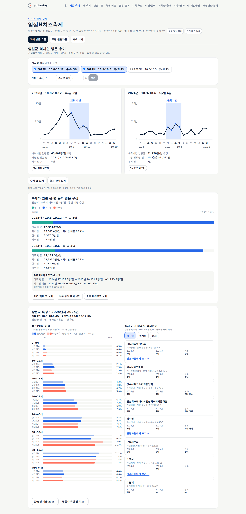

# 고른 축제 모두의 공통 분석 흐름

**상태: 사용 가능 — 구현·공개 검증 완료.** 담당자가 검색한 현재 등록 축제를 고르면 해당 시군구의 월별·일별 외지인 방문,
주변 관광자원, 개최 시기를 같은 메뉴에서 살펴본다. 새 축제를 지원하려고 축제별 화면 코드를 추가하지 않는다.
임실·논산의 검토된 과거 회차는 현재 등록 축제 안에서 이어 보며, 기존 회차·보조 분석도 유지한다.

## 실제 자료와 연결 범위

- 공식 전국 시군구 방문 API를 처음 수집해 2023-01~2026-08의 44개월 자료를 보관했다. 현재 관광조회 단위 269곳과 연결했다.
  269개 기초자치단체나 44개월 완전 관측을 뜻하지 않는다. 최신 관측일은 2026-08-27이며 9월은 정상 빈 응답이었다.
- 전국 TourAPI 축제 등록은 9페이지·867건이다. 처음 수집 141회, 당월 확인 1회를 사용했다. 이는 당시 관측 수량이며 고정 지원 목록이 아니다.
- 전남·광주 27곳은 행정안전부 원문 변경표의 법정동 구성까지 대조한 일대일 코드로 연결한다. 분할·합병된 인천의 옛 3개 코드는 배분하지 않는다.
- 지역 방문 추정은 축제 입장객·축제 효과가 아니다. 확인된 등록 날짜만 바로가기로 제공한다. 성·연령 등 축제별 보조 자료는 확보된 축제에서만 보인다.
- 공식 API만 정기 수집한다. 데이터랩 공개 페이지의 비공식 차트 주소는 자동 수집 원천에 넣지 않았다. 원천·운영 계약은 [설계18](../design/18-unified-festival-analysis.md), [운영 절차](../ops/festival-sources.md)를 따른다.

## 직접 검증

Claude Opus 5.5에 설계·원천 수집 구현·화면·문서·공식 코드 변경 조사를 위임하고 주 담당자가 직접 검수했다.
비공식 차트 자동 수집과 올해 날짜를 옮긴 과거 기간 제안은 채택하지 않았다. 직접 공식 응답·코드 변경 원문·실제 화면을 대조했고
잠금·일별 호출 상한·날짜별 자료 수집시각·손상 시 이전 정상본 복구를 보완했다.

| 검증 | 결과 |
|---|---|
| 단위·스크립트 시험 | 357건 통과. 수집·연결 15건, 기존 단위 312건, 스크립트 30건 |
| 타입·배포 빌드 | 통과. 기존 논산 사전 시험의 고정 14개 코드 검사 유지 |
| 기존 headless 회귀 | 22개 스크립트 통과 |
| 새 공통 흐름 headless | 통제 응답 16항목 통과. 회차 수치는 실제 보관값이며 통제 시험의 현재 축제 연결 식별자만 고정했다. 실제 서버 연결 검증과 구분 |
| 실제 API·로컬 headless | 강릉단오제·안동국제탈춤페스티벌·정남진 장흥 물축제·제주들불축제. 검색→세 메뉴, 2025-09의 각 30일 값·월평균 원자료 일치, 새 축제와 값 일치. 가짜 응답 0, 앱 쓰기 0, 브라우저 오류 0 |
| 기존 회차 보존 | 현재 임실 ID와 기존 보관 ID의 회차·방문자 특성 응답 일치, 현재 이름·주소 안에서 비교 화면 유지 |
| 자료가 짧은 신설 지역 | 인천 새 코드의 실제 날짜만 표시. 2025년 값·불완전 월평균을 만들지 않음 |
| 배포 설정 | 기존 17개 리소스 유지. 독립 수집 컨테이너만 추가하며 기존 PVC의 전용 하위 폴더 사용. 권한·새 자격 변경 없음 |
| 공개 운영 | ARC 실행 성공·이미지 검증·Argo Synced/Healthy. 실제 네 축제의 원자료·세 메뉴·320/390/1440px 확인, 가짜 응답 0·오류 0·앱 쓰기 0. 기존 업무 9종의 건수·해시 보존 |

실제 검증에 사용한 네 축제의 2025년 9월 외지인 일평균은 강릉 74,202.1명, 안동 52,286.7333명,
장흥 13,424.0167명, 제주 166,596.5명이다. 당시 관측의 대조값이며 해당 축제 방문 실적이 아니다.

## 화면·사용성 검수

| 기준 | 판정·근거 |
|---|---|
| 목표·흐름 | 충족 — 실제 네 축제의 검색→방문·자원·시기, 임실 회차 비교 확인 |
| 시각적 위계 | 충족 — 축제명·지역, 세 메뉴, 지역 방문 제목, 연월 선택, 차트·표 순서. 데스크톱·모바일 실제 화면 직접 확인 |
| 문구 경계 | 충족 — 자료 단위·지역·날짜·출처는 제공하며 내부 수집 규칙·해시·지원 목록은 화면·응답에 없음 |
| 상태·복구 | 충족 — 통제 응답으로 조회 중·자료 없음·부분 실패·재시도·늦은 응답 분리 확인 |
| 접근성·반응형 | 충족(시험 범위) — 키보드 선택·출처·초점 복원, 320/390/1440px 페이지 넘침 없음. 전체 보조기술·200% 확대는 미평가 |
| 필요한 고지 | 충족 — 시군구 전체·통신 기반 추정·등록 일정·출처 구분. 별도 법적 고지 추가를 요구하는 원천은 이번 변경에 없음 |

## 공개 반영과 확인

구현 `bf08b7cc59f71f47f5f99f2514f99e4d39d4aad4`, 배포 선언 `b53e7080a8a8e50d8982e9dc046084c62a05ea15`를 반영했다.
[ARC 실행](https://github.com/gitvssh/fest-compass/actions/runs/36231323372)은 전용 `homelab-fest-compass`에서 성공했다.
해당 커밋의 앱 시험·타입·빌드와 인프라 전체 41건이 통과했고 Actions artifact는 0개다.
검증한 이미지 해시는 `sha256:e38b924a8bf778b6a03f23aa040558c1ff15547ef1737dcb34c378ff46261891`이다.

Argo Synced·Healthy·Succeeded, 앱 Pod 3개 컨테이너 정상, 기존 Deployment·PVC 식별자와 업무 데이터 9종의 건수·해시가 유지됐다.
운영 수집기도 141회 과거 수집·1회 당월 확인을 완료했다. 공개 응답을 변경하지 않은 headless 시험으로 네 축제의 원자료·세 메뉴와
임실 회차 비교를 확인했다. 동의 창의 일반 `모두 거부` 버튼을 사용하며 화면·응답을 숨기거나 바꾸지 않았다.
초기 시험은 늦게 뜬 동의 창 처리 누락으로 중단됐고 시험 스크립트를 수정해 재실행했다. 제품 코드 변경은 없었다.
처음 Python HTTP 요청은 403이었으나 Node 요청과 실제 Chromium에서 정상 응답·동작을 확인했다. 우회 설정은 바꾸지 않았다.
첫 화면·검색·새 축제·robots·sitemap·준비 상태는 200이다. [구조화된 실행 근거](evidence/2026-09-26-unified-festival.json)를 보존한다.

## 공개 실제 화면

강릉단오제의 지역 방문 흐름과 장흥군의 모바일 화면이다. 실제 공개 화면이며 아래 이미지의 수치는 각 시군구 전체 외지인 방문이다.
모바일 차트·표는 각 영역 안에서 좌우로 탐색한다. 최종 색·간격·배치 개선은 사용자 디자인 작업으로 이어진다.

임실은 같은 현재 등록 축제 안에서 검토된 회차 비교와 기존 방문자 특성을 이어 볼 수 있다.

최종 시각 디자인·실제 담당자 업무 관찰, 축제별 성·연령·거주지 전국 확대, 미확보 과거 개최일 확보,
지도 경계 개편 35곳 교체는 이번 완료 범위에 포함하지 않는다.
