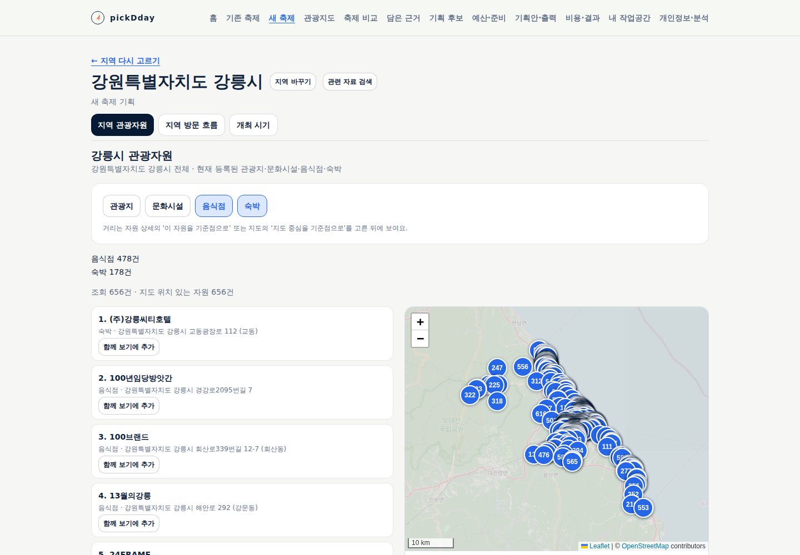
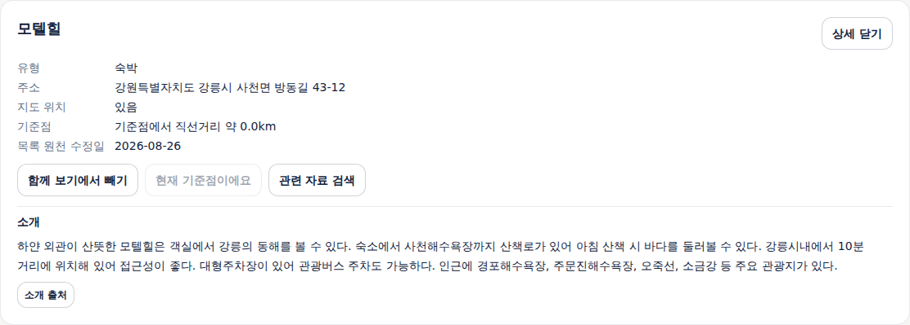
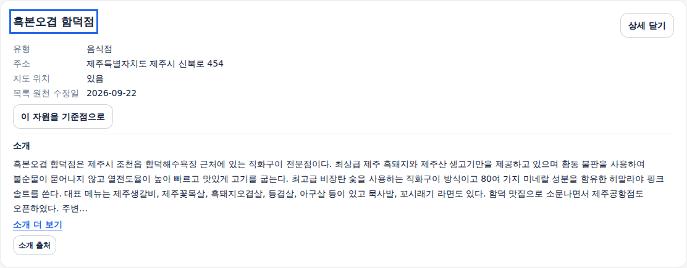
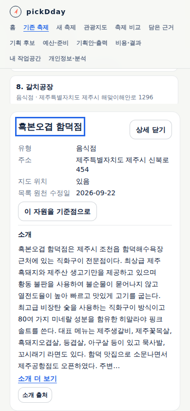

# 관광자원 공통 상세와 음식점·숙박

상태: **사용 가능 — 구현·공개 검증 완료.** [설계19](../design/19-tourism-resources.md)와
[TS-FC-016](../sdlc/3-testing/scenarios/TS-FC-016.md)을 기준으로 진행한다.

두 흐름에서 관광지·문화시설·음식점·숙박을 선택하고 위치·주소·소개를 확인한다. 기본 선택은 기존 관광지·문화시설이며
새 축제의 두 곳 함께 보기와 거리 기준점 지정은 각각 독립 행동이다. 기록·저장 없이 사용할 수 있다.

## 공식 데이터 확인

[국문 관광정보 서비스](https://www.data.go.kr/data/15101578/openapi.do)의 `areaBasedList2`를
5개 지역·두 유형의 첫 페이지로 확인했다. 제주시·강릉시 각 음식점·숙박 상세를 1건씩 추가 조회했다.
총 14회이며 ID·명시 유형·지역·소개를 직접 대조했다. [확인 결과](evidence/2026-09-26-tourism-resource-probe.json)에
키·요청 URL·원문 로그 없이 공개 건수와 필드 존재 여부를 보존했다. 5개 표본이 전국의 완전성을 증명하지 않는다.

현재 등록 목록과 소개를 사용하며 영업 여부·예약·객실 수·수용력·추천 점수를 만들지 않는다.
음식점·숙박 각각 최대 2,000건의 전체 페이지를 확인하고 일부 목록을 전체인 것처럼 제공하지 않는다.

## 구현과 검수

주 담당자가 설계를 작성한 후 실제 Claude Opus 5.5에 데이터 계층과 화면 구현을 나눠 위임했다.
실제 CLI의 모델 응답에서 `claude-opus-5-5`를 확인한 네 작업(데이터·화면 각 최초 구현과 보완)이 완료됐다.
주 담당자가 코드·공식 응답을 직접 대조하고 전체 필수 검사·화면 검수를 진행했다.

- 네 유형은 같은 선택·목록·지도·직선거리 조작을 사용한다. 소개는 두 흐름 공통 경로이며 이전 새 축제 경로도 호환한다.
- ID·명시 유형·지역·페이지·총수·중복을 검증한다. 유형별 한도는 2,000건이며 등록 행사(15)는 기존 600건을 유지한다.
- 검수 중 모든 유형을 껐을 때 상세가 사라지는 문제, 필터로 숨긴 상세의 거리가 미확인으로 바뀌는 문제를 수정했다.
- 잘못된 지역·유형 블록 없는 응답은 가리고 재시도를 유지한다. 다른 지역의 이전 응답을 정상 지역 재시도에 합치지 않는다.
- 이전 지역 탐색·비교 화면으로 전달되던 내부 실패 사유를 짧은 조회 실패 문구로 바꿨다. 기존 시험의 문구 기대값도 함께 수정했다.

## 실행 검증

Node 24.20.0에서 단위·스크립트 시험 368건(15+323+30), 타입 검사, 배포 빌드,
운영 의존성 취약점 검사(0건), 인프라 계약 41건과 배포 선언 17개 준비 검증을 통과했다.
문서 추적은 필수 산출물 60개 누락·error/warn/info 0건이다. 미선언 API·실행 보고·YouTrack 연결은 검사 생략이며 통과로 세지 않는다.

전체 headless 브라우저 24개 스크립트를 완료했다. 제품 빌드는 동일하며 예전 실패 문구를 기대하던 시험을 수정한 뒤
이미 통과한 구간은 재사용하고 남은 구간을 재개했다. 공통 자원 시험 31개 확인 항목·브라우저 오류0·앱 쓰기0이다.
**통제 응답**으로 선택·실패·재시도·늦은 응답·초점·320/390/1440px 레이아웃을 확인했다.
650개 가상 음식점 격자의 목록·지도·반경·상세는 대량 표시 시험이며 실제 API 수집 증거가 아니다.
겹친 지도 마커의 선택은 이벤트 호출로 검증하므로 650개 마커의 실제 포인터 선택 편의성까지 검증한 것은 아니다.

공식 API 조회와 공개 사이트 실제 응답 검증은 위 통제 시험과 별도로 기록한다.

## 공개 서비스와 실제 자료

구현 커밋 `956a849e87c356ebf743fc9d11b9a4ba9f92541c`의 [배포 이미지 작업](https://github.com/gitvssh/fest-compass/actions/runs/36245474007)이
전용 `homelab-fest-compass` 실행기에서 성공했다. Actions artifact·cache는 0개다. 검증한 이미지
`sha256:c27d06af10fdda83e2d0dd5d929bbe102e629d1da5d7a459973725d6febe39ed`를
`6fe8675bec6d697398e96c148db58e0eabb19e8b`에서 고정하고 등록된 앱을 정상 동기화했다.
Argo Synced·Healthy, 운영 컨테이너 3/3 준비와 상태 점검 200을 확인했다.
Deployment·PVC의 동일성을 유지했고 업무 테이블 9개의 행수·내용 해시는 배포 전후 일치한다.

[공개 서비스](https://pickday.damecasol.com)의 실제 응답으로 다음을 확인했다. 가로채거나 가상 응답을 넣지 않았다.

- 강릉시 478/178, 제주시 426/89, 논산시 28/3, 강남구 260/32건(음식점/숙박)의 전체 목록·유형·중복 없음이 독립 원천 조회와 일치했다.
- 제주·강릉 음식점·숙박 4곳의 소개가 독립 조회 표본과 일치했다. 이전 소개 API도 같은 내용을 반환했다.
- 새 축제 강릉 화면에서 음식점·숙박 상세, 두 곳 함께 보기와 별도 기준점 지정이 동작했다. 기존 제주 축제에서는
  음식점 도착 링크가 상세를 열고 주소에서 한 번만 소비됐으며 모든 유형을 꺼도 상세가 유지됐다.
- 논산의 기본 선택은 관광지·문화시설이다. 공개 화면 320/390/1440px의 가로 넘침·페이지 오류·앱 API 쓰기는 0이다.

첫 Python HTTP 점검은 403이었고 정상 Chromium 요청은 200이었다. 처음 브라우저 시험에서 동의창의 영어 버튼을
찾지 못해 중단됐으며, 정상 거부 버튼을 조작하도록 시험을 고친 뒤 전체 공개 확인을 완료했다. 플랫폼·동의 설정은 바꾸지 않았다.
상세 근거는 [실행 결과](evidence/2026-09-26-tourism-resources.json)에 둔다.

## 실제 화면

## 제품 경험 직접 검수

| 항목 | 결과 | 확인 근거·범위 |
|---|---|---|
| 목표·흐름 | 충족 | 고른 지역의 네 유형→장소 소개→위치·거리 탐색. 작성·저장 강제 없음 |
| 기본 위계·배치 | 충족 | 유형 버튼·유형별 건수·목록/지도·선택 상세 순서, 좁은 화면 전환과 긴 이름 줄바꿈. 최종 시각 디자인은 후속 |
| 문구 경계 | 충족 | 내부 수집 한도·검증 절차를 안내로 추가하지 않음. 실패는 짧은 상태·재시도, 목록/소개 출처는 분리 |
| 상태·복구 | 충족 | 유형별 독립 실패, 잘못된 지역·블록 응답 재시도, 상세 결측 생략, 필터 후 상세·거리 유지 |
| 키보드·반응형 | 충족 | 320/390/1440px, 상세 제목 초점과 닫기 복귀, 유형 선택·함께 보기. 전체 보조기술·200% 확대는 미평가 |
| 출처·적용 고지 | 충족 | 관광정보 원천·수집 시각과 지도 귀속 표시 유지. 새 법적 요건을 가정해 고지를 늘리지 않음 |

대량 지도는 번호 마커가 겹치므로 밀집 지역의 포인터 탐색 편의성은 후속 개선 대상이다. 목록·반경·거리·상세 탐색은 검증했다.
설계·실제 화면은 [검토자료 전달 기준](../ops/review-delivery.md)에 따라 D 드라이브 사본으로 제공하고 프로젝트 원본은 유지한다.

최종 시각 디자인·실무자 관찰·메뉴/영업시간/객실 정보 구조화는 후속 검토다.
