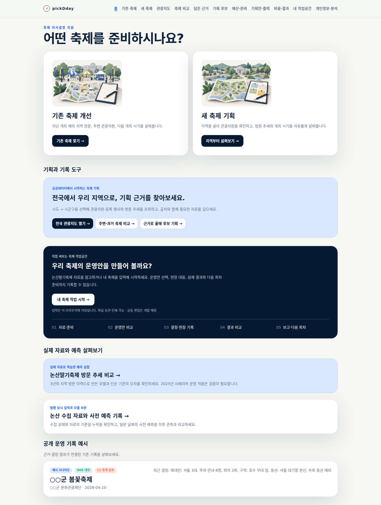
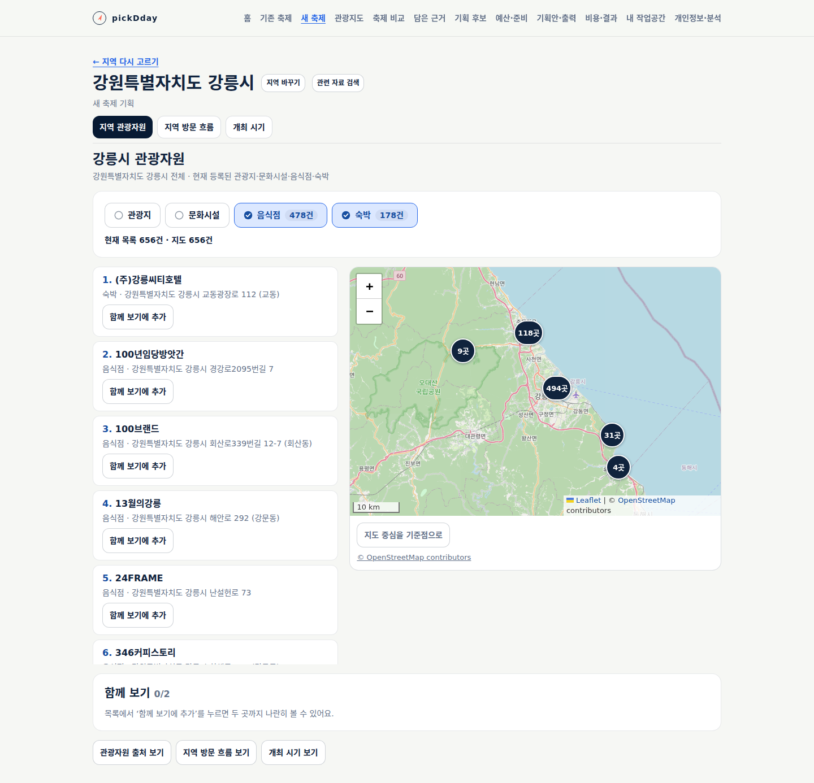
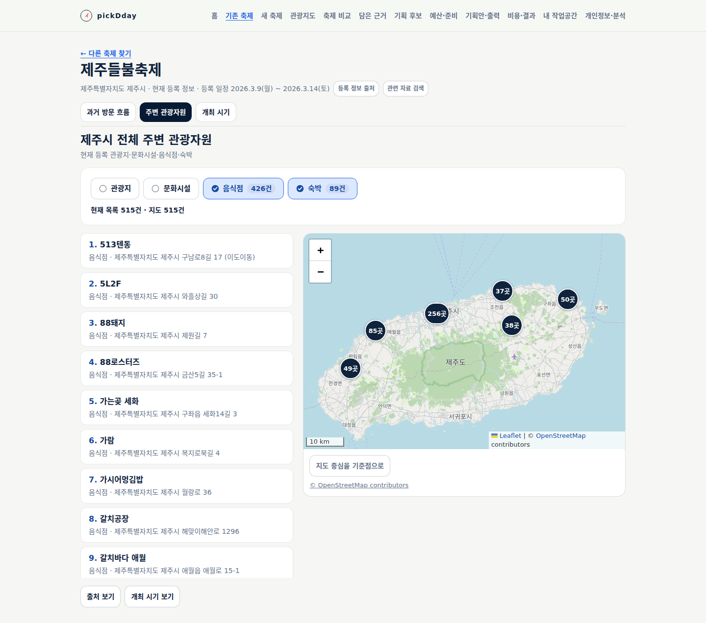
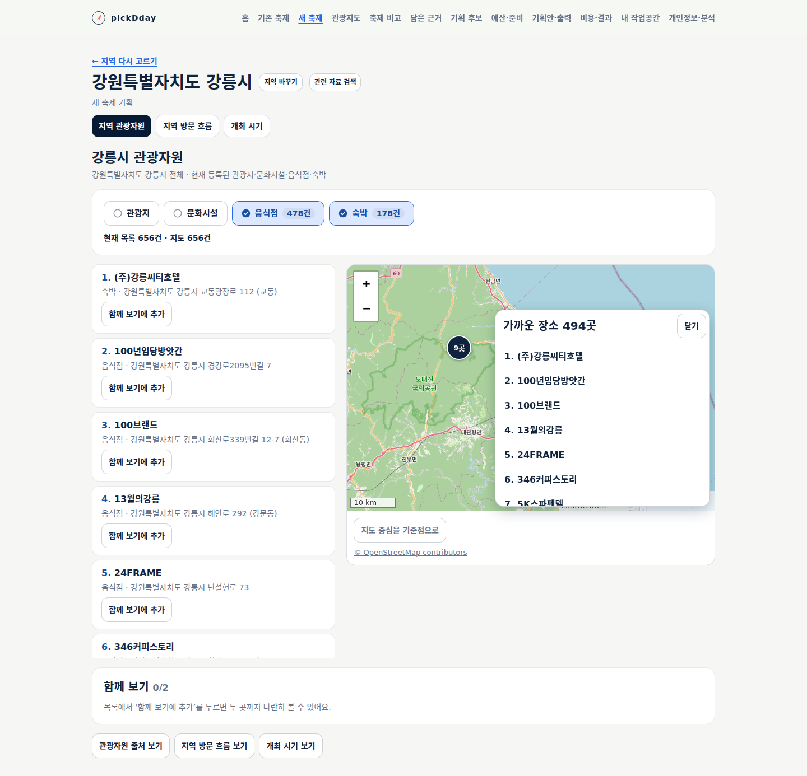
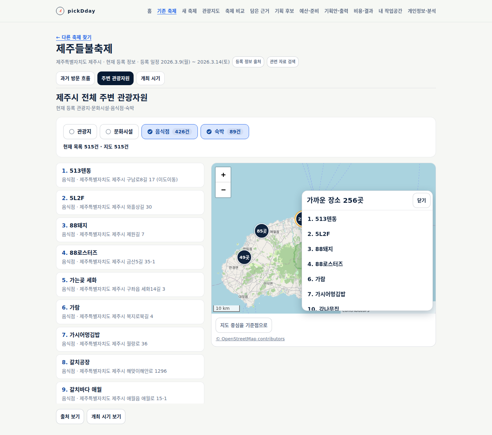
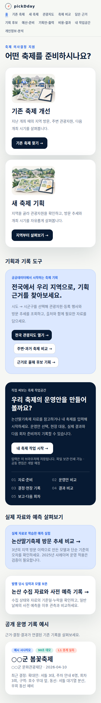
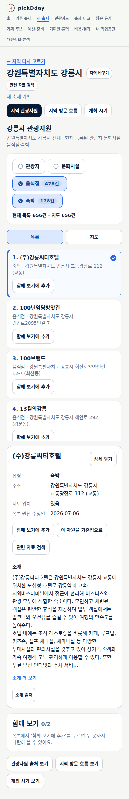
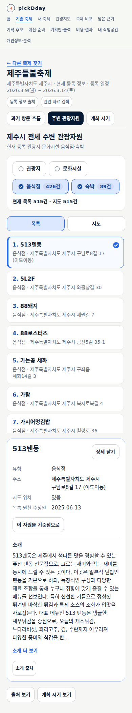
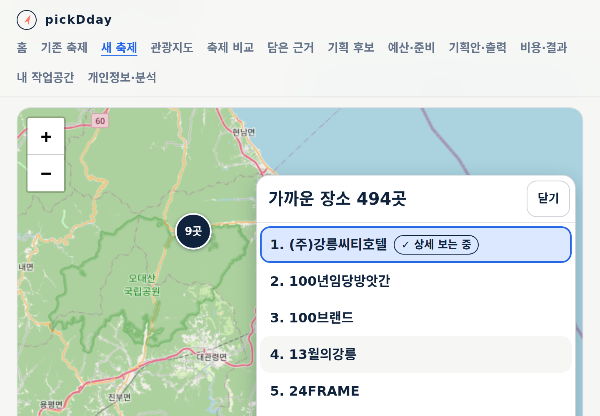
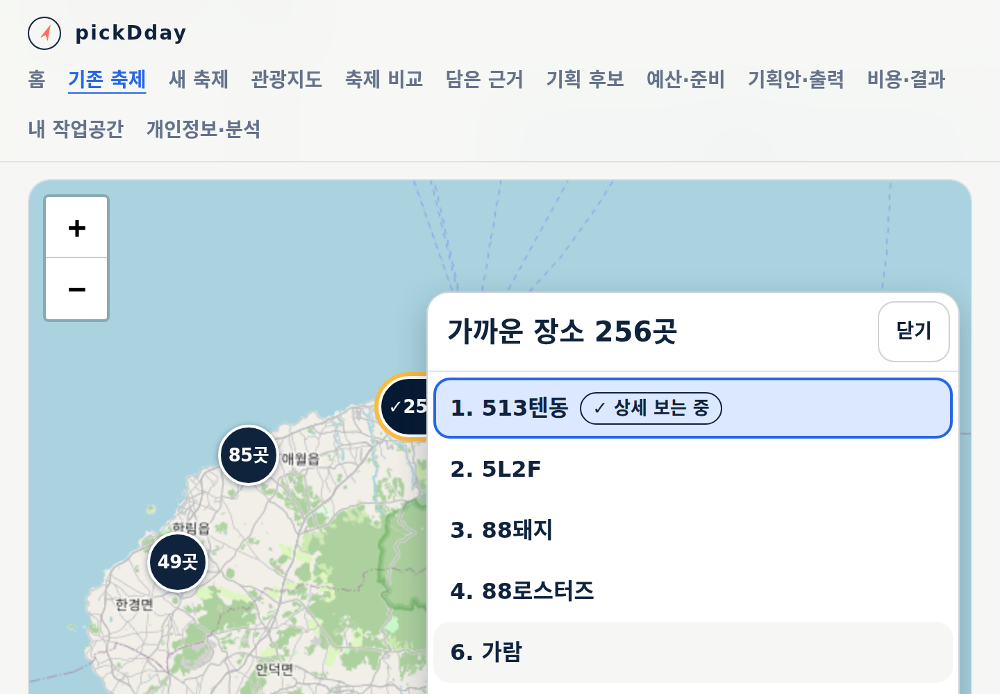

# 관광자원 시각화와 첫 화면 목적 이미지

상태: **구현·실제 자료를 연결한 로컬 검수 완료, 공개 배포 대기.** [설계20](../design/20-resource-experience.md)과
[TS-FC-017](../sdlc/3-testing/scenarios/TS-FC-017.md)에 따른 개선이다.

두 관광자원 화면에서 선택 유형의 건수와 목록·지도·상세의 관계를 명확히 한다.
밀집된 장소는 개수로 묶고 묶음 안의 장소를 선택한다. 같은 좌표에 있는 장소도 각각 열 수 있다.
첫 화면에는 기존 축제 개선·새 축제 기획 목적별 이미지를 사용하며 작성·저장을 필수로 만들지 않는다.

## 설계와 구현

주 담당자가 devkit 제품 경험 기준과 저장소의 기존 화면·군집 지도, 공식 군집 예제를 비교하고 설계20을 확정했다.
실제 Claude Opus 5.5에 지도·자원 화면·목적 카드·회귀 시험 구현을 나눠 위임하고 직접 코드를 검토했다.
실제 CLI 7회 모두 `claude-opus-5-5` 사용을 확인했다. 유형 건수 배치, 같은 장소 재선택과 상세 닫기 초점,
정렬 시 지도 위치 보존을 보완했다. 강릉 실제 자료를 로컬 화면에서 읽으며 군집 패널 뒤 링크에
키보드 초점이 들어가는 결함을 직접 확인했다. 패널을 열면 뒤 지도만 조작 대상에서 제외하고
닫기가 화면에 반영된 뒤 원래 군집으로 복귀하도록 수정했다.
추가 확대 검토의 Opus 호출은 주간 사용 한도로 실행되지 않았다. 해당 검토를 Opus 완료로 세지 않고,
주 담당자가 Leaflet 소스와 실제 화면을 대조해 숨김·크기 변경 시 지리적 중심 보존을 직접 보완했다.

생성 이미지는 내장 imagegen으로 제작했으며 원본·프롬프트를 설계20에 보존한다.
실제 장소 사진이나 관광 실적을 나타내지 않는 장식 일러스트다. 지도와 실제 건수는 공공자료에서 계산한다.

## 실행 검증

Node 24.20.0에서 단위·스크립트 시험 **379건(26+323+30)**, 타입 검사, 배포 빌드를 통과했다.
운영 의존성 취약점 0건, 인프라 계약 41건과 배포 선언 17개 준비 검증도 통과했다.
8,000행 군집 계산은 주 담당자 실행에서 밀집 2.6~19.8ms, 분산 4.8~12.9ms, 연속 배치 14.2ms였다.
이는 해당 로컬 환경의 순수 군집 함수 측정이며 모든 기기나 전체 화면 응답 시간의 보장이 아니다.

전체 headless 브라우저 24개 스크립트를 완료했다. `cbf1501`에 포함된 동일 제품 빌드에서
앞 10개와 뒤 14개를 나누어 완료했다. 이후 `6592de7`의 색상 보완은 아래 별도 검수로 확인했다.
관광자원 시험 **46개 항목**, 브라우저 오류0·앱 쓰기0이다. 동일 좌표·가까운 장소·650건 격자,
군집 ID 전수·중복 없음, 번호 일치, 실제 포인터 선택, Enter/Space/Tab/Shift+Tab/Escape,
모바일 상세 닫기, 기존 유형·주소·소개·반경·비교 계약을 확인했다.
320/390/1440px와 긴 이름, CSS 200% 확대, 홈 이미지와 첫 CTA를 통제 시험으로 확인했다.

최초 시험에서 문자열 평가를 쓰던 대기 함수가 운영 CSP에 거부되어 일반 함수로 수정했다.
방문자 특성 연결 시험은 같은 장소의 목록과 지도에 공통 ID가 생긴 뒤 목록으로 선택 범위를 좁혔다.
제품의 보안 설정이나 기능을 약화하지 않았으며 이미 통과한 동일 빌드의 구간은 재사용했다.
통제 응답과 공식 원천의 공개 화면 확인, CSS 확대와 실제 브라우저 확대의 근거는 구분한다.

마지막 대비 검수에서 선택 유형·보기 전환의 글자를 더 짙게 조정했다. 배포 빌드를 다시 완료하고
실제 강릉 응답의 PC/390px 화면에서 글자·건수 색상과 군집 열기/닫기·상세 복귀를 직접 재확인했다.
유형 글자 대비는 약 6.45:1, 건수 표시는 약 5.77:1이다. 이 색상 변경은 앞선 기능 시험의 데이터·조작을 바꾸지 않는다.

최종 `1dddaa0`에서 지도 크기 변경을 한 경로로 처리하고 숨김 크기0을 무시하도록 보완했다.
타입 검사를 포함한 빌드와 관광자원 회귀 **48개 항목**을 다시 통과했다. 새 두 항목은
390/320/1440/720px 전환과 숨김·표시 후 같은 지리적 중심을 유지하는지 확인한다.
기존 전체24개 중 영향받은 관광자원 검사를 재실행했으며, 나머지 검사의 동일 부분은 앞선 근거를 재사용했다.

## 실제 자료를 연결한 화면 확인

로컬 배포 빌드에서 강릉시 음식점478·숙박178, 제주시 음식점426·숙박89건의 실제 앱 응답을 사용했다.
응답을 가로채거나 가상 자료를 넣지 않았다. 원천 API 독립 대조는 [이전 기록41](41-tourism-resources.md)의 근거를 유지한다.
전체 목록 ID·상세 이름·군집 선택·키보드 복귀·320/390/1440px를 확인했고 페이지 오류·앱 API 쓰기는0이다.
실제 Chrome 탭 확대2.0을 읽어 확인했으며 1440px 창에서 CSS 폭720px·DPR2·CSS zoom1을 기록했다.
CSS 확대 통제 시험과 구분하며 첫 화면·기존 축제·새 축제 모두 실제200% 확인을 완료했다.
상세 닫기 후 초점 복귀는 화면 반영을 기다린 뒤 확인한다. 확대 캡처는 전체 페이지 좌표 잘림을 피하려고
실제 viewport를 저장한다. [실행 근거](evidence/2026-09-27-resource-experience.json)에 대상·범위를 남긴다.

## 공개 배포 상태

`6592de7`의 ARC 이미지 작업은 검증·빌드 후 Harbor 업로드에서 용량 한도로 실패했다.
최종 지도 보완까지 포함한 새 버전은 아직 공개 서비스에 적용되지 않았다. 기존 서비스는 정상 운영 중이다.
[정확한 정리 후보와 재개 절차](../ops/resource-experience-release.md)에 보존할 이미지2개와 후보3개를 기록했다.
수동 삭제 결정 또는 예정된 자동 정리 완료 후 최신 main 이미지 생성·정상 sync·공개 응답·업무자료 보존을 확인한다.
이 문서의 아래 캡처는 **로컬 검수 화면**이며 공개 배포 완료 증거가 아니다.

## 개선 화면

## 제품 경험 직접 검수

| 항목 | 결과 | 확인 근거·범위 |
|---|---|---|
| 목표·흐름 | 충족 · 로컬 | 두 흐름의 선택→군집/목록→상세와 기존 기록 선택 원칙 보존 |
| 시각적 위계 | 충족 · 로컬 | 유형+건수, 16px 이름·14px 주소, 40/60 배치, 번호/개수, 선택 표식과 상세. 실제 강릉 PC/모바일 화면 직접 확인 |
| 문구 경계 | 충족 | 내부 규칙 노출 없음. 불필요한 거리 조작 안내를 줄이고 실제 상태·출처 유지 |
| 상태·복구 | 충족 · 로컬 | 24개 회귀에서 유형별 실패·재시도·결측·필터·주소 조건 보존 |
| 키보드·반응형 | 충족 · 로컬 | 동일 좌표 실제 클릭, 650건 누락 없음, 패널 뒤 초점 차단·복귀, 320/390/1440px·CSS/실제 브라우저200% 확대·숨김/크기 변경 후 지도 중심 유지 |
| 출처·고지 | 충족 | 관광자료 출처·직선거리·지도 귀속 유지, 장식 이미지에 실제 성과·장소를 암시하는 이름/수치 없음 |

실무자 관찰, 전체 보조기술 인증, 전역 메뉴·차트·달력 개편은 이번 결과에 포함하지 않는다.
