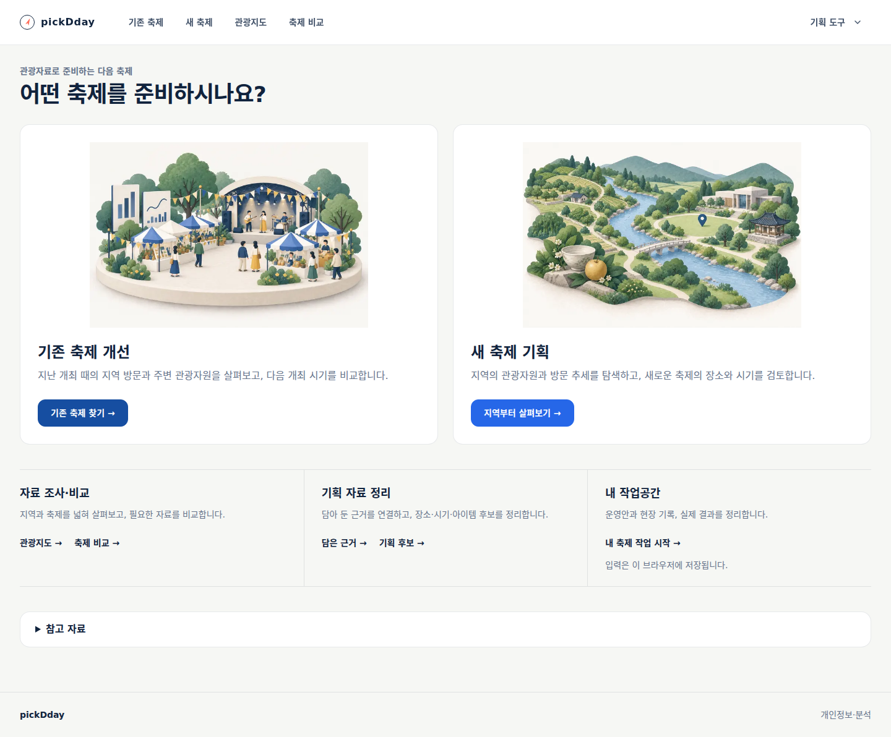
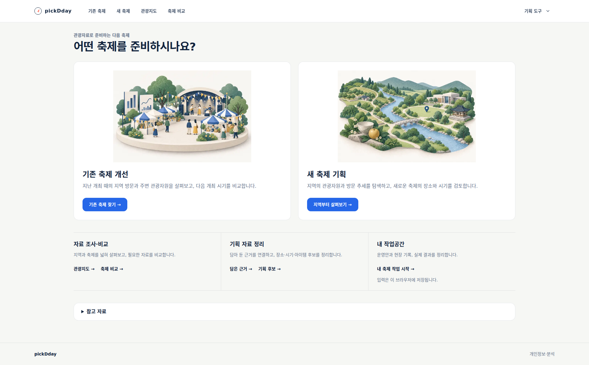
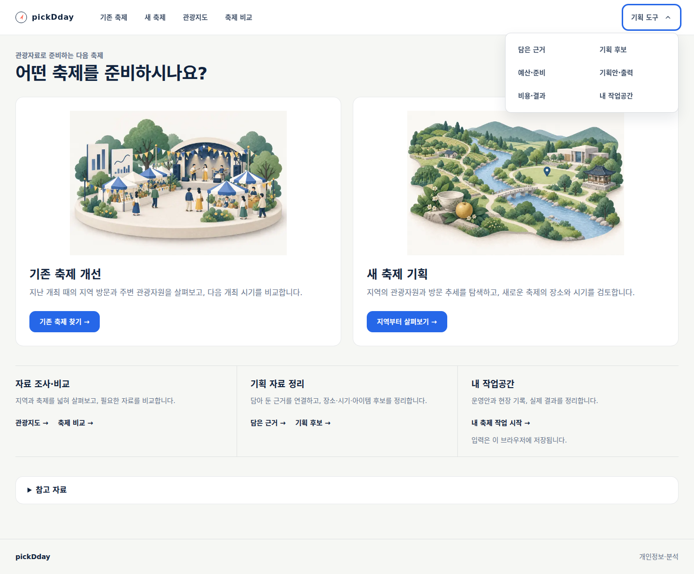
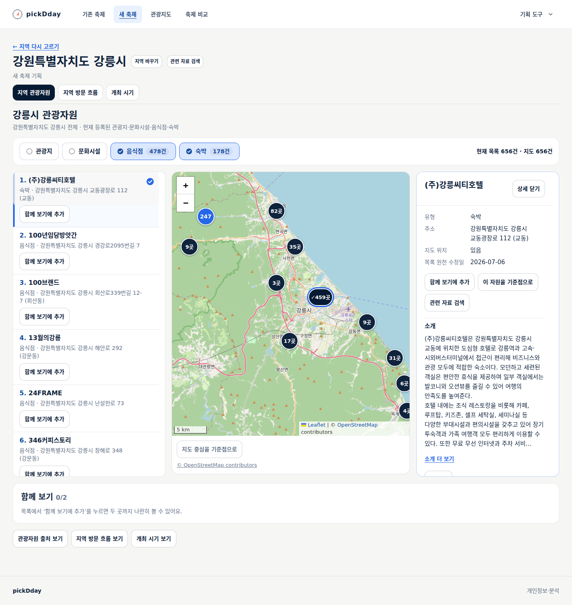
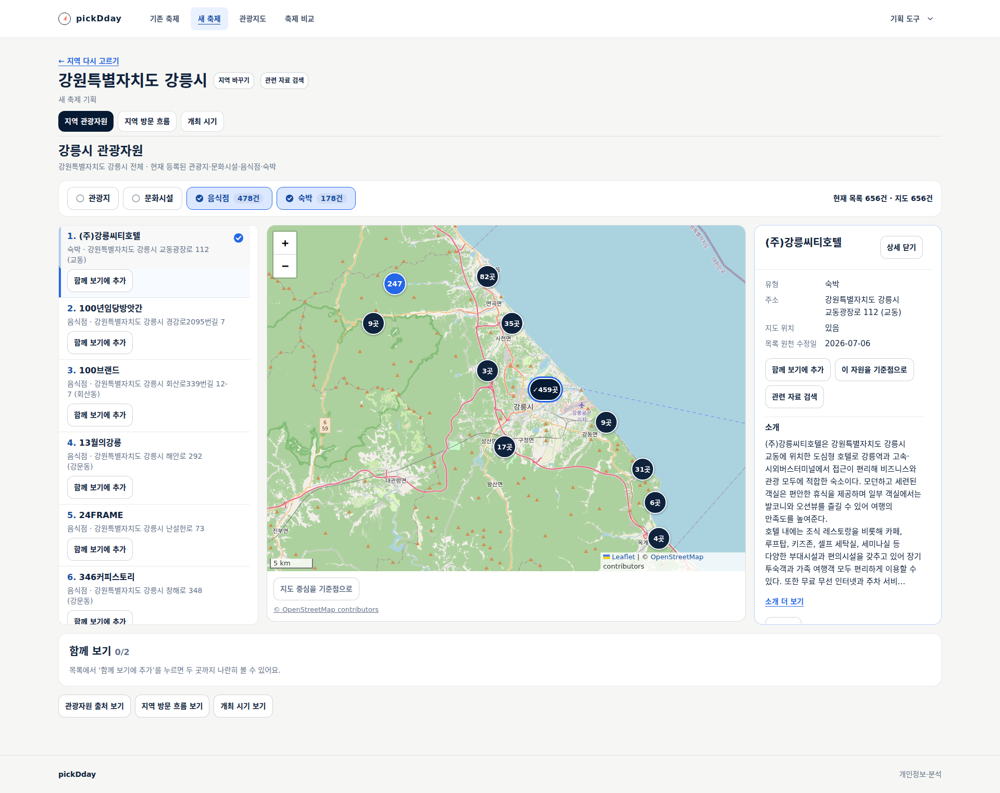
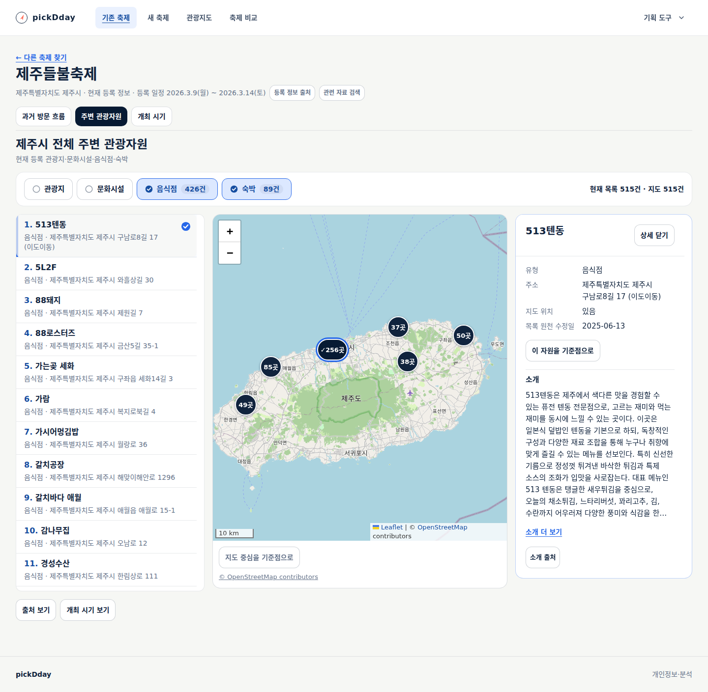
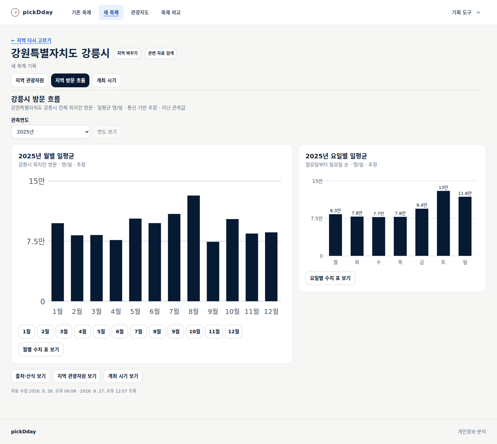
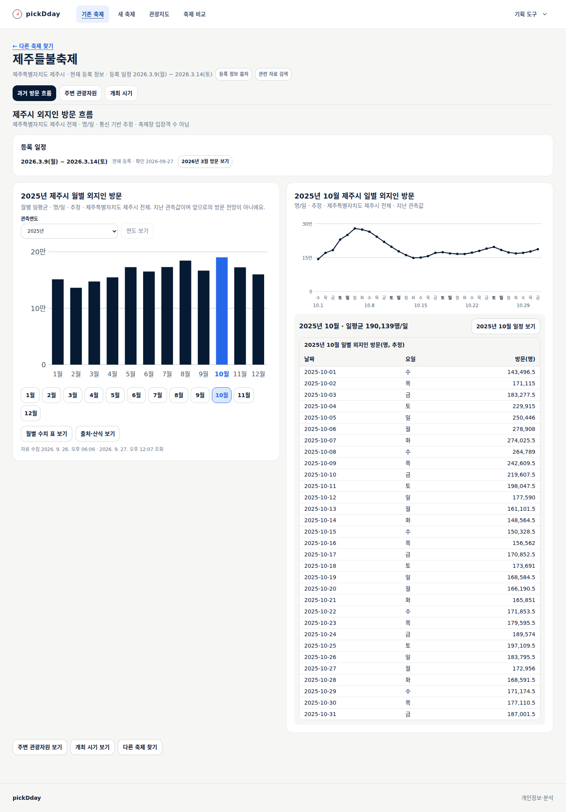
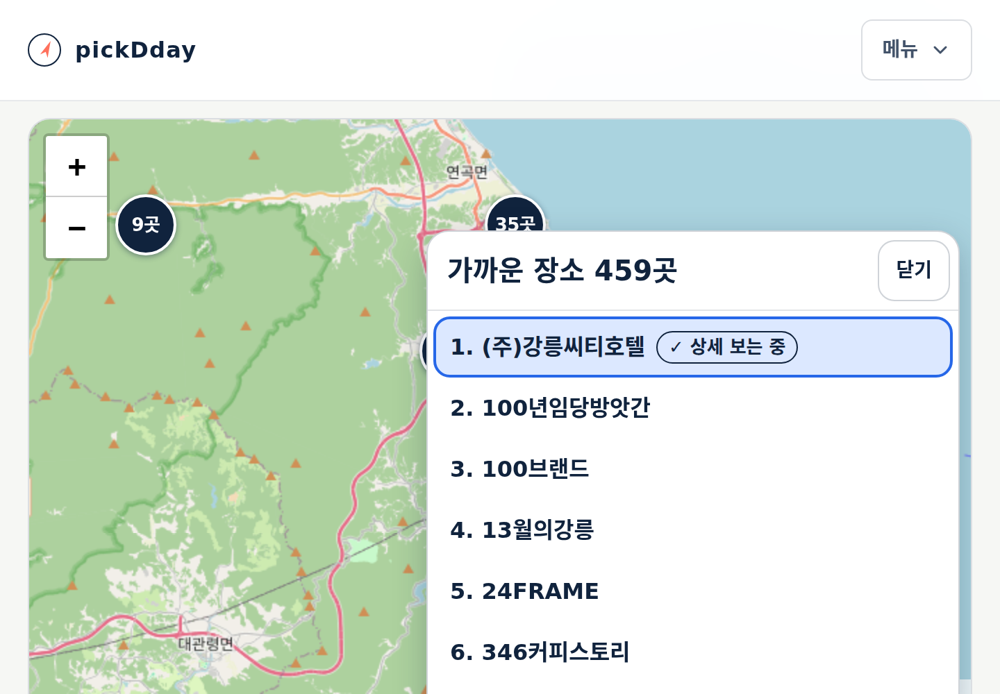

# PC 중심 조사·기획 화면

상태: **사용 가능. 공개 배포·실제 자료·PC·실제200% 확대 검수 완료.** [설계21](../design/21-desktop-research-experience.md)과
[TS-FC-018](../sdlc/3-testing/scenarios/TS-FC-018.md)에 따른 변경이다.

## 사용자에게 달라지는 점

- 기존 축제는 무대·부스·사람, 새 축제는 강·문화공간·지역 자원을 탐색하는 이미지로 구별한다. PC 그림 높이는300px로 키웠다.
- 헤더는 기존 축제·새 축제·관광지도·축제 비교와 기획 도구 묶음으로 정리한다. 예산·기획안·기록 등 기존 기능은 계속 이용한다.
- 첫 화면의 두 핵심 진입에 파란 버튼을 쓰고 보조 도구의 큰 색면을 없앴다. 예측 연구와 공개 운영 예시는 ‘참고 자료’에서 펼친다.
- PC 본문 최대1760px, 홈1440px. 관광자원은 넓은 PC에서 목록·지도·선택 상세를 동시에 읽고, 유형·건수를 같은 줄에 배치한다.
- 월별·요일별 방문 자료와 월별·선택 월의 일별 방문 자료를 나란히 본다. 등록 축제의 일별 수치 표와 일정 연결도 해당 일별 그래프 아래로 모았다.

자료를 보는 데 작성·저장은 필요하지 않다. 기존 출처·단위·결측·법적 고지를 유지한다.
두 이미지는 내장 imagegen으로 각각 편집했으며 이전 원본과 최종 프롬프트를 설계21에 보존한다.
실제 장소 사진이나 실적을 표시하는 자료가 아닌 장식 일러스트다.

## 설계·직접 검수

devkit 제품 경험 기준과 공식 Carbon 헤더·자료 탐색 예시, 기존 실제 화면을 대조해 구조를 설계했다.
Claude Opus5.5 검토 호출은 제공자의 사용량 한도로 거부되어 완료한 위임으로 세지 않는다.
협업 에이전트에 헤더/홈·관광자원·시험·문서 작업과 독립 검토를 나누고 주 담당자가 설계·방문 배치·최종 검수를 수행했다.

첫 실제 화면 검수에서 관광자원 상단 조건 영역이 높아 유형과 건수를 한 행으로 압축했다.
선택한 달의 수치 표는 일별 그래프와 같은 영역으로 옮겼다. 월 선택·주소·자료 계산은 그대로 유지한다.
목록 버튼은 이름·주소 가독성과44px 조작 영역을 보존한다. 행 오른쪽에 비교 버튼을 강제로 넣는 밀도 변경은 이번 범위에 포함하지 않는다.

## 실행 검증

Node24.20.0에서 단위·스크립트 시험381건(26+325+30), 타입 검사와 배포 빌드를 통과했다.
최종 변경의 전체 headless 브라우저26회(기존24개+새 메뉴 검사 두 모드)를 완료했다. 관광자원49개 항목,
인프라 계약41건과 기존 운영 digest의 배포 선언17개 검사도 통과했다. 기획안·결과 인쇄 회귀를 포함한다.
새 메뉴 검사는 공개/편집 모드 각각1366/1440/1920px, 실제 경로 이동·키보드·320/390px·실제 탭 확대2.0을 확인한다.
관광자원 회귀는650건·긴 이름·1366px 두 열과1400/1440/1920px 세 열·상세 열기/닫기·지도 중심·반경·필터·실패 복구를 확인한다.
최초 이미지 대기가20초에 끝난 검사는 실패로 남기고 이미지 완료 대기를60초로 조정해 전체를 다시 실행했다.
페이지/이미지 응답을 대체하거나 오류를 무시한 통과가 아니다.

로컬 실제 자료 확인에는 강릉 음식점478·숙박178, 제주 음식점426·숙박89건을 사용했다.
방문 자료는 운영의 공식 수집 파일을 읽기 전용으로 복사해 연결했다. 로컬 자료 디렉터리가 없던 최초 방문 확인은
자료 없음으로 중단됐으며 성공으로 세지 않는다. 자료 연결 후 두 방문 배치와 자원 조회·키보드·실제200% 확대를 확인했다.
통제 응답 회귀와 실제 자료 검수, 로컬과 공개 결과는 구분해 남긴다.
[실행 근거 JSON](evidence/2026-09-27-desktop-research.json)에 검사 범위·실제 표시 폭·자료 건수·확대 배율을 보존한다.

## 제품 경험 판정

| 항목 | 결과 | 확인 범위 |
|---|---|---|
| 목표·흐름 | 충족 | 두 목적 진입과 모든 기획 도구 경로, 조회 조건·선택·일정 연결 보존 |
| 시각적 위계 | 충족 | 홈1440/1920px, 자원1440/1920px, 두 방문 화면 직접 확인. 유형 도구막대를48px 압축하고 일별 표를 그래프 옆이 아닌 해당 그래프 아래에 배치 |
| 문구 경계 | 충족 | 내부 검수 규칙을 제품에 노출하지 않음. 저장 안내는 기록 도구 맥락, 실제 자료의 단위·출처·결측은 보존 |
| 상태·복구 | 충족 · 로컬 | 유형별·상세·지도 실패와 재시도, 숨긴 유형의 선택 상세 보존 회귀 |
| 키보드·반응형 | 충족 | 메뉴·군집·상세 초점, 긴 이름·650건,320/390px·실제200% 탭 확대, 기획안·결과 인쇄 회귀 |
| 출처·고지 | 충족 | 개인정보 푸터 접근, 지도 귀속·직선거리·지역 방문 추정의 의미 유지 |

실무자 관찰·전체 보조기술 인증은 미평가다. 이번 개선은 전역 탐색·홈·관광자원·방문 분석과 공통 폭에 적용하며
기존 모든 기획·운영 화면을 새로 설계했다는 뜻은 아니다.

## 공개 배포와 실제 자료

소스 `48cc50f`의 [ARC 작업36290156260](https://github.com/gitvssh/fest-compass/actions/runs/36290156260)이 성공했다.
전용 `homelab-fest-compass`에서 단위381·타입·전체 배포 빌드·인프라41을 확인했고 의존성 취약점·Actions artifact/cache는0이다.
확인된 이미지 `sha256:e33197a4801ece680843dbfcbcc720e993d87c3d70961ba82f40f65f70cffa6f`를
`7994db4`에 고정하고 정상 sync 후 Synced·Healthy·Succeeded, 컨테이너3/3과 livez/readyz200을 확인했다.
Deployment·PVC 식별자가 같고 업무9개 테이블20행의 개수·내용 해시가 배포 전후 일치한다. 이전 운영 이미지는 복구본으로 보존했다.

[공개 서비스](https://pickday.damecasol.com)에서 응답 대체 없이 강릉478/178·제주426/89건을 조회해
전체 목록 ID·군집 선택·상세·키보드 복귀·3열 배치를 확인했다. 두 지역의2025년 방문 자료도 월/요일·월/일별로 나란히 표시됐다.
별도 공개 메뉴 검사로4개 주 메뉴·6개 도구·참고 자료·개인정보 경로와1366/1440/1920px를 확인했다.
320/390px와 실제 탭 확대2.0을 검사했고 두 공개 검사 모두 페이지 오류·앱 API 쓰기는0이다.
아래는 최종 공개 서비스 캡처다. 원본 문서·이미지·생성 프롬프트는 프로젝트에 유지하며 D 드라이브 확인용 사본은
[자료 전달 기록](../ops/review-delivery.md)에 별도로 남긴다.

## 실제 화면

