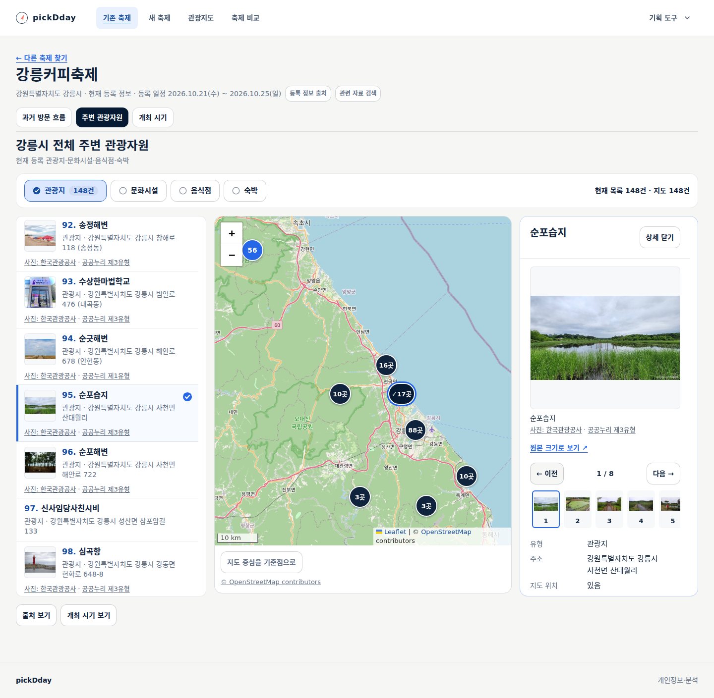
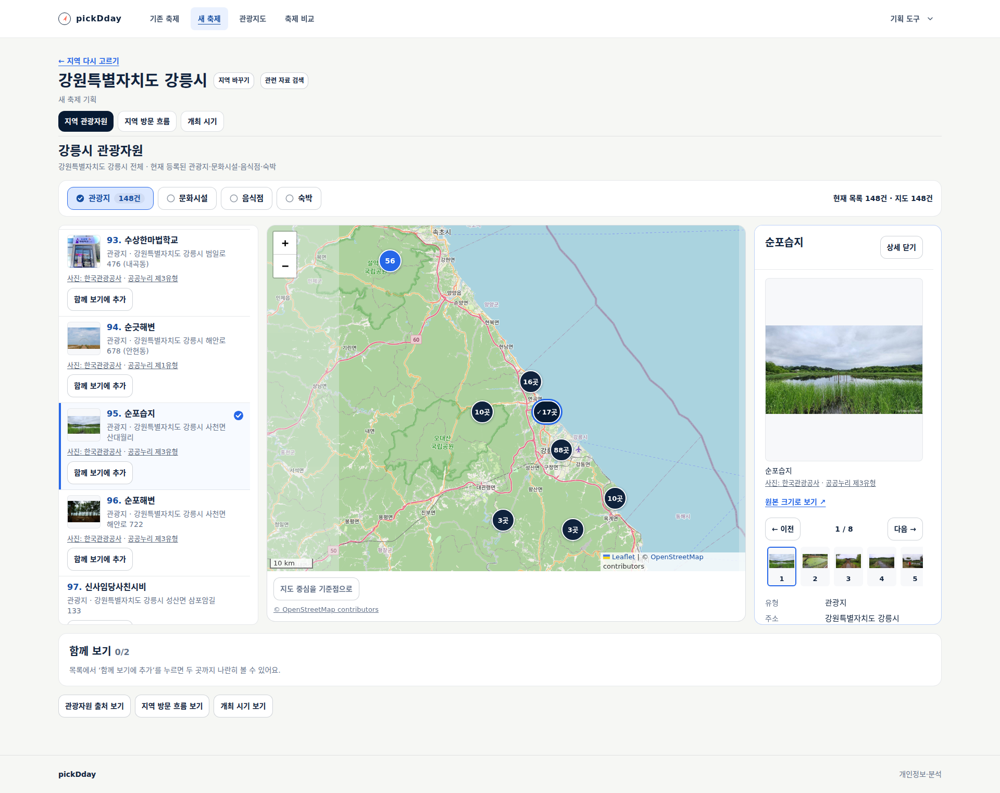
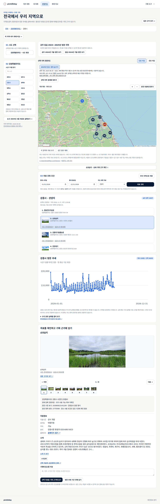
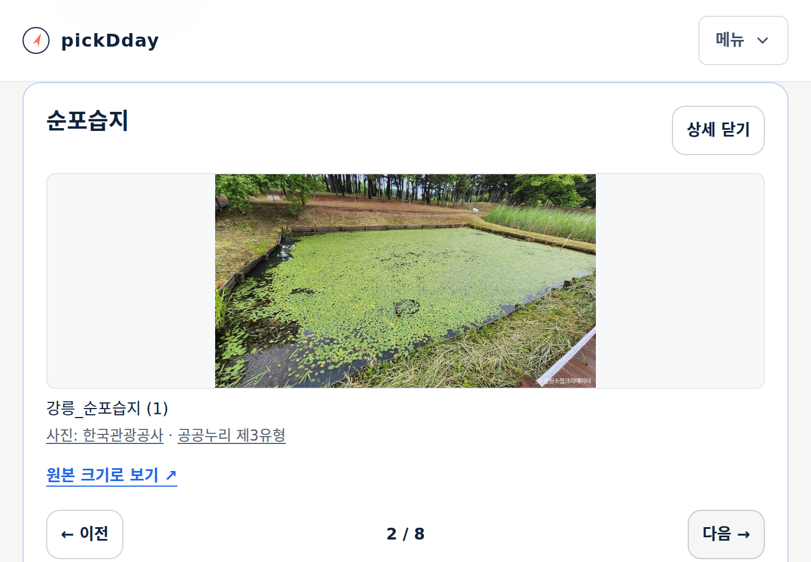
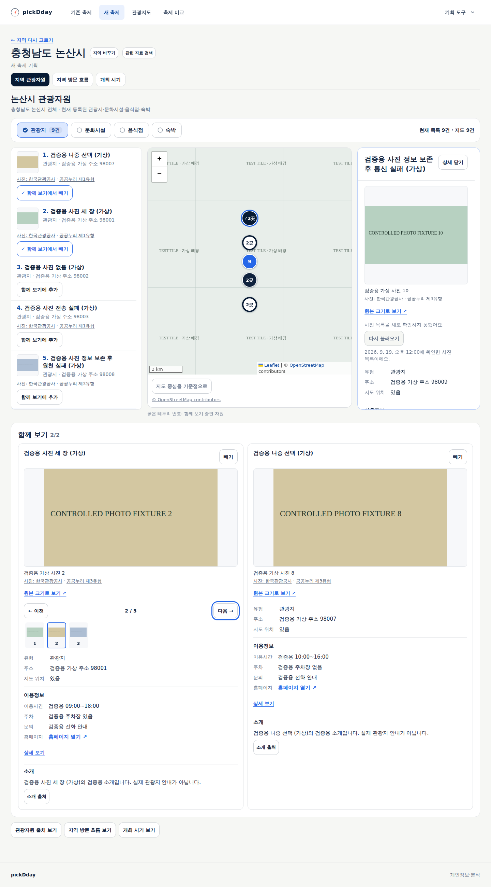
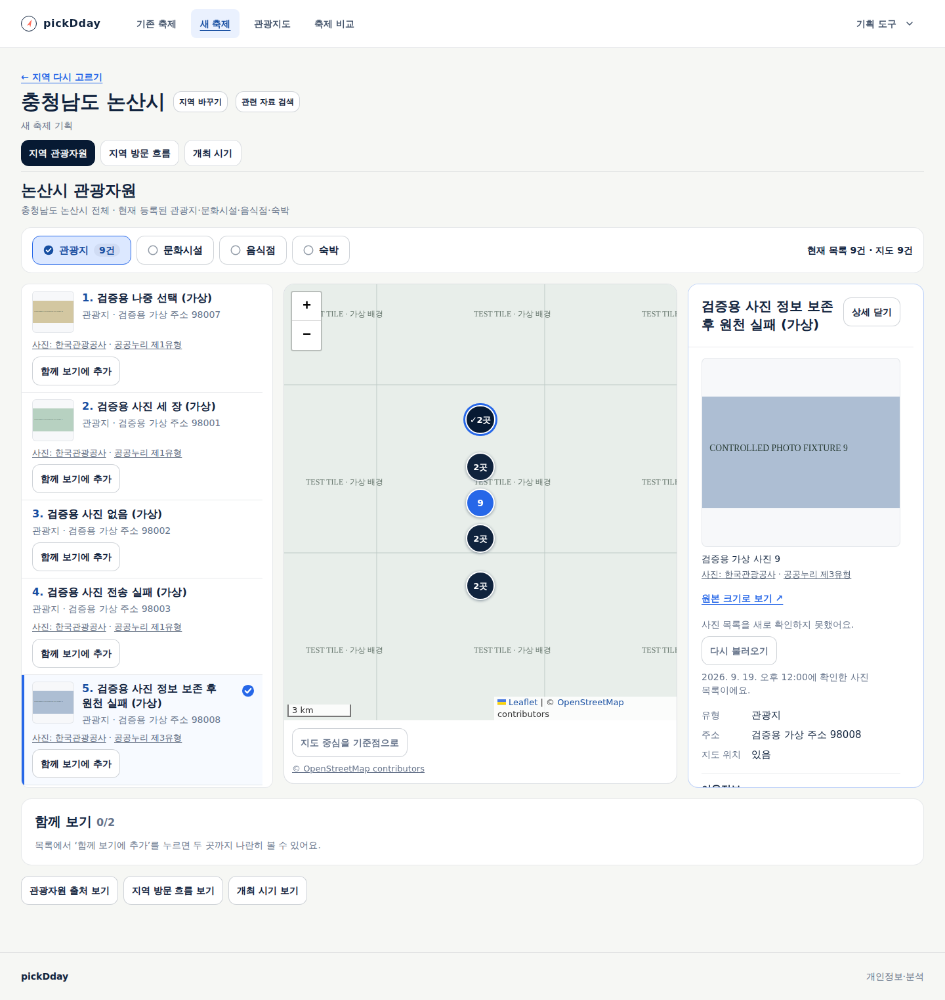

# 관광지도·자원 사진과 이용정보

상태: **사용 가능 — 공개 반영·실제 공공데이터·PC·200% 확대 검증 완료.** [설계22](../design/22-tourism-media.md)와
[인수 기준 TS-FC-019](../sdlc/3-testing/scenarios/TS-FC-019.md)에 따른 변경이다.

## 사용자에게 달라지는 점

- 목록에서 작은 대표사진과 이름·주소를 함께 확인한다.
- 선택 상세에서 사진을 넘겨 보고 등록된 이용시간·휴무·주차·유형별 이용정보를 확인한다.
- 기존 축제·새 축제·관광지도에 같은 상세를 적용한다. 사진이 없는 장소도 기존 정보로 조사한다.
- 새 축제의 ‘함께 보기’에서도 두 후보의 사진·이용조건·소개를 나란히 읽는다.
- 사진 출처·공공누리 이용조건은 사진 가까이 연결한다. 사진을 잘라내거나 가공하지 않는다.
- 소개·사진·이용정보 중 일부 조회 실패가 확인된 다른 정보를 지우지 않도록 한다.

## 실제 데이터 확인

[공식 API 조회 근거](evidence/2026-09-27-tourism-media-source.json): 강릉 유형별 첫10곳40건 중
대표사진33건. 관광지·문화시설·음식점·숙박 각1곳의 상세사진7·5·6·14장과 실제 이미지 GET200.
해당 표본의 확인이며 전국 사진 제공률이나 모든 시설 정보의 최신성 검증은 아니다.
순포습지는 별도 대표사진1장이 더 있어 실제 상세에는 중복 없는8장이 표시됐다.

## 구현·검증

Opus5.5 검토 호출은 사용 한도로 실행되지 않았다. 협업 에이전트에 서버·공통화면·관광지도·시험·독립 검토를
분담하고 주 담당자가 실제 원천 확인·통합·직접 검수를 수행했다.

- `npm test`:397개 통과(42+325+30). 사진 주소·항목 일치·사진별 이용조건·누락/실패·두 후보 동시요청을 포함한다.
- 로컬 실제 API·headless: 순포습지의8장 사진과 이용시간·주차, 기존 축제·새 축제·관광지도3흐름,
  390/1440/1920px와 실제 브라우저200% 확대·사진 넘기기·선택 유지를 확인했다. 통제 응답과 별도 실행했다.
- 독립 코드 검토에서 전체 재조회 실패의 표시, 목록 사진이 상세 이용조건을 덮는 문제,
  소개정보 수집시각의 혼동을 발견해 수정했다. 재검토에서 남은 중요 결함은 없었다.
- Node24.20.0에서 타입 검사·전체 배포 빌드·headless 전체27회 통과. 기존 관광자원49항목,
  새 미디어23항목, 메뉴 두 모드와 예산·기획안·결과 인쇄 회귀를 포함한다. 인프라 계약41건·선언17개도 통과했다.
- 최종 [미디어 통제 결과](evidence/2026-09-27-tourism-media-controlled/report.json)는 가상 API·사진을 사용한다.
  실제 원천 검수와 구분하며 두 후보의 서로 다른 이용정보·독립 사진 넘기기·기존 열기/빼기·부분 실패 복구를 확인했다.
- 최초 전체 검사에서는 새 썸네일 배치로 달라진 제목 행과 함께보기 소개 구조를 예전 검사 코드가 읽지 못했다.
  번호·정렬·소개·빈값·실패 복구 검증을 새 구조에 맞춰 갱신한 뒤 전체를 다시 통과했다.
- 홈의 화면 폭 변경 직후 새로고침에서 진행 중 이미지 최적화 요청 취소 경쟁을 재현했다.
  첫 화면 이미지는 즉시 로딩하고, 화면 크기 검사는 한 번 연 화면을 변경하며 각 폭의 실제 이미지 완료·경로·크기를
  계속 확인한다. 프레임워크의 모든 요청 취소 경우를 해결했다는 뜻은 아니다. 검사 중 공유 빌드와 겹친 실행은
  근거로 사용하지 않고 독립 전체 실행으로 대체했다.
- 배포와 실제 공개 자료는 아래 결과를 따르며, D 사본 검증은 [전달 기록](../ops/review-delivery.md)에 남긴다.

## 제품 경험 판정

devkit 제품 경험 기준과 기존 PC 설계21을 적용했다. 주 담당자가 실제 자료 화면과 통제된 상태 화면을 직접 검수했다.

| 항목 | 결과 | 확인 범위 |
|---|---|---|
| 목표·흐름 | 충족 | 공개3흐름의 사진·이용정보와 통제된 두 후보 비교. 작성 없이 조회, 기존 기준점·조건·열기·제거 동작 유지 |
| 시각적 위계 | 충족 | 공개 실제 화면의 작은 사진+이름 행과 목록·지도·상세3열 유지. 큰 사진은 선택 상세·후보 비교에 배치 |
| 문구 경계 | 충족 | 자료 없는 사진·소개 영역 생략. 내부 허용 규칙·모델·개발 절차를 제품에 노출하지 않음 |
| 상태·복구 | 충족 · 통제 시험 | 사진404·부분 실패·전체 재조회 실패·이전 장소의 늦은 응답·재시도. 기존 확인 자료와 각 수집시각 유지 |
| 키보드·반응형 | 충족 | 통제된 목록·상세 초점 복귀와 공개 이전/다음 사진,390/1440/1920px·실제200% 탭 확대·가로 넘침 없음 |
| 출처·고지 | 충족 | 사진별 공공누리1/3·출처·원본 링크. 전체 사진 비율을 유지하고 최신 상세의 이용조건 우선 |

실무자 관찰, 사진 저작자와의 별도 확인, 모든 보조기술 인증과 Windows 브라우저 직접 실행은 미평가다.
포토코리아의 지역 경관 검색과 AI 생성 사진·요약은 이번 구현에 포함하지 않는다.

## 공개 배포·실제 자료 확인

소스 `2bf1f8ac5b78939211ed9b549d66dd4c0af70d05`의 [발행 작업36294562405](https://github.com/gitvssh/fest-compass/actions/runs/36294562405)이
전용 `homelab-fest-compass`에서 attempt1로 성공했다. 단위397·타입·전체 배포 빌드·인프라41과 원격 이미지 검증을 수행했다.
검증한 이미지 `sha256:19bd603b6ca07ac1176da0dbbb911f3bbce7bad9ffa463b0bb93e24d486bb875`를
`476ad7ac59d6c4c4f686468dbe8bdade9cc62687`에 고정해 정상 sync했다. 앱은 Synced·Healthy·Succeeded,
컨테이너3/3 준비, 내부 `/health/livez`·`/health/readyz`는200이다. Actions artifact/cache와 이미지 수동 삭제는0이다.

Deployment·PVC 식별자가 같고 업무9개 테이블20행의 건수·내용 해시가 배포 전후 일치한다
([전](evidence/2026-09-27-tourism-media-before.json), [후](evidence/2026-09-27-tourism-media-after.json)).
[실행 근거](evidence/2026-09-27-tourism-media.json)에 소스·배포·검증 대상과 결과를 모았다.

[공개 실제 자료 검사](evidence/2026-09-27-tourism-media-public/report.json)는 응답 대체 없이
강릉커피축제의 주변 관광자원·새 축제 강릉 지역·관광지도에서 순포습지2775508을 확인했다.
목록148건, 대표사진을 포함한8장 모두 실제 로딩, 이용시간 ‘상시 개방’·휴무 ‘연중무휴’·주차 ‘가능’을 확인했다.
각 흐름의390/1440/1920px·실제 탭 확대2.0(innerWidth720, CSS zoom1), 사진 넘기기·선택 유지가 통과했다.
브라우저 오류·앱 API 쓰기·대체 응답은 모두0이다. 표본1곳의 공개 화면 검수이며 전국 시설의 제공량·현재 영업을 보장하지 않는다.

## 실제 공개 화면

[관광지도 긴 화면 원본 열기](evidence/2026-09-27-tourism-media-public/regions-sunpo-wetland-1440.png)

## 통제된 상태 확인 화면

아래는 검증용 가상 자료다. 실제 관광지 사진이나 운영 조건의 근거로 사용하지 않는다.

